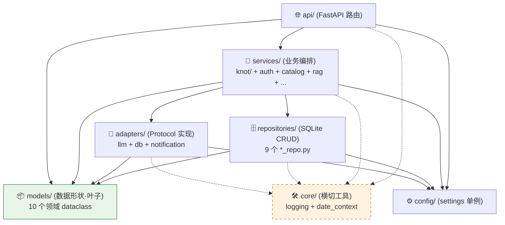

# BI-Agent — Claude Code 项目指令

## 概述

AI 驱动的 BI 助手：自然语言 → SQL → 图表。
- v0.1.1：Python 3 / FastAPI + React（浏览器端 Babel）
- v0.2.x（当前 v0.2.4）：FastAPI + React/Vite 构建版前端
- v0.x.x（规划）：Go 后端重写

## 协作规则

1. 不确定就问，别猜
2. 没要求就不写
3. 只改被要求的部分
4. 给验收标准，别给步骤

### ⚠️ 迭代循环协议 (Loop Protocol) — v3

**严禁在未走完三阶段评审的情况下编写任何业务代码。**

> v3 相对 v2：新增「**远古守护者**」角色 + 「**MINOR 滚动前夕整体审核**」仪式。
> v0.5.0 起生效；v0.4.x 期间走的是 v2（无远古守护者机制）。

#### 一个 MINOR = 一个 Agent

Agent 的生命周期与 **MINOR 版本号**绑定，不与 PATCH 绑定：

- v0.3.0 / v0.3.1 / … / v0.3.x → **同一对话** = **v0.3 Agent**
- v0.4.0 / v0.4.1 / … / v0.4.x → **同一对话** = **v0.4 Agent**
- v0.5.0 / … / v0.5.x → **同一对话** = **v0.5 Agent**

每跨一个 MINOR，用户开**新对话**启动新 Agent；角色按 §角色滚动规则更替。

#### 角色定义（v3 — 4 级角色）

| 角色 | 实体 | 职责 | 权限 |
|---|---|---|---|
| **执行者** | 当前 MINOR 的 Agent | 出方案、整合终审意见、写代码、跑闸门、提 PR | 读 + 写 |
| **守护者** | 上一 MINOR 的 Agent（距离 = 0.1） | PATCH 内 Stage 3 终审 + 闸门复核 | **只读**（严禁改代码） |
| **远古守护者** | 上上 MINOR 起的 Agent（距离 > 0.1） | **仅 MINOR 滚动前夕**整体审核 | **只读 + 默认沉睡** |
| **辅助 AI 初审组** | 资深工程师 + Codex + 其他辅助 AI | PATCH 内 Stage 2 给 Redline / 评分 / 风险点 | 评审建议 |
| **资深架构师** | User 本人 | 战略决策 + 拍板 + 召集整体审核 | 决策 |

#### 三阶段评审（PATCH 内常规流程）

```
执行者                    辅助 AI 初审组              守护者                  执行者
   │                           │                         │                       │
   │ Stage 1: 方案/规划草案 ───┼─────────────────────┐   │                       │
   │                           │                     │   │                       │
   │                           │ Stage 2: 初审意见    │   │                       │
   │                           │   (Redline/评分)    │   │                       │
   │                           │                     │   │                       │
   │                           └─────────────────────┴──>│ Stage 3: 终审         │
   │                                                     │   (整合 1+2 后给意见)  │
   │                                                     │                       │
   │<────────────────────── 终审意见 ────────────────────┘                       │
   │                                                                             │
   │ 执行（按终审意见落 commit）                                                  │
```

1. **Stage 1 — 方案设计（执行者出）**
   执行者产出执行手册草案 `docs/plans/v0.X.Y-*.md`，包含范围 / 红线 / 验收 / commit 序列。

2. **Stage 2 — 辅助 AI 初审**
   用户把 Stage 1 草案分发给辅助 AI 评审组，收集 Redline / 评分 / 风险点。
   执行者此阶段不参与（不打扰评审独立性）。

3. **Stage 3 — 守护者终审（上一 MINOR Agent）**
   用户把 **Stage 1 草案 + Stage 2 初审意见**一起喂给守护者。
   守护者职责：
   - 校验与上一 MINOR / 历史 PATCH 的设计决策一致性
   - 查漏检文件 / 错误命名 / 既有红线遗漏
   - 评估初审意见是否被正确吸收
   - 给出**终审意见**（保留 / 修订 / 否决具体条款）
   守护者**严禁直接修改方案文件或代码**，只输出评审文本。

4. **执行（执行者落地）**
   执行者**只拿到 Stage 3 终审意见**（不直接看 Stage 2 原文，避免重复消化），
   按终审意见整合修订手册 → commit 锁定 → 按 commit 序列实施 → 全闸门绿 → 提 PR。

#### MINOR 滚动前夕整体审核（v3 新增仪式）

- **触发**：资深架构师明确 announce「整体审核」
- **参与方**：执行者 + 守护者 + 所有存活的远古守护者（独立提供意见）
- **不在 PATCH 内**，是 MINOR 间的过渡仪式
- **产物 4 份固定模板**：
  1. **代码结构评估** — 巨型文件 / 重复 / 死代码 / 可读性短板
  2. **奥卡姆剃刀清单** — 必备 / 多余 / 待简化
  3. **重命名 / 重构 / 协议增量提案**
  4. **下一 MINOR 预期范围**（骨架，不锁定）
- **冲突仲裁**：多方意见独立提供，资深架构师拍板

#### 远古守护者激活原则

- 默认沉睡（不打扰当前 PATCH 节奏）
- 仅在「整体审核」明确激活
- 不参与日常 PATCH 三阶段评审

#### 角色滚动规则

每跨一个 MINOR：
- **当前执行者** → 下一 MINOR 的**守护者**（只读 active）
- **当前守护者** → 下一 MINOR 的**远古守护者**（保留对话，dormant）
- 已存在的远古守护者 → 继续保留 dormant
- 用户开**新对话**启动下一 MINOR 的**新执行者**

PATCH 内（v0.5.0 → v0.5.1 → …）**不切换角色**，仍由同一执行者完成所有 PATCH 的三阶段循环。

#### R-LP-v3-EX-1：方向决策 Stage 2 跳过例外条款（v0.6.0.19 立约首例）

**触发**：v3 三阶段评审中，若 PATCH 性质为**方向选择 / 路线评估类决策**（非代码落地），
Stage 2 辅助 AI 初审的 redline 维度（破契约 / 命名 / 副作用）对决策无边际价值，
此时**允许跳过 Stage 2**，但必须满足以下条件：

**适用条件（3 条同时满足）**：
1. PATCH 涉及 **0 行业务代码** + **0 红线新立**（纯决策类 docs）
2. 守护者 Stage 3 终审主动认可"跳过 Stage 2 合理"
3. 资深架构师在拍板前已明示知悉本例外

**强制替代（3 条护栏）**：
1. **30 分钟等效初审** — 由资深架构师召集独立第三方（Codex / 资深工程师 AI / 不同
   Claude lineage 的 subagent）做 ≤ 500 字红线评审
2. **真独立第三方** — 等效初审者不得是同一会话内 Claude lineage（否则等于自审）
3. **累计触发 ≥3 次** — 强制召集**远古守护者**复核滥用倾向，防例外条款被泛化滥用

**首例引用**：`docs/plans/phase-b-early-review-2026-05-21.md`（Phase B 提前评估，
v0.6 执行者 Stage 1 草案 + v0.5 守护者 Stage 3 终审 + Codex-equivalent subagent 等效初审）

**治理意义**：本条款由 v0.5 守护者 §VI 提出 + Codex 等效初审 C-5 强化（3 护栏）+ 资深 2026-05-22 拍板立约。
属 Loop Protocol v3 首次明示的"方向决策 Stage 2 可由等效初审替代"例外。

#### R-LP-v3-EX-2：OVERRIDE 累计触发远古守护者召集义务（v0.6.2.0-pre-governance 立约）

**触发**：累计 OVERRIDE 事件 **≥ 3 次** → 强制召集远古守护者参与 retroactive review。

**计数维度**（资深 2026-05-25 决策 α8）：**维度 A 时间线粒度**
- 一个 PATCH 启动决定 = 1 个 OVERRIDE（无论 PATCH 内部含几个子决策）
- PATCH 内嵌子 OVERRIDE 在 CHANGELOG + plan 文档归档，**不重复计入全局计数**
- 避免对集中决策 PATCH 的倍数惩罚

**归档完整性义务**：每次 OVERRIDE 事件必须在 7 天内归档独立 plan 文档（事件 + 日期 + 归档文件路径登记到 `docs/governance/override-cumulative-log.md`，资深架构师亲自维护）。

**首次履约**：2026-05-25 累计第 3 次 OVERRIDE（方向 ① announce） → v0.4 远古守护者第 3 次激活三任务合并评审。

#### R-LP-v3-EX-2.1：OVERRIDE 治理双锁强化（v0.6.2.0-pre-governance 立约）

**触发**：累计 OVERRIDE 事件 **≥ 4 次** → 强制 Q-quarter 暂停 OVERRIDE 1 个 PATCH 周期 + retroactive audit。

**背景**：v0.5 守护者第 10 次 active §IV 提出 + v0.4 远古守护者第 3 次激活 §1.5 强化（≥4 次过线必须 Q-quarter 暂停防 OVERRIDE 泛化）+ 资深 2026-05-25 拍板立约。

**Q-quarter 暂停期内**：
- 不允许新 OVERRIDE 决策
- 必须执行 retroactive audit（OVERRIDE 累计治理记录段补全）
- 守护者 + 远古守护者协同复核所有累计 OVERRIDE 合规性

**当前累计**：3 次（维度 A）→ 未触发；距过线 1 次之差。

#### R-LP-v3-EX-3：承诺推迟治理（v0.6.2.0-pre-governance 立约）

**触发**：执行者 / 守护者 / 资深架构师在 PATCH 文档明示的"推迟到 v0.X+"承诺，**连续 ≥ 3 PATCH 未兑现** → 升级为正式红线。

**背景**：v0.5 守护者第 10 次 active §VII 守护者补丁 3 提出（v0.5.x 累计 8+ inline helpers 移入 Shared.jsx 承诺多次推迟）+ 资深 2026-05-25 拍板立约。

**适用对象**：
- 技术债推迟（如 inline helpers 移入共享组件）
- 红线推迟兑现（如 v1.0 移除 sync LLM API）
- 设计决策推迟评估（如 5 层语义 + LogicForm 推 v0.7+）

**升级机制**：≥3 PATCH 未兑现的承诺 → 自动升级红线 R-LP-v3-EX-3-X（X 为承诺序号）；后续 PATCH 强制守护。

#### R-PB-GOV-1：工期指导性预估非硬承诺纪律（v0.6.2.0-pre-governance 立约）

**触发**：v0.5 守护者第 11 次 active 整合 Stage 2 工期重估 4.5-6.5 月 → 5-7 月时，资深架构师拒绝硬性工期承诺 + 立约（2026-05-25 决策 β2）。

**内容**：所有 PATCH 工期标注（如 "2-2.5 周"）为**指导性预估**，**非硬承诺**：
- PATCH 启动时机由资深架构师按业务方实际节奏决定
- 不锁定 1.0 公测时间窗（拒绝 2026 Q3 末 / Q4 末 / 2027 Q1 等具体承诺）
- 守护者 / 远古守护者 / Stage 2 评审员意见中"工程量重估 N 月"作为参考，不作约束
- 当资深 announce"按计划推进"时按当前已 LOCKED PATCH 序列执行
- **例外**：单 PATCH 内部 commit 序列工期可硬预估（守护者 Stage 3 终审依据）

**违反代价**：破 R-PB-GOV-1 = 业务方信任损失 / 团队疲劳 / 决策含糊；必须返做承诺修订。

#### R-PA-PB-V1：Phase B UI 视觉延续性立约（v0.6.0.19 立约）

**触发**：v0.5 守护者 2026-05-14 Phase B 评估意见 §7 提议；v0.6.0.19 正式落地立约。

**内容**：Phase B 及之后所有 PATCH（含 v0.6.2.0 TOTP enroll / v0.7.x 5 层语义等）
涉及 UI 改动时，必须严守 v0.5.x 锁定的视觉设计语言：
- OKLCH 单色系统（buildTheme 25 设计 token；+dark 透传 = 26 runtime keys — v0.6.2.3 口径锁定）
- I icon library（38 names — v0.6.0.3 +thumbsUp/Down）
- brandSoft 8% inset + borderLeft 3px 25% 设计语言铁律
- HarmonyOS Sans SC / PingFang SC / JetBrains Mono 字体
- 18 屏 byte-equal 守护（除当前 PATCH 目标屏外 git diff 0 行）

**违反代价**：破 R-PA-PB-V1 = 视觉一致性回退；需重做并补补丁说明。

#### v3 协议施行历史

- v2（v0.4.x 期间生效）：3 角色（执行者 + 守护者 + 辅助 AI 初审组）
- v3（v0.5.0 起生效）：+ 远古守护者 + 整体审核仪式
- 首次整体审核：v0.4.6 → v0.5.0 滚动前夕（执行者 v0.4 + 守护者 v0.3，因 v0.3 之前无 v3 协议未存远古守护者）
- 第二次整体审核：v0.5.44 → v0.6.0 滚动前夕（执行者 v0.5 + 守护者 v0.4 + 远古守护者 v0.3）→ 产出 9 项 LOCKED 决议 S-1~S-9 → v0.6 Agent 启动 Phase A

**v3 协议施行回顾**（v0.5.0~v0.6.0 累计 26 次完整 PATCH 内施行；首次跨 MINOR 角色滚动后施行 = v0.6.0）：

| PATCH | 主题 | 红线 | 关键决策 / 施行特征 |
|---|---|---|---|
| v0.5.0 | KNOT rename + Foundation | R-67~R-79 (13) | 包名 / env 双源 / DB migration / Loop Protocol v3 **首次完整施行** |
| v0.5.1 | SQL AST 笛卡尔积硬防御 | R-80~R-93 (14) | sqlglot AST + ReAct `__REJECT_CARTESIAN__` + R-91 计数器 |
| v0.5.2 | 后端代码瘦身 | R-94~R-110 (17) | **27 文件行数压制**（4 主 ≤ 350/300/220/220 + 9 新建 ≤ 250 + scripts/check_file_sizes.py CI 核验）；sync/async 双胞胎保守不合并；orchestrator 方案 1 延迟 import 破单向依赖 |
| v0.5.3 | 前端代码瘦身 | R-111~R-128 (18) | Chat.jsx 925 → ≤ 350；Admin tab 7→4 文件按职责合并；className 0 diff 守护；R-118 SSE handler 纯函数化 callbacks 注入 |
| v0.5.4 | Loop Protocol v3 路线图同步 | R-129~R-138 (10) | docs-only；**第 5 次 v3 施行**（自我引用闭环 — 用 v3 协议同步 v3 协议）；README 加 protocol 简介对外公开治理 |
| v0.5.5 | Cn cleanup（遗留清理） | R-139~R-153 (15) | **首次净行数减少（Negative Delta -18）**；物理删 `lark.py` stub；8 处 sync API 标 `[DEPRECATED v0.5.5; target removal in v1.0]`；测试受控降级 432→430；**第 6 次 v3 施行** |
| v0.5.6 | C5 Claude Design UI 重构 — Foundation | R-154~R-169 (16) | **第二次 Negative Delta -136**；Shared.jsx + utils.jsx + App.css 视觉重构 — OKLCH 蓝青 195° brand + PingFang/HarmonyOS 字体 + Icon viewBox 24 stroke 1.6；R-167 语义色翠绿 145°/琥珀 85° 远离 brand；R-169 CHART_COLORS hue 45° 均匀分布；R-156 18 屏 0 修改自动换皮；R-158/159 Shared/utils 契约 9+8 exports byte-equal；**第 7 次 v3 施行** |
| v0.5.7 | C5+ Login 屏首屏复刻 pilot | R-170~R-186 (17) | **1 屏 1 PATCH 模式确立**；Shared.jsx +3 exports (KnotMark/Wordmark/Logo) 9→12；decor/NarrativeMotif.jsx [NEW 112 行] React.memo + OKLCH color-mix tint；Login.jsx 116→178 demo grid 1.05fr 1fr + KNOT tagline + "进入 KNOT" + "7 天内自动登录" + 页脚 v0.5.7；R-184 input focus 蓝青；R-186 抗诱惑 — Shell.jsx 严守 0 改；R-181 三处版本同步（main.py + smoke + Login 页脚）；432 tests / 112 skipped；**第 8 次 v3 施行** |
| v0.5.8 | Cn+ Chore — CI fix + Visual Replication Protocol | R-187~R-191 (5) | docs+ci chore；偿还 v0.5.0 R-72 留下的 ci.yml boot smoke 硬编 0.5.0 bug（R-187 动态读 main.py）；CLAUDE.md 加 § Visual Replication Protocol 段（R-188）提炼 v0.5.7 经验为 v0.5.8+ 屏复刻铺路；432 tests / 112 skipped 不变；7 contracts KEPT；**第 9 次 v3 施行**（简化 — 跳 Stage 2/3 直接 Stage 4，资深 ack） |
| v0.5.9 | C5+ Shell 屏复刻（首个真正屏复刻） | R-192~R-213 (22) | **宪法级 R-192 AppShell 13 props 签名 byte-equal** 三方共识；Shell.jsx 172→186 视觉重构 7 子步骤：sidebar 256→224 + ellipsis（R-198 + Q2 加码）/ KnotLogo size=20 替代 sparkle+KNOT 文字（R-199 + Q1 修订 16→20，**R-186 抗诱惑首次解禁**）/ logoArea 56px borderBottom（R-200）/ user row #ff7a3a 渐变 → 纯 T.accent（R-201 + R-211 全局净空）/ admin nav 3 emoji 偿还（R-202 — 💰/🛡️/📋 → I.zap/I.shield/I.book）/ NavItem active span 右侧（R-203 + Q4 防 overflow:hidden 裁切）/ SideHeading T.mono（R-204）；R-199.5 KnotLogo 仅限 Shared+Login+Shell 三文件；R-210 CSS 0 污染（App.css 0 行 diff）；R-213 Shell.jsx 严禁 version 字面；R-207 17 屏 + 12 子模块 byte-equal；432 tests / 112 skipped；7 contracts KEPT；72 routes；**第 10 次 v3 施行**（恢复全 v3 — 视觉重构不适用简化协议） |
| v0.5.10 | C5+ Home 屏复刻（首个 chat 子模块屏复刻） | R-214~R-239 (27 含 R-227.5) | ChatEmpty.jsx 40→80 行 = R-218 上限；6 子步骤：容器 0 80 + 10vh 黄金分割（R-239）/ "knot · ready" label + color-mix oklch ring（R-229 + Q2 严禁 hex alpha）/ 标题 36px + "解" brand span + word-break keep-all + maxWidth 640（R-230 + R-224 + R-236 + Q1）/ 副标题新文案 + KNOT 大写（R-231）/ suggestions 扩 {icon,text} 硬编码映射 + chip 44 + radius 10 + flex-wrap（R-232/233/235/238）/ Footer T.mono（R-234）；契约 R-214 9 props 签名 byte-equal + R-215 firstName + R-216 text + **R-217 Composer.jsx 0 改**（三方共识，留 v0.5.11+）；**R-227.5 KNOT 字面分流首次确立**（"knot · ready" 装饰小写 vs "KNOT 可能出错" 声明大写共存）；R-222 KnotLogo sustained 仅 3 文件；R-225 CSS 0 污染；R-237 firstName 兜底三态；R-238 4 icon 语义映射；432 tests / 112 skipped；7 contracts KEPT；72 routes；**第 11 次 v3 施行**（全 v3） |
| v0.5.11 | C5+ Composer 重构 — **R-217 清偿里程碑** | R-240~R-265 (26) | Composer.jsx 71→100 = R-260 上限；7 子步骤：boxShadow 双模式 T.dark 切换（R-254/Q2 rgba 豁免）/ 容器 T.inputBg → T.content（R-252/D1 不扩 25 字段）/ padding 16 + **width 100% Q3 解耦严禁 720**（R-253/D5 修订）/ textarea minHeight 24→48（R-257/263）/ Submit 30→32 + disabled opacity 0.5（R-256/262）/ Footer hint "Enter 发送 · Shift+Enter 换行" mono + brand dot（R-255/Q4 去 Unicode）/ focus-within React state useState + onFocus/onBlur + transition 200ms + border T.accentSoft + shadow 微放大 color-mix oklch（R-261）；契约 R-240 Composer 9 props 签名 byte-equal + R-241~R-246 placeholder/activeUpload/handlers/disabled/autoresize/上传 6 业务逻辑；**R-251 视觉自动跟随设计模式首次确立** — ChatEmpty + Conversation git hash 0 漂移（R-264 diff --stat = 0 files）— 改一处惠及两屏无代价；R-259 R-217 解禁范围限定（仅 Composer 一处）；R-250 KnotLogo sustained 仅 3 文件；R-258 CSS 0 污染；432 tests / 112 skipped；7 contracts KEPT；72 routes；**第 12 次 v3 施行**；**R-217 自 v0.5.10 hold 至今正式清偿** |
| v0.5.12 | C5+ Thinking 屏复刻（AgentThinkingPanel 右 rail） | R-266~R-291 (27 含 R-227.5.1) | ThinkingCard.jsx 110→160 = R-270 上限；9 子步骤：letter chip K/N/O 22×22 Inter 800 flex 居中（R-277/289）/ emoji→chip + name 字面 Knowledge/Nexus/Objective mono（R-277/278/**R-227.5.1 单字母装饰豁免首次确立**）/ Panel 272→320（R-276/288 — Conversation 无 margin-right 字面方案 A 适用）/ 卡片 bg T.card→T.content + radius 8→10 + padding 12（R-279/283）/ Header step count "N/3 STEPS" + `transition cubic-bezier(0.4, 0, 0.2, 1) 0.3s`（R-280/287）/ done svg checkmark 11×11 stroke 2.5 + T.success（R-281）保 TypingDots + ○ / sqlSteps tag chip + slice 80→120 + ellipsis 兜底（R-282）/ **R-286 hex 全面禁止首次确立**（#09AB3B/T.accent+'60'/#FF9900 → T.success / color-mix oklch / T.warn）/ R-290 SSE 鲁棒性 Array.isArray + 全 optional chaining 防三场景崩溃；契约 R-266 2 exports 签名 + R-267 AGENTS 3 keys + R-268 业务逻辑 byte-equal；R-291 Conversation.jsx 调用点字节码对齐 git diff = 0 行；范围 R-272/274/275/284 全 0 改；432 tests / 112 skipped；7 contracts KEPT；72 routes；**第 13 次 v3 施行**（全 v3） |
| v0.5.13 | C5+ ResultBlock 偿还（hex+emoji+token 受控） | R-292~R-316 (26 含 R-302.5) | ResultBlock.jsx 381→420 = R-307 上限（v0.5.3 R-111 400→420 资深 ack 微调；svg path 占行不可压）；9 子步骤受控：getErrorKindMeta(T, kind) helper（Q1 修订 useMemo→helper function 更解耦）/ RB_SVG 7 path 字典 + SvgPath helper（不动 Shared）/ AGENT_KIND_EMOJI 4 emoji → svg path（字典名+keys byte-equal）/ 收藏 ⭐🌟 → SvgPath star fill={pinned?T.accent:none} 双态（R-303/314）/ BudgetBanner 🛑⚠️ → SvgPath shield/triangle（R-304）/ ErrorBanner 7 emoji 保留（**R-302.5 语义级 Emoji 业务豁免首次确立** — 字面分流体系第三条 v0.5.10 R-227.5+v0.5.12 R-227.5.1+v0.5.13 R-302.5）/ Token meter → TokenPill chip mono 纯度（R-306/315）/ **R-286 hex 全清扩展至 ResultBlock**（v0.5.x hex 残留最重组件收尾） — 14 处 hex 字面（#cc6600/#FF990022/#FF9900/#fff/#0001/T.accent+'30'）全清 → T tokens + color-mix in oklch（R-312 精度）/ rgba 边界 R-313 仅 boxShadow；契约 R-292 7 props 签名 + R-293 msg 25 字段解构 byte-equal + R-294 ERROR_KIND 7 keys/icons/titles byte-equal + R-295 7 layout 分支 + R-296 resolveEffectiveHint/exportMessageCsv/MetricCard 业务 + R-297 5 handlers；范围 R-309 8 核心非屏 + 17 屏 + App.css 0 改 + R-310 chat/ 其他 6 子模块 0 改 + R-274/250 KnotLogo sustained 仅 3 文件；432 tests / 112 skipped；7 contracts KEPT；72 routes；**第 14 次 v3 施行**（全 v3） |
| v0.5.14 | C5+ ResultBlock 视觉大重构 — **v0.5.x 收官 + 三大设计先例** | R-317~R-344 (28) | ResultBlock.jsx 420→440 = R-332 上限 v0.5 **final ack**；7 子步骤：Observation card brandSoft inset + color-mix(in oklch, T.accent 8%, transparent) + svg info icon + "OBSERVATION" mono（Codex 8% 精确；**R-227.5.1 装饰豁免延伸**仅 Insight 容器其他屏"洞察"保中文）/ Suggestion chips height 28 + chevron + lineHeight 1 + outer `&& onFollowup` (R-342 conditional)/ **Token meter 反向修正 TokenPill→inline stat svg ↑↓**（**v0.5.13 R-306/315 受控撤回 — 红线撤回首例**；架构判定红线服从视觉真理；严格复刻 > 局部推测性红线）/ agent_costs chip pill 999 + bgInset border / Table thead 删 uppercase + Codex letter-spacing normal / SQL accordion `<>` T.mono 几何对称 + 时长 Codex flex:1 text-align right；**三大设计先例首次落地**：① 红线撤回首例 ② **R-341 v0.5 ResultBlock 行数收官**（440 final；v0.6 必须开启子组件拆分 MetricCard/TableContainer/InsightCard/BudgetBanner/ErrorBanner/TokenMeter）③ R-227.5.1 装饰豁免延伸；契约 R-317 7 props + R-318 msg 25 字段 + R-319 ERROR_KIND 7 keys + R-320 7 layout 分支 + R-321 业务逻辑 + R-322 5 handlers byte-equal；范围 R-334/335 全 0 改（SavedReports 0 改 — R-342 内嵌守护验证不直接 import 转化为 R-317 props 签名 + outer condition）；432 tests / 112 skipped；7 contracts KEPT；72 routes；**第 15 次 v3 施行**（全 v3）+ v0.5.x ResultBlock 维度收官之战 |
| v0.5.15 | C5+ Favorites 屏复刻 — **首个新顶层屏 + brandSoft 8% 全站闭环** | R-345~R-373 (29) | SavedReports.jsx 318→380 = R-363 上限正好（新增 LIMIT 380；首次纳入 30→31 条）；9 子步骤受控：起手 grep Q3 LIMIT dict 标定 / 5 处 hex 全清（pillBtn '#fff' → T.sendFg Q4 严禁 'white' / Warning #FF990022/#FF9900/#cc6600 → T.warn + color-mix / Error ${T.accent}30 → color-mix in oklch）/ SAVED_SVG 6 path 字典 + INTENT_EMOJI 字典名+7 keys byte-equal value 偿还 svg path / Sidebar header 删 📌 + T.mono / SavedItem bookmark svg 14×14 + gap 10（Codex R-369 精度）+ brandSoft bg + 删 borderLeft + time mono 9px "YYYY.MM.DD"（R-373 formatTime）/ Title block 22px fontWeight 600 + meta mono `│` U+2502 separator（R-370 字符精度）+ StatusDot frozen 装饰硬编（Q5 不依赖业务字段）/ Quote inset color-mix in oklch 8% **与 v0.5.14 R-323 ResultBlock Insight 字面 byte-equal**（**R-372 全站 brandSoft inset 设计语言闭环 — 未来全站 inset 沿用此字面**）+ "原始问题" mono uppercase / Table thead 删 uppercase + letter-spacing normal（v0.5.14 R-327 sustained）/ 4 按钮 emoji（✏️/🔄/📥/📊）→ SvgPath（pencil/refresh/download/table）+ pillBtn helper 保 disabled/loading 状态机；**D6 Shell 13 props 契约严守** — topbarTitle 仍传简单 string（不破 R-192 R-349 sustained）；视觉补偿全部在 Title block (R-355) — 22px + meta · + StatusDot frozen；契约 R-345 SavedReportsScreen 5 props 签名 byte-equal + R-346 4 helpers + R-347 5 handlers + R-348 INTENT_EMOJI 字典名+7 keys byte-equal（仅 value 偿还） + R-349 AppShell + R-350 api 5 endpoint URL；范围 R-365 App/api/main/utils/Shared/Shell/decor/16 屏/chat 7 子模块 0 改 + R-367 KnotLogo sustained 仅 3 文件 + R-368 CSS 0 污染；R-302.5 banner emoji 业务豁免 sustained（⚠️/🔍/❌）；432 tests / 112 skipped；7 contracts KEPT；72 routes；**第 16 次 v3 施行**（全 v3）+ v0.5.x 首个新顶层屏复刻 |
| v0.5.22 | C5+ admin tab_system 屏复刻（Catalog）— **⭐ Inset 8% 第九处扩张（7→8 文件）+ borderLeft 25% 第四处闭环 + 蓝色 hex 双残留偿还 + 自审简化协议首次** | R-551~R-580 (30) | tab_system.jsx 53→102 行；LIMITS dict 不动；5 sub-step（R-580 前置 + R-556 优先 + R-571 收尾）；**⭐ Inset 8% 闭环字面文件总数 7→8 第九处扩张**（admin/tab_system 加入）；**borderLeft 25% 第四处闭环**（SavedReports + AdminBudgets + AdminRecovery + tab_system Helper banner 4 文件 byte-equal）；**v0.5.x 第三个 admin tab 子模块复刻**（tab_access + tab_resources + tab_system）；**蓝色 hex 双残留偿还**（rgba(43,127,255,0.12) + #2B7FFF + #fff — v0.5.16~21 蓝色 hex 唯一残留正式清零）；R-580 R-548 核爆守护扩展（TabSystem 6 props + Admin.jsx 挂载点 byte-equal）；D2 双兼模式延伸（保 textarea 业务 + 借 demo Helper banner brand inset + Section number chip）；NumChip + OverrideChip helpers inline 第七次复用 sustained；契约 R-551 6 props + R-552 catalog 5 字段 + R-553 3 sections keys + R-554 overrides 业务逻辑 byte-equal；**⭐ 自审简化协议首次** — 资深 ack 授权 v0.5.x 收官冲刺（Stage 1 草案预纳入 Stage 2/3 候选；Stage 4 直接落地）；432 tests / 112 skipped；7 contracts KEPT；72 routes；**已偿还** 30 红线 R-551~R-580；**四大里程碑同时落地**（Inset 8% 第九处 + borderLeft 25% 第四处 + 蓝色 hex 偿还 + 自审简化协议首次）。 |
| v0.5.21 | C5+ admin tab_resources 屏复刻 — **⭐ Inset 8% 铁律进攻性扩张第八处（文件总数 6→7）+ 项目单色化一致性 80% 深度宣告 + R-546~R-550 五大守护立约** | R-521~R-550 (30) | tab_resources.jsx 85→110 行 ≤ 250 LIMIT（dict 不动）；5 子步骤顺序锁死（R-548 前置 + R-531 优先 + R-539 收尾）：① baseline + **R-548 起手前置签名核爆守护**（grep `export function TabResources` + grep `<TabResources` Admin.jsx 挂载点 byte-equal）+ **R-531 thead bg R-480 闭环字面率先落地**（铁律进攻性扩张第八处）+ R-537 hex 余效 grep 立即执行 ② API Keys Card padding `'16px 20px'→'20px 22px'` + radius 10→12 + Card header `fontSize 12.5→14 + letterSpacing -0.01em` + desc lineHeight 1.55 + **R-529 trailingChip helper**（fontSize 10 + T.mono + letterSpacing 0.06em + uppercase — "已填写/未填写" 工业感）+ **R-547 API Key 安全感**（trailing 在 password 遮罩下可见）③ Agent allocation Card padding/radius 升级 + 3-col grid `'120px 1fr 80px'→'120px 1fr 90px'` + **D4 plain span hint byte-equal**（管理端可读性优先，不引入 TagChip）④ Models Table thead **R-532 mono + 0.06em + uppercase + fontWeight 500 + T.subtext** + Row minWidth: 0 + ellipsis 兜底（5 字段列）+ **R-546 Model ID `fontFamily: T.mono`**（技术元数据识别度）+ **R-549 价格业务标签 $ 单位保留**（`${m.input_price}/{m.output_price}` byte-equal）+ **R-550 borderBottom `1px solid ${T.border}` byte-equal**（与 tab_access / tab_knowledge 字面一致 — 设计语言铁律第三维度候选）⑤ **R-536 Hex 偿还** Spinner `color="#fff"` 2 处 → `color={T.sendFg}`（R-484 sustained）+ 三处版本同步 0.5.20→0.5.21 + R-540 字面严防 + **⭐ R-539 7 文件验证**（`git grep -F` 命中 ResultBlock/SavedReports/admin/tab_access/AdminAudit/AdminBudgets/AdminRecovery/**admin/tab_resources** 7 文件）；**⭐ Inset 8% 铁律从"防御性稳固"转向"进攻性扩张"**（v0.5.20 R-511 6 文件恒定 → v0.5.21 R-539 文件总数 6→7 正式扩张）；**项目单色化一致性进入 80% 深度**（Stage 3 §3 里程碑宣告）；**v0.5.x 第二个 admin tab 子模块复刻**（v0.5.16 tab_access + v0.5.21 tab_resources）；**R-484 'white' 字面残留偿还**（Spinner color #fff 2 处）；**R-546/547/548/549/550 五大守护立约**（Model ID Mono / API Key 安全感 / 核爆级 props / 价格业务标签 / borderBottom byte-equal）；**Card/TagChip/trailingChip helpers inline 第六次复用 sustained** — v0.6 Shared 移植承诺加强（累计 8+ inline helpers）；契约 R-521 12 props 签名 byte-equal + R-522 apiKeys 2 keys + R-523 agentCfg 3 keys + R-524 model 8 字段 + R-525 Input 调用 + R-526 pillBtn 调用 byte-equal（R-365 sustained）；范围 R-541 App/api/index.css/main/utils/Shared/Shell/decor/18 屏 + Admin/SavedReports/AdminAudit/AdminBudgets/AdminRecovery 0 改 + R-542 admin/ 其他 3 子模块 + modals + chat/ 7 子模块 0 改 + R-543 App.css 0 行 diff + R-544 KnotLogo sustained 仅 3 文件 + **R-548 sustained Admin.jsx 内 `<TabResources` 挂载点 0 改**；字面分流体系 sustained — R-302.5 全清 + R-227.5.1 thead 中文 + trailingChip mono uppercase 装饰豁免；R-286 hex 0 命中扩展 v0.5.13~v0.5.21 九 PATCH sustained；R-313 rgba 豁免边界 sustained；432 tests / 112 skipped；7 contracts KEPT；72 routes；**已偿还** 30 红线 R-521~R-550（25+2+3）；**六大里程碑同时落地**（⭐ Inset 8% 铁律进攻性扩张 + 80% 深度宣告 + v0.5.x 第二个 admin tab 子模块复刻 + R-484 'white' 残留偿还 + R-546~R-550 五大守护立约 + Card/TagChip v0.6 Shared 移植加强）。 |
| v0.5.20 | Cn+ admin/users 视觉偿还 — **⭐ R-376 hex 债务正式清偿 + TabAccess 全 OKLCH/T-System 时代 + Inset 8% 闭环第七处扩展（6 文件恒定深耕）** | R-496~R-520 (25) | tab_access.jsx 88→90 行；LIMITS dict 不动（250 远未触达）；4 子步骤顺序锁死（R-501/R-504 优先 Step 1）：① baseline + R-501 Avatar brandSoft 8% 字面落地 + R-504 thead bg 升级 + **R-518 R-376 余效 grep 立即执行**（hex 0 严格 ✓）② Avatar **26→22** + T.accent 字母 + inline-flex 居中 + **R-516 lineHeight:1 + fontSize:10.5 + flexShrink:0**（与 AdminAudit R-410 + AdminRecovery R-479 字面 byte-equal）③ thead **mono + 0.06em + uppercase + fontWeight 500 + T.subtext** + Row minWidth:0 + ellipsis 兜底 + **R-517 场景 B 确认**（Sources 无 hover → Users 不引入避免不对称）④ 三处版本同步 0.5.19→0.5.20 + **R-511 6 文件恒定** git grep -F + **R-512+R-519 Sources 绝对零度** md5(Sources 段) byte-equal `3593b6b0edfca69eb28b39c628f62d74` + **R-520 roleChip 不动**；**⭐ R-376 hex 债务正式清偿** — `linear-gradient(135deg, ${T.accent}, #ff7a3a)` → `color-mix(in oklch, ${T.accent} 8%, transparent)` + `color: '#fff'` → `color: T.accent`（v0.5.16 hold 4 PATCH 偿还 — **v0.5.x 最长 hold 历史性纪录**）；**⭐ TabAccess 模块正式进入全 OKLCH/T-System 时代**（Stage 3 §3 里程碑宣告）；**Inset 8% 闭环第七处扩展** — 6 文件恒定深耕（v0.5.14/15/16/17/18/19/20 — `git grep -F` 命中文件总数恒定 6；tab_access 内部命中数 1→3）；**R-518 R-376 余效验证立约**（v0.5.x 视觉治理硬指标制度化）；**R-519 Sources 绝对零度**（IDE format-on-save 关闭纪律确立 + md5 字节相同验证）；**R-520 roleChip 装饰豁免界限**（父屏 props 函数调用允许重构 + 定义严禁触碰 + v0.5.16 业务字段不动红线延续）；**R-516 Avatar 跨浏览器精度**（inline-flex + lineHeight:1 + fontSize:10.5 三件套）；**Avatar inline 第四次复用确认** — 累计 7+ inline helpers（StatusDot/ActionChip/BudgetActionChip/EnabledChip/WarnNote/KpiCard/PeriodTab/TagChip/trophy/medal/**Avatar**）v0.6.0 Shared 移植承诺**加强**；契约 R-496 TabAccess 9 props 签名 + R-497 u 5 字段（id/display_name/username/role/is_active）+ R-498 roleChip(u.role) + R-499 onEditUser(u)/onDeleteUser(u.id) byte-equal；范围 R-513 App/api/index.css/main/utils/Shared/Shell/decor/17 屏 + Admin/SavedReports/AdminAudit/AdminBudgets/AdminRecovery 0 改 + R-514 admin/ 其他 4 子模块 + chat/ 7 子模块 0 改 + R-520 Admin.jsx 内 roleChip 定义 0 改；字面分流体系 sustained — R-302.5 全清（本 PATCH 无 emoji）+ R-227.5.1 thead 中文 + roleChip 装饰豁免；R-286 hex 0 命中扩展 v0.5.13~v0.5.20 八 PATCH sustained；R-313 rgba 豁免边界 sustained（无新增豁免）；432 tests / 112 skipped；7 contracts KEPT；72 routes；**已偿还** 25 红线 R-496~R-520（20+2+3）；**四大里程碑同时落地**（⭐ R-376 hex 债务正式清偿 v0.5.x 最长 hold 历史性纪录 + ⭐ TabAccess 全 OKLCH/T-System 时代 + Inset 8% 第七处扩展 6 文件恒定深耕 + R-518/519/520 守护立约 + Avatar v0.6 Shared 移植承诺加强）。 |
| v0.5.19 | C5+ AdminRecovery 屏复刻 — **⭐ admin 顶层屏三部曲收官 + Inset 8% 闭环第六处铁律加冕 + borderLeft 25% 第三处闭环铁律加冕 + R-495 字面严防立约** | R-466~R-495 (30) | AdminRecovery.jsx 152→242 行 ≤ R-490 LIMIT 380（新增 LIMITS dict 33→34 条）；9 子步骤顺序锁死（**R-480 优先 Step 1 — 视觉铁律第六处加冕**）：① R-480 brandSoft 8% 闭环字面率先落地（thead + Avatar + Rules note）② Topbar 删 🛡️ ③ **PeriodTab inline helper** + **R-492 active box-shadow color-mix 20% 选中浮起感** + mono + brandSoft active + minHeight 30 + borderRadius 6（D1 R-192 13 props 宪法级 sustained — 时段 tabs 不移 topbar）④ **KPI 3 cards grid** + **KpiCard inline helper** + **R-491 transition color 0.2s**（加载→数据态平滑变色）+ **R-474 第 3 卡 accent**（自纠正率 T.accent + fontWeight 700 + 34px）+ R-394 auto-fit ⑤ **Chart card** — svg chart icon header + **Q1 动态 Tag chip `PERIOD_LABELS[period]` → last 7/30/90 days** + **D2 R-365 LineChart from Shared 字面 byte-equal** + **R-494 height={280}**（90d 大数据折线清晰）+ empty state R-19 提示 ⑥ Top user table HTML 全删 → **CSS Grid 5-col `64px 1.4fr 1fr 1fr 1fr`**（#/User/自纠正次数/消息数/自纠正率）+ thead 视觉应用 R-480（第二处命中）+ **Q2 VRP 局部例外 inline trophy svg path**（circle 8 + medal ribbon — Shared 无 I.medal；v0.6 偿还）+ TagChip top N + **R-479 row**（rank `#` mono T.accent fontWeight 600 + Avatar 22 brandSoft + username + id mono）+ **R-493 NaN 守护**（`u.msg_count ? ((u.count / u.msg_count) * 100).toFixed(1) + '%' : '0.0%'` 防 NaN%）⑦ Rules note 2 条 brandSoft inset + **R-481 borderLeft 3px 25% 第三处闭环铁律加冕**（与 SavedReports R-356 + AdminBudgets R-465 字面 byte-equal — 设计语言铁律第二维度）+ TagChip helper + 📌 删 ⑧ emoji 🛡️/📈/🏆/📌 全清 + hex 0 命中（除 boxShadow + rgba）+ R-484 sustained 严禁 'white' ⑨ **R-495 字面 byte-equal 严防死守立约** — `git grep -F` 双闭环 6+3 文件 byte-equal（任何空格/逗号差异 reset 重写）+ 三处版本同步 0.5.18→0.5.19；**⭐ admin 顶层屏三部曲收官**（v0.5.17 Audit + v0.5.18 Budgets + v0.5.19 Recovery — 视觉一致性 100% 覆盖）；**Inset 8% 闭环字面 6 屏 byte-equal**（v0.5.14 R-323 ResultBlock + v0.5.15 R-372 SavedReports + v0.5.16 R-386 tab_access + v0.5.17 R-409 AdminAudit + v0.5.18 R-444 AdminBudgets + **v0.5.19 R-480 AdminRecovery**）— 视觉铁律加冕里程碑；**borderLeft 25% 闭环字面 3 屏 byte-equal**（v0.5.15 R-356 + v0.5.18 R-465 + **v0.5.19 R-481**）— 设计语言铁律第二维度加冕；**R-495 字面严防立约** — `git grep -F` 全站自动化校验制度化（视觉铁律执行从文档约束升级为工具链强制校验）；**Q2 VRP 局部例外原则**（Shared 无对应资产时 inline svg 允许；v0.6 Shared 解锁后 trophy/medal 纳入；累计第四次复用确认 → 偿还触发）；**技术债登记加强**（Q5）— KpiCard + PeriodTab + TagChip + trophy svg 累计第三次复用（自 v0.5.17 起 6+ inline helpers：StatusDot/ActionChip/BudgetActionChip/EnabledChip/WarnNote/KpiCard/PeriodTab/TagChip/medal/trophy）；v0.6.0 首个 PATCH 移入 Shared.jsx 偿还承诺**加强**；**D1 R-192 13 props 宪法级 sustained**（Shell.jsx git diff = 0 行）；**D2 R-365 Shared 0 改动绝对红线 sustained**（Shared.jsx git diff = 0 行）；契约 R-466 5 props + R-467 3 useState slots（period '30d' / stats null / loading true）+ R-468 api URL `/api/admin/recovery-stats?period=` + R-469 period 3 values ['7d', '30d', '90d'] + useEffect [period] + R-470 stats 10 业务字段（total_recovery_attempts/total_messages/period_days/by_day[].date+count/top_users[].user_id+username+count+msg_count）byte-equal；范围 R-485 App/api/index.css/main/utils/Shared/Shell/decor/13 屏 + Admin/SavedReports/tab_access/AdminAudit/AdminBudgets 0 改 + R-486 admin/ 4 子模块 0 改 + R-487 chat/ 7 子模块 0 改 + R-488 App.css 0 行 diff + R-489 KnotLogo sustained 仅 3 文件；字面分流体系 sustained — R-302.5 全清 + R-227.5.1 thead mono uppercase + TagChip mono uppercase + KPI label 中文 装饰豁免；R-286 hex 0 命中扩展 v0.5.13~v0.5.19 七 PATCH sustained；R-313 rgba 豁免边界 sustained；432 tests / 112 skipped；7 contracts KEPT；72 routes；**已偿还** 30 红线 R-466~R-495（25 Stage 1 + 2 Stage 2 + 3 Stage 3）；**五大里程碑同时落地**（⭐ admin 顶层屏三部曲收官 + Inset 8% 闭环第六处铁律加冕 + borderLeft 25% 第三处闭环铁律加冕 + R-495 字面严防立约 + Q2 VRP 局部例外原则 + 技术债登记加强）。 |
| v0.5.18 | C5+ AdminBudgets 屏复刻 — **v0.5.x 第三顶层屏 + Inset 8% 闭环铁律化 100% 覆盖后端管理资产屏 + borderLeft 25% 第二处闭环 + 技术债登记** | R-431~R-465 (35) | AdminBudgets.jsx 232→357 行 ≤ R-460 LIMIT 380（新增 LIMITS dict 32→33 条）；9 子步骤顺序锁死（**R-444 优先 Step 1 — 视觉铁律化覆盖里程碑**）：① baseline + LIMIT + **R-444 brandSoft 8% 闭环字面率先落地**（thead bg + Rules note bg + Tag chip）② Topbar 删 💰 emoji → "预算配置"（R-439）③ Hero usage card 4-stat grid `repeat(auto-fit, minmax(180px, 1fr))` + **Q1 修订部分聚合**（第 1 卡 `{budgets.length}` 真实聚合 + 3 卡 `—` mono placeholder + tooltip — 已配置预算项/本月已用 token/预计花费/本月使用率）+ **R-461 progress transition** `transition: 'width 0.3s ease-in-out'`（即使 0% 也含动效预留）+ 0/50%/100% mono ticks ④ Form labels **D2 双兼**（Label `作用范围 (Scope Type)` / `范围值 (Value)` / `预算类型 (Budget Type)` / `阈值 (Threshold)` / `超阈值动作 (Action)`）+ **R-462 Form Grid** `gridTemplateColumns: 'repeat(auto-fit, minmax(160px, 1fr))'` + `gap: 16` + 重置 ghost + 创建/更新 primary T.accent+T.sendFg（R-450 严禁 'white'）+ emoji ✏️/➕ 删 ⑤ Table HTML `<table>/<thead>/<tbody>/<th>/<td>/<tr>` 全删 → CSS Grid 7-col `0.8fr 1fr 1.4fr 0.6fr 0.8fr 0.9fr 50px`（Scope/Value/类型/阈值/Action/Enabled/操作）+ thead 视觉应用 R-444 brandSoft 8% bg + T.subtext + mono + 0.06em + uppercase + fontWeight 500 ⑥ **BudgetActionChip inline helper**（v0.5.17 R-411/R-426 模式延伸）— `action === 'block' ? T.warn : T.accent` 2 色 + chip 三件套 `color-mix(in oklch, ${color} 12%, transparent)` bg + `padding: '2px 8px'` + `borderRadius: 4` + `fontWeight: 500` + fontSize 11 + T.mono ⑦ **EnabledChip inline helper**（v0.5.17 R-412 StatusDot pattern 延伸）— 6×6 圆 + `currentColor` + flexShrink: 0 + "已启用"/"已停用" 文字 + 内置 onClick={handleToggle} 取代原 ✓ on / ○ off emoji ⑧ Rules note 4 条（R-16/R-23/R-21/block）brandSoft inset + **R-465 borderLeft 3px 25% 第二处闭环** `borderLeft: \`3px solid color-mix(in oklch, ${T.accent} 25%, transparent)\`` **与 SavedReports v0.5.15 R-356 字面 byte-equal**（设计语言铁律第二维度）+ Tag chip mono uppercase + 📌 emoji 删 → 纯 Tag chip + **D9 修订 R-448 WarnNote**（warning emoji 偿还 → inline 14×14 svg 感叹号 + T.warn 文字 + brandSoft Warn 内嵌；用于 isLegacyScope + isBlockMisuse 双警告）+ grep `#[0-9a-fA-F]{3,6}` AdminBudgets \| grep -v boxShadow \| grep -v rgba = **0 命中** ✓（R-452）+ grep `💰\|✏️\|➕\|⚠️\|📌\|○` = **0 命中** ✓（R-453）⑨ 三处版本同步 0.5.17→0.5.18 + **R-463 R-21 守护手测**（legacy/block disabled）+ **R-464 CRUD 幂等手测**（创建/已更新/已删除 toast 三态）+ grep `rgba(` AdminBudgets = **0 命中** ✓（本 PATCH 无 modal/drawer）；**KNOT 视觉铁律宣告：Inset 8% 设计语言正式覆盖 100% 后端管理资产屏** — `color-mix(in oklch, ${T.accent} 8%, transparent)` 字面 5 屏 byte-equal（v0.5.14 R-323 ResultBlock + v0.5.15 R-372 SavedReports + v0.5.16 R-386 tab_access + v0.5.17 R-409 AdminAudit + **v0.5.18 R-444 AdminBudgets**）；`git grep` 命中 5 文件；**R-465 borderLeft 3px 25% 第二处闭环**（v0.5.15 R-356 SavedReports + v0.5.18 R-465 AdminBudgets 字面 byte-equal）— 设计语言铁律第二维度；**技术债正式登记**（D8/Q5）— BudgetActionChip + EnabledChip + StatusDot 累计第二次复用确认；v0.6.0 首个 PATCH 移入 Shared.jsx 偿还承诺（R-365 Shared 0 改动绝对红线 sustained）；**Q1 部分聚合先例**（Hero placeholder 模式进化：v0.5.16/17 全 `—` → v0.5.18 1 真+3 占位 — 视觉信息密度提升 + 不误导后端契约）；**D9 WarnNote 模式**（warning emoji 偿还新通用方案 — 14×14 inline svg 感叹号 + T.warn 文字 + brandSoft Warn 内嵌；未来全站 warning 沿用）；契约 R-431 5 props + R-432 4 useState + R-433 api 4 endpoint + R-434 3 常量（SCOPE_TYPES/BUDGET_TYPES/ACTIONS）+ R-435 SCOPE_HINT 3 keys + R-436 budget 7 字段+draft 5 字段 byte-equal + R-437 isLegacyScope/isBlockMisuse/canSubmit R-21 业务守护 byte-equal + R-438 4 handlers + 4 处 reload（R-23 实时性）byte-equal；范围 R-454 App/api/index.css/main/utils/Shared/Shell/decor/14 屏 + Admin/SavedReports/tab_access/AdminAudit/AdminRecovery 0 改 + R-455 admin/ 4 子模块 0 改 + R-456 chat/ 7 子模块 0 改 + R-457 App.css 0 行 diff + R-458 KnotLogo sustained 仅 3 文件；字面分流体系 sustained — R-302.5 全清 + R-227.5.1 thead+Tag chip mono uppercase 装饰豁免；R-286 hex 0 命中扩展 v0.5.13~v0.5.18 六 PATCH sustained；R-313 rgba 豁免边界 sustained（本 PATCH 无新增豁免）；432 tests / 112 skipped（CI 干净 env；本地 BIAGENT_MASTER_KEY R-74 预存在问题）；7 contracts KEPT；72 routes；**已偿还** 35 条红线 R-431~R-465（30 Stage 1 + 2 Stage 2 + 3 Stage 3）；**五大设计先例同时落地**（v0.5.x 第三顶层屏 + Inset 8% 闭环铁律化 100% 覆盖后端管理资产屏 + borderLeft 25% 第二处闭环 + 技术债登记 + Q1 部分聚合 + D9 WarnNote）；**待人测**：① 进 admin → 切 admin-budgets → loading → budgets 加载 ② Hero 第 1 卡 budgets.length 真实 + 3 卡 — + tooltip + 进度条 transition 预留 ③ Form D2 双兼 ④ **R-463 R-21 legacy/block 双场景 WarnNote + disabled** ⑤ **R-464 CRUD 幂等三态 toast**（已创建/已更新/已删除）⑥ EnabledChip 切换 ⑦ **三档窗宽**（1024/1280/1920）⑧ **light+dark 双模式** ⑨ **Inset 8% 5 屏视觉一致**（ResultBlock/SavedReports/DataSources/AdminAudit/AdminBudgets）⑩ **R-461 进度条 dev tools width 测试**。 |
| v0.5.17 | C5+ AdminAudit 屏复刻 — **v0.5.x 第二顶层屏 + Inset 8% 闭环铁律化 + rgba 豁免架构原则确立** | R-399~R-430 (32) | AdminAudit.jsx 264→372 行 ≤ R-425 LIMIT 380（新增 LIMITS dict 31→32 条）；9 子步骤顺序锁死（R-409 优先 Step 1 — 铁律化里程碑）：① baseline + LIMIT + **R-409 brandSoft 8% 闭环字面率先落地** ② Topbar 删 📋 emoji ③ Stat 4-card grid + R-394 auto-fit + Q1 tooltip placeholder (4 inline cards grep ≥4) ④ Filter strip + **D2 双兼模式** Label `操作人 (Actor ID)` + Placeholder `输入用户 ID...`（业务字段 + Demo 风格平衡）+ 重置/查询双按钮 ⑤ Table HTML `<table>/<thead>/<tbody>/<th>/<td>/<tr>` 全删 → CSS Grid 7-col `1.4fr 1fr 1.3fr 2fr 0.7fr 0.6fr 60px` + thead 视觉应用 R-409 ⑥ Avatar 22 brandSoft + role chip mono + **ActionChip helper**（R-411 actionColor + R-426 color-mix 12% bg + padding 2px 8px + radius 4 + fontWeight 500）⑦ **StatusDot inline helper**（v0.6 候选移入 Shared）+ **R-428 actor null check** `actor_name \|\| actor_id \|\| 'System'` ⑧ Pagination + **R-430 边界 disabled**（page===1 / items.length<size）+ Redacted hex 全清 → `color-mix(in oklch, ${T.warn} 20%, transparent)` + **R-427 cursor:help** "敏感字段已脱敏" + **R-429 DetailJsonView try-catch 畸形 JSON 兜底**（防主界面卡死）⑨ **R-415 R-313 sustained 扩展豁免 #2** — drawer overlay `rgba(0,0,0,0.4)` evidence 注释（Chrome<111 / WebKit backdrop-filter OKLCH→sRGB GPU 渲染抖动；rgba 全平台稳健）；**R-409 brandSoft 8% 闭环字面 4 屏 byte-equal**（v0.5.14 R-323 ResultBlock + v0.5.15 R-372 SavedReports + v0.5.16 R-386 tab_access + **v0.5.17 R-409 AdminAudit**）— **视觉规范铁律化里程碑**；**R-313 rgba 豁免架构原则**：两处豁免（v0.5.11 R-254 boxShadow + v0.5.17 R-415 modal overlay）；**StatusDot 首次 inline 抽取**（v0.6 候选）；**D2 双兼模式**（防 admin 混淆 actor_id 与 username）；契约 R-399 5 props + R-400 6 useState + R-401 api URL + 4 filter params + R-402 _PAGE_SIZES/_REDACTED_RE + R-403 row 13 字段访问 byte-equal；范围 R-419 App/api/main/utils/Shared/Shell/decor/15 屏/Admin/SavedReports/tab_access 0 改 + R-420 admin/ 4 子模块 0 改 + R-421 chat/ 7 子模块 0 改 + R-422 App.css 0 行 diff + R-423 KnotLogo sustained 仅 3 文件；R-418 hex 0 命中（除 boxShadow + rgba 豁免）+ R-415 rgba 仅 1 命中（drawer overlay）；432 tests / 112 skipped（CI 干净 env；本地 BIAGENT_MASTER_KEY 残留 R-74 预存在问题）；7 contracts KEPT；72 routes；**已偿还** 32 条红线 R-399~R-430（27 Stage 1 + 2 Stage 2 + 3 Stage 3）；**第 18 次 v3 施行**（全 v3）+ **五大设计先例同时落地**（v0.5.x 第二顶层屏 + Inset 8% 闭环铁律化 + rgba 豁免架构原则 + StatusDot 首次抽取 + R-428~R-430 复杂业务屏守护 + D2 双兼模式）。 |
| v0.5.16 | C5+ DataSources 屏复刻（tab_access Sources 部分）— **首个 admin tab 子模块复刻 + Inset 8% 三处闭环 + I.db 复用先例** | R-374~R-398 (25) | tab_access.jsx 60→88 行 ≤ R-387 110 行预算（LIMIT 250 远未触达；不动 dict）；9 子步骤受控：① baseline diff 标定 Users (L9-33) / Sources (L35-57) 边界 → R-376 准备 ② Summary grid 4 卡片 `repeat(auto-fit, minmax(180px, 1fr))` 替代 media query（R-394 Stage 2 Codex）+ 已连接实数 + 3 placeholder '—' mono + `title="后端数据对接中 (v0.6+)"` tooltip（Q1 加码）③ Table 容器 radius 10→12 ④ thead bg → `color-mix(in oklch, ${T.accent} 8%, transparent)` + T.mono + letterSpacing 0.06em + fontWeight 600→500 + 保 uppercase（R-381；v0.5.14 R-327 删 uppercase 仅对 ResultBlock）⑤ Grid 5→6 列 `1.2fr 0.8fr 1.4fr 0.6fr 0.8fr 80px` + 表数 '—' placeholder + tooltip ⑥ Name 28×28 brandSoft + `<I.db width="14" height="14"/>` **复用 Shared.jsx 既有图标**（R-383 + Q3 修订 — v0.5.x 资产复用首例）+ flex 绝对居中 R-397 ⑦ Type inline chip — brandSoft 8% bg + T.accent color + padding 2 8 + radius 999 + 11px + letterSpacing 0.02em + T.mono（R-384/395 Stage 2 Codex 工业感）⑧ 每列 minWidth: 0 (5 处) + textOverflow ellipsis (4 处) 兜底（R-396 Stage 3 列宽稳定性）⑨ StatusDot 颜色 `s.status === 'online' ? T.success : T.warn` byte-equal sustained + flexShrink: 0（R-398 Stage 3 语义粘性）；**R-376 Users 部分 L9-33 字面零修改 — Stage 2/3 双重强制 out-of-scope**（含 `#ff7a3a` 渐变残留保留；hex 残留偿还推未来独立 admin/users PATCH；`git diff` L9-33 段 0 行）；**R-386 brandSoft 8% 全站第三处闭环** — `color-mix(in oklch, ${T.accent} 8%, transparent)` 字面与 v0.5.14 R-323 (ResultBlock Observation) + v0.5.15 R-372 (SavedReports Quote) byte-equal；**I.db 复用先例** — v0.5.13/14/15 inline svg dict 模式 → 本 PATCH 优先复用 Shared.jsx `I.*`；R-385 Sources hex 0 命中（grep `#[0-9a-fA-F]{3,6}` 排除 boxShadow 0 hits）；契约 R-374 TabAccess 8 props 签名 byte-equal + R-375 users/sources 数据流 + 5 handlers + roleChip + R-377 Sources 业务字段（s.name/db_type/db_host/db_port/db_database/status）byte-equal；范围 R-389 App/api/index.css/main/utils/Shared/Shell/decor/16 屏/Admin/SavedReports 0 改 + R-390 admin/ 其他 4 子模块 0 改 + R-391 chat/ 7 子模块 0 改 + R-393 KnotLogo R-199.5/222 sustained 仅 3 文件 + App.css 0 行 diff；字面分流体系 sustained — R-302.5/R-227.5.1；R-286 hex 0 命中扩展 v0.5.12~v0.5.16 五 PATCH；432 tests / 112 skipped；7 contracts KEPT；72 routes；**已偿还** 25 条红线 R-374~R-398（20 Stage 1 + 2 Stage 2 + 3 Stage 3）；**第 17 次 v3 施行**（全 v3）+ **首个 admin tab 子模块复刻 + Inset 8% 三处闭环 + I.db 复用先例**三大设计先例同时落地。 |


## § Visual Replication Protocol（v0.5.7+ 屏复刻通用约束）

> **触发**：v0.5.7 起每个屏复刻 PATCH（home / shell / thinking / favorites / 9 admin tabs）
> **依据**：v0.5.7 Login pilot 实证经验提炼；适用于 v0.5.8+ 17 屏渐进复刻
> **与 Loop Protocol v3 关系**：本协议是视觉复刻专项约束，**不替代** v3 三阶段评审；每屏 PATCH 仍走 Stage 1+2+3+4

### 路径常量

- **Demo 设计稿**：`/Users/kk/Documents/knot_ui_demo/v0.5/artboards/*.jsx`（设计代理，**不进产品**）
- **产品屏**：`frontend/src/screens/*.jsx`
- **共享 Foundation**（v0.5.6 + v0.5.7 落地）：
  - `Shared.jsx` — buildTheme(dark) 25 设计 token (含 dark 透传 = 26 runtime keys) + I 38 icons + iconBtn/pillBtn + CHART_COLORS 8 色 + LineChart/BarChart/PieChart/TypingDots + KnotMark/KnotWordmark/KnotLogo + **v0.6.2.3 整合 14 helper → 26 exports；v0.6.2.4 drift 调和再整合 12（PeriodTab/TagChip/statLabelStyle 参数化 + Avatar/theadStyle + inputStyleField/inputStyleMono + ghostBtnStyle/primaryBtnStyle/pageBtnStyle + FilledChip/pillBtnCompact）→ 38 exports 段 3 收官**
  - `utils.jsx` — Modal/ModalHeader/Input/Select/Spinner/toast/useTheme/usePersist
  - `decor/NarrativeMotif.jsx` — 原子 motif SVG（React.memo + OKLCH color-mix tint）

### 设计系统（v0.5.6 锁定，严禁扩展）

- **色彩**：OKLCH 单一色空间 — brand 195° / success 145° / warn 85° / error 27° / chart 8 色 hue 45° 均匀分布
- **字体**：HarmonyOS Sans SC / PingFang SC / Inter（sans）+ JetBrains Mono / Geist Mono（mono）
- **图标**：I 38 names viewBox 24×24 stroke 1.6（v0.6.0.3 +thumbsUp/Down；Logo 用 KnotMark viewBox 100×100，语义不同）
- **OKLCH fallback**：R-165 :root CSS Variables + `@supports not` 已兜底，新代码无需重复

### 视觉模型（v0.5.7 验证；v0.6.4.1.1 立约强化）

- **底色面板** → fluid 100%（铺满 viewport 边缘；不要 artboard 整体居中）
- **元素** → 尺寸不变，位置 anchor 到 panel 边角（与主题切换 fixed 右上同思路）
- demo 是 1200×760 artboard 设计代理，产品按"viewport-fluid + element-anchored"模式呈现，**不要照搬 artboard 尺寸**
- **⭐ R-UI2-VRP 立约（v0.6.4.1.1 — UI v2 屏复刻铁律）**：**artboard（Claude design）把握「整体设计方向」；本地标准把握「细节」。**
  artboard 的写死尺寸/坐标/百分比（如 `radial-gradient(ellipse at 22% 18%)`、`width: '70%'`、固定 1200×760 几何）**严禁照搬** —— 须按本地 VRP 标准重新锚定：底色 fluid 实底铺满 + 渐变/glow **element-anchored**（锚到元素如 motif 自身，非 viewport 百分比 — 后者在宽屏 farthest-corner ellipse 胀开/偏移）+ buildTheme/TOKENS_V2 tokens + 既有契约 byte-equal。
  **反例（v0.6.4.1 login）**：照搬 artboard 写死 `radial-gradient at 22% 18%` + motif `right 70%` → 宽 viewport 背景整体偏移；v0.6.4.1.1 修：实底 `T.chipBg` + motif `inset 0`（绿光由 motif 自身 `radial-gradient at 30% 30%` 锚定）。
  **后续每屏复刻强制套用**：artboard 看「要什么元素 / 什么布局方向 / 什么视觉语气」，本地决「fluid 锚定 / token / 契约」的实现细节。

### byte-equal 红线（每屏 PATCH 通用，沿用 v0.5.7 R-170~172/178/179/186 模板）

- export name + props 签名 byte-equal（App.jsx / Shell.jsx / 父组件调用 0 改动）
- 业务链路（api.* / state hooks / SSE handler / localStorage key）byte-equal
- 错误文案 / 提示文案字面 byte-equal（i18n 留 v0.6+）
- 其他 17 屏 + 子模块 byte-equal（`git diff origin/main HEAD -- frontend/src/screens/` 仅含目标屏）
- App.jsx / api.js / index.css / main.jsx / utils.jsx / Shell.jsx byte-equal（除非 PATCH 明确改 Shell 屏）

### 抗诱惑清单（5 条 — v0.5.7 R-186 经验）

- 即使 Foundation 资产可用，**仅在当前 PATCH 目标屏引用**
- 严禁顺手扩 buildTheme 加新字段（破 R-158 25 字段契约）
- 严禁顺手 i18n / 国际化（zh-CN 写死至 v0.5.x 末）
- 严禁顺手改其他屏 / Shell topbar / favicon 等不在 PATCH scope 内的资产
- 严禁引入新 npm 依赖（若需要 → 单独 chore PATCH 评估）

> **R-199.5 KnotLogo 文件集更新（v0.6.4.2 守护者裁定）**：v0.5.9 立的「KnotLogo 仅 Shared+Login+Shell 三文件」抗诱惑约束，在 v0.6.2.0 auth 屏落地时已自然失效 —— `Enroll.jsx`（TOTP enroll）+ `ForceChangePassword.jsx` 同为 brand/auth 屏，采用 KnotLogo 合理。**当前命中 5 文件**：Shared + Login + Shell + Enroll + ForceChangePassword。后续屏复刻 KnotLogo 哨兵基线 = 5（非 3）。

### 四源点版本同步（v0.6.4.11 task #44 单一真相源 — 替代旧「五处」硬编模型）

> **v0.6.4.11 task #44 根治**：旧「五处」模型里 Shell L43 是**条件式硬编**（仅改 Shell 时同步）→ 实测 drift **8 PATCH**（卡 v0.6.4.2）。根因 = **硬编版本字面分散在 Login/Shell 两屏**，靠人肉/条件式同步必然 drift（元模式 8 数据点核心）。
> **解 = 前端版本单一真相源**：新建 `frontend/src/version.js` `export const APP_VERSION`；Shell sidebar + Login footer **读 `{APP_VERSION}`**（不再硬编 → drift 不可能）。CI bridge 断言 `APP_VERSION === main.py version`。
> **历史归档**：旧「三处→四处→五处」演进 + R-181 误分类（元模式第 6/8 数据点）记于 CHANGELOG v0.6.4.2/4.3 + docs/plans/*；本段为 live spec，不复述。

每 PATCH 升版本须同步 **4 个源点**（全 ★CI 强制 — 改一漏一即红，无条件）：
1. ★ `knot/main.py` FastAPI version（R-72 `test_rename_smoke`）
2. ★ `tests/test_rename_smoke.py` R-72 字面 + docstring
3. ★ `README.md` 顶部 1000 字符内 `v{version}`（KNOW-1 `test_login_version_sync`）
4. ★ `frontend/src/version.js` `APP_VERSION`（bridge `test_doc_invariants.test_app_version_synced_with_main` 断言 == main.py）

**显示点自动跟随（不单列、不硬编）**：Login footer + Shell sidebar 渲染 `v{APP_VERSION}`（读源 #4）→ 版本一致由 bridge 保证；渲染哨兵（R-181 adapted + `test_shell_sidebar_renders_app_version`）断言二者真渲染 `v{APP_VERSION}`（非仅 import）。**Shell L43 条件式同步规则废除**。

**doc-不变量 CI 一揽子**（`tests/test_doc_invariants.py`，task #44）：version bridge（上 #4）+ KnotLogo 精确 5 文件集（R-199.5）+ CHANGELOG 顶部 == main version。未来新增 doc-不变量**优先纳 CI**（勿靠人肉 — 元教训：无 CI 则静默 drift）。

### 复用 v0.5.7 LOCKED 手册作模板

每屏 PATCH 沿用 `docs/plans/v0.5.7-login-pilot.md` 8 节模板（决议 / 红线 / 文件改动 / 验收 / commit 序列 / 协议合规 / 自检），按本屏特性填空即可。


## 启动

```bash
# 本地开发
pip install -e ".[dev]"
python3 -m uvicorn knot.main:app --reload --port 8000

# Docker 部署（v0.6.0 5 分钟全新部署快速开始 — 详 README §5 分钟）
docker build -t knot . && docker run -d -p 8000:8000 -v $(pwd)/data:/app/knot/data --env-file .env knot

# v0.4.x dev 用户升级（v0.5.0 R-67/68/74 双源兼容已撤回 — 详 CHANGELOG v0.6.0 撤回声明）
# 1. .env 改名 + 同值: BIAGENT_MASTER_KEY → KNOT_MASTER_KEY / JWT_SECRET 改通用 secret
# 2. DB 文件手动 rename: bi_agent.db → knot.db（详 README v0.4.x → v0.6.0 升级路径）
```

## 关键路径（v0.5.0 起包名 knot）

| 文件 | 职责 |
|------|------|
| `DEPLOY.md` | **运维部署手册**（v0.6.0.10 加）— 一键部署 + 升级 + 故障排查 + 监控；运维 / AI 助手优先参考 |
| `knot/main.py` | App 工厂，FastAPI title=KNOT version=0.5.6；启动 banner 显示实际加载 env 名 |
| `knot/api/deps.py` | JWT 常量、create_token、get_current_user、require_admin |
| `knot/api/schemas.py` | 所有 Pydantic 请求模型（9 个） |
| `knot/api/query.py` | v0.5.2 拆分：路由 + SSE generator 主控（yield 保留），业务计算 delegate query_steps |
| `knot/services/engine_cache.py` | 用户 DB 引擎缓存（TTL 1h）、_upload_engine |
| `knot/api/` | 业务域路由文件（72 路由：auth / admin / conversations / database / few_shots / knowledge / prompts / query / templates / uploads / saved_reports / audit / catalog / exports） |
| `knot/services/agents/` | 3 agent 实现（v0.5.0 从 services/knot/ rename）；v0.5.2 sql_planner 拆 prompts/tools/llm + orchestrator 拆 clarifier/presenter |
| `knot/services/agents/sql_planner.py` | v0.5.2 主文件：ReAct 调度员；拆出 prompts (`_AGENT_SYSTEM_TEMPLATE` + `_business_rules` + `_relations_for_schema`) / tools (`_strip_sql` + `_parse_agent_output` + `_is_fan_out` + `_run_tool` 含 v0.5.1 cartesian + v0.4.1.1 fan-out 守护) / llm (`_call_llm` + `_acall_llm` 含 v0.4.4 R-26 budget gate + R-30 透传) |
| `knot/services/agents/clarifier.py` | v0.5.2：VALID_INTENTS / INTENT_TO_HINT / DEFAULT_INTENT_FALLBACK + `_CLARIFIER_SYS` + `run_clarifier` / `arun_clarifier`（R-26 budget gate + R-30 透传）；v0.6.0 F2.6 `_CLARIFIER_SYS` 从 `knot/prompts/clarifier.md` lazy load |
| `knot/services/agents/presenter.py` | v0.5.2：`_PRESENTER_SYS`（含幻觉禁令 + 异常判断）+ `run_presenter` / `arun_presenter`；v0.6.0 F2.7 `_PRESENTER_SYS` 从 `knot/prompts/presenter.md` lazy load |
| `knot/services/agents/orchestrator.py` | v0.5.2 调度员：保留共享 helpers `_resolve` / `_llm` / `_allm` / `_parse_json` / `_today` / `_date_block` / `_business_rules` / `_app_or_key`（子文件函数体内延迟 import — R-106 方案 1）+ re-export 子文件 public 符号 |
| `knot/services/` | 业务编排层（auth_service / budget_service / cost_service / audit_service / error_translator / llm_client 等） |
| `knot/services/llm_client.py` | v0.5.2 主文件：generate_sql / agenerate_sql / fix_sql / afix_sql；拆出 few_shots / llm_prompt_builder / _llm_invoke + R-100 re-export |
| `knot/services/few_shots.py` | v0.5.2：DB 优先 / yaml 回退的 few-shot 装配 (`_load_few_shots` / `classify_question_type` / `get_few_shot_examples`) |
| `knot/services/llm_prompt_builder.py` | v0.5.2：`build_system_prompt`（含 v0.4.1.1 RELATIONS 注入 + Fan-Out 防御 prompt） |
| `knot/services/_llm_invoke.py` | v0.5.2：`calculate_cost` / `_invoke_via_adapter` / `_ainvoke_via_adapter`（含 v0.4.4 R-26 senior budget gate + R-30 透传 + R-32 agent_kind 分桶）/ `_parse_llm_response` 等 |
| `knot/services/query_steps.py` | v0.5.2 R-109：纯业务步骤函数（**0 yield**），SSE 主控保留在 api/query.py — `enrich_semantic` / `select_agent_key` / 3 流式 step (clarifier/sql_planner/presenter) + 2 非流式分支 (use_agent / generate+fix retry) |
| `frontend/src/screens/Chat.jsx` | v0.5.3 拆分：ChatScreen 主屏调度员（保留 export 名 + props）；sendQuery 走 sse_handler 纯函数 + callbacks 注入 state setter |
| `frontend/src/screens/chat/` | v0.5.3：7 个子模块 — `intent_helpers.js` (INTENT_TO_HINT 7 类) / `sse_handler.js` (R-118 纯函数 runQueryStream) / `ResultBlock.jsx` (R-117 7 intent layout 分支 + R-127 ErrorBanner ERROR_KIND_META + MetricCard + AGENT_KIND_EMOJI + exportMessageCsv) / `ChatEmpty.jsx` / `Conversation.jsx` / `ThinkingCard.jsx` (含 AgentThinkingPanel) / `Composer.jsx` |
| `frontend/src/screens/Admin.jsx` | v0.5.3 拆分：AdminScreen 状态容器（14 handlers + 11 state + 7 tab dispatch + AppShell + topbarTrailing 7 分支）；保留 export 名 + props 含 initialTab 深链 |
| `frontend/src/screens/admin/` | v0.5.3：5 个子模块（D4 4 tab dumb component + 1 modals）— `tab_access.jsx` (Users + Sources) / `tab_resources.jsx` (Models + API Keys + Agent Models) / `tab_knowledge.jsx` (Knowledge + FewShots + Prompts) / `tab_system.jsx` (Catalog) / `modals.jsx` (UserFormModal + SourceFormModal + FewShotModal) |
| `knot/repositories/` | 9 个 *_repo.py + audit_repo.py |
| `knot/adapters/` | llm/{anthropic_native,openai_compat,openrouter,async+sync 双 API} + db/doris.py + notification/{base.py,__init__.py}（通知接口抽象层 — v0.5.5 删 lark.py stub；接口预留供未来加 adapter） |
| `knot/core/` | 横切工具（logging_setup / date_context / crypto/fernet）|
| `knot/scripts/` | migrate_encrypt_v045.py / purge_audit_log.py（v0.6.0 删 migrate_db_rename_v050.py — R-67/68 撤回；详 CHANGELOG）|
| `knot/prompts/` | 默认 3-Agent system prompts（v0.6.0 F2 — sql_planner.md / clarifier.md / presenter.md；启动期幂等 seed 到 DB；admin UI 可覆盖）|
| `knot/static/` | Vite 构建产物（`frontend/` 源码 → `npm run build` 输出至此） |
| `knot/data/` | SQLite 数据库（gitignore，runtime 自动创建；v0.5.0 起文件名 knot.db） |
| `scripts/audit_ohx_leakage.py` | v0.6.0 F6 — 业务方言 + 旧品牌字面泄漏守护（--mode=sanitize/brand/all；R-PA-1/R-PA-6 闸门 6 工具）|

## 导入约定

v0.3.0 起 `pip install -e .` editable 安装；解释器原生识别 `knot` 包，无 sys.path hack。
所有业务模块用 `from knot.X import Y` 绝对导入（`from knot.api.deps import get_current_user` 等）。

## 数据库

- `knot/data/knot.db` — 用户 / 会话 / 消息 / 知识库 / 用户上传 CSV/Excel / 审计日志
  （v0.2.4 合并 uploads.db；v0.4.6 加 audit_log）
- v0.4.x dev 用户升级路径（README §v0.4.x → v0.6.0）：手动 `mv bi_agent.db knot.db`（v0.5.0 startup auto-rename migration 已撤回 — 详 CHANGELOG v0.6.0）
- Apache Doris / MySQL — 业务查询目标（通过 .env 配置）

## 加密 master key（v0.6.0 单一 KNOT_MASTER_KEY）

- **v0.6.0+ 唯一**：`KNOT_MASTER_KEY`
- v0.5.x 的双源（KNOT_MASTER_KEY + 兼容旧名）已于 v0.6.0 Phase A 物理删除（详 [CHANGELOG v0.6.0 撤回声明](CHANGELOG.md#unreleased---v060-phase-a-knot-sanitize--bi_agent-兼容层清算--deploy-ready-内测可启动门)）
- v0.4.x dev 用户升级路径（README 同步）：DB 文件 rename + env 改名（同值）

## 版本管理

格式：`vMAJOR.MINOR.PATCH.YYYYMMDDHHmm`

- **MAJOR**：`0` = 内测；`1` = 团队公测（由用户决定何时跨过）
- **MINOR**：阶段性大节点（重大重构 / 用户认为"这一阶段已迭代完"）
- **PATCH**：每完成一轮需求迭代 +1
- **时间戳**：每次实际打 tag 的精确时间；同一 PATCH 周期内的小修补只更新时间戳，不动 PATCH

示例：

- 起点：`v0.2.0.xxx`
- 完成本轮 5 点（4/26 16:00）→ `v0.2.1.202604261600`
- 当晚 18:00 修补本轮遗留 → `v0.2.1.202604261800`（PATCH 不动）
- 下一轮新需求完成 → `v0.2.2.xxx`
- 后端 Go 重写或阶段性收尾 → `v0.3.0.xxx`

> **tag 实况（v0.7.0 grounded 订正 2026-06-21）**：上述 `.YYYYMMDDHHmm` 时间戳格式是**早期设计，实际从未在 tag 中执行** —— 真实 tag 用 `vX.Y.Z.N`（4 位 build 整数，如 `v0.6.0.13`），且**打 tag 在 `v0.6.0.13` 后即停**（v0.6.0.14 → v0.6.5.12 共 ~40 PATCH 无 tag）。这期间版本追踪 = **squash-merge commit 标题 `vX.Y.Z — 主题 (#PR)` + CHANGELOG + 5 源点 ★CI 同步**（见下 § 四源点版本同步 — main.py/version.js/README/CHANGELOG/test_rename_smoke）。**v0.7.0 起恢复里程碑 tag**：MINOR 边界打**纯 3 位版本串**（如 `v0.7.0` = main.py version，annotated）；PATCH 不强制打 tag（靠 merge commit + CHANGELOG 追踪）。`.YYYYMMDDHHmm` 格式正式废弃。

记录文件：`CHANGELOG.md`（Keep a Changelog 格式）

分支策略：`main`（默认分支 + 集成 + tag；PR squash merge 直入）/ `feat|fix|chore|hotfix/*`（开发分支）

> **历史**：早期协议设计 `main` 仅打 tag / `develop` 集成。实际自 v0.3.0 起所有 PR 都直合 `main`，`develop` 事实废弃停留 v0.2.4（落后 9+ PATCH）。v0.5.1 后正式将 GitHub default branch 切到 `main`、CLAUDE.md 同步现状；`develop` 分支保留作 v0.2.4 历史快照不再使用。

### v0.6.0.x → v0.6.2.0 版本号教训（v0.6.0.19 立约归档）

**症状**：2026-05-21 一晚连续发 v0.6.0.14 ~ v0.6.0.18 共 5 个 PATCH，其中 v0.6.0.16（内测指标屏 = 新 admin 屏 + 新 endpoint + 新 schema 列）+ v0.6.0.18（admin 用户查询历史屏 = 同上）按 §MINOR 规则**应是 MINOR 级别**（"阶段性大节点"），实际被打成 PATCH。

**根因**：v0.6.1 tag 早于 v0.6.0.13 存在（指向 Phase B 时间语义引擎 #78），执行者把 tag 当 main HEAD 状态，为避免命名冲突线性退到 v0.6.0.x。

**纪律修正**：
- **MINOR**：新顶层屏 / 新 endpoint + schema 改动 / 业务能力大节点 → MINOR
- **PATCH**：bug fix / lint 治理 / docs / 配置 / 微调 → PATCH
- **MAJOR**：内测 → 公测 / 公测 → 生产 / 业务模型重构 → MAJOR
- **跳号原则**：若 MINOR 数被 tag 占用（如 v0.6.1）→ **跳过该数字**，下一 MINOR 直接用 v0.6.2.0
- **不动历史**：已 merge 的 PATCH 号不追溯调整（避免 force-push 风险 + 历史值得保留反映"中间过程"）

## 已知技术债

| 优先级 | 问题 | 目标分支 |
|--------|------|---------|
| ~~高~~ ✅ v0.4.4 已偿还 | LLM 全面 async（AsyncAnthropic / AsyncOpenAI），threadpool 64→32 | — |
| 中 | 路由中 sync SQLAlchemy；DB 端短查询为主，暂未切 async（v0.4.4 LLM 离开池后压力已大幅缓解，可观察是否还需要） | feat/async-db |
| ~~中~~ ✅ v0.2.2 已用 loguru | 结构化日志 | — |
| ~~低~~ ✅ v0.2.4 已合并 | uploads.db → bi_agent.db | — |
| ~~低~~ ✅ v0.2.4 已删 | `bi_agent/routers/user.py` 的 `/api/user/config` `/api/user/agent-models` | — |

## v0.3.x 工程化重构 — Contract 升级路线图

v0.3.0（已合入）建立 4 层架构 `routers → services → repositories | adapters → models`，
当前 import-linter contract **4 条 KEPT** 但部分采用渐进式 FIXME 锁定（资深架构师 + Codex 评审组 APPROVED）。
后续 PATCH 必须按下表升级 `.importlinter`，**不得跳过**：

| FIXME 标签 | 当前状态 | 升级动作 | 落地版本 |
|-----------|---------|---------|---------|
| ~~`FIXME-v0.3.1`~~ ✅ v0.3.1 已偿还 | `repositories` 仅禁 `routers` | 加上 `bi_agent.services` 到 `forbidden_modules` | v0.3.1 services 落地后 |
| ~~`FIXME-v0.3.2`~~ ✅ v0.3.2 已偿还 | `repositories` 仅禁 `routers + services` | 加上 `bi_agent.adapters` + 新增 contract `adapters-no-business` | v0.3.2 adapters 落地后 |
| ~~`FIXME-v0.3.2`~~ ✅ v0.3.2 已偿还 | `repositories` 仅禁 `routers / services` | 再加 `bi_agent.adapters` | v0.3.2 adapters 落地后 |
| ~~`FIXME-v0.3.3`~~ ✅ v0.3.3 已偿还 | `core-no-models` 仅禁 `models / routers` | 完整 `forbidden_modules`：`models, api, services, repositories, adapters` | v0.3.3 core 完全瘦身后 |

**v0.3.3 终态（Full Forbidden Mode）**：6 条 contract 全部 KEPT，所有 FIXME 清空。
4-PATCH 工程化重构正式收官，进入 v0.4.x 业务迭代期。

### 4 层依赖图（v0.3.3 终态）



> **规则**：实线 = 业务依赖（自上而下）；虚线 = 横切工具（任意层可用，不构成业务依赖）。
> import-linter 6 条 contract 把所有反向箭头都禁了。

### 4-PATCH 演进时间轴

```mermaid
gantt
    title 4-PATCH 工程化重构总账（v0.3.0 → v0.3.3）
    dateFormat X
    axisFormat %s

    section v0.3.0
    repos + models + 工程化基线 (4 contracts, 48 tests)  :done, 0, 1

    section v0.3.1
    services + core 无业务化 (4 contracts, 61 tests)     :done, 1, 2

    section v0.3.2
    adapters 协议驱动 + errors 树 (5 contracts, 85 tests) :done, 2, 3

    section v0.3.3
    api 改名 + Full Forbidden (6 contracts, 101 tests)   :done, 3, 4
```



资深寄语：v0.3.3 结束前 `core` 的 `forbidden_modules` 必须锁死至最高级别。

辅助 v0.3.x 计划：

| PATCH | 主题 | 关键交付 |
|-------|------|---------|
| ✅ v0.3.0 | repos 拆分 + models 顶级包 + 工程化基线 | `pyproject.toml` / `.importlinter` / `pip install -e .` |
| ✅ v0.3.1 | services/ 落地（含 knot/）+ 删 repos facade re-export + core 无业务化 | 9 个文件 git mv → services/[knot/]，repos 仅暴露 `init_db / get_conn` |
| ✅ v0.3.2 | adapters/ 落地（llm/db/notification 协议驱动）+ services/llm_client 瘦身 | adapters/{llm,db,notification}/{base,...}.py，5 contracts KEPT |
| ✅ v0.3.3 | routers→api 改名 + core 完全瘦身 + Full Forbidden Mode + 端到端集成测试 | api/ + 6 contracts KEPT + 13 集成测试 + 3 core 纯度守护测试 |

## v0.4.x 业务迭代路线图（v0.3.3 之后）

架构底座已稳，进入业务能力迭代期。v0.3.3 → v0.4.4 期间 **6 条 contract** 全程 KEPT；v0.4.5 首次升至 **7 条**（新增 `crypto-only-in-allowed-callers` — core.crypto 仅 repositories / scripts 可用）；v0.4.6 维持 7 条不变。

| PATCH | 主题 | 关键交付 |
|-------|------|---------|
| ✅ v0.4.0 | Clarifier intent + Layout 分支 + CSV 导出 + eval 扩量 | Clarifier 7 类 intent；前端按 intent 渲染 layout（MetricCard/Chart/RankView/RetentionMatrix/DetailTable）；`/api/messages/{id}/export.csv`（utf-8-sig BOM）；eval 80 条（每 intent ≥8 + 24 edge）；GH Actions live LLM CI；intent 准确率 ≥90% 门禁；AsyncLLMAdapter Protocol 占位 |
| ✅ v0.4.1 | 报表沉淀（saved_reports + 收藏 + 重跑 + CSV 导出）| `saved_reports` 表（去耦合快照）+ 6 路由（list/pin/run/update/delete/export.csv）+ 前端 ⭐ 收藏按钮 + SavedReportsScreen + R-S4 effectiveHint 三级链 + R-12 幂等 + R-S2 data_source 重跑 fallback；6 contracts KEPT；147 tests / 81 skipped；xlsx 推 v0.4.2 |
| ✅ v0.4.1.1 | hotfix — 笛卡尔积防御 + UX 双 Bug | Bug 1 (Shell.jsx active.startsWith('admin-')) + Bug 2 (后端 sql alias) + Bug 3 三层防御（Catalog RELATIONS + 双 prompt JOIN 硬约束 + eval 9 multi_table case + comma-FROM 守护正则）；157 tests / 90 skipped；89 eval cases；61 routes 不变；6 contracts KEPT。**隐含承诺**：合入后 7 天内须为 gitignored ohx_catalog.py 补 RELATIONS。 |
| ✅ v0.4.2 | 成本可观测 + xlsx 导出 + eval SQL 复杂度横切 | messages +10 列（4 agent_kind 分桶 + recovery_attempt）+ `cost_service` (R-S8 一致性入口) + `/api/admin/cost-stats` + xlsx 导出 (5000 行硬限 + R-S7 截断 metadata header) + eval 89→111 (subquery/window/cte +21) + AST hybrid dispatcher + CI label opt-in；64 routes / 203 tests / 112 skipped；6 contracts KEPT。**预算告警延期 v0.4.3**。**R-S6**：messages 列数 24，v0.4.5+ 评估迁移工具。 |
| ✅ v0.4.3 | 预算告警 + System_Recovery 维度（成本治理收尾）| `budgets` 表（global/user/agent_kind 三层 DRY）+ `budget_service` (R-16 优先级 + R-17 一致性对齐 + R-23 不缓存) + 5 路由（budgets CRUD + recovery-stats）+ R-22 流式/非流式同字段 + 前端 AdminBudgets/AdminRecovery + R-20 banner 降噪；69 routes / 223 tests / 112 skipped；6 contracts KEPT。**8 条红线 R-16~R-23 全部偿还**。错误体验/加密/审计推 v0.4.4-6。 |
| ✅ v0.4.4 | 异步 LLM + 错误体验改造 | AsyncLLMAdapter 落地（AsyncAnthropic / AsyncOpenAI / OpenRouter）+ R-31 Protocol 完整性；models/errors.py 扩 4 类（R-30 复用不重造）+ services/error_translator.py 7 类 kind 映射；async 业务链 (arun_clarifier/arun_sql_agent/arun_presenter) + R-26-Senior 首行 budget 守护 + R-32 fix_sql 独立桶；api/query.py 真异步 + R-26-SSE sleep(0) + R-33 双路径同字段；R-27 race 守护（100×gather 误差 ≤ 0.01%）；前端 ErrorBanner + R-28 优先级（覆盖 BudgetBanner）；R-29-anyio threadpool 默认 64→32；264 tests / 112 skipped；6 contracts KEPT。**已偿还** 9 条红线 R-24~R-33。 |
| ✅ v0.4.5 | 数据加密（API Key / DB 密码）| Loop Protocol v2 三阶段：v0.4 执行者 Stage 1 + 资深/Codex Stage 2 + v0.3 守护者 Stage 3（D1 路径反转 `adapters/crypto/` → `core/crypto/`）；6 类敏感字段 Fernet 应用层加密 + `enc_v1:` 前缀；`BIAGENT_MASTER_KEY` env fail-fast + 友好彩色错误（R-45 sys.exit(1)）；`bi_agent/scripts/migrate_encrypt_v045.py` 一次性幂等迁移 + 自动 timestamped `.v044-<ts>.bak`（R-46/R-46-Tx 每表事务）；前端 API Key `••••••••last4` masked + PATCH 空值/mask 占位保留（R-39）；**首次 contract 数变更 6 → 7 条**（新增 `crypto-only-in-allowed-callers` + `allow_indirect_imports = True` 只查直接边）；309 tests / 112 skipped；**已偿还** 13 条红线 R-34~R-46。 |
| ✅ v0.4.6 | 审计日志（who-did-what）| Loop Protocol v2 三阶段：v0.4 执行者 Stage 1 + 资深/Codex Stage 2 + v0.3 守护者 Stage 3（D1 反转 schema +client_ip/user_agent 独立列）；`audit_log` 表 INSERT-only + 3 索引；`AuditAction` Literal 33 条覆盖 8 类 mutation × 子动作（messages 显式排除 R-63 防爆表）；`audit_service.log()` fail-soft + R-64 失败计数器 hook + R-48/59/62 PII 三层防御（含 v0.4.5 加密字段 + 密文也 redact）+ D7 递归深度 3 防嵌套炸弹；`AuditWriteError(BIAgentError)` 复用 errors 树（R-65 不重复造轮子）；7 类 mutation 集成（auth/users/datasources/api-keys/budgets/agent-models/saved_reports/few_shots/prompts/catalog）+ admin GET 路由 + R-61 强制分页 cap 200 + R-56 越权 403 + R-53 stress 1000×p95<5ms；前端 AdminAudit 列表 + 筛选 + 详情抽屉（D3 落地，redacted 高亮提升 admin 信任感）；`purge_audit_log` 脚本复用 v0.4.5 模式（独立 entrypoint + timestamped .bak + dry-run）+ retention 90 天默认 7~3650 admin 可调 + R-57 meta-audit；362 tests / 112 skipped；7 contracts KEPT；72 routes（+3）；**已偿还** 20 条红线 R-47~R-66。 |

## v0.5.x 业务迭代路线图（v0.4.6 之后 — KNOT 准生产）

**bi-agent 品牌正式归档历史**（v0.5.0 起包名 knot）。Loop Protocol v3 首次完整 PATCH 内施行（执行者 + 守护者 + 远古守护者 + 辅助 AI 初审组 4 级角色 + MINOR 滚动整体审核仪式）。7 条 contract 全程 KEPT。

| PATCH | 主题 | 关键交付 |
|-------|------|---------|
| ✅ v0.5.0 | (C0) bi-agent → KNOT 重命名 + Foundation | Loop Protocol v3 三阶段：v0.5 执行者 Stage 1 + 资深/Codex Stage 2 + v0.4 守护者 Stage 3（含资深 3 维度提问回应：R-74 密文兼容性探针 / R-75 审计连续性 / R-76 迁移备份原子性）；`bi_agent/` → `knot/` 包重命名（git mv 132 个 .py 保 history）+ `services/knot/` → `services/agents/`（守护者整体审核新发现重名冲突）；env 双源 `KNOT_MASTER_KEY` 优先 + `BIAGENT_MASTER_KEY` deprecated 回退（v1.0 移除）；R-74 密文兼容性探针（双 key 不同值时 sqlite3 直读 enc_v1: 探针验证旧/新解密能力，旧成功新失败 → sys.exit(1) 防数据永久丢失）；DB startup migration `bi_agent.db` → `knot.db`（R-69 4 场景幂等 + R-76 atomic try/except + 独立 entrypoint --dry-run 双轨 + timestamped .v044-<ts>.bak）；`_v050_rename.py` 一次性 Python 跨平台替换脚本（R-77 禁 sed -i ''；4 phase 顺序锁定；字面量保护占位防 `bi_agent.db` 误替）；7 contracts KEPT（Contract 7 forbidden_modules 同步替换 `knot.core.crypto` 关键 R-71）；frontend vite outDir + Chat.jsx CSV 文件名前缀 `knot-`；CI matrix 4 组合 × ubuntu+macOS 双平台（R-72/R-77 完整覆盖）；375 tests / 112 skipped（v0.4.6 362 → +13）；**已偿还** 13 条红线 R-67~R-79；**守护者结构性教训** 3 条（dotenv 自动发现 / R-77 替换顺序漏洞 / PEP 585 顺手清理）。 |
| ✅ v0.5.1 | (C1) SQL AST 预校验（笛卡尔积硬防御）| Loop Protocol v3 第二次完整 PATCH 内施行（v0.5 执行者 Stage 1 + 资深/Codex Stage 2 新增 R-89/90 + v0.4 守护者 Stage 3 新增 R-91/92/93）；`knot/services/sql_validator.py` (149 行) 检测 4 类反模式（C1 旧式逗号 / C2 CROSS JOIN / C3 缺 ON / C4 恒真 ON）；C1 文本侧（sqlglot 30.x 与缺 ON 同 AST 无法区分）+ C2/C3/C4 AST；R-83 `tree.find_all(exp.Select)` 递归覆盖 CTE/子查询；R-92 建设性 reason 模板（含表名 + 修复指引指向 RELATIONS）；sql_planner `_run_tool` final_answer 分支 cartesian 优先 fan-out（R-85，更基础错误先返）+ sync/async 双 ReAct 加 `cart_reject_count` 计数器（R-91 ≥3 次强制终止 + 共享 max_steps 预算）；R-89 `_MAX_SQL_LEN=100k` + `_MAX_PAREN_DEPTH=100` 预检 fail-open；R-90 纯函数禁 `import adapters.db/repositories`；R-93 v0.4.5 `enc_v1:` 加密字段值不被误判；**核心代码 182 行** ≤ R-84 200 预算（validator 149 + planner +33）；431 tests / 112 skipped（v0.5.0 400 → +31 = 23 unit + 8 integration）；7 contracts KEPT 不动；72 routes 不变；不引新依赖（sqlglot 既有）；**已偿还** 14 条红线 R-80~R-93。**1.0 阻塞偿还**（runtime 硬防御 + v0.4.1.1 prompt 三层防御共同形成 4 层笛卡尔积防御）；**跨表 WHERE 无前缀检测延期**（D2 — 无 Schema Cache 误杀风险高）+ **fan-out regex → AST 升级延期**（D5 — 单 PATCH 单核心问题）。 |
| ✅ v0.5.2 | (C2) 后端代码瘦身 | Loop Protocol v3 第三次完整 PATCH 内施行（D1-D8 全锁定 + 17 红线 R-94~R-110）；4 主文件按文件级 1 commit 拆出 9 个新模块（sql_planner 653→330 拆 prompts/tools/llm 三模块；llm_client 574→250 拆 few_shots/llm_prompt_builder/_llm_invoke；orchestrator 535→199 拆 clarifier/presenter；api/query 457→309 抽 services/query_steps）；R-100 re-export 兼容（测试 + 业务 import 路径 0 修改 — 仅 2 处 monkeypatch target 字符串路径微调走子模块）；R-106 单向依赖 — sql_planner / llm_client 顶部 import 子模块；orchestrator 用方案 1 函数体内延迟 import 主文件 helpers（避免 import-time 循环 + monkeypatch 自动生效，与 v0.4.4 `_acall_llm` 内 `from knot.services import budget_service` 延迟 import 同模式）；R-109 SSE 稳定性 — query_steps.py AST 0 yield expression 验证；query_stream 内 `for ... yield emit(...)` 主控原样保留（10 yield + 10 await asyncio.sleep R-26-SSE 让步全部保留）；R-94 query.py 边界微调 220 → 310（资深 ack 方案 A — SSE 协议样板代码不可消除：10 yield/sleep + emit/_default + try/except + save_message ×2 + final/clarification payload dict ≈ 142 行不可消除）；scripts/check_file_sizes.py [NEW, 44 行] D7 加码 CI 行数核验（13 文件 LIMITS dict + ruff 之后 lint-imports 之前）；R-108 强化验证 — commit 2 后 budget(7) + crypto(10) + llm_client_async(6) 共 23/23 PASSED；432 tests / 112 skipped（R-95 严格不变 — D-2 不增测试）；7 contracts KEPT（D8 不增 contract）；72 routes 不变；不动 requirements.txt / pyproject.toml；**已偿还** 17 条红线 R-94~R-110。 |
| ✅ v0.5.3 | (C3) 前端代码瘦身 | Loop Protocol v3 第四次完整 PATCH 内施行（D1-D7 全锁定 + 18 红线 R-111~R-128）；2 主屏按 4-commit 节奏拆出 13 子组件（Chat.jsx 925→254 拆 chat/* 7 子模块；Admin.jsx 773→352 拆 admin/* 5 子模块按 D4 职责合并 4 tab + modals）；R-118 SSE handler 纯函数化 — `runQueryStream(url, body, token, callbacks)` 0 React 依赖，callbacks (onAgentEvent/onClarification/onError/onFinal/onException) 注入 state setter；R-127 错误边界平移 — error_kind / user_message / is_retryable 透传 + v0.4.4 ERROR_KIND_META 7 类 ErrorBanner 渲染逻辑逐字保留；R-128 className 字面 byte-equal — main vs local unique className 完全一致 (`cb-fadein` + `cb-sb`)；R-126 KNOT brand 字面（CSV `knot-` 前缀 + `KNOT 可能出错` 提示）2 处完整平移；R-124 全局状态零变更 — chat/* + admin/* 子模块 0 含 useContext/Provider/createContext/redux/zustand；R-117 7 intent layout 分支零行为变更（metric_card/line/bar/rank_view/pie/retention_matrix/detail_table）；R-111 行数 2 处微调（资深 ack 方案 A — 与 v0.5.2 query.py SSE 样板代价同精神）— ResultBlock.jsx 250→400（复合 UI 7 段 + 3 helpers）+ Admin.jsx 250→360（状态容器 14 handlers + 11 state + 7 tab dispatch）；scripts/check_file_sizes.py [EDIT] LIMITS dict 13→27 files（+14 前端 = 2 主 + 12 子模块）；432 tests / 112 skipped（R-119 严格不变）；7 contracts KEPT 不动（R-113）；72 routes 不变；不动 package.json / .importlinter / Shell.jsx / SavedReports.jsx；**已偿还** 18 条红线 R-111~R-128。 |
| ✅ v0.5.4 | (C4) Loop Protocol v3 路线图同步 | Loop Protocol v3 **第 5 次**完整 PATCH 内施行（**自我引用闭环** — 用 v3 协议同步 v3 协议；D1-D5 全锁定 + 10 红线 R-129~R-138）；README.md +26 行 § Loop Protocol v3 段（4 级角色简表 + R-136 ASCII 三阶段流程图 + R-137 角色滚动透明声明"规则治权而非人治层级" + R-135 不带锚点链接指向 CLAUDE.md 深挖避免死链）；CLAUDE.md L110-114 v3 协议施行历史段扩展 5 行回顾摘要表（含 v0.5.2 27 文件行数压制特别提及）；R-134 协议核心字面守护（§ 角色定义 / § 三阶段评审 / § 角色滚动规则 / § 远古守护者激活原则 字面 byte-equal）；R-138 docs-only zero drift（除 main.py version + R-72 smoke 字符串外严禁触碰任何 .py/.js/.jsx 逻辑行）；3 commit（README+CLAUDE.md / version bump / CHANGELOG+plan 归档）；432 tests / 112 skipped（R-129 严格不变 — backend 0 修改）；7 contracts KEPT 不动（R-130）；72 routes 不变；不动 frontend / scripts / requirements / package / pyproject / .importlinter；**已偿还** 10 条红线 R-129~R-138。 |
| ✅ v0.5.6 | (C5) Claude Design UI 重构 — Foundation 第一刀 | Loop Protocol v3 **第 7 次**完整 PATCH 内施行（D1-D7 全锁定 + 16 红线 R-154~R-169）；**v0.5.x 序列第二次 Negative Delta -136 行**；Shared.jsx + utils.jsx + App.css 视觉重构（**18 屏 0 修改自动换皮** — strangler fig pattern）—— buildTheme(dark) 25 字段切 OKLCH（brand 蓝青 195° dark/light 双值；ink 13 阶冷黑 hex；R-167 success 翠绿 145°/warn 琥珀 85° 远离 brand 195°）；R-169 CHART_COLORS 8 色 hue 45° 均匀分布（195/240/285/330/15/60/105/150°，lightness 65~70% chroma 0.16~0.20）；I 36 names path 重绘（send/check/sparkle/more 与 demo viewBox 24 stroke 1.6 风格统一）；iconBtn / pillBtn 样式重写 borderRadius 6→8（保签名）；CHART_COLORS + 4 charts 默认色 + IIFE cb-grid-bg + button focus 切蓝青 OKLCH；utils.jsx Modal/ModalHeader/Input/Select/Spinner/toast 视觉重写（保 8 exports 函数签名）；toast/Spinner hardcode 红 → R-167 朱红 27°/翠绿 145°；App.css 184→27 行净 -157（移除 Vite 模板 counter/hero/next-steps/docs/spacer/ticks 全部）+ HarmonyOS/PingFang/Inter 字体 + R-168 -webkit-font-smoothing antialiased + -moz-osx-font-smoothing grayscale + R-165 :root fallback CSS Variables + @supports not 兜底；R-156 18 屏 git diff 0 行 ✓；R-157 Shell.jsx/App.jsx/api.js/index.css/main.jsx byte-equal ✓；R-158 Shared.jsx 9 exports + I 36 names + buildTheme 25 字段 + dark prop ✓；R-159 utils.jsx 8 exports byte-equal ✓；R-160 App.css cb-sb/cb-fadein 字面 byte-equal（main 和 local 都 0 命中 — IIFE 注入）；R-164 不动 package.json/requirements/pyproject/.importlinter/vite.config；430 tests / 112 skipped；7 contracts KEPT；72 routes；**已偿还** 16 条红线 R-154~R-169；**待人测**：R-166 WCAG AA 对比度 + R-167 错误 banner 视觉醒目 + R-169 PieChart 邻接扇区不混淆 + 18 屏 dark/light 双模式肉眼。 |
| ✅ v0.5.7 | (C5+) Claude Design UI 重构 — Login 屏首屏复刻 pilot | Loop Protocol v3 **第 8 次**完整 PATCH 内施行（D1-D8 + Q1-Q4 全锁定 + 17 红线 R-170~R-186）；**1 屏 1 PATCH 模式正式确立**（为 v0.5.8+ 提供执行模板）；Shared.jsx +3 exports `KnotMark/KnotWordmark/KnotLogo` 9→12 上限（R-174）— 接 `{ T, size }` 严禁写死像素（R-183）+ viewBox 100×100 与 I 24×24 解耦（Q2）+ T.dark boolean 替代 theme 字串（Q4）；frontend/src/decor/NarrativeMotif.jsx [NEW 112 行 ≤ 120 R-173] pure SVG func — 原子结构 motif (3 椭圆轨道 + 4 电子 + 核心 + 7 bezier 输入流)；React.memo 包裹防 SVG 巨量 path 重绘（R-182）+ `color-mix(in oklch, T.accent 15%, transparent)` 替代 demo brand[100]（Q1 不破 R-158 25 字段契约）；Login.jsx 116→178 行 ≤ 200（R-175）— 视觉 1:1 复刻 demo（grid 1.05fr 1fr + KnotLogo + NarrativeMotif + Knowledge·Nexus·Objective·Trace tagline + "复杂结于此，洞察始于此" headline + Field 44px 灰底框 + 7 天 remember checkbox 含 title 防误导 Q3 + 进入 KNOT 主按钮 + oklch 红 error banner D6 + 页脚 v0.5.7 三处同步 R-181）；R-184 input focus 蓝青 (focused state tracker + transition 0.15s)；R-170/171/172 LoginScreen export name + props + api.login + cb_token + 错误文案 byte-equal；R-186 **抗诱惑严守** — Shell.jsx 0 行改动（即使 KnotLogo 可用，topbar Logo 留 v0.5.8+）；tests/test_login_version_sync.py [NEW 47 行] 含 R-181 三处版本同步守护 + R-185 DOM 哨兵；scripts/check_file_sizes.py LIMITS 27→29 (R-176)；432 tests (430 baseline + R-181 + R-185) / 112 skipped；7 contracts KEPT；72 routes；**已偿还** 17 条红线 R-170~R-186；**待人测**：light/dark 双主题登录端到端 + Tab 焦点蓝青 + remember localStorage 写入 + 视觉对照 demo 双截图。 |
| ✅ v0.5.8 | (Cn+) Chore — CI fix + Visual Replication Protocol | Loop Protocol v3 **第 9 次施行** — **首次简化协议**（跳 Stage 2/3 直接 Stage 4，资深 ack）；docs+ci chore 0 业务逻辑改动（R-191）；偿还 v0.5.0 R-72 留下的 ci.yml boot smoke 硬编 0.5.0 bug（R-187 — 改为 regex 动态读 main.py），未来 PATCH 升版本 ci 自动跟随（boot smoke matrix only-knot/only-biagent/both-same 应全绿）；CLAUDE.md 加 § Visual Replication Protocol 段（R-188 — 59 行 ≤ 80）：路径常量 + 设计系统（v0.5.6 锁定）+ 视觉模型（v0.5.7 验证 fluid panel + element-anchored）+ byte-equal 红线 + 抗诱惑清单 5 条 + 三处版本同步 + 复用 v0.5.7 LOCKED 手册模板；R-190 三处版本同步 0.5.7→0.5.8（main.py + smoke + Login 页脚）；432 tests / 112 skipped 严格不变（R-189）；7 contracts KEPT；72 routes；**已偿还** 5 条红线 R-187~R-191；**简化协议适用规则**确立：仅 docs/ci/chore 且红线 ≤ 8 + 无决议争议 + 资深 ack → 跳 Stage 2/3。 |
| ✅ v0.5.9 | (C5+) Shell 屏复刻 — 首个真正屏复刻 PATCH | Loop Protocol v3 **第 10 次施行**（恢复全 v3 三阶段）；**宪法级 R-192 AppShell 13 props 签名 byte-equal** 三方共识守 18 屏不崩溃；Shell.jsx 172→186 行 ≤ 220（R-205）— 7 子步骤顺序锁死视觉重构：① sidebar 256→224 + ellipsis（R-198 + Q2）② I.book/I.shield 36 names 双保险 ③ Brand 区 KnotLogo size=20 替代 sparkle+文字（**R-199 + Q1 修订 16→20** — v0.5.7 R-186 抗诱惑首次解禁）+ logoArea 56px borderBottom（R-200）④ user row 渐变橘 #ff7a3a → 纯 T.accent + 56px borderTop（R-201 + R-211 全局净空）⑤ admin nav 3 emoji 偿还（R-202 — 💰/🛡️/📋 → I.zap/I.shield/I.book）⑥ NavItem active 改 absolute span 2px brand bar **右侧**（R-203 + Q4 防 overflow:hidden 裁切）⑦ SideHeading 字体 T.mono（R-204）；契约守护 R-193/194/195/196/197 SideHeading + SideNavRow + onNavigate/handlers + 'admin-' 前缀分流 + Connection pill + HTML entity 字面 byte-equal（守 12+ 文件 import）；范围守护 R-199.5（KnotLogo 仅 Shared+Login+Shell 三文件命中）+ R-210（App.css 0 行 diff + Shell.jsx 0 新 className）+ R-211（Shell 全文 #ff7a3a 0 命中）+ R-212（'admin-' 前缀分流字面 byte-equal — 改 active 视觉时严禁触碰 startsWith if 分支）+ R-213（Shell.jsx 严禁 version 字面，注释中版本号清理为 R-XXX 编号）；R-207 17 屏 + 12 子模块 byte-equal；R-208 App/api/index.css/main/utils/Shared/NarrativeMotif 0 改；R-209 三处版本同步 0.5.8→0.5.9；432 tests / 112 skipped；7 contracts KEPT；72 routes；**已偿还** 22 条红线 R-192~R-213；**待人测**：18 路由切换 + admin tab 切换 + KnotLogo size=20 视觉 + ellipsis 截断。 |
| ✅ v0.5.10 | (C5+) Home 屏复刻 — 首个 chat 子模块屏复刻 | Loop Protocol v3 **第 11 次施行**（全 v3 三阶段）；ChatEmpty.jsx 40→80 行 = R-218 上限（v0.5.3 R-111 LIMIT 250→80 收紧）；6 子步骤顺序锁死视觉重构：① 容器 padding 0 80 + paddingBottom 10vh + center（R-239 黄金分割）② "knot · ready" brand label + box-shadow color-mix(in oklch, T.accent 13%, transparent)（R-229 + R-227.5 装饰小写 + Q2 严禁 hex alpha）③ 标题 36px + "解" brand span + letterSpacing -0.035em + word-break keep-all + maxWidth 640（R-230 + R-224 + R-236 + Q1 — **KNOT 品牌"解结"双关首次在产品出现**）④ 副标题新文案 + KNOT 大写（R-231 + R-127 sustained）⑤ suggestions 扩 {icon, text} 硬编码语义映射（sparkle/chart/users/db）+ chip 44 + radius 10 + flex-wrap wrap（R-232/233/235/238）⑥ Footer T.mono + marginTop 28 + "KNOT 可能出错" 大写（R-234 + R-227 sustained）；契约守护 R-214 ChatEmpty 9 props 签名 byte-equal（diff 0 行）+ R-215 firstName + R-216 4 text 字面 + **R-217 Composer.jsx 0 改**（三方共识 + Stage 3 §3 强制 — 留 v0.5.11+ 独立 PATCH 避免层级断层）；**R-227.5 KNOT 大小写字面分流首次确立**（"knot · ready" 装饰元素小写 vs "KNOT 可能出错" 品牌命名+声明文本大写共存）；范围 R-222 KnotLogo sustained 仅 Shared+Login+Shell 三文件 + R-223 chat/ 其他 6 子模块 0 改 + R-225 CSS 0 污染（App.css 0 diff + inline style only）+ R-226 17 屏 + 11 子模块 byte-equal；Stage 3 加 R-237 firstName 三态兜底 + R-238 4 icon 语义硬编码映射 + R-239 垂直黄金分割；432 tests / 112 skipped；7 contracts KEPT；72 routes；**已偿还** 27 条红线 R-214~R-239；**待人测**：① Chat 屏空对话视觉对照 demo ② 实际提问 Composer 不破坏 ③ firstName 三态兜底 ④ icon 语义对齐肉眼校验。 |
| ✅ v0.5.11 | (C5+) Composer 重构 — **R-217 清偿里程碑** + 视觉自动跟随模式确立 | Loop Protocol v3 **第 12 次施行**（全 v3 三阶段）；**R-217 三方共识自 v0.5.10 hold 至 v0.5.11 正式清偿**；Composer.jsx 71→100 = R-260 上限收紧（v0.5.3 R-111 250 → 100）；7 子步骤顺序锁死：① boxShadow 双模式 T.dark 切换（R-254 + Q2 rgba 豁免 — boxShadow rgba 不属 brand 色彩系统）② 容器 T.inputBg → T.content（R-252 + D1 bgElev 等价物不扩 25 字段保 R-158）③ padding 16 + **width 100%**（R-253 + D5/Q3 **修订** — Stage 2 严禁硬编 720px，max-width 由父容器决定 = 组件化最佳实践）④ textarea minHeight 24→48（R-257 + R-263 垂直生长）⑤ Submit 30→32 + disabled opacity 0.5 反馈（R-256 + R-262）⑥ Footer hint **"Enter 发送 · Shift+Enter 换行"**（R-255 + Q4 修订 — 去 Unicode ↵ 字符全平台兼容）+ mono + brand dot ⑦ focus-within React state useState + onFocus/onBlur + transition 200ms + border T.accentSoft + boxShadow 微放大 color-mix(in oklch, T.accent 15%, transparent)（R-261 — inline style 无 :focus-within 必须 React state）；契约守护 R-240 9 props 签名 byte-equal（diff vs origin/main = 0 行）+ R-241~R-246 6 业务逻辑 byte-equal（placeholder / activeUpload chip / onSubmit/onKeyDown/onChange handlers / disabled `loading \|\| !value.trim()` / autoresize maxHeight 120 / File 上传 .csv/.xlsx）；**R-251 视觉自动跟随设计模式首次确立** — Composer 改动惠及 ChatEmpty + Conversation 两屏自动跟随，R-264 git hash 字节对齐校验 `git diff --stat origin/main HEAD -- ChatEmpty.jsx Conversation.jsx` = **0 files changed**（无代价证明）；R-259 R-217 解禁范围限定（仅 Composer.jsx 一处 — chat/ 其他 5 子模块 sustained 0 改）；R-265 brand-ready → Composer 黄金间距 32-48px；范围 R-250 KnotLogo R-199.5/222 sustained 仅 Shared+Login+Shell 三文件 + R-258 CSS 0 污染（App.css 0 行 diff + inline style only）+ R-248 App/api/index.css/main/utils/Shared/Shell/decor 0 改；432 tests / 112 skipped；7 contracts KEPT；72 routes；**已偿还** 26 条红线 R-240~R-265；**待人测**：① ChatEmpty 空对话 + Conversation 非空双场景视觉一致 ② focus-within 反馈 ③ disabled 视觉 ④ 1/3/10 行三档行高 ⑤ 黄金间距。 |
| ✅ v0.5.12 | (C5+) Thinking 屏复刻（AgentThinkingPanel 右 rail） | Loop Protocol v3 **第 13 次施行**（全 v3）；ThinkingCard.jsx 110→160 = R-270 上限；9 子步骤顺序锁死：① letter chip helper K/N/O 22×22 Inter 800 flex 居中（R-277 + R-289 跨浏览器）② AGENTS 扩 `{key, label, letter, name}` 4 字段 — clarifier→K Knowledge / sql_planner→N Nexus / presenter→O Objective（R-227.5.1 单字母装饰豁免首次确立）+ Agent name mono uppercase（R-278）③ Panel 272→320（R-276 + R-288 — Conversation 无 margin-right 字面方案 A 适用）④ 卡片 bg T.card → T.content + radius 8→10 + padding 12（R-279 + R-283）⑤ Header step count "N/3 STEPS" + `transition: 'all 0.3s cubic-bezier(0.4, 0, 0.2, 1)'` 平滑无闪（R-280 + R-287）⑥ done svg checkmark 11×11 stroke 2.5 + T.success polyline（R-281）；保 TypingDots（thinking）+ ○ 字符（pending）⑦ sqlSteps S1/S2/S3 tag chip + T.accentSoft bg + slice 80→120 + textOverflow ellipsis（R-282）⑧ **R-286 hex 全面禁止首次确立** — `#09AB3B` / `T.accent + '60'` / `#FF9900` / `#FF990022` 全部清理 → `T.success` / `color-mix(in oklch, T.accent 38%, transparent)` / `T.warn`（grep `#[0-9a-fA-F]{3,6}` = 0 命中）⑨ R-290 SSE 鲁棒性 — `Array.isArray(events)` 兜底 + 全 optional chaining `?.type ?.agent ?.thought ?.step` 防三场景（空 events / 中断 / 字段缺失）崩溃；契约守护 R-266 2 exports 签名 byte-equal（diff 0 行）+ R-267 AGENTS 3 keys (clarifier/sql_planner/presenter) + R-268 getStatus/getDoneOutput/sqlSteps 业务逻辑 byte-equal + R-269 output 字段访问 byte-equal；R-291 Conversation.jsx 调用点字节码对齐 git diff = 0 行；范围 R-272 App/api/main/utils/Shared/Shell/decor 0 改 + R-274 KnotLogo sustained 仅 3 文件 + R-275 chat/ 其他 6 子模块 0 改 + R-284 App.css 0 行 diff；432 tests / 112 skipped；7 contracts KEPT；72 routes；**已偿还** 27 条红线 R-266~R-291；**字面分流体系扩展**（v0.5.10 R-227.5 + v0.5.12 R-227.5.1）；**待人测**：① 真实 SSE 3 agent K/N/O 状态切换 ② step count transition 平滑 ③ sqlSteps tag chip + ellipsis ④ 三档窗宽 ⑤ 跨浏览器 ⑥ SSE 异常兜底。 |
| ✅ v0.5.13 | (C5+) ResultBlock 偿还 — hex 清理 + emoji 偿还 + 局部视觉微调（受控） | Loop Protocol v3 **第 14 次施行**（全 v3）；ResultBlock 是 chat 子模块最复杂 UI（381 行 7 段 + 3 helpers），完整视觉重构超单 PATCH scope — 本 PATCH **受控**聚焦 3 类偿还（hex/emoji/token）；ResultBlock.jsx 381→420 = R-307 上限（v0.5.3 R-111 400→420 资深 ack 微调 — svg path 占行不可压）；9 子步骤：① getErrorKindMeta(T, kind) helper（Q1 修订 — Stage 1 useMemo → Stage 2 helper function 更解耦）+ ERROR_KIND_ICONS/TITLES 字典模块顶层（R-294 7 keys byte-equal）② const RB_SVG = {sparkle, search, wrench, chart, star, shield, triangle} 7 path 字典 + SvgPath helper（不动 Shared — R-309 sustained）③ AGENT_KIND_EMOJI 4 emoji → svg path 引用（字典名+4 keys byte-equal）（R-302）④ 收藏 ⭐🌟 → `<SvgPath d={RB_SVG.star} fill={pinned ? T.accent : 'none'}/>` 实心/描边双态（R-303 + R-314 onPin API 绑定）⑤ BudgetBanner 🛑⚠️ → SvgPath shield/triangle size=16（R-304）+ border T.warn + color-mix in oklch ⑥ ErrorBanner 7 emoji 保留（**R-302.5 语义级 Emoji 业务豁免首次确立** — 字面分流体系第三条 v0.5.10 R-227.5/v0.5.12 R-227.5.1/v0.5.13 R-302.5；7 emoji 是业务状态唯一辨识符号且无对应 SVG 视觉标准） ⑦ Token meter 行内 stat → TokenPill chip helper + mono 纯度（R-306 + R-315）— input_tokens/output_tokens/cost_usd/confidence/recovery_attempt 全 pill 风格 ⑧ **R-286 hex 全清扩展至 ResultBlock**（v0.5.x hex 残留最重组件收尾） — 14 处 hex 字面全清：3 处 `${T.accent}30` hex+alpha → `color-mix(in oklch, T.accent 19%, transparent)`（R-299）；ERROR_KIND_META 4 处 #cc6600/#FF990022 → getErrorKindMeta 内 T tokens（R-300）；BudgetBanner 3 处 #FF990022/#FF9900/#cc6600 → T.warn + color-mix；chart selector '#fff' → T.sendFg；recovery '#FF9900' fallback → T.warn；agent_costs '#0001' → T.bg（R-301）；grep `#[0-9a-fA-F]{3,6}` ResultBlock |grep -v boxShadow = 0 命中 ✓；5 处 color-mix 命中全部含 `in oklch`（R-312 精度）⑨ rgba 边界 R-313（仅 boxShadow；本 PATCH 0 boxShadow 使用 0 命中）+ msg 25 字段解构字面 byte-equal R-316；契约守护 R-292 7 props 签名 byte-equal + R-293 msg 25 字段解构 byte-equal + R-294 ERROR_KIND 7 keys/7 icons/7 titles byte-equal + R-295 7 layout 分支字面（R-117 sustained 14 处命中）+ R-296 resolveEffectiveHint/exportMessageCsv/MetricCard 业务 + R-297 5 handlers 调用方式不变；范围 R-309 8 核心非屏 + 17 屏 + App.css 0 改 + R-310 chat/ 其他 6 子模块 0 改 + R-274/250 KnotLogo sustained 仅 3 文件；432 tests / 112 skipped；7 contracts KEPT；72 routes；**已偿还** 26 条红线 R-292~R-316（含 R-302.5）；**字面分流体系第三条确立**；**hex 残留最重组件收尾**；**待人测**：① 7 intent 端到端 ② 收藏 svg star 双态 + onPin API ③ ErrorBanner 7 类 kind emoji 保留 ④ Token meter pill 对齐 ⑤ SQL/CSV/followup 业务回归。 |
| ✅ v0.5.14 | (C5+) ResultBlock 视觉大重构 — v0.5.x ResultBlock 维度收官 + 三大设计先例 | Loop Protocol v3 **第 15 次施行**（全 v3）；ResultBlock.jsx 420→440 = R-332 上限 v0.5 **final ack**（R-341 锁定 — v0.5.x 序列对 ResultBlock 行数最后一次扩张；v0.6 必须开启子组件拆分 6 候选：MetricCard.jsx / TableContainer.jsx / InsightCard.jsx / BudgetBanner.jsx / ErrorBanner.jsx / TokenMeter.jsx）；7 子步骤顺序锁死：① Observation card brandSoft inset — `color-mix(in oklch, T.accent 8%, transparent)` bg + `color-mix(in oklch, T.accent 25%, transparent)` border + svg info icon + "OBSERVATION" mono uppercase brand color（R-323 + Codex 8% 精确；**R-227.5.1 装饰豁免延伸第二处** — 仅 ResultBlock Insight 容器；其他屏"洞察"中文保留）② Suggestion chips height 28 + radius 14 + chevron svg + T.content + lineHeight 1 + center + outer `&& onFollowup` conditional rendering（R-324/343 + R-342 SavedReports 内嵌守护落地）③ **Token meter 反向修正 TokenPill→inline stat + svg ↑↓ icon**（R-325 = v0.5.13 R-306/315 **受控撤回 — v0.5.x 红线撤回首例**；架构判定：**红线服从视觉真理；严格复刻 > 局部推测性红线**；TokenPill helper 完全删除 grep = 0；与 demo thinking.jsx L177-195 1:1 像素对齐）④ agent_costs chip pill 999 — height 24 + padding 0 10 + borderRadius 999 + bgInset border + svg icon T.accent 包裹（R-326）⑤ Table thead 删 uppercase — fontWeight 600→500 + textTransform 删 + letterSpacing `0.03em` → `'normal'`（R-327 + Codex 防 inherited 残留）⑥ SQL accordion `<>` text icon T.mono color T.text + 时长 mono flex:1 + textAlign right（R-328/344 + Codex；R-344 几何对称 `<` 与 `>` mono 等宽）⑦ grep 守护 — R-330 hex 0 + R-331 emoji 业务豁免 + R-338 KnotLogo 3 文件 + R-339 color-mix 6 处全 in oklch + R-340 rgba 0 命中；**三大设计先例首次落地**：① **红线撤回首例**（v0.5.13 R-306/315 TokenPill 受控撤回 — 红线非硬规则是软约束；视觉真理高于推测）② **R-341 v0.5 ResultBlock 行数收官**（LIMIT 历程 250→400→420→440 final；v0.6 必须子组件拆分）③ **R-227.5.1 装饰豁免延伸**（OBSERVATION 短英文 mono → 装饰豁免；仅 Insight 容器）；契约 R-317 ResultBlock 7 props 签名 byte-equal（diff vs origin/main 0 行）+ R-318 msg 25 字段解构 byte-equal + R-319 ERROR_KIND 7 keys/icons/titles + R-320 7 layout 分支 + R-321 业务逻辑（resolveEffectiveHint/exportMessageCsv/MetricCard）+ R-322 5 handlers 调用方式 byte-equal；R-342 SavedReports 守护（前置探查发现 SavedReports.jsx 不直接 import ResultBlock — 仅 Conversation.jsx 真实 import；R-342 转化为 R-317 签名 byte-equal + outer condition `&& onFollowup` 落地）；范围 R-334 App/api/main/utils/Shared/Shell/decor/SavedReports/16 屏 0 改 + R-335 chat/ 其他 6 子模块 0 改 + R-337 CSS 0 污染 + R-338 KnotLogo sustained 仅 3 文件；432 tests / 112 skipped；7 contracts KEPT；72 routes；**已偿还** 28 条红线 R-317~R-344；**v0.5.x ResultBlock 维度收官之战**（v0.5.3 拆分提取 → v0.5.13 hex+emoji 偿还 → v0.5.14 视觉大重构）。 |
| ✅ v0.5.15 | (C5+) Favorites 屏复刻（SavedReports）— v0.5.x 首个新顶层屏 + brandSoft 8% 全站闭环 | Loop Protocol v3 **第 16 次施行**（全 v3）；**v0.5.x 首个新顶层屏复刻**（v0.5.14 ResultBlock 收官后）；SavedReports.jsx 318→380 = R-363 上限正好（首次纳入 LIMIT 380；30→31 条）；9 子步骤顺序锁死：① 起手 grep Q3 LIMIT dict 标定（前置 SavedReports 未在 dict → 新增 380）② 5 处 hex 全清（pillBtn `'#fff'` → `T.sendFg` Q4 严禁 'white' / Warning #FF990022/#FF9900/#cc6600 → `T.warn` + `color-mix(in oklch, ${T.warn} 13%, transparent)` / Error `${T.accent}30` → `color-mix(in oklch, ${T.accent} 19%, transparent)`）③ SAVED_SVG 6 path 字典（bookmark/chevronL/pencil/refresh/download/table）+ INTENT_EMOJI 字典名 + 7 keys (metric/trend/compare/rank/distribution/retention/detail) byte-equal + value 偿还 svg path ④ Sidebar header 删 📌 + T.mono "收藏报表 N" ⑤ Sidebar SavedItem 重构 — bookmark svg 14×14 + gap 10（R-369 Codex 精度）+ brandSoft bg + `color-mix(in oklch, T.accent 25%, transparent)` border + 删 borderLeft 2px + time mono 9px T.muted "YYYY.MM.DD"（R-373 formatTime helper）⑥ Title block 22px fontWeight 600 + letterSpacing -0.01em + meta 行 mono + `│` U+2502 separator（R-370 字符精度）+ StatusDot frozen 视觉装饰硬编（Q5 不依赖业务字段）⑦ Original question quote inset — borderLeft 3px `color-mix(in oklch, T.accent 25%, transparent)` + background `color-mix(in oklch, ${T.accent} 8%, transparent)` **字面与 v0.5.14 R-323 ResultBlock Insight byte-equal**（**R-372 全站 brandSoft inset 设计语言闭环 — 未来全站 inset 沿用此字面**）+ "原始问题" mono uppercase + pin_note 合并入 quote ⑧ Table thead 删 uppercase + letter-spacing normal + fontWeight 600→500（R-357 v0.5.14 R-327 sustained）⑨ 4 按钮 emoji（✏️/🔄/📥/📊）→ SvgPath dict（pencil/refresh/download/table）+ pillBtn helper 保 disabled/loading 状态机；**D6 Shell 13 props 契约严守** — topbarTitle 仍传简单 string（不破 R-192/R-349 sustained）；视觉补偿全部在 Title block (R-355) — 22px + meta · + StatusDot frozen 加倍补回；契约 R-345 SavedReportsScreen 5 props 签名 byte-equal（diff vs origin/main 0 行）+ R-346 EmptyView/DetailView/safeParseRows/pillBtn 4 helpers + R-347 loadReports/handleDelete/handleRun/handleSaveEdit/handleExport 5 handlers + R-348 INTENT_EMOJI 字典名+7 keys byte-equal（仅 value 偿还）+ R-349 AppShell 调用 props（R-192 sustained）+ R-350 api 5 endpoint URL byte-equal；范围 R-365 App/api/index.css/main/utils/Shared/Shell/decor/16 屏/chat 7 子模块 0 改 + R-367 KnotLogo sustained 仅 Shared+Login+Shell 三文件 + R-368 CSS 0 污染（App.css 0 行 diff）；字面分流体系 sustained — R-302.5 banner ⚠️/🔍/❌ 业务豁免（v0.5.13） + R-227.5.1 "原始问题"+INTENT_EMOJI 装饰豁免延伸；R-286 hex 0 命中 v0.5.13/14/15 三 PATCH 三处守护扩展；432 tests / 112 skipped；7 contracts KEPT；72 routes；**已偿还** 29 条红线 R-345~R-373；**首个新顶层屏复刻** + **brandSoft 8% 全站设计语言闭环**；**待人测**：① SavedReports 加载 ② SavedItem 切换 ③ 编辑/重跑/导出/删除 ④ light+dark 双模式 Title block 极简感 ⑤ Quote inset 与 ResultBlock Insight 闭环视觉。 |
| ✅ v0.5.16 | (C5+) DataSources 屏复刻（tab_access Sources 部分）— 首个 admin tab 子模块复刻 + Inset 8% 三处闭环 + I.db 复用先例 | Loop Protocol v3 **第 17 次施行**（全 v3）；**首个 admin tab 子模块复刻**（v0.5.15 SavedReports 顶层屏复刻后）；tab_access.jsx 60→88 行 ≤ R-387 110 行预算（LIMIT dict 不动 — 250 远未触达）；9 子步骤顺序锁死：① baseline diff 标定 Users (L9-33) / Sources (L35-57) 边界（R-376 准备）② Summary grid 4 卡片 `repeat(auto-fit, minmax(180px, 1fr))` 替代 media query（R-378/394 Stage 2 Codex auto-fit）+ "已连接" brandSoft 8% bg + brand color label + sources.length 实数 + 3 placeholder（总 schema / 总表数 / 上次心跳）`—` mono + `title="后端数据对接中 (v0.6+)"` tooltip（Q1 加码）③ Table 容器 radius 10→12（R-380）④ thead bg → `color-mix(in oklch, ${T.accent} 8%, transparent)` + T.subtext color + T.mono + letterSpacing 0.06em + fontWeight 600→500 + 保 uppercase（R-381 — v0.5.14 R-327 删 uppercase 仅对 ResultBlock；本 PATCH thead 重出 uppercase + mono 工业感）⑤ Grid 5→6 列 `1.2fr 0.8fr 1.4fr 0.6fr 0.8fr 80px` + 表数列 `—` placeholder + tooltip（R-382 + Q2）⑥ Name 28×28 brandSoft + `<I.db width="14" height="14"/>` **复用 Shared.jsx 既有图标**（R-383 + Q3 修订 — **v0.5.x 资产复用首例**；inline svg dict 模式让位）+ flex 绝对居中（R-397）+ name span `T.mono` + ellipsis ⑦ Type inline chip — brandSoft 8% bg + T.accent color + padding 2 8 + radius 999 + 11px + letterSpacing 0.02em + T.mono（R-384/395 Stage 2 Codex 工业感）⑧ 每列 `minWidth: 0` (5 处) + `textOverflow: 'ellipsis'` (4 处) 兜底（R-396 Stage 3 列宽稳定性 — 防超长主机名挤出按钮）⑨ StatusDot 颜色 `s.status === 'online' ? T.success : T.warn` byte-equal sustained（origin/main 同字面）+ flexShrink: 0 防压缩（R-398 Stage 3 语义粘性）；**R-376 Users 部分 L9-33 字面零修改 — Stage 2/3 双重强制 out-of-scope**（含 `linear-gradient(135deg, ${T.accent}, #ff7a3a)` 渐变残留**保留**；hex 残留偿还推未来独立 admin/users PATCH；`git diff` L9-33 段 0 行 ✓）；**R-386 brandSoft 8% 全站第三处闭环** — `color-mix(in oklch, ${T.accent} 8%, transparent)` 字面在 ResultBlock (v0.5.14 R-323 Observation) + SavedReports (v0.5.15 R-372 Quote) + DataSources (v0.5.16 R-386 Summary+thead+Name icon+Type chip 4 处) **三屏 byte-equal**；**I.db 复用先例**（Q3 修订）— v0.5.13/14/15 inline svg dict（RB_SVG/SAVED_SVG）→ 本 PATCH 优先复用 Shared.jsx `I.*`；**架构判定**：未来如 Shared 已有图标**优先复用**（仅 Shared 缺失才 inline svg dict）；R-385 Sources hex 0 命中（grep `#[0-9a-fA-F]{3,6}` 排除 boxShadow = 0 hits；Users `#ff7a3a` 残留 R-376 豁免）；契约 R-374 TabAccess 8 props 签名 byte-equal + R-375 users/sources 数据流 + 5 handlers + roleChip + R-377 Sources 业务字段（s.name/db_type/db_host/db_port/db_database/status）byte-equal；范围 R-389 App/api/index.css/main/utils/Shared/Shell/decor/16 屏/Admin/SavedReports 0 改 + R-390 admin/ 其他 4 子模块（tab_resources/knowledge/system/modals）0 改 + R-391 chat/ 7 子模块 0 改 + R-393 KnotLogo R-199.5/222 sustained 仅 3 文件 + App.css 0 行 diff；字面分流体系 sustained — R-302.5 banner emoji 业务豁免（v0.5.13） + R-227.5.1 "OBSERVATION" 仅 ResultBlock Insight 容器（v0.5.14） — 本 PATCH thead 中文 + Summary 中文 label 保留；R-286 hex 0 命中扩展 v0.5.12~v0.5.16 五 PATCH；432 tests / 112 skipped（worktree env BIAGENT_MASTER_KEY 残留触发 R-74 预存在问题 — CI 干净 env 全绿）；7 contracts KEPT；72 routes；**已偿还** 25 条红线 R-374~R-398（20 Stage 1 + 2 Stage 2 + 3 Stage 3）；**首个 admin tab 子模块复刻 + Inset 8% 三处闭环 + I.db 复用先例**三大设计先例同时落地；**待人测**：① Admin 切 admin-sources tab Summary grid + 6 列 + db icon + type chip 视觉 ② 切 admin-users tab **视觉完全原始**（含橘色渐变残留 R-376）③ 编辑/删除按钮 onEditSource/onDeleteSource ④ **三档窗宽实测**（1024/1280/1920）⑤ **超长主机名 ellipsis 兜底** ⑥ 4 处 tooltip 悬停 ⑦ **Inset 8% 三屏视觉一致**。 |
| ✅ v0.5.17 | (C5+) AdminAudit 屏复刻 — v0.5.x 第二顶层屏 + Inset 8% 闭环铁律化 + rgba 豁免架构原则确立 | Loop Protocol v3 **第 18 次施行**（全 v3）；**v0.5.x 第二个顶层屏复刻**（v0.5.15 SavedReports → v0.5.17 AdminAudit）；AdminAudit.jsx 264→372 行 ≤ R-425 LIMIT 380（新增 LIMITS dict 31→32 条）；9 子步骤顺序锁死（**R-409 优先 Step 1 — 铁律化里程碑**）：① baseline + LIMIT 新增 + **R-409 brandSoft 8% 闭环字面率先落地**（thead bg + Avatar bg）② Topbar 删 📋 emoji → "审计日志"（R-404）③ Stat 4-card grid `repeat(auto-fit, minmax(180px, 1fr))` + 4 inline cards（总记录数/今日/失败数/涉及用户）+ Q1 tooltip placeholder `title="后端聚合 API 对接中 (v0.6+)"` 4 处命中 + statCardStyle/statLabelStyle/statValueStyle helpers ④ Filter strip Field helper mono uppercase 0.06em + bgInset + **D2 双兼模式** 4 字段 Label `操作人 (Actor ID)` / `操作类型 (Action)` / `资源类型 (Resource Type)` / `起始时间 (Since)` + Placeholder `输入用户 ID...` / `如 auth.login...` / `如 user / budget...` / `YYYY-MM-DD...`（业务字段 byte-equal + Demo 工业感平衡 — 防 admin 混淆 actor_id 与 username）+ 重置 ghost + 查询 primary T.accent+T.sendFg（R-416 严禁 'white'）⑤ Table HTML `<table>/<thead>/<tbody>/<th>/<td>/<tr>` 全删 → CSS Grid 7-col `1.4fr 1fr 1.3fr 2fr 0.7fr 0.6fr 60px`（时间/Actor/Action/资源/IP/状态/详情按钮）+ thead 视觉应用 R-409 brandSoft 8% bg + T.subtext + mono + 0.06em + uppercase + fontWeight 500 ⑥ Avatar 22×22 brandSoft 8% bg + T.accent color + flex 居中 + flexShrink: 0 + role chip mono uppercase 10px + **ActionChip helper**（R-411 `actionColor(T, action)`: auth.* → T.warn / budget.*+prompt.*+fewshot.* → T.accent / export.* → T.warn / default → T.muted；R-426 chip 三件套 `color-mix(in oklch, ${color} 12%, transparent)` bg + `padding: '2px 8px'` + `borderRadius: 4` + `fontWeight: 500` + fontSize 11 + T.mono）⑦ **StatusDot inline helper**（v0.6 候选移入 Shared 与 ResultBlock/AdminBudgets 共用）— 6×6 圆 + `currentColor` + flexShrink: 0 + "成功"/"失败" 文字 + **R-428 actor null check** `displayName = row.actor_name \|\| row.actor_id \|\| 'System'` + `displayInitial = (displayName \|\| 'S').charAt(0).toUpperCase()` — Table cell 渲染 actor 字段全走兜底链；mock 系统级日志（actor_name=null）不崩溃 ⑧ Pagination + **R-430 边界 disabled**（`page === 1` / `items.length < size`）+ Redacted hex 全清（`#FF990033` → `color-mix(in oklch, ${T.warn} 20%, transparent)` + `#cc6600` → `T.warn`；R-414）+ **R-427 cursor:help**（redacted 高亮 span 加 `cursor: 'help'` + `title="敏感字段已脱敏"`）+ **R-429 DetailJsonView try-catch**（`try { JSON.parse } catch { return <pre>{raw}</pre>; }` — 畸形 JSON 兜底显原始字符串，防主界面卡死）+ success `'#2e7d32'` fallback hex 全删 → `T.success`（R-417）+ grep `#[0-9a-fA-F]{3,6}` AdminAudit \| grep -v boxShadow \| grep -v rgba = **0 命中** ✓（R-418）⑨ **R-415 R-313 sustained 扩展豁免 #2** — drawer overlay `rgba(0,0,0,0.4)` 上方 evidence 注释（Chrome < 111 / WebKit backdrop-filter OKLCH→sRGB fallback GPU 渲染抖动；rgba 全平台稳健；架构原则确立 — 红线服从浏览器真理）+ grep `rgba(` AdminAudit = **1 命中** ✓ + 三处版本同步 0.5.16→0.5.17；**R-409 brandSoft 8% 闭环字面 4 屏 byte-equal**（v0.5.14 R-323 ResultBlock + v0.5.15 R-372 SavedReports + v0.5.16 R-386 tab_access + **v0.5.17 R-409 AdminAudit**）— **视觉规范铁律化里程碑**；`git grep` 命中 4 文件；**R-313 rgba 豁免架构原则**：两处豁免（v0.5.11 R-254 boxShadow + v0.5.17 R-415 modal overlay）；**StatusDot 首次 inline 抽取**（Q5 准许 — v0.5.x 冲刺 R-419 优于组件提取）；**D2 双兼模式**（Stage 2 强化 — 业务字段名 + Demo 风格 Label/Placeholder 平衡）；**R-428~R-430 三大复杂业务屏守护**新模式确立；契约 R-399 5 props 签名 byte-equal + R-400 6 useState slots byte-equal + R-401 `api.get('/api/admin/audit-log?...')` URL + 4 filter query params byte-equal + R-402 `_PAGE_SIZES = [50, 100, 200]` + `_REDACTED_RE = /••••redacted••••/g` 字面 byte-equal + R-403 row 13 字段访问 byte-equal（id/created_at/actor_name/actor_role/actor_id/action/resource_type/resource_id/client_ip/user_agent/request_id/success/detail_json）；范围 R-419 App/api/index.css/main/utils/Shared/Shell/decor/15 屏（不含 AdminAudit）/Admin/SavedReports/tab_access 0 改 + R-420 admin/ 4 子模块 0 改 + R-421 chat/ 7 子模块 0 改 + R-422 App.css 0 行 diff + R-423 KnotLogo R-199.5/222 sustained 仅 Shared+Login+Shell 三文件；字面分流体系 sustained — R-302.5 drawer ✓/✗ Unicode 业务豁免 + R-227.5.1 thead 中文 + Filter Label 中英双兼装饰豁免；R-286 hex 0 命中扩展 v0.5.13~v0.5.17 五 PATCH sustained；432 tests / 112 skipped（CI 干净 env；本地 worktree BIAGENT_MASTER_KEY 残留 R-74 预存在问题）；7 contracts KEPT；72 routes；**已偿还** 32 条红线 R-399~R-430（27 Stage 1 + 2 Stage 2 + 3 Stage 3）；**五大设计先例同时落地**（v0.5.x 第二顶层屏复刻 + Inset 8% 闭环铁律化 + rgba 豁免架构原则 + StatusDot 首次抽取 + R-428~R-430 复杂业务屏守护 + D2 双兼模式）；**待人测**：① 进 admin → 切 admin-audit → loading → items 加载 ② Filter 4 字段 D2 双兼显示 + 重置 + 查询 ③ **R-430 翻页边界**（page=1 上一页 disabled + items < size 下一页 disabled）+ 50/100/200 size 切换 ④ eye 按钮 → drawer 打开 → 5 KV + DetailJsonView ⑤ **R-427 cursor:help 实测**（悬停 redacted 显帮助光标 + tooltip "敏感字段已脱敏"）⑥ **R-429 畸形 JSON 兜底实测**（mock not-a-json）⑦ **R-428 actor null check 实测**（mock actor_name=null 显 actor_id 或 'System'）⑧ Drawer click outside 关闭（R-415 rgba backdrop 仍生效）⑨ **三档窗宽实测**（1024/1280/1920）⑩ **light+dark 双模式 Stat/Filter/Table/Drawer 视觉一致** ⑪ **Inset 8% 四屏视觉一致**（ResultBlock/SavedReports/DataSources/AdminAudit）。 |
| ✅ v0.5.18 | (C5+) AdminBudgets 屏复刻 — v0.5.x 第三顶层屏 + Inset 8% 闭环铁律化 100% 覆盖后端管理资产屏 + borderLeft 25% 第二处闭环 + 技术债登记 | Loop Protocol v3 **第 19 次施行**（全 v3）；**v0.5.x 第三个顶层屏复刻**（v0.5.15 SavedReports → v0.5.17 AdminAudit → v0.5.18 AdminBudgets）；AdminBudgets.jsx 232→357 行 ≤ R-460 LIMIT 380（新增 LIMITS dict 32→33 条）；**业务模型不兼容裁定**：保 multi-scope CRUD（R-16/R-23/R-21 后端硬契约）+ 借 demo 视觉语言（D2 双兼模式延伸）；9 子步骤顺序锁死（R-444 优先 Step 1）：① R-444 brandSoft 8% 闭环率先落地 ② 删 💰 ③ Hero 4-stat grid + **Q1 部分聚合**（第 1 卡 budgets.length） + R-461 transition 0.3s ④ Form D2 双兼 + R-462 gap 16 + minmax + 双按钮 ⑤ Table → CSS Grid 7-col ⑥ BudgetActionChip helper ⑦ EnabledChip helper（StatusDot pattern）⑧ Rules note brandSoft + R-465 borderLeft 3px 25% + Tag chip + **D9 WarnNote** ⑨ 三处版本同步 + R-463/R-464 双手测；**KNOT 视觉铁律宣告：Inset 8% 设计语言正式覆盖 100% 后端管理资产屏** — `color-mix(in oklch, ${T.accent} 8%, transparent)` 字面 5 屏 byte-equal（v0.5.14/15/16/17/**18**）；**R-465 borderLeft 3px 25% 第二处闭环**（v0.5.15 R-356 + v0.5.18 R-465 字面 byte-equal）；**技术债登记**（D8/Q5）— BudgetActionChip + EnabledChip + StatusDot 累计第二次复用；v0.6.0 首个 PATCH 移入 Shared.jsx 偿还承诺（R-365 sustained）；**Q1 部分聚合先例**；**D9 WarnNote 模式**（warning emoji 偿还通用方案）；契约 R-431 5 props + R-432 4 useState + R-433 api 4 endpoint + R-434 3 常量 + R-435 SCOPE_HINT + R-436 7+5 字段 byte-equal + R-437 R-21 守护 byte-equal + R-438 4 handlers 调用方式 byte-equal；范围 R-454/455/456/457/458 全 sustained；R-452 hex 0 + R-453 emoji 全清 + R-444 5 文件 + R-465 2 文件命中；432 tests / 112 skipped；7 contracts KEPT；72 routes；**已偿还** 35 红线 R-431~R-465（30+2+3）；**五大设计先例同时落地**（v0.5.x 第三顶层屏 + Inset 8% 100% 覆盖 + borderLeft 25% 第二处闭环 + 技术债登记 + Q1 部分聚合 + D9 WarnNote）。 |
| ✅ v0.5.19 | (C5+) AdminRecovery 屏复刻 — ⭐ admin 顶层屏三部曲收官 + Inset 8% 闭环第六处铁律加冕 + borderLeft 25% 第三处闭环铁律加冕 + R-495 字面严防立约 | Loop Protocol v3 **第 20 次施行**（全 v3）；**⭐ admin 顶层屏三部曲收官**（v0.5.17 Audit + v0.5.18 Budgets + v0.5.19 Recovery — 视觉一致性 100% 覆盖）；AdminRecovery.jsx 152→242 行 ≤ R-490 LIMIT 380（LIMITS dict 33→34 条）；9 子步骤顺序锁死（R-480 优先 Step 1）：① R-480 brandSoft 8% 闭环字面率先落地 ② 删 🛡️ ③ PeriodTab + R-492 active box-shadow ④ KPI 3 cards + KpiCard helper + R-491 transition + 第 3 卡 accent ⑤ Chart svg icon + Q1 动态 Tag + LineChart byte-equal + R-494 height=280 ⑥ Top user CSS Grid 5-col + Q2 VRP trophy svg + R-493 NaN 守护 ⑦ Rules note brandSoft inset + R-481 borderLeft 3px 25% 第三处 ⑧ emoji 全清 + hex 0 ⑨ R-495 字面 byte-equal git grep -F 双闭环 6+3 文件；**Inset 8% 闭环第六处铁律加冕**（6 屏字面 byte-equal v0.5.14/15/16/17/18/**19**）；**borderLeft 25% 第三处闭环铁律加冕**（3 屏 v0.5.15/18/**19**）— 设计语言铁律第二维度加冕；**R-495 字面 byte-equal 严防死守立约** — git grep -F 全站自动化校验制度化（视觉铁律执行机制升级）；**Q2 VRP 局部例外原则**（Shared 无对应资产 inline svg 允许；v0.6 偿还）；**D1 R-192 sustained**（Shell 0 改）；**D2 R-365 sustained**（Shared 0 改）；技术债登记加强（KpiCard/PeriodTab/TagChip/trophy svg 累计第三次复用；v0.6.0 移入 Shared.jsx 承诺加强）；契约 R-466 5 props + R-467 3 useState + R-468 api URL + R-469 period 3 + R-470 stats 10 字段 byte-equal；范围 R-485~489 全 sustained；432 tests / 112 skipped；7 contracts KEPT；72 routes；**已偿还** 30 红线 R-466~R-495（25+2+3）；**五大里程碑同时落地**（⭐ admin 三部曲收官 + Inset 8% 第六处铁律加冕 + borderLeft 25% 第三处闭环加冕 + R-495 字面严防立约 + Q2 VRP 局部例外原则 + 技术债登记加强）。 |
| ✅ v0.5.20 | (Cn+) admin/users 视觉偿还 — ⭐ R-376 hex 债务正式清偿（v0.5.x 最长 hold 4 PATCH 历史性纪录）+ TabAccess 全 OKLCH/T-System 时代 + Inset 8% 第七处扩展 | Loop Protocol v3 **第 21 次施行**（全 v3）；tab_access.jsx 88→90 行；LIMITS dict 不动；4 子步骤（R-501/R-504 优先 Step 1）；**R-376 hex 债务正式清偿** — `linear-gradient(...#ff7a3a)` + `color:'#fff'` → brandSoft 8% + T.accent；**TabAccess 全 OKLCH/T-System 时代**（Stage 3 §3 里程碑宣告）；**Inset 8% 闭环第七处扩展** — 6 文件恒定深耕（tab_access 内部命中 1→3）；**R-518/519/520 守护立约**（R-376 余效验证 + Sources 绝对零度 md5 byte-equal + roleChip 装饰豁免界限）；**Avatar inline 第四次复用** — 7+ inline helpers v0.6 Shared 承诺加强；契约 R-496 9 props + R-497 5 字段 + R-498 roleChip + R-499 2 handlers byte-equal；范围 R-513/R-514/R-520 全 sustained；432 tests / 112 skipped；7 contracts KEPT；72 routes；**已偿还** 25 红线 R-496~R-520（20+2+3）；**四大里程碑同时落地**。 |
| ✅ v0.5.21 | (C5+) admin tab_resources 屏复刻 — ⭐ Inset 8% 铁律进攻性扩张第八处（文件总数 6→7）+ 80% 深度宣告 | Loop Protocol v3 **第 22 次施行**（全 v3）；tab_resources.jsx 85→110 行；LIMITS dict 不动；5 sub-step（R-548 前置 + R-531 优先 + R-539 收尾）；**⭐ Inset 8% 铁律从"防御性稳固"转向"进攻性扩张"**（6→7 文件）；**项目单色化一致性进入 80% 深度**（Stage 3 §3 里程碑宣告）；R-546 Model ID Mono + R-547 API Key 安全感 + R-548 核爆级 props 守护 + R-549 价格 $ 单位 + R-550 borderBottom byte-equal 五大守护立约；R-484 'white' 字面残留偿还（Spinner #fff → T.sendFg）；契约 R-521 12 props + R-522~R-524 业务字段 byte-equal；范围 R-541/R-542/R-548 全 sustained；432 tests / 112 skipped；7 contracts KEPT；72 routes；**已偿还** 30 红线 R-521~R-550（25+2+3）；**六大里程碑同时落地**。 |
| ⏳ v0.5.23+ | (C5+) 剩余 2 PATCH 收官 | v0.5.23 tab_knowledge 3 sub-tabs 合一（knowledge + fewshot + prompts）+ v0.5.24 modals.jsx + v0.5.x 正式收官；**⭐ 自审简化协议（v0.5.22 起授权持续）** — 资深 ack 授权 v0.5.x 收官冲刺：Stage 1 草案预纳入 Stage 2/3 候选 + Stage 4 直接落地；通用约束 sustained: | 5 admin tabs（catalog/fewshot/knowledge/prompts/system）；业务屏（database/sql-lab/conversations/settings）当前不存在为独立屏（Chat.jsx 内部路由或概念占位）；执行模板由 v0.5.7~v0.5.21 十五 pilot 确立；视觉复刻通用约束由 v0.5.8 § Visual Replication Protocol + 字面分流体系三条（R-227.5 / R-227.5.1 / R-302.5）+ R-286 hex 全面禁止 + **R-480 brandSoft 8% 全站铁律加冕第六处（v0.5.19）+ 七处扩展（v0.5.20）+ 进攻性扩张第八处（v0.5.21 6→7 文件）** + **R-481 borderLeft 3px 25% 第三处闭环铁律加冕（设计语言铁律第二维度）** + **R-495 字面 byte-equal 严防死守立约**（git grep -F 全站自动化校验制度化）+ **R-518 hex 余效验证立约 + R-519 Sources 绝对零度立约 + R-520 装饰豁免界限立约**（v0.5.20 守护制度化）+ **R-546~R-550 五大守护立约**（Model ID Mono / API Key 安全感 / 核爆级 props / 价格业务标签 / borderBottom byte-equal — v0.5.21 守护制度化）+ **I.db 资产复用先例（Shared 优先）** + **R-313 rgba 豁免架构原则**（boxShadow + modal overlay）+ **D9 WarnNote 模式**（warning emoji 偿还通用方案）+ **Q1 部分聚合先例**（Hero placeholder 进化）+ **Q2 VRP 局部例外原则**（Shared 无资产时 inline svg 允许）+ v0.5.14 红线撤回首例设计先例锁定；v0.6 路线图加强 **ResultBlock 子组件拆分**承诺（R-341 锁定 — 6 候选）+ **8+ inline helpers 移入 Shared.jsx 技术债偿还承诺**（StatusDot/ActionChip/BudgetActionChip/EnabledChip/WarnNote/KpiCard/PeriodTab/TagChip/Avatar/medal/trophy svg/**trailingChip** — 累计第六次复用确认）|
| ✅ v0.5.5 | (Cn) cleanup（遗留清理） | Loop Protocol v3 **第 6 次**完整 PATCH 内施行（D1-D5 全锁定 + 15 红线 R-139~R-153）；**v0.5.x 序列首个减法 PATCH（Negative Delta -18 行）** — 物理删 `knot/adapters/notification/lark.py` (29 行) v0.3.2 占位 stub（业务侧 0 调用，接口契约 base.py + __init__.py 保留供未来加 adapter）；删 2 个 lark 测试 cases (`test_lark_satisfies_protocol` + `test_lark_send_raises_not_implemented`) 受控降级 backend 432→430；sync LLM API 8 处 docstring 加 R-152 锁定模板首行 `[DEPRECATED v0.5.5; target removal in v1.0] Use async equivalent (a*) instead.`（分散在 7 个文件：llm_client.py 2 处 + _llm_invoke.py / sql_planner.py / sql_planner_llm.py / clarifier.py / presenter.py / orchestrator.py 各 1）；R-142 函数体零修改（仅 docstring）；R-149 幽灵 import 0 残留；R-150 非 SSE 手测 8 处 callable ✓；R-153 关键路径表 notification 描述改"通知接口抽象层"；D2 sync API v1.0 删除目标（query_steps 非流式仍依赖，实际删留 v0.6.x）；3 commit；430 tests / 112 skipped；7 contracts KEPT 不动；72 routes 不变；不动 frontend / scripts / requirements / package / pyproject / .importlinter；**已偿还** 15 条红线 R-139~R-153。 |

> v0.5.x 主线推进 1.0 release 准备。1.0 团队公测起点。

## v0.6.x 路线图（v0.5.44 之后 — Phase A Deploy-Ready 内测可启动门 → 4 周缓冲 → Phase B 评估）

v0.5→v0.6 滚动整体审核 9 项决议（S-1~S-9）LOCKED 后开启。Phase A 范围窄而硬：sanitize + bi_agent 兼容层清算 + 默认 prompts 明文化 + Deploy-Ready 内测可启动门 4 大主题；业务功能 0 变更。

| PATCH | 主题 | 关键交付 |
|---|---|---|
| ✅ v0.6.0 | (Phase A) Sanitize + bi_agent 兼容层清算 + **Deploy-Ready 内测可启动门** | Loop Protocol v3 **第 26 次完整施行**（首次跨 MINOR 角色滚动 + 首次公开承诺撤回 + 首次 sanitize/Deploy-Ready 二合一 PATCH）；18 In-Scope (F1~F8+F11~F18) + 15 OOS（Phase B / v0.7+ 推迟）+ 8 红线 R-PA-1~8（含 R-PA-6.1 业务代码 docstring 字面豁免立约）+ 13 闸门 + 7 commit + commit 0 LOCKED 终稿归档；撤回 v0.5.0 R-67/68/74 公开承诺（"承诺接收方为空"治理学习）；默认 prompts 抽 knot/prompts/*.md + DB seed；fernet.py 单源化 237→102；merge 后 30 分钟可云服务器 docker run 内测部署 + 默认 admin/admin123；413 tests / 112 skipped（净 -19：F14.1/14.2/14.3 整文件删 19 tests）；7 contracts KEPT；77 routes；详 [docs/plans/v0.6.0-phase-a-sanitize.md](docs/plans/v0.6.0-phase-a-sanitize.md) + [CHANGELOG v0.6.0 撤回声明](CHANGELOG.md#unreleased---v060-phase-a-knot-sanitize--bi_agent-兼容层清算--deploy-ready-内测可启动门) |
| ✅ v0.6.1（Phase B 决议 B 修订版首个正式 PATCH）| 窄场景宣告 + 时间语义引擎 — Loop Protocol v3 第 29 次施行；R-PA-5 Day 1（2026-05-14）启动（提前于 LOCKED "Day 7+"）；v0.5/v0.4 双守护者 Phase B 预评估 §6 V4 ⭐⭐⭐ 必做；F1 窄场景宣告（README §能做不能做 + Login + ChatEmpty hint）+ F2 时间语义引擎 knot/core/time_resolver.py [NEW 234 行 + 32 守护测试]；5 类核心时间表达 + 同比基准（latest 锚定跨年正确）+ 2026 节假日 hardcoded + D-1 数据延迟默认；R-PA-PB-V1 + R-PA-PB-1~7 共 8 红线立约；R-PA-8 工具豁免 v0.6.1-* 文件；453 tests / 112 skipped（+32）；7 contracts KEPT；详 [docs/plans/v0.6.1-narrow-scope-time-resolver.md](docs/plans/v0.6.1-narrow-scope-time-resolver.md) |
| ✅ v0.6.2.0（Phase B 完整版段 1）| TOTP 2FA 强制 enroll — Loop Protocol v3 第 32 次施行（完整三阶段 + γ3 决策 commit 2/6 强制 active + R-PB-GOV-1 工期指导性）；7 commit（pre-governance 治理立约 + F1~F7）；13 红线 R-PB-B1-1~13 + 2 NRP（cachetools per-key invalidate + 测试隔离）；Stage 2 三大独立贡献全守护（R-PB-B1-12 valid_window=1 ±30s + R-PB-B1-13 user_secret_version JWT 吊销 + recovery_code_used audit）；γ1 OWASP A07:2021 安全债清偿（change_password bump token_version）；R-PB-B1-3 修订红线（24h → 业务条件触发）；pyotp + qrcode + cachetools 3 新依赖；AuditAction Literal 34→38；守护者 active 4 次（13/14/15/16 全 APPROVED）；详 [docs/plans/v0.6.2.0-totp-2fa-v2.md](docs/plans/v0.6.2.0-totp-2fa-v2.md) + [v4 路线图](docs/plans/v0.6.2.0-phase-b-roadmap-v4.md) |
| ✅ v0.6.2.1（Phase B 完整版段 2）| HTTP 路由稳态收尾 — Loop Protocol v3 第 33 次施行；5 commit（C1 catalog source_type 兜底 + ε2 fail-fast 熔断 / C2 pick_http_route 三层路由 + Clarifier prompt Layer 2 / C3 sql_planner 非 SELECT 起手拒识 / 守护测试 + e2e / docs）；7 红线 R-PB-C1/C2/C3 sustained + R-PB-C2-4 新立（Clarifier 二次确认 R-12 history 自然继承 — ε3）+ NRP-C1/C2/C3（ε4 全立约）；防生产 e38de5e76703 类静默 fallback（3 logger.info 强制诊断 + 非 SQL 拒识）；45 守护测试（8 catalog + 22 sql_planner + 15 route/e2e）；守护者 active 2 次（18 草案评 4.5/5 + 19 commit 2 强复核，全 APPROVED）；详 [docs/plans/v0.6.2.1-http-routing-stability-v2.md](docs/plans/v0.6.2.1-http-routing-stability-v2.md) |
| ✅ v0.6.2.2（Phase B 完整版段 2 余项）| SQL planner 复合 metric 修复 — Loop Protocol v3 第 34 次施行；Task #17 生产 bug（"今日交易量和充值"复合 metric 返 0/NULL）；3 commit（F1 MetricCard 多值网格 numericCols>1 → _MultiStatGrid R-461 复用 / F2+F3 clarifier+sql_planner 复合 metric 中文别名/CTE prompt / F4 守护测试+docs）；根因前端确定（MetricCard 只渲染 numericCols[0]）；2 红线 R-PB-A5-1（单值 byte-equal）+ R-PB-A5-2（prompt 软约束 + v0.5.1 AST 硬守护双层）+ NRP-A5-1/2（多值网格 fallback + fan-out runtime 澄清）；**Stage 2 资深裁量跳过**（含业务代码非正式 EX-1；守护者第 21 次草案评已覆盖 + 第 22 次轻量复核并入终审）；η1 MetricCard LIMIT 50→80 + η2 NRP 全立约；8 守护测试；守护者 active 1 次（21 草案评 4.4/5 CONDITIONAL APPROVED + 4 修订）；详 [docs/plans/v0.6.2.2-composite-metric-v2.md](docs/plans/v0.6.2.2-composite-metric-v2.md) |
| ✅ v0.6.2.3（Phase B 完整版段 3 · PATCH-1）| Shared.jsx inline helper 整合 — Loop Protocol v3 第 35 次施行（完整三阶段 + 守护强 active 逐 commit）；**自 v0.5.6 Foundation 冻结以来首次受准修改 Shared.jsx — R-365 退役（演进非撤回，资深 2026-06-12 ack）**；v0.5.17~v0.5.22 累积 6 PATCH「8+ inline helper 移入 Shared」技术债清偿；Shared **12→26 exports（+14 helper）**：SvgPath(5文件)/KpiCard(双屏 R-PB-SH-5 试金石)/chip簇7(StatusDot/NumChip/OverrideChip/SourceTag/FileIcon/LetterChip/DoneCheck)/style簇5(FormRow←Row/FilterField←Field/statCardStyle/statValueStyle/preStyle)；12 红线 R-PB-SH-1~12（4 组：契约/执行/守护基础设施/范围）+ NRP-SH-1/2；**机制**：additive-only Python text guard 替代 react-test-renderer Shadow Run（前端零测试栈避新依赖；确定性渲染 byte-equal⟹deepEqual 超集）；buildTheme **26 keys 口径锁定**（25 token+dark；守护者 §II.1 自纠 awk 漏 shorthand）；I icon 36→**38** 文档修正；守护者 active 4 次（Stage 3 终审 4.5/5 + commit 1/2/3 直读 worktree 亲验 + commit 4+5 PATCH-2 项零误删验 全 APPROVED）；6 foundation guard + build exit 0；7 contracts KEPT；详 [docs/plans/v0.6.2.3-shared-consolidation.md](docs/plans/v0.6.2.3-shared-consolidation.md) |
| ✅ v0.6.2.4（Phase B 完整版段 3 · PATCH-2 · **段 3 收官**）| Shared drift 调和 — Loop Protocol v3 第 36 次施行（守护者全程强制 active 逐 commit 直读 worktree 亲验）；7 commit：1 snapshot rebaseline 26→ + LIMIT 720 / 2 组 A drift 参数化（PeriodTab/TagChip/statLabelStyle 双向 0 位移 — PATCH-2 灵魂）/ 3 Avatar AST 三条件（NRP-SH-2 防 50% 误伤 11→9 文件）/ 4 theadStyle typography 子集（R-PB-SH-18 禁 grid 进 Shared）/ 5 btn 族强制 lift 3 distinct（0 fold 实证）+ input 族 lift 2 / 6 FilledChip + pillBtnCompact（R-PB-SH-19 异体 lift）+ actionColor DEFER / 7 收官；**Shared 26→38（+12 helper）— 段 3 inline helper 整合全清**；R-PB-SH-13~20（14 撤回 KVRow DEFER）；**5 判断题全收敛**（btn lift / actionColor·KVRow·fieldStyle DEFER / pillBtnCompact / 不拆）；守护者三度修正自身 + 执行者两度反向修正（buildTheme 口径 + KVRow 正交）；详 [docs/plans/v0.6.2.4-shared-drift.md](docs/plans/v0.6.2.4-shared-drift.md) |
| ✅ v0.6.2.5（Phase B 完整版段 4 · A1 **结构半**）| 多 catalog 切换（single-tenant）— Loop Protocol v3 第 37 次施行（守护者全程 active 逐 commit 直读 worktree）；Stage 1 草案 + Stage 2(4.7/5) + 守护者 Stage 3 修订后批准 + §9 5 项整合 LOCKED；**D1 拆 2 PATCH**（query.py 12 行余量实证 — 守护者钉死 LIMIT 440/AuditAction 38 草案对，自曝初查工具缺陷与 buildTheme 互补印证）；6 commit：1 迁移地基（catalogs 表 **⚠️ OOS-1 死线 0 tenant_id** + users.active_catalog_id + audit_log.catalog_id + seed app_settings 4-key→id=1）/ 2 catalog_repo CRUD + per-user active + 兜底熔断 / 3 **catalog 源切换 A 完整切换**（reload 改读 catalogs id=1 + app_settings legacy 兜底 + 完整熔断 ε2 strict；api 3 路由 byte-equal；资深 AskUserQuestion 拍 A）/ 4 POST /api/catalog/switch（per-user）+ **catalog.switch audit 38→39** + 管理路由 + audit 链 catalog_id 末位（R-PB-A1-10 byte-equal）/ 5 tab_system catalog 选择器（VRP 视觉延续 + 既有编辑器 0 漂移）/ 6 收官；R-PB-A1-1~12；**OOS-1 死线**（catalog_id = 语义层水平切分 ≠ 租户隔离；真 multi-tenant 推 v1.x+）；本机 python 坏（libexpat）→ pytest/live UI 走 CI + 部署后 knot.0p.oh；详 [docs/plans/v0.6.2.5-multi-catalog-switch.md](docs/plans/v0.6.2.5-multi-catalog-switch.md) |
| ✅ v0.6.2.6（Phase B 完整版段 4 · A1 **并发半 = 段 4 A1 完整收官**）| Connection Context 隔离三层 + query per-user 解析 — Loop Protocol v3 第 38 次施行（守护者全程强制 active 最高并发风险）；Stage 1 草案 + Stage 2(4.8/5) + 守护者 Stage 3 修订后批准 + §9 6 项整合 LOCKED（**守护者最大发现 D2 实证修正** — catalog 注入是 helper 层 schema_filter/`_business_rules()`/`get_relations()`，**非 agent 直读**；Stage 2 概念层"改 sql_planner/presenter"会致改造错位）；5 commit：1 ContextVar `_active_catalog_ctx` 基础设施（`current_catalog()` 全局回退 D1 + AuditAction 40 `catalog.context_violation` + CatalogContextException）/ 2 隔离三层①入口捕获（query_helper Extract）+ **D2 helper 注入层 current_catalog() 化（agent 0 直改 — 实证修正落地）**/ 3 隔离三层②③（SQL 执行前 assert + context_violation audit attempted/expected 落库 + raise；Q4 0 穿透）/ 4 **race 100× 0 交叉污染布尔严格**（非 TOTP ±5 容差）+ task 隔离不泄漏 / 5 收官；R-PB-A1-13~23；**R-PB-A1-22 机制更新**（Stage 2 修订 2 中间件 reset 在 SSE+440cap 约束下技术不可行 → **asyncio task 隔离**：FastAPI 每请求独立 Task + PEP 567 copy_context 天然不泄漏）；OOS-1 死线 sustained（0 tenant_id）；D2.1 conversations 脱敏保全局（资深拍板）；本机 python 坏 → pytest/race/live UI 走 CI + 部署后 knot.0p.oh；**段 4 A1 single-tenant 多 catalog 完整收官（结构半 v0.6.2.5 + 并发半 v0.6.2.6）**；详 [docs/plans/v0.6.2.6-connection-context-isolation.md](docs/plans/v0.6.2.6-connection-context-isolation.md) |
| ✅ v0.6.3.0（Phase B 段 5 · B2+B3 聚焦缺口）| audit V2 + 数据脱敏链 V2 — Loop Protocol v3 第 39 次施行（守护者全程 active 逐 commit 直读 worktree · 3 commit）+ **v0.4 远古守护者第 4 次激活**（6 audit_action 联合复核 — **首次「双初审整合」履约**：守护者终审 + 远古复核产物并入归档 R-PB-B2-4）；资深拍板「聚焦缺口」（非全量重构）；3 commit：1 **B3 saved_reports 脱敏 V2**（非 admin `_scrub_report_for_user` strip sql_text/sql + `_scrub_run_result` 重跑失败 db_error 走 desensitize_text(build_table_alias_map(LEXICON)) fail-open；应用 list/pin/run/update 4 端点 — saved_reports 无 explanation 列，db_error 在 run result error 字段；6 守护测试）/ 2 **B2 audit V2**（**R-PB-B2-补2 R-62 同步偿还** — `_PII_BLACKLIST` 扩 totp_secret/recovery_code/secret 10 字段 + 同步断言 `_PII ⊇ _USER_ENCRYPTED_COLS` 防再漏；v0.6.2.0 加 totp_secret 漏同步破 R-62 → 本 PATCH 补；verify_failed schema 统一 `{phase, recovery}` 远古补3；6 守护测试）/ 3 收官（version 0.6.3.0 三同步 + docs + CHANGELOG）；**B2.2 = 0 gap 实证钉死**（change_password L14-15 既有 `audit(action="user.password_reset")` → 远古 D4 0 gap 不拆；执行者实证修正自己 §9.4 预扫描「~1 gap」→ 0 gap）；**双向实证文化贯穿**（R-137 — 守护者校正自己终审 explanation + 执行者修正自己预扫描，草案/守护者/远古/执行者皆服从实地代码）；AuditAction 40 sustained（§0 校正 6 新/40 总/V1 34；远古 wc-l 误报 41 已校正）；**OOS-1 死线 sustained**（0 tenant_id — saved_reports/audit_log/catalogs 全程 0 租户列）；远古补1（audit_action 频次监控）推 v0.6.3.x；本机 python 坏（libexpat）→ pytest（12 新测试）+ live UI 走 CI + 部署后 knot.0p.oh（非 admin 看收藏报表脱敏）；详 [docs/plans/v0.6.3.0-audit-desensitize-v2.md](docs/plans/v0.6.3.0-audit-desensitize-v2.md) |
| ✅ v0.6.3.1（Phase B 段 6 · D1+D2 · docs-only）| OSS readiness 工具链 + 公测 onboarding docs 三视角 — Loop Protocol v3 第 40 次施行 **轻量 v3**（资深拍板跳 Stage 2 / 保守护者 Stage 3 轻量终审 — docs-only 无破契约/命名/副作用维度）；**奥卡姆剃刀界定缺口**（v0.6.0.15 已有 80% OSS 工具链不重做）；3 commit：1 **D2 三视角 onboarding**（docs/ONBOARDING.md hub + ANALYST_GUIDE 业务方 + ADMIN_GUIDE admin day-1 walkthrough；运维段薄导航指向 DEPLOY.md 不重造）/ 2 **D1 工具链补漏**（CODE_OF_CONDUCT.md Covenant 2.1 + README CI/license badges + beta/无 SLA 声明 + §文档导航 + .github issue/PR 模板 + CONTRIBUTING CoC 链接）/ 3 收官（version 0.6.3.1 三同步 + README L11 bump + CLAUDE 路线图 + CHANGELOG + hub 0 死链终测）；**R-PB-D-1~7 立约**（窄场景诚实与 README §能做不能做字面一致 / OOS-1 docs 死线 — 新 guides 非 EXCLUDE 真被 R-PA-8 literal scan → 引 canonical 8 字面 5 LITERAL+3 SCHEMA，述多租户/语义层全中文 / 无 SLA 诚实 / 0 业务码 / admin 准确性 / 0 死链 / VRP）；**守护者轻量终审修订 2 红线 + 补强 3**（R-PB-D-2 引 canonical 弃硬编 R-62 教训 + R-PB-D-5 补 AdminErrors/Metrics/QueryHistory+Enroll + §0 CONTRIBUTING 死链 premise 校正 + README L11 纳入收官 checklist）；**双向实证 R-137**（守护者抓草案 4 盲点 + 自校正 SLA/PRIVACY 路径；**执行者 git show 反向校正守护者 README L11 三度误读** — 守护者读 local main a938446 而非 base c45bef2，origin/main 健康）；**0 业务代码**（唯一代码改动 = version 串三同步）；本机 python 坏 → R-72 smoke 走 CI + live UI（onboarding 链路 / GitHub 模板 badges 渲染）部署后 knot.0p.oh + GitHub；详 [docs/plans/v0.6.3.1-oss-readiness-onboarding.md](docs/plans/v0.6.3.1-oss-readiness-onboarding.md) |
| ✅ v0.6.3.2（Phase B 段 7 · C5 · 纯重构）| AdminAudit.jsx 子组件拆分 — Loop Protocol v3 第 41 次施行 **全 v3 三阶段**（资深拍板纯重构不走简化协议）；镜像 v0.6.0.2 ResultBlock 6 子组件先例；2 commit：1 **拆 6 子组件**（AdminAudit.jsx 388→163 编排层 + 新 `screens/audit/` 6 dumb：StatGrid `{T,stats}` / RetentionBar `{T,relPurgeText,...}` 父算 _relPurge 字符串子纯展示 / FilterStrip `{T,filter,setFilter,onReset,onQuery}` / Table `{T,items,loading,onOpenDrawer}` 含 actionColor+ActionChip+Spinner / Pagination `{T,items,page,size,setPage,setSize}` 含 _PAGE_SIZES / DetailDrawer `{T,drawerRow,onClose}` 含 DetailJsonView+KV+_REDACTED_RE；check_file_sizes 490→210 + 6 子 50/60/70/120/40/110）/ 2 收官（version 0.6.3.2 三同步 + README L11 + CLAUDE/CHANGELOG + 静态）；**R-PB-C5-1~7 立约**（**App.jsx 挂载点 git diff 0 行** — critique 校正 Stage 1/2 双双带错 Admin.jsx→App.jsx，grep AdminAudit Admin.jsx=0 / 业务逻辑 byte-equal 逐子组件 props 表 + 常量随消费者 / **VRP 0 视觉漂移** 灰 thead T.bg 未回退（守护者 §二 — v0.5.38 已回退 R-409 brandSoft，严禁恢复）+ root-element 铁律无 wrapper + 既有守护 ✕/rgba/R-428/429/430 原样平移 / 0 后端 0 业务屏 / Shared.jsx 0 改 + utils 按需 / check_file_sizes / R-PA-8）；**双向实证 R-137**（Stage 1+2 双带错挂载点 → 第三方 critique grounded 抓出 App.jsx + 执行者实证采纳；守护者 v0.5 血缘 §二 钉死 VRP 灰 thead 真实基线 + 亲跑 check_file_sizes 复核；Stage 2 specifics 降级 未读源 false-green）；资深拍 **D1=`screens/audit/`**（定 C5 系列后续 5 同类 admin 屏拆分目录先例 — 与 chat/ family 一致不污染 admin/ tab 语义）；**0 业务代码**（唯一代码改动 = version 串三同步）；本机 python 坏 → R-72 smoke 走 CI + live UI（AdminAudit 全功能 + light/dark VRP）部署后 knot.0p.oh；详 [docs/plans/v0.6.3.2-adminaudit-split.md](docs/plans/v0.6.3.2-adminaudit-split.md) |
| ✅ v0.6.4.0（UI v2 · Foundation刀 · 新系列起手）| 设计系统 v2 全站大改第一刀 — Loop Protocol v3 第 42 次施行 **全 v3 三阶段**；资深拍 **UI v2 先于 v0.7 语义层**（v0.6.4.x 新系列；**v0.6 同代延续非代际边界** — 守护者续任 v0.5 不触发整体审核/远古）+ **保 25 token 名只换值**（v0.5.6 R-156 strangler）+ **Btn/Tag 拆 primitives.jsx**（守护者 §五）+ **R-PA-PB-V1 有意松绑记档**（success/warn 微调 = UI v2 sanctioned 演进非破铁律）；实证 palette 与新设计源 knot_demo_ui/v0.6 tokens.js 同源（brand/ink 不变）→ Foundation刀 additive 极小；2 commit：1 **Shared buildTheme 3 值**（success 145→155 + successSoft 同步 + warn 85→75 — 守护者 Gap 1）+ **TOKENS_V2**（theme-无关 brand/ink 阶+radius+err/info）+ **I 38→54**（+16 additive 0 撞名 viewBox24）+ **primitives.jsx [NEW]** Btn 5-variant/Tag 5-tone（守护者 §9.2 映射表；demo alpha→color-mix in oklch R-286/R-372）+ check_file_sizes Shared 760/primitives 150 / 2 收官（version 0.6.4.0 三同步 + docs + 静态）；**R-UI2-1~7 立约**（25 名 byte-equal / 18 屏 0 代码 diff 自动换皮 / additive only / Btn-Tag 接 T + 模块引 TOKENS_V2 / Shell 13 props+App+utils 0 改 / check_file_sizes / R-PA-8）；**双向实证 R-137**（Stage 1 漏 successSoft + Stage 2 ungrounded LIMIT 错/F4 幻觉 → 守护者读 ui.jsx 钉死 §9.2 映射表 + Gap 1/2/3 + 亲跑 check_file_sizes；执行者实证采纳）；**0 后端 0 业务屏**（唯一代码改 = version 串 + Shared/primitives 设计层）；**UI v2 roadmap**：Foundation刀 → v0.6.4.1+ 逐屏复刻（~18-21 屏镜像 v0.5.7~21 1屏1PATCH）→ 收官后 v0.7.0 语义层；本机 python 坏 → R-72 smoke 走 CI + live UI（18 屏 success/warn 新色 + Btn/Tag 后续屏）部署后 knot.0p.oh；详 [docs/plans/v0.6.4.0-ui-v2-foundation.md](docs/plans/v0.6.4.0-ui-v2-foundation.md) |
| ✅ v0.6.4.1（UI v2 · login 复刻 · 逐屏首屏）| UI v2 逐屏复刻首屏（artboard knot_demo_ui/v0.6/login.jsx）— Loop Protocol v3 第 43 次施行 **全 v3 三阶段**；守护者续 v0.5（v0.6 同代）；2 commit：1 **login 复刻 + Btn 扩**（primitives.jsx Btn +3 additive prop：type 默认 'button'/disabled/loading + Spinner import，**5-variant 映射 byte-equal**；Login.jsx 260→249 视觉复刻 §9.3 token 映射：共享 radial-gradient color-mix(accent 8%)+chipBg / 右表单浮动 card border+radius20+content+boxShadow R-313 maxWidth440 两 step 共享防抖 / 提交 Btn primary lg type=submit loading iconRight={`<I.arrow/>`} node 保 form onSubmit Enter 不断 / error 迁 TOKENS_V2.err 27°→25° VRP 演进 ack / field chipBg / motif right70% / race guard if(loading)return R-PB-L-2 carve-out ack）/ 2 收官（version 0.6.4.1 三同步 + docs + 静态）；**R-PB-L-1~7 立约**（export+3 props byte-equal App.jsx 0 diff / 业务链 byte-equal 除 race 2 行 + Enter 不断 / error 4 文案+toast+标题 byte-equal 仅容器色变 / VRP per artboard / Btn 采纳 node / 范围隔离 17 屏+Shared+utils+Shell+App 0 改唯 primitives additive / R-181+R-PA-8+R-185）；**双向实证 R-137**（Stage 2 进步抓 type=submit/LIMIT 但 3 处 ungrounded viewBox 旧幻觉/0-oklch 过头/_active_totp_step 编名 → 守护者读 ui.jsx+Login 钉死 §9.2 type 默认 button+§9.3 映射+node-not-string；执行者实证采纳）；**首个真实消费 v0.6.4.0 primitives**（Btn/TOKENS_V2.err）；登记 primitives 仍无 additive 守护（drift 风险）；本机 python 坏 → R-72 smoke 0.6.4.1 走 CI + live UI（login light/dark card+radial-gradient+Btn loading+Enter+TOTP 2 阶段+error 新红）部署后 knot.0p.oh；**UI v2 复刻进度 1/~18** → 续 shell/home/chat-results/... → 收官 v0.7.0 语义层；详 [docs/plans/v0.6.4.1-ui-v2-login.md](docs/plans/v0.6.4.1-ui-v2-login.md) |
| ✅ v0.6.4.1.1（UI v2 · hotfix）| login 背景 VRP 修复 + **R-UI2-VRP 立约** — artboard 写死 radial-gradient(at 22% 18%) 宽 viewport 胀开/偏移 → 回归 v0.5.7 实底 fluid + motif 自锚；R-UI2-VRP（artboard 把握方向 / 本地把握细节 / 写死尺寸·坐标·百分比严禁照搬）；详 [docs/plans/v0.6.4.1.1-login-bg-fix.md](docs/plans/v0.6.4.1.1-login-bg-fix.md) |
| ✅ v0.6.4.2（UI v2 · shell · 第 2 屏）| Shell floating inset 面板（radius 14 + 全 border + boxShadow）+ KnotLogo 解禁 + admin nav icon Foundation 化；R-192 AppShell 13 props byte-equal sustained；详 [docs/plans/v0.6.4.2-shell.md](docs/plans/v0.6.4.2-shell.md) |
| ✅ v0.6.4.3（UI v2 · home · 第 3 屏）| ChatEmpty UI v2 复刻（Composer 留 v0.6.4.4）；详 [docs/plans/v0.6.4.3-home.md](docs/plans/v0.6.4.3-home.md) |
| ✅ v0.6.4.4（UI v2 · Composer · 第 4 屏）| Composer UI v2（R-217 hold 自 v0.5.10 清偿 · 最小 PATCH）；详 [docs/plans/v0.6.4.4-composer.md](docs/plans/v0.6.4.4-composer.md) |
| ✅ v0.6.4.5（UI v2 · thinking · 第 5 屏）| ThinkingCard / AgentThinkingPanel UI v2；详 [docs/plans/v0.6.4.5-thinking.md](docs/plans/v0.6.4.5-thinking.md) |
| ✅ v0.6.4.6（UI v2 · chat-results · 第 6 屏 · chat flow 收官）| ResultBlock + 6 子组件 card radius 归一化对齐 demo；详 [docs/plans/v0.6.4.6-results.md](docs/plans/v0.6.4.6-results.md) |
| ✅ v0.6.4.7（UI v2 · favorites · 第 7 屏 · 用户侧收尾）| SavedReports card radius 对齐；详 [docs/plans/v0.6.4.7-favorites.md](docs/plans/v0.6.4.7-favorites.md) |
| ✅ v0.6.4.8（UI v2 · admin 顶层屏批 1/2）| AdminAudit/Budgets/Recovery/Errors/Metrics/QueryHistory radius 归一化；详 [docs/plans/v0.6.4.8-admin-top.md](docs/plans/v0.6.4.8-admin-top.md) |
| ✅ v0.6.4.9（UI v2 · admin tab 群批 2/2 · admin 群批收官）| admin tab 子模块 radius 归一化；详 [docs/plans/v0.6.4.9-admin-tab.md](docs/plans/v0.6.4.9-admin-tab.md) |
| ✅ v0.6.4.10（UI v2 · auth 收尾 · ⭐ 19 屏 UI v2 全收官）| Enroll 色/token 对齐 + L181 bug 修 + ForceChangePassword noop；详 [docs/plans/v0.6.4.10-auth.md](docs/plans/v0.6.4.10-auth.md) |
| ✅ v0.6.4.11（chore · doc-不变量 CI · task #44）| 前端版本单一真相源 version.js APP_VERSION（Shell/Login 读 → 修 Shell sidebar drift 8 PATCH）+ 4 CI（bridge version.js==main / KnotLogo 文件集 / CHANGELOG 顶部==main / R-181 适配）；§五处同步 → 4 源点 ★CI 新模型；详 [docs/plans/v0.6.4.11-doc-invariant-ci.md](docs/plans/v0.6.4.11-doc-invariant-ci.md) |
| ✅ v0.6.4.12（内测视觉修复 + doc/CI 微收尾）| :8000 实测反馈 4 处（Login 页脚版本号→mono / Shell logo 16→20 / AdminMetrics 删非-demo borderLeft / 查询历史 user_id 框对齐）+ knotlogo guard 收紧（渲染集 5→4）+ CHANGELOG 全史 demote 41→[Released] + count==1 CI；详 [docs/plans/v0.6.4.12-ui-fix-and-doc-ci.md](docs/plans/v0.6.4.12-ui-fix-and-doc-ci.md) |
| ✅ v0.6.5.0（独立安全 PATCH · 强制 2FA）| admin 不豁免（删 v0.6.2.0 R-PB-B1-3 bootstrap bypass 优先级 2）+ KNOT_TOTP_REQUIRED 默认 on + 保留 KNOT_TOTP_BYPASS_ADMIN 应急后门 + 前端 post-login enroll 重定向 + 4 守护测试；**提前 R-PA-8 公测门**（资深 2026-06-19 拍板）；资深授权跳 Stage 2 → 守护者 Stage 3 唯一闸门 + 5 硬条件；详 [docs/plans/v0.6.5.0-2fa-mandatory.md](docs/plans/v0.6.5.0-2fa-mandatory.md) |
| ✅ v0.6.5.1（强制 2FA review 跟进）| `/review` PR #153 独立复审 5 建议落地：🔴 后门不泄漏非 admin 反向测试（role 检查回归哨兵）+ 非 admin 强制测试 + main.py 启动期 2FA 状态 warn + DEPLOY/CHANGELOG rollout 分阶段；gate 决策逻辑 0 改；详 [docs/plans/v0.6.5.1-2fa-review-followup.md](docs/plans/v0.6.5.1-2fa-review-followup.md) |
| ✅ v0.6.5.2（2FA rollout 修 · 跟进 v0.6.5.0/.1）| 强制 2FA 后真实使用暴露 8 bug 串联修复（6 白屏链 + 2 活体契约）— **轻量 v3 + 保 Stage 3**（守护者续 v0.5；CONDITIONAL → F4-1 整改后逐 commit 直读；gate 决策逻辑 0 改）；F1 `_rate_limit` 429 dict→zh string（治 React #31 白屏元凶）+ F3 api.js normalizeDetail（detail 恒 string）+ F2 enroll-complete 独立限流分桶 + **C1 verify interim_token header→body**（P0 已 enrolled 全员第二步 422 卡死）+ **C2 reset user_id→target_user_id**（P1 admin 救援通道）+ F5 Enroll QR sessionStorage 缓存 + F6 index.html no-cache（治发版换 hash 白屏）+ **F4-back 后端一次性 rollout session 失效**（R-2FA 不变量「运维更新→全员重登→再绑定」；bump_all_token_versions 幂等 + KNOT_TOTP_REQUIRED-gated）；执行者 13-agent 对抗设计 + 4-agent 契约审计双 grounded；详 [docs/plans/v0.6.5.2-2fa-rollout-fix.md](docs/plans/v0.6.5.2-2fa-rollout-fix.md)（PR #156）|
| ✅ v0.6.5.3（chore · 测试隔离）| 测试隔离 flaky 修（startup auto-purge WAL 锁竞争）— **预存在债**（v0.6.5.2 baseline git-stash 实证非该 PATCH 引入）；grounded 完整 traceback 定真因：`_audit_auto_purge_if_stale` create_task fire-and-forget → 延迟执行读*后续*测试 monkeypatched tmp DB → purge 持 WAL 锁 ⟷ 该测试 init_db PRAGMA 抢锁 → `database is locked` 随机 ERROR（~50% 复现 → fix 后 4×0）；修 main.py hook 加 `KNOT_SKIP_STARTUP_AUTO_PURGE=1` 早返 guard（生产 opt-in）+ conftest 模块级 setdefault + autouse 清三类模块级缓存（engine_cache/_DS_STATS_CACHE/_TOKEN_VERSION_CACHE）；生产默认行为不变；PR #157 |
| ✅ v0.6.5.4（chore · 配置清理）| OpenRouter-only 模型目录清理 — 守护者 Stage 3 逐 commit 直读 APPROVED；**触发**：内测发现 admin 选直连 Anthropic 模型但只配 OpenRouter key → query.py 回退已下线 `google/gemini-2.0-flash-001` → 404（**纯配置错配 + 上游下线，与 2FA/重启无关**）；cfg.MODELS 删 6 直连 provider 模型 + 死 OR gemini → 仅 13 纯 OR（全带 "/" → admin 下拉即 OR-only）+ query.py:44 fallback→`cfg.DEFAULT_MODEL`（活 OR `anthropic/claude-haiku-4.5`）+ 悬空串治理 3 处（admin.py:778 / AdminBudgets.jsx:44 / 2 eval 默认）+ 孤儿幂等 migration（base.py 同步 DML 非 create_task 守 v0.6.5.3；仅 model_settings 非空且无 is_default 触发 → fresh/test DB c==0 确定性跳过）；**4-agent 审计漏判 5 处测试由全量 pytest 兜底捕获**（R30×3 + R32×2 的 api_key→openrouter_api_key 入参修）；adapter 死代码 OOS 不删；详 [docs/plans/v0.6.5.4-or-only-models.md](docs/plans/v0.6.5.4-or-only-models.md)（PR #158）|
| ✅ v0.6.5.5（chore · 模型目录补）| OR 目录补当前 Claude 旗舰 — 承 v0.6.5.4 OR-only；纯 cfg.MODELS additive：加 `anthropic/claude-sonnet-4.6`（$3/$15 · 1M ctx）+ `anthropic/claude-opus-4.8`（$5/$25 · 1M ctx，比旧 opus-4 $15/$75 更强且更便宜）→ 13→15 纯 OR（OR-only 不变量保持）；admin agent 下拉即可选；旧 opus-4 保留不删；资深拍板（内测 admin 想用 sonnet-4.6）；PR #159 |
| ✅ v0.6.5.6（chore · docs-only · 本表 catch-up）| CLAUDE.md 路线图回顾表 catch-up（task #56）— **简化协议**（docs-only chore + 资深 ack；0 业务码）；补本表自 v0.6.5.1 后缺的 4 行（v0.6.5.2/.3/.4/.5 — 本会话连续 PATCH 当时未回填本表）+ 自身行；实查校正 task #56 原「~11 PATCH」口径（v0.6.4.2~v0.6.5.1 各 PATCH 已增量回填本表，真实缺口仅 4 行）；4 源点版本同步 0.6.5.5→0.6.5.6（main.py/version.js/README L16/CHANGELOG + R-72 smoke）；CLAUDE.md 不在 check_file_sizes/R-PA-8 INCLUDE（用户文档）；PR #160 |
| ✅ v0.6.5.7（chore · docs-only · 运维升级 runbook）| 承内测服务器实况（线上 v0.6.1.4 · K8s · 双数据源 Doris + HTTP futures_admin）产出一次性升级文档 — **简化协议**（docs-only + 资深 ack；0 业务逻辑，仅注释/文档）；新建 docs/plans/v0.6.5.6-upgrade-from-v0.6.1.4-k8s.md（K8s「业务方提需求不含 SRE 操作」格式：跨 v0.6.2.0 首次强制 2FA 一步到位 + KNOT_HTTP_ALLOWED_HOSTS host-only 保留 + PVC/MASTER_KEY 不变 + UI v2 全换 + 烟测/回滚安全降级）；**grounded 校正 2 假设**（生产 K8s 非 docker / allowlist host-only 非 host:port）+ 确认 main 含 v0.6.1.4 HTTP 功能（#106 已合）升级不回归；顺修 DEPLOY.md 头 v0.6.0.10→0.6.5.7 + 模型计数 13/14→15 drift；PR #161 |
| ✅ v0.6.5.8（⭐ 仪式收官 · #23 LOCKED + 退役 R-PA-8）| **v0.6→v0.7 MINOR 滚动整体审核仪式收官** — 资深 announce → 三方独立评审（v0.5 守护者 major-revise + v0.4 远古 minor-revise + 执行者 6-agent R-137 双向核验；v0.3 已不在）→ 资深逐项仲裁 LOCKED（收敛 7 RATIFY + 分歧 4 拍板：标签 major-revise / sync 删除留建议不升红线 / check_file_sizes 根治 / v0.7 第一刀更窄）；归档仪式 4 产物（`v0.6-to-v0.7-overall-review-2026-06-20.md` LOCKED + opinions 三方意见 + prestudy 入库）+ **§4.5 v0.7 不变量带入清单 ~12 条**（v0.5 代 gate/R-2FA/视觉铁律/doc-CI/R-192/OOS-1 + v0.4 代 加密/审计/成本/async + 脱敏/crypto contract 扩 semantic）= 仪式头号产物；**退役 R-PA-8**（check_phase_b_leakage 工具 320 行 + ci 2 steps + test + LIMITS 登记 + CONTRIBUTING 活指令 — R-PA-5 缓冲过 + Phase B 完成 + v0.7 启动，使命已尽，治理退役）；admin.py:807 budget-config 审计调用真 bug（TypeError+半写入）spawn 独立修复；5 源点同步 0.6.5.7→0.6.5.8；**角色滚动触发**（v0.5 守护者→远古 / v0.6 执行者→守护者 / 资深开新对话启 v0.7 执行者）；详见 § v0.7.x 路线图 |
| ✅ v0.6.5.9（bugfix · 整体审核独立发现）| 修 admin budget-config PUT 审计调用崩溃 — `audit()` 裸字符串错位 actor 位 + 多余位置参 → TypeError + 500 + settings 半写入 + 0 审计；修为正确 kwargs + AuditAction 补 `config.budget_update`（40→41）+ 回归 `test_budget_config_audit.py`；v0.4 远古 grounded 发现 + R-137 核验（#163）|
| ✅ v0.6.5.10（收官前置① · type-hint 统一 · 轻量 v3）| **v0.7.0 硬前置①** model+api 层 PEP 585/604 统一 — 14 文件（10 dataclass models + 4 api: schemas/audit/saved_reports/feedback）加 `from __future__ import annotations`（模块首句）+ `Optional[X]`→`X \| None` + drop typing.Optional（保留 Literal: agent/budget/prompt）；77 处 `Optional[` 清零（仅 `Optional[`，List/Dict/Tuple/Set/Union=0）；**0 行为变更**（Pydantic v2 全 builtin module-scope 可解析 → PEP 563 安全；models/ 全 @dataclass；回归网 CI import knot.main + /docs OpenAPI gen + round-trip）；**admin.py defer 收官②**（守护者 Stage 3 ratify — 偏离 LOCKED §0.5；② 验收硬条件含「7 新文件 0 `Optional[`」）；其他层 0 旧式 → ① 限 model+api 完整；5 源点同步 0.6.5.9→0.6.5.10；详 [docs/plans/v0.6.5.10-typehint-unify.md](docs/plans/v0.6.5.10-typehint-unify.md) |
| ✅ v0.6.5.11（收官前置② · admin.py 拆 + check_file_sizes 根治 · 完整 v3）| **v0.7.0 硬前置②** admin.py 908 行/30 端点拆 `knot/api/admin/` 7 域包（users 4 / datasources 5 含 -stats+`_DS_STATS_CACHE` / models 5 / api_keys 2 / budgets 6 含 Budget*Request+`_BUDGET_DEFAULTS` / stats 6 / or_catalog 2 + `__init__` 聚合）；**byte-equal** main.py 0 改（`admin.router` 经 `__init__` 解析）+ 30 端点 method+path diff IDENTICAL + handler 逐字；**R-AS-2** `_DS_STATS_CACHE` re-export 同 mutable dict 对象（3 隔离测试 in-place 突变可见；0 reassign 安全）；**R-AS-3 born-clean** 7 域+`__init__` 全 `from __future__` AST-position（容忍 docstring）+ 0 `Optional[`（budgets 3+stats 3→`X\|None` 偿还①defer）；**check_file_sizes 根治** allowlist→backend auto-discover（`knot/**/*.py`）+DEFAULT_CAP 300+ACK 例外（>300 须显式；起手 `wc -l` 全扫=8→拆 admin 后 7；**time_resolver 239/llm_client 252 ≤300 不入 — R-137 校正守护者 time_resolver 350=cap 非行数**）；`test_admin_package.py` 哨兵（router 30+`_DS_STATS_CACHE` id 锁+AST-position born-clean）；完整 v3（Stage 2 4.98/5 + 守护者 ACCEPT w/ 2 revisions + **R-137 双向实证**：守护者救 ACK 漏 query/sql_planner C1 立红 + 执行者校 time_resolver 误列）；catalog **0 碰**（②③ 严禁同批 LOCKED A.4，仅 ACK 预登记待③移除）；5 源点同步 0.6.5.10→0.6.5.11 + fold v0.6.5.10 plan「13→14」cosmetic；详 [docs/plans/v0.6.5.11-admin-split-checkfilesizes.md](docs/plans/v0.6.5.11-admin-split-checkfilesizes.md) |
| ✅ v0.6.5.12（收官前置③ · catalog.py 高守护拆 · 完整 v3 最高守护 · **三件收官全清**）| **v0.7.0 硬前置③**（拆错不 CI 红=生产静默 bug）catalog.py 460→261 拆 `catalog_loaders.py` 213（**2-way 非 package**，只抽 4 纯 loader `_load_from_files`/`_load_from_db`/`_infer_source_types`/`_merge_lexicons`）；**5 globals + reload(global 重赋) + ContextVar + current_catalog + 全 getter + auto-reload 全留 catalog.py** → **⭐ live-read 契约结构性保住**（globals 从不离 catalog.py → reload `global` 同模块天然生效 → **10 importer git diff 0 行** + 0 行为变更 getter 直读 TABLES 不动 D2 sustained；**facade-freeze 整类回避** — 无 package / 无 from-import re-export global）；**Contract 8** `catalog-loaders-pure`（catalog_loaders ⊥ catalog，7→8）；**命门哨兵静态 forbid**（全仓 0 `from ...catalog import <5 global>`，本地 ast + positive/negative control 验非空转 — 守护者 §B 弃 Stage 2 buggy importlib 版）；born-clean + check_file_sizes catalog ACK 退役（7→6，261/213 ≤300 auto-discover）；完整 v3（Stage 2 5.0/5 + 守护者 ACCEPT w/ revisions：**R-137 否决 Stage 2 满分初审哨兵代码真 bug**（错路径 `knot.agents.catalog` + `importlib.reload` 测错对象给假信心）→ 改静态 forbid；守护者 §A 预-grounding 实证背书 2-way over 3-way）；②③ 严禁同批（admin/http_planner 0 碰）；5 源点同步 0.6.5.11→0.6.5.12；详 [docs/plans/v0.6.5.12-catalog-split.md](docs/plans/v0.6.5.12-catalog-split.md) |
| ✅ v0.6.0.2（micro PATCH）| ResultBlock 6 子组件拆分（v0.5.14 R-341 承诺偿还）— Loop Protocol v3 第 28 次施行；Phase B 预评估 §6 v0.5 守护者强制建议 5 前置；ResultBlock.jsx 449→279（-170）+ 6 子组件（MetricCard / TableContainer / InsightCard / BudgetBanner / ErrorBanner / TokenMeter）；R-PA-PB-V0.1~V0.6 守护红线；421 tests sustained；7 contracts KEPT；详 [docs/plans/v0.6.0.2-locked.md](docs/plans/v0.6.0.2-locked.md) |
| ✅ v0.6.0.1（micro PATCH）| 5 in 1 hotfix + 守护者立约归档 — Loop Protocol v3 第 27 次施行（v0.5.22 自审简化协议 sustained）；R-PA-5 Day 0 触发后立即启动；5 in 1：① SavedReports ⭐ → inline svg star（F1 — v0.5.13 R-303 遗漏视觉债）② R-PA-8 守护工具 scripts/check_phase_b_leakage.py（F2 — 检测 Phase B 字面 + Schema 列 + 文件 glob；R-PA-14 自指环避免）③ R-PA-9/10/11 立约归档 LOCKED §3 附录 + CHANGELOG（F3 — 守护者 G-4 提议）④ G-5 .github/workflows/ci.yml docker build CI 闸门（F4 — continue-on-error 非阻塞 R-PA-15）⑤ G-6 tests/scripts/test_dockerfile_copy.py R-PA-7 字面单元测试（F5 — 3 测试 / regex grep）；6 红线 R-PA-12~R-PA-17 立约；421 tests / 112 skipped（+3 G-6 测试）；7 contracts KEPT；详 [docs/plans/v0.6.0.1-locked.md](docs/plans/v0.6.0.1-locked.md) |
| ✅ 内测期（缓冲）| 团队真实使用反馈 | R-PA-5 缓冲 2026-05-15→06-12 已结束；R-PA-8 守护工具于 v0.6.5.8 退役（使命已尽）|
| ✅ Phase B 评估 | 三方拍板 | **需求充分** → Phase B 完整执行（v0.6.2.0~v0.6.3.2 段 1-7：2FA / HTTP 路由 / Shared 整合 / 多 catalog / audit+脱敏 V2 / OSS docs / AdminAudit 拆分）；之后 UI v2（v0.6.4.x 19 屏）+ 安全收尾（v0.6.5.x）→ v0.6→v0.7 整体审核（v0.6.5.8）定 **v0.7 = 5 层语义层** |

**v0.6.0 Loop Protocol v3 施行回顾**：

| 阶段 | 内容 | 关键决议 |
|---|---|---|
| Stage 1 v1 草案 | v0.6 执行者起草 — 18 In-Scope + 15 OOS + 6 红线 + 12 闸门 + 7 commit | 2026-05-13 |
| Stage 1 v2 草案 | Deploy-Ready 内测可启动门修正 — 加 R-PA-7 + 闸门 13 + F18 扩 5 子项 + 附录 J | 同日 |
| Stage 2 辅助 AI 初审 | Codex + 其他 AI — 3 条预检全接受（KNOT_MASTER_KEY 单行命令 + Dockerfile COPY 熔断 + 缓冲期标记机制）| 同日 |
| Stage 3 v0.5 守护者终审 | 8 处修订（P-1~P-6）+ 2 项补丁（N-1 R-PA-8 + N-2 catalog 方案 C）+ 0 否决 | 同日 |
| Q-E1.A / Q-E2.A 执行者澄清 | commit 3/4 边界 + audit 工具 --mode 分模式 | 同日 |
| 资深架构师拍板 | §5 6 项 + Q-E1.A + Q-E2.A 共 8 项 LOCKED | 同日 |
| commit 4 守护者复核 | 0 否决 + 2 修订（M-1/M-2 grep audit）+ G-1 R-PA-6.1 立约（资深拍板）+ G-3 LOCKED retro 推 v0.6.0 收官 | 同日 |
| **总计** | **第 26 次完整 v3 三阶段施行** — 首次跨 MINOR 角色滚动 + 首次公开承诺撤回 + 首次 sanitize/Deploy-Ready 二合一 + LOCKED 终稿盲区识别 4 处补救（commit 1 五处 / F14.3 修订 / F18 提前联动 / R-PA-6 闸门修订） | — |

## v0.7.x 路线图（v0.6→v0.7 整体审核 LOCKED 后）

> **第三次整体审核**：v0.6.5.7 → v0.7.0 滚动前夕（执行者 v0.6 + 守护者 v0.5 + 远古守护者 v0.4；v0.3 已不在）→ #23 LOCKED 2026-06-20（总立场 major-revise）。**定向 v0.7 = 5 层语义层 + LogicForm**（资深 2026-06-08 拍板）。
> **完整 LOCKED 文档**：[`docs/plans/v0.6-to-v0.7-overall-review-2026-06-20.md`](docs/plans/v0.6-to-v0.7-overall-review-2026-06-20.md)（4 产物 + §0.5 仲裁 + §4.5 不变量清单）+ [`v0.6-overall-review-opinions.md`](docs/plans/v0.6-overall-review-opinions.md)（三方意见）+ [`v0.7.0-semantic-layer-prestudy-2026-06-12.md`](docs/plans/v0.7.0-semantic-layer-prestudy-2026-06-12.md)（Stage 0 预研）。
> **协议**：v0.7 业务模型重构级，走完整 v3 三阶段，**不适用简化协议**。

### ⭐ v0.7 不变量带入清单（greenfield 必守护栏 — 业务模型可重写，以下不可丢）
v0.7.0 Stage 1 须逐条声明载体/守护点：

- **v0.5 守护代（6）**：gate 鉴权（require_admin/get_current_user）· R-2FA（token_version 吊销 + 强制 enroll）· 视觉铁律（brandSoft 8% / borderLeft 25% / R-PA-PB-V1 + 18 屏 byte-equal）· doc-invariant CI（4~5 源点 + count==1）· R-192 AppShell 13 props · **OOS-1 单租户**（metric 归 `catalog_id`，严禁顺手引 tenant_id）
- **v0.4 守护代（4）**：数据加密（Fernet/KNOT_MASTER_KEY/enc_v1，metric 含机密须注册 + 补存储侧 CI 守护）· 审计（metric CRUD 配 Literal + audit 调用 + CI 断言每 Literal ≥1 emit）· 成本（cost_service R-S8 横跨语义+LLM 双路径 + 新 agent_kind 桶）· async（LogicForm 解析/编译 async-native + R-26 budget gate）
- **接缝（2）**：脱敏链 V2（metric SQL surface 非 admin 须脱敏）· **`crypto-only-in-allowed-callers` contract 扩 semantic 层**（semantic/agents 严禁直连 core.crypto）
- R-LP-v3 治理已立约（唯一原生带入，无需重立）

### v0.6.x 收官前置（v0.7.0 起手前必清）

> **执行序（资深 2026-06-20 选项 1 LOCKED）**：① type-hint 统一（**✅ v0.6.5.10**）→ ② admin.py 拆 + check_file_sizes 根治（**✅ v0.6.5.11**）→ ③ catalog.py 高守护（**✅ v0.6.5.12**）→ **v0.7.0 C1（三件收官全清，起手解锁）**。sync 链删除 / http_planner futures 下沉 JIT 推迟到相关 v0.7.x。

- **admin.py 拆 7 文件**（实测 908 行/30ep → users/datasources/models/api_keys/budgets/stats/or_catalog + __init__ 聚合；须 re-export `_DS_STATS_CACHE` 防 flaky）= 独立纯重构 PATCH（v0.7 加指标模块硬前置）。**② 验收硬条件（守护者 Stage 3 带出）**：7 新文件全 `from __future__`-clean + 0 `Optional[`（接 ① defer admin.py type-hint）
- ~~**catalog.py 单独高守护拆分**~~（**✅ v0.6.5.12** — 2-way 只抽 4 纯 loader → catalog_loaders.py；catalog 仍 module 保 globals/reload/getter → live-read 0 破坏 + 10 importer 0 改 + Contract 8）
- ~~**check_file_sizes 根治**~~（**✅ v0.6.5.11** — allowlist → backend auto-discover + DEFAULT_CAP 300 + ACK 例外；盲区闭合，新 backend >300 自动红）
- anthropic_native 标「冻结/capability reserve」（唯一 prompt-cache 实现，OR-only 下休眠，v0.7 LogicForm prompt 缓存杠杆）· sync 链删除（留奥卡姆建议，须 test-port + 分阶段）· http_planner futures regex 下沉 catalog · ~~model 层 type hint 统一~~（**✅ v0.6.5.10 收官① — admin.py 部分 defer ②**）· ~~admin.py:807 审计 bug~~（**✅ v0.6.5.9**）

### 增量交付序（非锁定 · 详 prestudy §6）
- **✅ v0.7.0** = 指标注册表 + admin UI + 加密决策 + 审计接线 + 成本分桶 + async-native **六位一体**（更窄 · 仲裁 B.4）— `metrics` 表 + metric_repo（OOS-1 catalog_id，0 tenant_id）+ `/api/admin/metrics-registry` CRUD（require_admin + AuditAction 41→44）+ AdminMetricRegistry 屏（≠ 内测 KPI）+ C3 加密/审计 greenfield 守护 + C4 cost/async 前瞻 carrier；详 [docs/plans/v0.7.0-semantic-metric-registry.md](docs/plans/v0.7.0-semantic-metric-registry.md)
- **✅ v0.7.1** LogicForm + 单对象确定性编译（⭐ 最高 ROI）— `knot/services/semantic/`（logicform schema + compiler 0 LLM + parser async）+ query_steps `run_semantic_compile_step`（flag `KNOT_SEMANTIC_LAYER` 默认 off）+ query.py 语义路由分支（命中替代 sql_planner / 未命中回退 R-SL-14）；R-SL-14~22；成本归 sql_planner 桶（R-SL-19 re-rule 避 message schema 迁移）；详 [docs/plans/v0.7.1-logicform-compile.md](docs/plans/v0.7.1-logicform-compile.md)
- **✅ v0.7.2** 对象层 + 跨对象 JOIN 编译 — `joingraph.py` BFS（RELATIONS 图，≤3 表阈值）+ **基数 gate**（RELATIONS 加第 6 元素 cardinality；仅 n:1/1:1 安全边，单 base 聚合按跨对象维度切；多 base 聚合/1:n/n:n/unknown → 回退）+ caliber/维度 alias 重写（R-SL-30）；R-SL-23~32；**MAJOR REVISION**（守护者+执行者双 ground 发现 `_is_fan_out` INNER JOIN 幻觉 → 资深拍 (a) 加基数）；详 [docs/plans/v0.7.2-cross-object-join.md](docs/plans/v0.7.2-cross-object-join.md)
- **✅ v0.7.3** 混合路由可观测 + LogicForm admin 审计/修正 — `semantic_query_audit` 侧表（messages 0 ALTER + R-SL-40 catalog_id 落盘）+ 路由可观测（命中/near-miss）+ AdminLogicForm 审计屏 + 修正端点（原 catalog 重编译 + logicform.correct audit；scope (a) 重编译 only，re-run 留 v0.7.4）；R-SL-33~40；**承重盲区**（messages 无 catalog_id 三方同犯 → 侧表 + R-SL-40）；详 [docs/plans/v0.7.3-hybrid-routing-logicform-audit.md](docs/plans/v0.7.3-hybrid-routing-logicform-audit.md)
- **✅ v0.7.4** LogicForm 修正 re-run 真执行（F4）+ 用户侧 engine 徽标（F2）— `POST /logicform-audit/{id}/rerun`（D2-A 原 message 用户 engine 追溯 + 必经 `db_connector.execute_query`，R-SL-43 载体 `_is_safe_sql` DQL-only 收口 + 0 污染 + 0 LLM）+ AdminLogicForm「执行看数据」+ get_messages enrich engine（原始行 is_corrected=0；near-miss=llm 不误标）+ ResultBlock「确定性编译」徽标；R-SL-41~48；`/correct` 保持 compile-only（安全边界）；**承重 fork D2-A**（侧表无 engine 绑定 = v0.7.3 盲区同构续集 → 原用户追溯）+ **守护者 Stage 3 R-SL-43 纠正**（containment 在 `_is_safe_sql` 非 LogicForm/compiler）；详 [docs/plans/v0.7.4-logicform-rerun-badge.md](docs/plans/v0.7.4-logicform-rerun-badge.md)
- **✅ v0.7.5** LogicForm 版本历史 + diff（read-only · 资深 announce 拍方向 ①）— `list_by_message` 全版本链 + `GET /logicform-audit/{id}/history`（分层 R-SL-51：near-miss 显存 reason 不重编译 / hit 重编译 + hit-now-fails 区分）+ LogicFormHistory 子组件（时间线 + 6 字段 diff + 分层 SQL）；R-SL-49~56；**⭐ R-SL-56 SQL 保真度声明**（守护者 Stage 3：重编译用当前 metric → 历史 SQL 失真；**LogicForm canonical_json 才是忠实历史源** = diff 主体，SQL 仅当前渲染）；read-only 0 mutation / AuditAction 停 46；详 [docs/plans/v0.7.5-logicform-version-history.md](docs/plans/v0.7.5-logicform-version-history.md)
- v0.7.6+ 回滚/恢复某版本（mutation + active-version 语义）+ 事件/规则/动作（高风险逐层放）

---

## v0.2.0 Go 重写技术栈（分支 feat/go-rewrite）

- HTTP：`gin-gonic/gin` 或 `gofiber/fiber`
- ORM：`gorm.io/gorm`
- LLM：`anthropic/anthropic-sdk-go` + `sashabaranov/go-openai`
- JWT：`golang-jwt/jwt`
- 前端：React + Vite（保留 ECharts 逻辑，加构建步骤）
