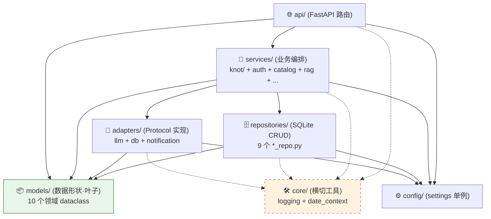

# BI-Agent — Claude Code 项目指令

## 概述

AI 驱动的 BI 助手：自然语言 → SQL → 图表。
- v0.1.1：Python 3 / FastAPI + React（浏览器端 Babel）
- v0.2.x（当前 v0.2.4）：FastAPI + React/Vite 构建版前端
- v0.x.x（规划）：Go 后端重写

## 协作规则

1. 不确定就问，别猜
2. 没要求就不写
3. 只改被要求的部分
4. 给验收标准，别给步骤

### ⚠️ 迭代循环协议 (Loop Protocol) — v2

**严禁在未走完三阶段评审的情况下编写任何业务代码。**

#### 一个 MINOR = 一个 Agent

Agent 的生命周期与 **MINOR 版本号**绑定，不与 PATCH 绑定：

- v0.3.0 / v0.3.1 / … / v0.3.x → **同一对话** = **v0.3 Agent**
- v0.4.0 / v0.4.1 / … / v0.4.x → **同一对话** = **v0.4 Agent**（当前执行者）
- v0.5.0 / … / v0.5.x → 下一对话 = v0.5 Agent

每跨一个 MINOR（0.3 → 0.4 / 0.4 → 0.5），用户开**新对话**启动新 Agent，
**上一 MINOR 的 Agent 立即转为守护者**（只读评审角色）。

#### 角色定义

| 角色 | 实体 | 职责 | 权限 |
|---|---|---|---|
| **执行者** | 当前 MINOR 的 Agent（如 v0.4 Agent） | 出方案、整合终审意见、写代码、跑闸门、提 PR | 读 + 写 |
| **守护者** | 上一 MINOR 的 Agent（如 v0.3 Agent） | 终审 — 拿到 Stage 1 草案 + Stage 2 初审意见，做逻辑一致性 / 历史决策冲突 / 红线遗漏校验 | **只读**（严禁改任何代码） |
| **辅助 AI 初审组** | 资深工程师 + Codex + 其他辅助 AI | 初审 — 对 Stage 1 草案给出 Redline / 评分 / 风险点 | 评审建议 |
| **资深架构师** | User 本人 | 战略决策 + 最终拍板 + 转发各阶段产物 | 决策 |

#### 三阶段评审

```
执行者                    辅助 AI 初审组              守护者                  执行者
   │                           │                         │                       │
   │ Stage 1: 方案/规划草案 ───┼─────────────────────┐   │                       │
   │                           │                     │   │                       │
   │                           │ Stage 2: 初审意见    │   │                       │
   │                           │   (Redline/评分)    │   │                       │
   │                           │                     │   │                       │
   │                           └─────────────────────┴──>│ Stage 3: 终审         │
   │                                                     │   (整合 1+2 后给意见)  │
   │                                                     │                       │
   │<────────────────────── 终审意见 ────────────────────┘                       │
   │                                                                             │
   │ 执行（按终审意见落 commit）                                                  │
```

1. **Stage 1 — 方案设计（执行者出）**
   执行者产出执行手册草案 `docs/plans/v0.X.Y-*.md`，包含范围 / 红线 / 验收 / commit 序列。

2. **Stage 2 — 辅助 AI 初审（资深工程师 + Codex + 其他 AI）**
   用户把 Stage 1 草案分发给辅助 AI 评审组，收集 Redline / 评分 / 风险点。
   **执行者此阶段不参与**（不打扰评审独立性）。

3. **Stage 3 — 守护者终审（上一 MINOR Agent）**
   用户把 **Stage 1 草案 + Stage 2 初审意见**一起喂给守护者。
   守护者职责：
   - 校验与上一 MINOR / 历史 PATCH 的设计决策一致性
   - 查漏检文件 / 错误命名 / 既有红线遗漏
   - 评估初审意见是否被正确吸收
   - 给出**终审意见**（保留 / 修订 / 否决具体条款）
   守护者**严禁直接修改方案文件或代码**，只输出评审文本。

4. **执行（执行者落地）**
   执行者**只拿到 Stage 3 终审意见**（不直接看 Stage 2 原文，避免重复消化），
   按终审意见整合修订手册 → commit 锁定 → 按 commit 序列实施 → 全闸门绿 → 提 PR。

#### 角色切换规则

每跨一个 MINOR（不是 PATCH）：
- **本 MINOR 执行者** → 自动晋升为下一 MINOR 的**守护者**（只读）
- 用户开**新对话**启动下一 MINOR 的**新执行者**
- 上上 MINOR 的守护者归档（除非用户主动调用做溯源）

PATCH 内（v0.4.0 → v0.4.1 → …）**不切换角色**，仍由同一执行者完成所有 PATCH 的三阶段循环。

## 启动

```bash
# 本地开发
pip install -r requirements.txt
python3 -m uvicorn bi_agent.main:app --reload --port 8000

# Docker 部署
docker build -t bi-agent . && docker run -d -p 8000:8000 --env-file .env bi-agent
```

## 关键路径

| 文件 | 职责 |
|------|------|
| `bi_agent/main.py` | App 工厂，sys.path 设置必须最先执行，注册所有路由 |
| `bi_agent/dependencies.py` | JWT 常量、create_token、get_current_user、require_admin |
| `bi_agent/schemas.py` | 所有 Pydantic 请求模型（9 个） |
| `bi_agent/engine_cache.py` | 用户 DB 引擎缓存（TTL 1h）、_upload_engine |
| `bi_agent/routers/` | 业务域路由文件（auth / admin / conversations / database / few_shots / knowledge / prompts / query / templates / uploads / user） |
| `bi_agent/core/` | 核心模块（config, persistence, llm_client, sql_agent, multi_agent 等） |
| `bi_agent/static/` | Vite 构建产物（`frontend/` 源码 → `npm run build` 输出至此） |
| `bi_agent/data/` | SQLite 数据库（gitignore，运行时自动创建） |

## 导入约定

`main.py` 最先执行 `sys.path.insert(0, .../core)`，使 core/ 内模块可用扁平导入
（`import config`、`import persistence` 等）。
`routers/` 通过相对导入拿 `dependencies` 和 `engine_cache`，不需要重复 sys.path 操作。

## 数据库

- `bi_agent/data/bi_agent.db` — 用户 / 会话 / 消息 / 知识库 / 用户上传 CSV/Excel（v0.2.4 合并 uploads.db）
- Apache Doris / MySQL — 业务查询目标（通过 .env 配置）

## 版本管理

格式：`vMAJOR.MINOR.PATCH.YYYYMMDDHHmm`

- **MAJOR**：`0` = 内测；`1` = 团队公测（由用户决定何时跨过）
- **MINOR**：阶段性大节点（重大重构 / 用户认为"这一阶段已迭代完"）
- **PATCH**：每完成一轮需求迭代 +1
- **时间戳**：每次实际打 tag 的精确时间；同一 PATCH 周期内的小修补只更新时间戳，不动 PATCH

示例：

- 起点：`v0.2.0.xxx`
- 完成本轮 5 点（4/26 16:00）→ `v0.2.1.202604261600`
- 当晚 18:00 修补本轮遗留 → `v0.2.1.202604261800`（PATCH 不动）
- 下一轮新需求完成 → `v0.2.2.xxx`
- 后端 Go 重写或阶段性收尾 → `v0.3.0.xxx`

记录文件：`CHANGELOG.md`（Keep a Changelog 格式）

分支策略：`main`（保护，仅打 tag）/ `develop`（集成）/ `feat|fix|chore|hotfix/*`

## 已知技术债

| 优先级 | 问题 | 目标分支 |
|--------|------|---------|
| ~~高~~ ✅ v0.4.4 已偿还 | LLM 全面 async（AsyncAnthropic / AsyncOpenAI），threadpool 64→32 | — |
| 中 | 路由中 sync SQLAlchemy；DB 端短查询为主，暂未切 async（v0.4.4 LLM 离开池后压力已大幅缓解，可观察是否还需要） | feat/async-db |
| ~~中~~ ✅ v0.2.2 已用 loguru | 结构化日志 | — |
| ~~低~~ ✅ v0.2.4 已合并 | uploads.db → bi_agent.db | — |
| ~~低~~ ✅ v0.2.4 已删 | `bi_agent/routers/user.py` 的 `/api/user/config` `/api/user/agent-models` | — |

## v0.3.x 工程化重构 — Contract 升级路线图

v0.3.0（已合入）建立 4 层架构 `routers → services → repositories | adapters → models`，
当前 import-linter contract **4 条 KEPT** 但部分采用渐进式 FIXME 锁定（资深架构师 + Codex 评审组 APPROVED）。
后续 PATCH 必须按下表升级 `.importlinter`，**不得跳过**：

| FIXME 标签 | 当前状态 | 升级动作 | 落地版本 |
|-----------|---------|---------|---------|
| ~~`FIXME-v0.3.1`~~ ✅ v0.3.1 已偿还 | `repositories` 仅禁 `routers` | 加上 `bi_agent.services` 到 `forbidden_modules` | v0.3.1 services 落地后 |
| ~~`FIXME-v0.3.2`~~ ✅ v0.3.2 已偿还 | `repositories` 仅禁 `routers + services` | 加上 `bi_agent.adapters` + 新增 contract `adapters-no-business` | v0.3.2 adapters 落地后 |
| ~~`FIXME-v0.3.2`~~ ✅ v0.3.2 已偿还 | `repositories` 仅禁 `routers / services` | 再加 `bi_agent.adapters` | v0.3.2 adapters 落地后 |
| ~~`FIXME-v0.3.3`~~ ✅ v0.3.3 已偿还 | `core-no-models` 仅禁 `models / routers` | 完整 `forbidden_modules`：`models, api, services, repositories, adapters` | v0.3.3 core 完全瘦身后 |

**v0.3.3 终态（Full Forbidden Mode）**：6 条 contract 全部 KEPT，所有 FIXME 清空。
4-PATCH 工程化重构正式收官，进入 v0.4.x 业务迭代期。

### 4 层依赖图（v0.3.3 终态）



> **规则**：实线 = 业务依赖（自上而下）；虚线 = 横切工具（任意层可用，不构成业务依赖）。
> import-linter 6 条 contract 把所有反向箭头都禁了。

### 4-PATCH 演进时间轴

```mermaid
gantt
    title 4-PATCH 工程化重构总账（v0.3.0 → v0.3.3）
    dateFormat X
    axisFormat %s

    section v0.3.0
    repos + models + 工程化基线 (4 contracts, 48 tests)  :done, 0, 1

    section v0.3.1
    services + core 无业务化 (4 contracts, 61 tests)     :done, 1, 2

    section v0.3.2
    adapters 协议驱动 + errors 树 (5 contracts, 85 tests) :done, 2, 3

    section v0.3.3
    api 改名 + Full Forbidden (6 contracts, 101 tests)   :done, 3, 4
```



资深寄语：v0.3.3 结束前 `core` 的 `forbidden_modules` 必须锁死至最高级别。

辅助 v0.3.x 计划：

| PATCH | 主题 | 关键交付 |
|-------|------|---------|
| ✅ v0.3.0 | repos 拆分 + models 顶级包 + 工程化基线 | `pyproject.toml` / `.importlinter` / `pip install -e .` |
| ✅ v0.3.1 | services/ 落地（含 knot/）+ 删 repos facade re-export + core 无业务化 | 9 个文件 git mv → services/[knot/]，repos 仅暴露 `init_db / get_conn` |
| ✅ v0.3.2 | adapters/ 落地（llm/db/notification 协议驱动）+ services/llm_client 瘦身 | adapters/{llm,db,notification}/{base,...}.py，5 contracts KEPT |
| ✅ v0.3.3 | routers→api 改名 + core 完全瘦身 + Full Forbidden Mode + 端到端集成测试 | api/ + 6 contracts KEPT + 13 集成测试 + 3 core 纯度守护测试 |

## v0.4.x 业务迭代路线图（v0.3.3 之后）

架构底座已稳，进入业务能力迭代期。v0.3.3 → v0.4.4 期间 **6 条 contract** 全程 KEPT；v0.4.5 首次升至 **7 条**（新增 `crypto-only-in-allowed-callers` — core.crypto 仅 repositories / scripts 可用）；v0.4.6 维持 7 条不变。

| PATCH | 主题 | 关键交付 |
|-------|------|---------|
| ✅ v0.4.0 | Clarifier intent + Layout 分支 + CSV 导出 + eval 扩量 | Clarifier 7 类 intent；前端按 intent 渲染 layout（MetricCard/Chart/RankView/RetentionMatrix/DetailTable）；`/api/messages/{id}/export.csv`（utf-8-sig BOM）；eval 80 条（每 intent ≥8 + 24 edge）；GH Actions live LLM CI；intent 准确率 ≥90% 门禁；AsyncLLMAdapter Protocol 占位 |
| ✅ v0.4.1 | 报表沉淀（saved_reports + 收藏 + 重跑 + CSV 导出）| `saved_reports` 表（去耦合快照）+ 6 路由（list/pin/run/update/delete/export.csv）+ 前端 ⭐ 收藏按钮 + SavedReportsScreen + R-S4 effectiveHint 三级链 + R-12 幂等 + R-S2 data_source 重跑 fallback；6 contracts KEPT；147 tests / 81 skipped；xlsx 推 v0.4.2 |
| ✅ v0.4.1.1 | hotfix — 笛卡尔积防御 + UX 双 Bug | Bug 1 (Shell.jsx active.startsWith('admin-')) + Bug 2 (后端 sql alias) + Bug 3 三层防御（Catalog RELATIONS + 双 prompt JOIN 硬约束 + eval 9 multi_table case + comma-FROM 守护正则）；157 tests / 90 skipped；89 eval cases；61 routes 不变；6 contracts KEPT。**隐含承诺**：合入后 7 天内须为 gitignored ohx_catalog.py 补 RELATIONS。 |
| ✅ v0.4.2 | 成本可观测 + xlsx 导出 + eval SQL 复杂度横切 | messages +10 列（4 agent_kind 分桶 + recovery_attempt）+ `cost_service` (R-S8 一致性入口) + `/api/admin/cost-stats` + xlsx 导出 (5000 行硬限 + R-S7 截断 metadata header) + eval 89→111 (subquery/window/cte +21) + AST hybrid dispatcher + CI label opt-in；64 routes / 203 tests / 112 skipped；6 contracts KEPT。**预算告警延期 v0.4.3**。**R-S6**：messages 列数 24，v0.4.5+ 评估迁移工具。 |
| ✅ v0.4.3 | 预算告警 + System_Recovery 维度（成本治理收尾）| `budgets` 表（global/user/agent_kind 三层 DRY）+ `budget_service` (R-16 优先级 + R-17 一致性对齐 + R-23 不缓存) + 5 路由（budgets CRUD + recovery-stats）+ R-22 流式/非流式同字段 + 前端 AdminBudgets/AdminRecovery + R-20 banner 降噪；69 routes / 223 tests / 112 skipped；6 contracts KEPT。**8 条红线 R-16~R-23 全部偿还**。错误体验/加密/审计推 v0.4.4-6。 |
| ✅ v0.4.4 | 异步 LLM + 错误体验改造 | AsyncLLMAdapter 落地（AsyncAnthropic / AsyncOpenAI / OpenRouter）+ R-31 Protocol 完整性；models/errors.py 扩 4 类（R-30 复用不重造）+ services/error_translator.py 7 类 kind 映射；async 业务链 (arun_clarifier/arun_sql_agent/arun_presenter) + R-26-Senior 首行 budget 守护 + R-32 fix_sql 独立桶；api/query.py 真异步 + R-26-SSE sleep(0) + R-33 双路径同字段；R-27 race 守护（100×gather 误差 ≤ 0.01%）；前端 ErrorBanner + R-28 优先级（覆盖 BudgetBanner）；R-29-anyio threadpool 默认 64→32；264 tests / 112 skipped；6 contracts KEPT。**已偿还** 9 条红线 R-24~R-33。 |
| ✅ v0.4.5 | 数据加密（API Key / DB 密码）| Loop Protocol v2 三阶段：v0.4 执行者 Stage 1 + 资深/Codex Stage 2 + v0.3 守护者 Stage 3（D1 路径反转 `adapters/crypto/` → `core/crypto/`）；6 类敏感字段 Fernet 应用层加密 + `enc_v1:` 前缀；`BIAGENT_MASTER_KEY` env fail-fast + 友好彩色错误（R-45 sys.exit(1)）；`bi_agent/scripts/migrate_encrypt_v045.py` 一次性幂等迁移 + 自动 timestamped `.v044-<ts>.bak`（R-46/R-46-Tx 每表事务）；前端 API Key `••••••••last4` masked + PATCH 空值/mask 占位保留（R-39）；**首次 contract 数变更 6 → 7 条**（新增 `crypto-only-in-allowed-callers` + `allow_indirect_imports = True` 只查直接边）；309 tests / 112 skipped；**已偿还** 13 条红线 R-34~R-46。 |
| ✅ v0.4.6 | 审计日志（who-did-what）| Loop Protocol v2 三阶段：v0.4 执行者 Stage 1 + 资深/Codex Stage 2 + v0.3 守护者 Stage 3（D1 反转 schema +client_ip/user_agent 独立列）；`audit_log` 表 INSERT-only + 3 索引；`AuditAction` Literal 33 条覆盖 8 类 mutation × 子动作（messages 显式排除 R-63 防爆表）；`audit_service.log()` fail-soft + R-64 失败计数器 hook + R-48/59/62 PII 三层防御（含 v0.4.5 加密字段 + 密文也 redact）+ D7 递归深度 3 防嵌套炸弹；`AuditWriteError(BIAgentError)` 复用 errors 树（R-65 不重复造轮子）；7 类 mutation 集成（auth/users/datasources/api-keys/budgets/agent-models/saved_reports/few_shots/prompts/catalog）+ admin GET 路由 + R-61 强制分页 cap 200 + R-56 越权 403 + R-53 stress 1000×p95<5ms；前端 AdminAudit 列表 + 筛选 + 详情抽屉（D3 落地，redacted 高亮提升 admin 信任感）；`purge_audit_log` 脚本复用 v0.4.5 模式（独立 entrypoint + timestamped .bak + dry-run）+ retention 90 天默认 7~3650 admin 可调 + R-57 meta-audit；362 tests / 112 skipped；7 contracts KEPT；72 routes（+3）；**已偿还** 20 条红线 R-47~R-66。 |

## v0.2.0 Go 重写技术栈（分支 feat/go-rewrite）

- HTTP：`gin-gonic/gin` 或 `gofiber/fiber`
- ORM：`gorm.io/gorm`
- LLM：`anthropic/anthropic-sdk-go` + `sashabaranov/go-openai`
- JWT：`golang-jwt/jwt`
- 前端：React + Vite（保留 ECharts 逻辑，加构建步骤）
