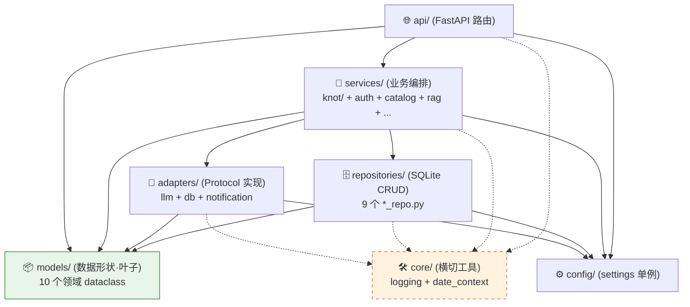

# BI-Agent — Claude Code 项目指令

## 概述

AI 驱动的 BI 助手：自然语言 → SQL → 图表。
- v0.1.1：Python 3 / FastAPI + React（浏览器端 Babel）
- v0.2.x（当前 v0.2.4）：FastAPI + React/Vite 构建版前端
- v0.x.x（规划）：Go 后端重写

## 协作规则

1. 不确定就问，别猜
2. 没要求就不写
3. 只改被要求的部分
4. 给验收标准，别给步骤

### ⚠️ 迭代循环协议 (Loop Protocol) — v3

**严禁在未走完三阶段评审的情况下编写任何业务代码。**

> v3 相对 v2：新增「**远古守护者**」角色 + 「**MINOR 滚动前夕整体审核**」仪式。
> v0.5.0 起生效；v0.4.x 期间走的是 v2（无远古守护者机制）。

#### 一个 MINOR = 一个 Agent

Agent 的生命周期与 **MINOR 版本号**绑定，不与 PATCH 绑定：

- v0.3.0 / v0.3.1 / … / v0.3.x → **同一对话** = **v0.3 Agent**
- v0.4.0 / v0.4.1 / … / v0.4.x → **同一对话** = **v0.4 Agent**
- v0.5.0 / … / v0.5.x → **同一对话** = **v0.5 Agent**

每跨一个 MINOR，用户开**新对话**启动新 Agent；角色按 §角色滚动规则更替。

#### 角色定义（v3 — 4 级角色）

| 角色 | 实体 | 职责 | 权限 |
|---|---|---|---|
| **执行者** | 当前 MINOR 的 Agent | 出方案、整合终审意见、写代码、跑闸门、提 PR | 读 + 写 |
| **守护者** | 上一 MINOR 的 Agent（距离 = 0.1） | PATCH 内 Stage 3 终审 + 闸门复核 | **只读**（严禁改代码） |
| **远古守护者** | 上上 MINOR 起的 Agent（距离 > 0.1） | **仅 MINOR 滚动前夕**整体审核 | **只读 + 默认沉睡** |
| **辅助 AI 初审组** | 资深工程师 + Codex + 其他辅助 AI | PATCH 内 Stage 2 给 Redline / 评分 / 风险点 | 评审建议 |
| **资深架构师** | User 本人 | 战略决策 + 拍板 + 召集整体审核 | 决策 |

#### 三阶段评审（PATCH 内常规流程）

```
执行者                    辅助 AI 初审组              守护者                  执行者
   │                           │                         │                       │
   │ Stage 1: 方案/规划草案 ───┼─────────────────────┐   │                       │
   │                           │                     │   │                       │
   │                           │ Stage 2: 初审意见    │   │                       │
   │                           │   (Redline/评分)    │   │                       │
   │                           │                     │   │                       │
   │                           └─────────────────────┴──>│ Stage 3: 终审         │
   │                                                     │   (整合 1+2 后给意见)  │
   │                                                     │                       │
   │<────────────────────── 终审意见 ────────────────────┘                       │
   │                                                                             │
   │ 执行（按终审意见落 commit）                                                  │
```

1. **Stage 1 — 方案设计（执行者出）**
   执行者产出执行手册草案 `docs/plans/v0.X.Y-*.md`，包含范围 / 红线 / 验收 / commit 序列。

2. **Stage 2 — 辅助 AI 初审**
   用户把 Stage 1 草案分发给辅助 AI 评审组，收集 Redline / 评分 / 风险点。
   执行者此阶段不参与（不打扰评审独立性）。

3. **Stage 3 — 守护者终审（上一 MINOR Agent）**
   用户把 **Stage 1 草案 + Stage 2 初审意见**一起喂给守护者。
   守护者职责：
   - 校验与上一 MINOR / 历史 PATCH 的设计决策一致性
   - 查漏检文件 / 错误命名 / 既有红线遗漏
   - 评估初审意见是否被正确吸收
   - 给出**终审意见**（保留 / 修订 / 否决具体条款）
   守护者**严禁直接修改方案文件或代码**，只输出评审文本。

4. **执行（执行者落地）**
   执行者**只拿到 Stage 3 终审意见**（不直接看 Stage 2 原文，避免重复消化），
   按终审意见整合修订手册 → commit 锁定 → 按 commit 序列实施 → 全闸门绿 → 提 PR。

#### MINOR 滚动前夕整体审核（v3 新增仪式）

- **触发**：资深架构师明确 announce「整体审核」
- **参与方**：执行者 + 守护者 + 所有存活的远古守护者（独立提供意见）
- **不在 PATCH 内**，是 MINOR 间的过渡仪式
- **产物 4 份固定模板**：
  1. **代码结构评估** — 巨型文件 / 重复 / 死代码 / 可读性短板
  2. **奥卡姆剃刀清单** — 必备 / 多余 / 待简化
  3. **重命名 / 重构 / 协议增量提案**
  4. **下一 MINOR 预期范围**（骨架，不锁定）
- **冲突仲裁**：多方意见独立提供，资深架构师拍板

#### 远古守护者激活原则

- 默认沉睡（不打扰当前 PATCH 节奏）
- 仅在「整体审核」明确激活
- 不参与日常 PATCH 三阶段评审

#### 角色滚动规则

每跨一个 MINOR：
- **当前执行者** → 下一 MINOR 的**守护者**（只读 active）
- **当前守护者** → 下一 MINOR 的**远古守护者**（保留对话，dormant）
- 已存在的远古守护者 → 继续保留 dormant
- 用户开**新对话**启动下一 MINOR 的**新执行者**

PATCH 内（v0.5.0 → v0.5.1 → …）**不切换角色**，仍由同一执行者完成所有 PATCH 的三阶段循环。

#### v3 协议施行历史

- v2（v0.4.x 期间生效）：3 角色（执行者 + 守护者 + 辅助 AI 初审组）
- v3（v0.5.0 起生效）：+ 远古守护者 + 整体审核仪式
- 首次整体审核：v0.4.6 → v0.5.0 滚动前夕（执行者 v0.4 + 守护者 v0.3，因 v0.3 之前无 v3 协议未存远古守护者）


## 启动

```bash
# 本地开发（v0.5.0 起包名 knot）
pip install -e ".[dev]"
python3 -m uvicorn knot.main:app --reload --port 8000

# Docker 部署
docker build -t knot . && docker run -d -p 8000:8000 --env-file .env knot

# v0.5.0 升级老用户（v0.4.x → v0.5.0）
# 1. pip uninstall bi-agent && pip install -e .（包名变更）
# 2. .env 改 KNOT_MASTER_KEY（旧 BIAGENT_MASTER_KEY 兼容至 v1.0）
# 3. DB 自动迁移：startup 检测 bi_agent.db → 自动 rename knot.db + 留 timestamped bak
# 4. Docker volume：-v 路径变更 bi_agent/data/ → knot/data/
```

## 关键路径（v0.5.0 起包名 knot）

| 文件 | 职责 |
|------|------|
| `knot/main.py` | App 工厂，FastAPI title=KNOT version=0.5.0；启动 banner 显示实际加载 env 名 |
| `knot/api/deps.py` | JWT 常量、create_token、get_current_user、require_admin |
| `knot/api/schemas.py` | 所有 Pydantic 请求模型（9 个） |
| `knot/services/engine_cache.py` | 用户 DB 引擎缓存（TTL 1h）、_upload_engine |
| `knot/api/` | 业务域路由文件（72 路由：auth / admin / conversations / database / few_shots / knowledge / prompts / query / templates / uploads / saved_reports / audit / catalog / exports） |
| `knot/services/agents/` | 3 agent 实现（v0.5.0 从 services/knot/ rename，避免 knot/services/knot 重名）|
| `knot/services/` | 业务编排层（auth_service / budget_service / cost_service / audit_service / error_translator / llm_client 等） |
| `knot/repositories/` | 9 个 *_repo.py + audit_repo.py |
| `knot/adapters/` | llm/{anthropic_native,openai_compat,openrouter,async+sync 双 API} + db/doris.py + notification/lark.py(stub) |
| `knot/core/` | 横切工具（logging_setup / date_context / crypto/fernet）|
| `knot/scripts/` | migrate_encrypt_v045.py / purge_audit_log.py / migrate_db_rename_v050.py |
| `knot/static/` | Vite 构建产物（`frontend/` 源码 → `npm run build` 输出至此） |
| `knot/data/` | SQLite 数据库（gitignore，runtime 自动创建；v0.5.0 起文件名 knot.db） |

## 导入约定

v0.3.0 起 `pip install -e .` editable 安装；解释器原生识别 `knot` 包，无 sys.path hack。
所有业务模块用 `from knot.X import Y` 绝对导入（`from knot.api.deps import get_current_user` 等）。

## 数据库

- `knot/data/knot.db` — 用户 / 会话 / 消息 / 知识库 / 用户上传 CSV/Excel / 审计日志
  （v0.2.4 合并 uploads.db；v0.4.6 加 audit_log；v0.5.0 文件名 bi_agent.db → knot.db）
- 启动 migration（v0.5.0+）：检测旧 `bi_agent.db` → 自动 rename + 留 timestamped backup（R-69 幂等 + R-76 atomic 异常保护）
- Apache Doris / MySQL — 业务查询目标（通过 .env 配置）

## 加密 master key（v0.5.0 双源）

- **v0.5.0+ 推荐**：`KNOT_MASTER_KEY`（新名）
- **兼容旧名**：`BIAGENT_MASTER_KEY`（v0.4.5 起；启动见 deprecation warn；v1.0 移除）
- 同时设置且值不同 + DB 有 `enc_v1:` 数据 → R-74 探针验证旧/新解密能力，旧成功新失败 → `sys.exit(1)` 防数据永久丢失

## 版本管理

格式：`vMAJOR.MINOR.PATCH.YYYYMMDDHHmm`

- **MAJOR**：`0` = 内测；`1` = 团队公测（由用户决定何时跨过）
- **MINOR**：阶段性大节点（重大重构 / 用户认为"这一阶段已迭代完"）
- **PATCH**：每完成一轮需求迭代 +1
- **时间戳**：每次实际打 tag 的精确时间；同一 PATCH 周期内的小修补只更新时间戳，不动 PATCH

示例：

- 起点：`v0.2.0.xxx`
- 完成本轮 5 点（4/26 16:00）→ `v0.2.1.202604261600`
- 当晚 18:00 修补本轮遗留 → `v0.2.1.202604261800`（PATCH 不动）
- 下一轮新需求完成 → `v0.2.2.xxx`
- 后端 Go 重写或阶段性收尾 → `v0.3.0.xxx`

记录文件：`CHANGELOG.md`（Keep a Changelog 格式）

分支策略：`main`（保护，仅打 tag）/ `develop`（集成）/ `feat|fix|chore|hotfix/*`

## 已知技术债

| 优先级 | 问题 | 目标分支 |
|--------|------|---------|
| ~~高~~ ✅ v0.4.4 已偿还 | LLM 全面 async（AsyncAnthropic / AsyncOpenAI），threadpool 64→32 | — |
| 中 | 路由中 sync SQLAlchemy；DB 端短查询为主，暂未切 async（v0.4.4 LLM 离开池后压力已大幅缓解，可观察是否还需要） | feat/async-db |
| ~~中~~ ✅ v0.2.2 已用 loguru | 结构化日志 | — |
| ~~低~~ ✅ v0.2.4 已合并 | uploads.db → bi_agent.db | — |
| ~~低~~ ✅ v0.2.4 已删 | `bi_agent/routers/user.py` 的 `/api/user/config` `/api/user/agent-models` | — |

## v0.3.x 工程化重构 — Contract 升级路线图

v0.3.0（已合入）建立 4 层架构 `routers → services → repositories | adapters → models`，
当前 import-linter contract **4 条 KEPT** 但部分采用渐进式 FIXME 锁定（资深架构师 + Codex 评审组 APPROVED）。
后续 PATCH 必须按下表升级 `.importlinter`，**不得跳过**：

| FIXME 标签 | 当前状态 | 升级动作 | 落地版本 |
|-----------|---------|---------|---------|
| ~~`FIXME-v0.3.1`~~ ✅ v0.3.1 已偿还 | `repositories` 仅禁 `routers` | 加上 `bi_agent.services` 到 `forbidden_modules` | v0.3.1 services 落地后 |
| ~~`FIXME-v0.3.2`~~ ✅ v0.3.2 已偿还 | `repositories` 仅禁 `routers + services` | 加上 `bi_agent.adapters` + 新增 contract `adapters-no-business` | v0.3.2 adapters 落地后 |
| ~~`FIXME-v0.3.2`~~ ✅ v0.3.2 已偿还 | `repositories` 仅禁 `routers / services` | 再加 `bi_agent.adapters` | v0.3.2 adapters 落地后 |
| ~~`FIXME-v0.3.3`~~ ✅ v0.3.3 已偿还 | `core-no-models` 仅禁 `models / routers` | 完整 `forbidden_modules`：`models, api, services, repositories, adapters` | v0.3.3 core 完全瘦身后 |

**v0.3.3 终态（Full Forbidden Mode）**：6 条 contract 全部 KEPT，所有 FIXME 清空。
4-PATCH 工程化重构正式收官，进入 v0.4.x 业务迭代期。

### 4 层依赖图（v0.3.3 终态）



> **规则**：实线 = 业务依赖（自上而下）；虚线 = 横切工具（任意层可用，不构成业务依赖）。
> import-linter 6 条 contract 把所有反向箭头都禁了。

### 4-PATCH 演进时间轴

```mermaid
gantt
    title 4-PATCH 工程化重构总账（v0.3.0 → v0.3.3）
    dateFormat X
    axisFormat %s

    section v0.3.0
    repos + models + 工程化基线 (4 contracts, 48 tests)  :done, 0, 1

    section v0.3.1
    services + core 无业务化 (4 contracts, 61 tests)     :done, 1, 2

    section v0.3.2
    adapters 协议驱动 + errors 树 (5 contracts, 85 tests) :done, 2, 3

    section v0.3.3
    api 改名 + Full Forbidden (6 contracts, 101 tests)   :done, 3, 4
```



资深寄语：v0.3.3 结束前 `core` 的 `forbidden_modules` 必须锁死至最高级别。

辅助 v0.3.x 计划：

| PATCH | 主题 | 关键交付 |
|-------|------|---------|
| ✅ v0.3.0 | repos 拆分 + models 顶级包 + 工程化基线 | `pyproject.toml` / `.importlinter` / `pip install -e .` |
| ✅ v0.3.1 | services/ 落地（含 knot/）+ 删 repos facade re-export + core 无业务化 | 9 个文件 git mv → services/[knot/]，repos 仅暴露 `init_db / get_conn` |
| ✅ v0.3.2 | adapters/ 落地（llm/db/notification 协议驱动）+ services/llm_client 瘦身 | adapters/{llm,db,notification}/{base,...}.py，5 contracts KEPT |
| ✅ v0.3.3 | routers→api 改名 + core 完全瘦身 + Full Forbidden Mode + 端到端集成测试 | api/ + 6 contracts KEPT + 13 集成测试 + 3 core 纯度守护测试 |

## v0.4.x 业务迭代路线图（v0.3.3 之后）

架构底座已稳，进入业务能力迭代期。v0.3.3 → v0.4.4 期间 **6 条 contract** 全程 KEPT；v0.4.5 首次升至 **7 条**（新增 `crypto-only-in-allowed-callers` — core.crypto 仅 repositories / scripts 可用）；v0.4.6 维持 7 条不变。

| PATCH | 主题 | 关键交付 |
|-------|------|---------|
| ✅ v0.4.0 | Clarifier intent + Layout 分支 + CSV 导出 + eval 扩量 | Clarifier 7 类 intent；前端按 intent 渲染 layout（MetricCard/Chart/RankView/RetentionMatrix/DetailTable）；`/api/messages/{id}/export.csv`（utf-8-sig BOM）；eval 80 条（每 intent ≥8 + 24 edge）；GH Actions live LLM CI；intent 准确率 ≥90% 门禁；AsyncLLMAdapter Protocol 占位 |
| ✅ v0.4.1 | 报表沉淀（saved_reports + 收藏 + 重跑 + CSV 导出）| `saved_reports` 表（去耦合快照）+ 6 路由（list/pin/run/update/delete/export.csv）+ 前端 ⭐ 收藏按钮 + SavedReportsScreen + R-S4 effectiveHint 三级链 + R-12 幂等 + R-S2 data_source 重跑 fallback；6 contracts KEPT；147 tests / 81 skipped；xlsx 推 v0.4.2 |
| ✅ v0.4.1.1 | hotfix — 笛卡尔积防御 + UX 双 Bug | Bug 1 (Shell.jsx active.startsWith('admin-')) + Bug 2 (后端 sql alias) + Bug 3 三层防御（Catalog RELATIONS + 双 prompt JOIN 硬约束 + eval 9 multi_table case + comma-FROM 守护正则）；157 tests / 90 skipped；89 eval cases；61 routes 不变；6 contracts KEPT。**隐含承诺**：合入后 7 天内须为 gitignored ohx_catalog.py 补 RELATIONS。 |
| ✅ v0.4.2 | 成本可观测 + xlsx 导出 + eval SQL 复杂度横切 | messages +10 列（4 agent_kind 分桶 + recovery_attempt）+ `cost_service` (R-S8 一致性入口) + `/api/admin/cost-stats` + xlsx 导出 (5000 行硬限 + R-S7 截断 metadata header) + eval 89→111 (subquery/window/cte +21) + AST hybrid dispatcher + CI label opt-in；64 routes / 203 tests / 112 skipped；6 contracts KEPT。**预算告警延期 v0.4.3**。**R-S6**：messages 列数 24，v0.4.5+ 评估迁移工具。 |
| ✅ v0.4.3 | 预算告警 + System_Recovery 维度（成本治理收尾）| `budgets` 表（global/user/agent_kind 三层 DRY）+ `budget_service` (R-16 优先级 + R-17 一致性对齐 + R-23 不缓存) + 5 路由（budgets CRUD + recovery-stats）+ R-22 流式/非流式同字段 + 前端 AdminBudgets/AdminRecovery + R-20 banner 降噪；69 routes / 223 tests / 112 skipped；6 contracts KEPT。**8 条红线 R-16~R-23 全部偿还**。错误体验/加密/审计推 v0.4.4-6。 |
| ✅ v0.4.4 | 异步 LLM + 错误体验改造 | AsyncLLMAdapter 落地（AsyncAnthropic / AsyncOpenAI / OpenRouter）+ R-31 Protocol 完整性；models/errors.py 扩 4 类（R-30 复用不重造）+ services/error_translator.py 7 类 kind 映射；async 业务链 (arun_clarifier/arun_sql_agent/arun_presenter) + R-26-Senior 首行 budget 守护 + R-32 fix_sql 独立桶；api/query.py 真异步 + R-26-SSE sleep(0) + R-33 双路径同字段；R-27 race 守护（100×gather 误差 ≤ 0.01%）；前端 ErrorBanner + R-28 优先级（覆盖 BudgetBanner）；R-29-anyio threadpool 默认 64→32；264 tests / 112 skipped；6 contracts KEPT。**已偿还** 9 条红线 R-24~R-33。 |
| ✅ v0.4.5 | 数据加密（API Key / DB 密码）| Loop Protocol v2 三阶段：v0.4 执行者 Stage 1 + 资深/Codex Stage 2 + v0.3 守护者 Stage 3（D1 路径反转 `adapters/crypto/` → `core/crypto/`）；6 类敏感字段 Fernet 应用层加密 + `enc_v1:` 前缀；`BIAGENT_MASTER_KEY` env fail-fast + 友好彩色错误（R-45 sys.exit(1)）；`bi_agent/scripts/migrate_encrypt_v045.py` 一次性幂等迁移 + 自动 timestamped `.v044-<ts>.bak`（R-46/R-46-Tx 每表事务）；前端 API Key `••••••••last4` masked + PATCH 空值/mask 占位保留（R-39）；**首次 contract 数变更 6 → 7 条**（新增 `crypto-only-in-allowed-callers` + `allow_indirect_imports = True` 只查直接边）；309 tests / 112 skipped；**已偿还** 13 条红线 R-34~R-46。 |
| ✅ v0.4.6 | 审计日志（who-did-what）| Loop Protocol v2 三阶段：v0.4 执行者 Stage 1 + 资深/Codex Stage 2 + v0.3 守护者 Stage 3（D1 反转 schema +client_ip/user_agent 独立列）；`audit_log` 表 INSERT-only + 3 索引；`AuditAction` Literal 33 条覆盖 8 类 mutation × 子动作（messages 显式排除 R-63 防爆表）；`audit_service.log()` fail-soft + R-64 失败计数器 hook + R-48/59/62 PII 三层防御（含 v0.4.5 加密字段 + 密文也 redact）+ D7 递归深度 3 防嵌套炸弹；`AuditWriteError(BIAgentError)` 复用 errors 树（R-65 不重复造轮子）；7 类 mutation 集成（auth/users/datasources/api-keys/budgets/agent-models/saved_reports/few_shots/prompts/catalog）+ admin GET 路由 + R-61 强制分页 cap 200 + R-56 越权 403 + R-53 stress 1000×p95<5ms；前端 AdminAudit 列表 + 筛选 + 详情抽屉（D3 落地，redacted 高亮提升 admin 信任感）；`purge_audit_log` 脚本复用 v0.4.5 模式（独立 entrypoint + timestamped .bak + dry-run）+ retention 90 天默认 7~3650 admin 可调 + R-57 meta-audit；362 tests / 112 skipped；7 contracts KEPT；72 routes（+3）；**已偿还** 20 条红线 R-47~R-66。 |

## v0.5.x 业务迭代路线图（v0.4.6 之后 — KNOT 准生产）

**bi-agent 品牌正式归档历史**（v0.5.0 起包名 knot）。Loop Protocol v3 首次完整 PATCH 内施行（执行者 + 守护者 + 远古守护者 + 辅助 AI 初审组 4 级角色 + MINOR 滚动整体审核仪式）。7 条 contract 全程 KEPT。

| PATCH | 主题 | 关键交付 |
|-------|------|---------|
| ✅ v0.5.0 | (C0) bi-agent → KNOT 重命名 + Foundation | Loop Protocol v3 三阶段：v0.5 执行者 Stage 1 + 资深/Codex Stage 2 + v0.4 守护者 Stage 3（含资深 3 维度提问回应：R-74 密文兼容性探针 / R-75 审计连续性 / R-76 迁移备份原子性）；`bi_agent/` → `knot/` 包重命名（git mv 132 个 .py 保 history）+ `services/knot/` → `services/agents/`（守护者整体审核新发现重名冲突）；env 双源 `KNOT_MASTER_KEY` 优先 + `BIAGENT_MASTER_KEY` deprecated 回退（v1.0 移除）；R-74 密文兼容性探针（双 key 不同值时 sqlite3 直读 enc_v1: 探针验证旧/新解密能力，旧成功新失败 → sys.exit(1) 防数据永久丢失）；DB startup migration `bi_agent.db` → `knot.db`（R-69 4 场景幂等 + R-76 atomic try/except + 独立 entrypoint --dry-run 双轨 + timestamped .v044-<ts>.bak）；`_v050_rename.py` 一次性 Python 跨平台替换脚本（R-77 禁 sed -i ''；4 phase 顺序锁定；字面量保护占位防 `bi_agent.db` 误替）；7 contracts KEPT（Contract 7 forbidden_modules 同步替换 `knot.core.crypto` 关键 R-71）；frontend vite outDir + Chat.jsx CSV 文件名前缀 `knot-`；CI matrix 4 组合 × ubuntu+macOS 双平台（R-72/R-77 完整覆盖）；375 tests / 112 skipped（v0.4.6 362 → +13）；**已偿还** 13 条红线 R-67~R-79；**守护者结构性教训** 3 条（dotenv 自动发现 / R-77 替换顺序漏洞 / PEP 585 顺手清理）。 |
| ⏳ v0.5.1 | (C1) SQL AST 预校验（笛卡尔积硬防御）| sqlglot AST 解析 + JOIN graph 抽取 + 笛卡尔积 / 1=1 恒真 / 跨表 WHERE 无前缀检测；触发 → sql_planner ReAct 重生成（带反馈 prompt）；≤ 200 行；1.0 阻塞偿还 |
| ⏳ v0.5.2 | (C2) 后端代码瘦身 | sql_planner.py (622) / llm_client.py (574) / orchestrator.py (535) / api/query.py (457) 拆分 |
| ⏳ v0.5.3 | (C3) 前端代码瘦身 | Chat.jsx (925) / Admin.jsx (773) 拆分 |
| ⏳ v0.5.4 | (C4) Loop Protocol v3 路线图同步 | CLAUDE.md / CHANGELOG / README 同步 v3 协议 + 整体审核仪式 |
| ⏳ v0.5.5+ | (C5+) Claude Design UI 重构（多 PATCH）| `knot_ui_demo/v0.5/` 1:1 复刻；以体验先行重构产品形态 |
| ⏳ v0.5.x | (Cn) cleanup | 删 lark.py stub + sync LLM API @deprecated 标注 |

> v0.5.x 主线推进 1.0 release 准备。1.0 团队公测起点。

## v0.2.0 Go 重写技术栈（分支 feat/go-rewrite）

- HTTP：`gin-gonic/gin` 或 `gofiber/fiber`
- ORM：`gorm.io/gorm`
- LLM：`anthropic/anthropic-sdk-go` + `sashabaranov/go-openai`
- JWT：`golang-jwt/jwt`
- 前端：React + Vite（保留 ECharts 逻辑，加构建步骤）
