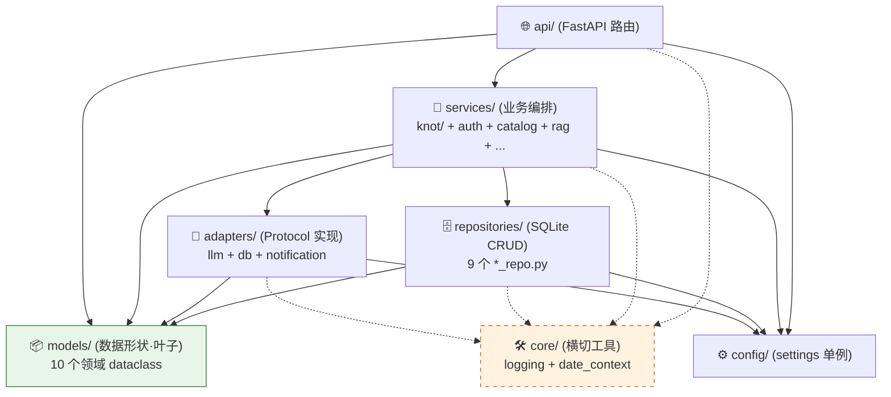

# BI-Agent — Claude Code 项目指令

## 概述

AI 驱动的 BI 助手：自然语言 → SQL → 图表。
- v0.1.1：Python 3 / FastAPI + React（浏览器端 Babel）
- v0.2.x（当前 v0.2.4）：FastAPI + React/Vite 构建版前端
- v0.x.x（规划）：Go 后端重写

## 协作规则

1. 不确定就问，别猜
2. 没要求就不写
3. 只改被要求的部分
4. 给验收标准，别给步骤

### ⚠️ 迭代循环协议 (Loop Protocol) — v3

**严禁在未走完三阶段评审的情况下编写任何业务代码。**

> v3 相对 v2：新增「**远古守护者**」角色 + 「**MINOR 滚动前夕整体审核**」仪式。
> v0.5.0 起生效；v0.4.x 期间走的是 v2（无远古守护者机制）。

#### 一个 MINOR = 一个 Agent

Agent 的生命周期与 **MINOR 版本号**绑定，不与 PATCH 绑定：

- v0.3.0 / v0.3.1 / … / v0.3.x → **同一对话** = **v0.3 Agent**
- v0.4.0 / v0.4.1 / … / v0.4.x → **同一对话** = **v0.4 Agent**
- v0.5.0 / … / v0.5.x → **同一对话** = **v0.5 Agent**

每跨一个 MINOR，用户开**新对话**启动新 Agent；角色按 §角色滚动规则更替。

#### 角色定义（v3 — 4 级角色）

| 角色 | 实体 | 职责 | 权限 |
|---|---|---|---|
| **执行者** | 当前 MINOR 的 Agent | 出方案、整合终审意见、写代码、跑闸门、提 PR | 读 + 写 |
| **守护者** | 上一 MINOR 的 Agent（距离 = 0.1） | PATCH 内 Stage 3 终审 + 闸门复核 | **只读**（严禁改代码） |
| **远古守护者** | 上上 MINOR 起的 Agent（距离 > 0.1） | **仅 MINOR 滚动前夕**整体审核 | **只读 + 默认沉睡** |
| **辅助 AI 初审组** | 资深工程师 + Codex + 其他辅助 AI | PATCH 内 Stage 2 给 Redline / 评分 / 风险点 | 评审建议 |
| **资深架构师** | User 本人 | 战略决策 + 拍板 + 召集整体审核 | 决策 |

#### 三阶段评审（PATCH 内常规流程）

```
执行者                    辅助 AI 初审组              守护者                  执行者
   │                           │                         │                       │
   │ Stage 1: 方案/规划草案 ───┼─────────────────────┐   │                       │
   │                           │                     │   │                       │
   │                           │ Stage 2: 初审意见    │   │                       │
   │                           │   (Redline/评分)    │   │                       │
   │                           │                     │   │                       │
   │                           └─────────────────────┴──>│ Stage 3: 终审         │
   │                                                     │   (整合 1+2 后给意见)  │
   │                                                     │                       │
   │<────────────────────── 终审意见 ────────────────────┘                       │
   │                                                                             │
   │ 执行（按终审意见落 commit）                                                  │
```

1. **Stage 1 — 方案设计（执行者出）**
   执行者产出执行手册草案 `docs/plans/v0.X.Y-*.md`，包含范围 / 红线 / 验收 / commit 序列。

2. **Stage 2 — 辅助 AI 初审**
   用户把 Stage 1 草案分发给辅助 AI 评审组，收集 Redline / 评分 / 风险点。
   执行者此阶段不参与（不打扰评审独立性）。

3. **Stage 3 — 守护者终审（上一 MINOR Agent）**
   用户把 **Stage 1 草案 + Stage 2 初审意见**一起喂给守护者。
   守护者职责：
   - 校验与上一 MINOR / 历史 PATCH 的设计决策一致性
   - 查漏检文件 / 错误命名 / 既有红线遗漏
   - 评估初审意见是否被正确吸收
   - 给出**终审意见**（保留 / 修订 / 否决具体条款）
   守护者**严禁直接修改方案文件或代码**，只输出评审文本。

4. **执行（执行者落地）**
   执行者**只拿到 Stage 3 终审意见**（不直接看 Stage 2 原文，避免重复消化），
   按终审意见整合修订手册 → commit 锁定 → 按 commit 序列实施 → 全闸门绿 → 提 PR。

#### MINOR 滚动前夕整体审核（v3 新增仪式）

- **触发**：资深架构师明确 announce「整体审核」
- **参与方**：执行者 + 守护者 + 所有存活的远古守护者（独立提供意见）
- **不在 PATCH 内**，是 MINOR 间的过渡仪式
- **产物 4 份固定模板**：
  1. **代码结构评估** — 巨型文件 / 重复 / 死代码 / 可读性短板
  2. **奥卡姆剃刀清单** — 必备 / 多余 / 待简化
  3. **重命名 / 重构 / 协议增量提案**
  4. **下一 MINOR 预期范围**（骨架，不锁定）
- **冲突仲裁**：多方意见独立提供，资深架构师拍板

#### 远古守护者激活原则

- 默认沉睡（不打扰当前 PATCH 节奏）
- 仅在「整体审核」明确激活
- 不参与日常 PATCH 三阶段评审

#### 角色滚动规则

每跨一个 MINOR：
- **当前执行者** → 下一 MINOR 的**守护者**（只读 active）
- **当前守护者** → 下一 MINOR 的**远古守护者**（保留对话，dormant）
- 已存在的远古守护者 → 继续保留 dormant
- 用户开**新对话**启动下一 MINOR 的**新执行者**

PATCH 内（v0.5.0 → v0.5.1 → …）**不切换角色**，仍由同一执行者完成所有 PATCH 的三阶段循环。

#### v3 协议施行历史

- v2（v0.4.x 期间生效）：3 角色（执行者 + 守护者 + 辅助 AI 初审组）
- v3（v0.5.0 起生效）：+ 远古守护者 + 整体审核仪式
- 首次整体审核：v0.4.6 → v0.5.0 滚动前夕（执行者 v0.4 + 守护者 v0.3，因 v0.3 之前无 v3 协议未存远古守护者）

**v3 协议施行回顾**（v0.5.0~v0.5.4 已 5 次完整 PATCH 内施行）：

| PATCH | 主题 | 红线 | 关键决策 / 施行特征 |
|---|---|---|---|
| v0.5.0 | KNOT rename + Foundation | R-67~R-79 (13) | 包名 / env 双源 / DB migration / Loop Protocol v3 **首次完整施行** |
| v0.5.1 | SQL AST 笛卡尔积硬防御 | R-80~R-93 (14) | sqlglot AST + ReAct `__REJECT_CARTESIAN__` + R-91 计数器 |
| v0.5.2 | 后端代码瘦身 | R-94~R-110 (17) | **27 文件行数压制**（4 主 ≤ 350/300/220/220 + 9 新建 ≤ 250 + scripts/check_file_sizes.py CI 核验）；sync/async 双胞胎保守不合并；orchestrator 方案 1 延迟 import 破单向依赖 |
| v0.5.3 | 前端代码瘦身 | R-111~R-128 (18) | Chat.jsx 925 → ≤ 350；Admin tab 7→4 文件按职责合并；className 0 diff 守护；R-118 SSE handler 纯函数化 callbacks 注入 |
| v0.5.4 | Loop Protocol v3 路线图同步 | R-129~R-138 (10) | docs-only；**第 5 次 v3 施行**（自我引用闭环 — 用 v3 协议同步 v3 协议）；README 加 protocol 简介对外公开治理 |
| v0.5.5 | Cn cleanup（遗留清理） | R-139~R-153 (15) | **首次净行数减少（Negative Delta -18）**；物理删 `lark.py` stub；8 处 sync API 标 `[DEPRECATED v0.5.5; target removal in v1.0]`；测试受控降级 432→430；**第 6 次 v3 施行** |
| v0.5.6 | C5 Claude Design UI 重构 — Foundation | R-154~R-169 (16) | **第二次 Negative Delta -136**；Shared.jsx + utils.jsx + App.css 视觉重构 — OKLCH 蓝青 195° brand + PingFang/HarmonyOS 字体 + Icon viewBox 24 stroke 1.6；R-167 语义色翠绿 145°/琥珀 85° 远离 brand；R-169 CHART_COLORS hue 45° 均匀分布；R-156 18 屏 0 修改自动换皮；R-158/159 Shared/utils 契约 9+8 exports byte-equal；**第 7 次 v3 施行** |
| v0.5.7 | C5+ Login 屏首屏复刻 pilot | R-170~R-186 (17) | **1 屏 1 PATCH 模式确立**；Shared.jsx +3 exports (KnotMark/Wordmark/Logo) 9→12；decor/NarrativeMotif.jsx [NEW 112 行] React.memo + OKLCH color-mix tint；Login.jsx 116→178 demo grid 1.05fr 1fr + KNOT tagline + "进入 KNOT" + "7 天内自动登录" + 页脚 v0.5.7；R-184 input focus 蓝青；R-186 抗诱惑 — Shell.jsx 严守 0 改；R-181 三处版本同步（main.py + smoke + Login 页脚）；432 tests / 112 skipped；**第 8 次 v3 施行** |
| v0.5.8 | Cn+ Chore — CI fix + Visual Replication Protocol | R-187~R-191 (5) | docs+ci chore；偿还 v0.5.0 R-72 留下的 ci.yml boot smoke 硬编 0.5.0 bug（R-187 动态读 main.py）；CLAUDE.md 加 § Visual Replication Protocol 段（R-188）提炼 v0.5.7 经验为 v0.5.8+ 屏复刻铺路；432 tests / 112 skipped 不变；7 contracts KEPT；**第 9 次 v3 施行**（简化 — 跳 Stage 2/3 直接 Stage 4，资深 ack） |


## § Visual Replication Protocol（v0.5.7+ 屏复刻通用约束）

> **触发**：v0.5.7 起每个屏复刻 PATCH（home / shell / thinking / favorites / 9 admin tabs）
> **依据**：v0.5.7 Login pilot 实证经验提炼；适用于 v0.5.8+ 17 屏渐进复刻
> **与 Loop Protocol v3 关系**：本协议是视觉复刻专项约束，**不替代** v3 三阶段评审；每屏 PATCH 仍走 Stage 1+2+3+4

### 路径常量

- **Demo 设计稿**：`/Users/kk/Documents/knot_ui_demo/v0.5/artboards/*.jsx`（设计代理，**不进产品**）
- **产品屏**：`frontend/src/screens/*.jsx`
- **共享 Foundation**（v0.5.6 + v0.5.7 落地）：
  - `Shared.jsx` — buildTheme(dark) 25 字段 + I 36 icons + iconBtn/pillBtn + CHART_COLORS 8 色 + LineChart/BarChart/PieChart/TypingDots + KnotMark/KnotWordmark/KnotLogo 三件套
  - `utils.jsx` — Modal/ModalHeader/Input/Select/Spinner/toast/useTheme/usePersist
  - `decor/NarrativeMotif.jsx` — 原子 motif SVG（React.memo + OKLCH color-mix tint）

### 设计系统（v0.5.6 锁定，严禁扩展）

- **色彩**：OKLCH 单一色空间 — brand 195° / success 145° / warn 85° / error 27° / chart 8 色 hue 45° 均匀分布
- **字体**：HarmonyOS Sans SC / PingFang SC / Inter（sans）+ JetBrains Mono / Geist Mono（mono）
- **图标**：I 36 names viewBox 24×24 stroke 1.6（Logo 用 KnotMark viewBox 100×100，语义不同）
- **OKLCH fallback**：R-165 :root CSS Variables + `@supports not` 已兜底，新代码无需重复

### 视觉模型（v0.5.7 验证）

- **底色面板** → fluid 100%（铺满 viewport 边缘；不要 artboard 整体居中）
- **元素** → 尺寸不变，位置 anchor 到 panel 边角（与主题切换 fixed 右上同思路）
- demo 是 1200×760 artboard 设计代理，产品按"viewport-fluid + element-anchored"模式呈现，**不要照搬 artboard 尺寸**

### byte-equal 红线（每屏 PATCH 通用，沿用 v0.5.7 R-170~172/178/179/186 模板）

- export name + props 签名 byte-equal（App.jsx / Shell.jsx / 父组件调用 0 改动）
- 业务链路（api.* / state hooks / SSE handler / localStorage key）byte-equal
- 错误文案 / 提示文案字面 byte-equal（i18n 留 v0.6+）
- 其他 17 屏 + 子模块 byte-equal（`git diff origin/main HEAD -- frontend/src/screens/` 仅含目标屏）
- App.jsx / api.js / index.css / main.jsx / utils.jsx / Shell.jsx byte-equal（除非 PATCH 明确改 Shell 屏）

### 抗诱惑清单（5 条 — v0.5.7 R-186 经验）

- 即使 Foundation 资产可用，**仅在当前 PATCH 目标屏引用**
- 严禁顺手扩 buildTheme 加新字段（破 R-158 25 字段契约）
- 严禁顺手 i18n / 国际化（zh-CN 写死至 v0.5.x 末）
- 严禁顺手改其他屏 / Shell topbar / favicon 等不在 PATCH scope 内的资产
- 严禁引入新 npm 依赖（若需要 → 单独 chore PATCH 评估）

### 三处版本同步（v0.5.0 R-72 + v0.5.7 R-181 模板）

每 PATCH 升版本须**三处同步**：
1. `knot/main.py` FastAPI version
2. `tests/test_rename_smoke.py` R-72 smoke 字面 + docstring
3. **若改 Login.jsx**：`frontend/src/screens/Login.jsx` 页脚 `v{version}` 字面（R-181 守护测试 grep）

未来若复刻 home/shell 等新屏含版本字面，加对应同步红线。

### 复用 v0.5.7 LOCKED 手册作模板

每屏 PATCH 沿用 `docs/plans/v0.5.7-login-pilot.md` 8 节模板（决议 / 红线 / 文件改动 / 验收 / commit 序列 / 协议合规 / 自检），按本屏特性填空即可。


## 启动

```bash
# 本地开发（v0.5.0 起包名 knot）
pip install -e ".[dev]"
python3 -m uvicorn knot.main:app --reload --port 8000

# Docker 部署
docker build -t knot . && docker run -d -p 8000:8000 --env-file .env knot

# v0.5.0 升级老用户（v0.4.x → v0.5.0）
# 1. pip uninstall bi-agent && pip install -e .（包名变更）
# 2. .env 改 KNOT_MASTER_KEY（旧 BIAGENT_MASTER_KEY 兼容至 v1.0）
# 3. DB 自动迁移：startup 检测 bi_agent.db → 自动 rename knot.db + 留 timestamped bak
# 4. Docker volume：-v 路径变更 bi_agent/data/ → knot/data/
```

## 关键路径（v0.5.0 起包名 knot）

| 文件 | 职责 |
|------|------|
| `knot/main.py` | App 工厂，FastAPI title=KNOT version=0.5.6；启动 banner 显示实际加载 env 名 |
| `knot/api/deps.py` | JWT 常量、create_token、get_current_user、require_admin |
| `knot/api/schemas.py` | 所有 Pydantic 请求模型（9 个） |
| `knot/api/query.py` | v0.5.2 拆分：路由 + SSE generator 主控（yield 保留），业务计算 delegate query_steps |
| `knot/services/engine_cache.py` | 用户 DB 引擎缓存（TTL 1h）、_upload_engine |
| `knot/api/` | 业务域路由文件（72 路由：auth / admin / conversations / database / few_shots / knowledge / prompts / query / templates / uploads / saved_reports / audit / catalog / exports） |
| `knot/services/agents/` | 3 agent 实现（v0.5.0 从 services/knot/ rename）；v0.5.2 sql_planner 拆 prompts/tools/llm + orchestrator 拆 clarifier/presenter |
| `knot/services/agents/sql_planner.py` | v0.5.2 主文件：ReAct 调度员；拆出 prompts (`_AGENT_SYSTEM_TEMPLATE` + `_business_rules` + `_relations_for_schema`) / tools (`_strip_sql` + `_parse_agent_output` + `_is_fan_out` + `_run_tool` 含 v0.5.1 cartesian + v0.4.1.1 fan-out 守护) / llm (`_call_llm` + `_acall_llm` 含 v0.4.4 R-26 budget gate + R-30 透传) |
| `knot/services/agents/clarifier.py` | v0.5.2：VALID_INTENTS / INTENT_TO_HINT / DEFAULT_INTENT_FALLBACK + `_CLARIFIER_SYS` + `run_clarifier` / `arun_clarifier`（R-26 budget gate + R-30 透传） |
| `knot/services/agents/presenter.py` | v0.5.2：`_PRESENTER_SYS`（含幻觉禁令 + 异常判断）+ `run_presenter` / `arun_presenter` |
| `knot/services/agents/orchestrator.py` | v0.5.2 调度员：保留共享 helpers `_resolve` / `_llm` / `_allm` / `_parse_json` / `_today` / `_date_block` / `_business_rules` / `_app_or_key`（子文件函数体内延迟 import — R-106 方案 1）+ re-export 子文件 public 符号 |
| `knot/services/` | 业务编排层（auth_service / budget_service / cost_service / audit_service / error_translator / llm_client 等） |
| `knot/services/llm_client.py` | v0.5.2 主文件：generate_sql / agenerate_sql / fix_sql / afix_sql；拆出 few_shots / llm_prompt_builder / _llm_invoke + R-100 re-export |
| `knot/services/few_shots.py` | v0.5.2：DB 优先 / yaml 回退的 few-shot 装配 (`_load_few_shots` / `classify_question_type` / `get_few_shot_examples`) |
| `knot/services/llm_prompt_builder.py` | v0.5.2：`build_system_prompt`（含 v0.4.1.1 RELATIONS 注入 + Fan-Out 防御 prompt） |
| `knot/services/_llm_invoke.py` | v0.5.2：`calculate_cost` / `_invoke_via_adapter` / `_ainvoke_via_adapter`（含 v0.4.4 R-26 senior budget gate + R-30 透传 + R-32 agent_kind 分桶）/ `_parse_llm_response` 等 |
| `knot/services/query_steps.py` | v0.5.2 R-109：纯业务步骤函数（**0 yield**），SSE 主控保留在 api/query.py — `enrich_semantic` / `select_agent_key` / 3 流式 step (clarifier/sql_planner/presenter) + 2 非流式分支 (use_agent / generate+fix retry) |
| `frontend/src/screens/Chat.jsx` | v0.5.3 拆分：ChatScreen 主屏调度员（保留 export 名 + props）；sendQuery 走 sse_handler 纯函数 + callbacks 注入 state setter |
| `frontend/src/screens/chat/` | v0.5.3：7 个子模块 — `intent_helpers.js` (INTENT_TO_HINT 7 类) / `sse_handler.js` (R-118 纯函数 runQueryStream) / `ResultBlock.jsx` (R-117 7 intent layout 分支 + R-127 ErrorBanner ERROR_KIND_META + MetricCard + AGENT_KIND_EMOJI + exportMessageCsv) / `ChatEmpty.jsx` / `Conversation.jsx` / `ThinkingCard.jsx` (含 AgentThinkingPanel) / `Composer.jsx` |
| `frontend/src/screens/Admin.jsx` | v0.5.3 拆分：AdminScreen 状态容器（14 handlers + 11 state + 7 tab dispatch + AppShell + topbarTrailing 7 分支）；保留 export 名 + props 含 initialTab 深链 |
| `frontend/src/screens/admin/` | v0.5.3：5 个子模块（D4 4 tab dumb component + 1 modals）— `tab_access.jsx` (Users + Sources) / `tab_resources.jsx` (Models + API Keys + Agent Models) / `tab_knowledge.jsx` (Knowledge + FewShots + Prompts) / `tab_system.jsx` (Catalog) / `modals.jsx` (UserFormModal + SourceFormModal + FewShotModal) |
| `knot/repositories/` | 9 个 *_repo.py + audit_repo.py |
| `knot/adapters/` | llm/{anthropic_native,openai_compat,openrouter,async+sync 双 API} + db/doris.py + notification/{base.py,__init__.py}（通知接口抽象层 — v0.5.5 删 lark.py stub；接口预留供未来加 adapter） |
| `knot/core/` | 横切工具（logging_setup / date_context / crypto/fernet）|
| `knot/scripts/` | migrate_encrypt_v045.py / purge_audit_log.py / migrate_db_rename_v050.py |
| `knot/static/` | Vite 构建产物（`frontend/` 源码 → `npm run build` 输出至此） |
| `knot/data/` | SQLite 数据库（gitignore，runtime 自动创建；v0.5.0 起文件名 knot.db） |

## 导入约定

v0.3.0 起 `pip install -e .` editable 安装；解释器原生识别 `knot` 包，无 sys.path hack。
所有业务模块用 `from knot.X import Y` 绝对导入（`from knot.api.deps import get_current_user` 等）。

## 数据库

- `knot/data/knot.db` — 用户 / 会话 / 消息 / 知识库 / 用户上传 CSV/Excel / 审计日志
  （v0.2.4 合并 uploads.db；v0.4.6 加 audit_log；v0.5.0 文件名 bi_agent.db → knot.db）
- 启动 migration（v0.5.0+）：检测旧 `bi_agent.db` → 自动 rename + 留 timestamped backup（R-69 幂等 + R-76 atomic 异常保护）
- Apache Doris / MySQL — 业务查询目标（通过 .env 配置）

## 加密 master key（v0.5.0 双源）

- **v0.5.0+ 推荐**：`KNOT_MASTER_KEY`（新名）
- **兼容旧名**：`BIAGENT_MASTER_KEY`（v0.4.5 起；启动见 deprecation warn；v1.0 移除）
- 同时设置且值不同 + DB 有 `enc_v1:` 数据 → R-74 探针验证旧/新解密能力，旧成功新失败 → `sys.exit(1)` 防数据永久丢失

## 版本管理

格式：`vMAJOR.MINOR.PATCH.YYYYMMDDHHmm`

- **MAJOR**：`0` = 内测；`1` = 团队公测（由用户决定何时跨过）
- **MINOR**：阶段性大节点（重大重构 / 用户认为"这一阶段已迭代完"）
- **PATCH**：每完成一轮需求迭代 +1
- **时间戳**：每次实际打 tag 的精确时间；同一 PATCH 周期内的小修补只更新时间戳，不动 PATCH

示例：

- 起点：`v0.2.0.xxx`
- 完成本轮 5 点（4/26 16:00）→ `v0.2.1.202604261600`
- 当晚 18:00 修补本轮遗留 → `v0.2.1.202604261800`（PATCH 不动）
- 下一轮新需求完成 → `v0.2.2.xxx`
- 后端 Go 重写或阶段性收尾 → `v0.3.0.xxx`

记录文件：`CHANGELOG.md`（Keep a Changelog 格式）

分支策略：`main`（默认分支 + 集成 + tag；PR squash merge 直入）/ `feat|fix|chore|hotfix/*`（开发分支）

> **历史**：早期协议设计 `main` 仅打 tag / `develop` 集成。实际自 v0.3.0 起所有 PR 都直合 `main`，`develop` 事实废弃停留 v0.2.4（落后 9+ PATCH）。v0.5.1 后正式将 GitHub default branch 切到 `main`、CLAUDE.md 同步现状；`develop` 分支保留作 v0.2.4 历史快照不再使用。

## 已知技术债

| 优先级 | 问题 | 目标分支 |
|--------|------|---------|
| ~~高~~ ✅ v0.4.4 已偿还 | LLM 全面 async（AsyncAnthropic / AsyncOpenAI），threadpool 64→32 | — |
| 中 | 路由中 sync SQLAlchemy；DB 端短查询为主，暂未切 async（v0.4.4 LLM 离开池后压力已大幅缓解，可观察是否还需要） | feat/async-db |
| ~~中~~ ✅ v0.2.2 已用 loguru | 结构化日志 | — |
| ~~低~~ ✅ v0.2.4 已合并 | uploads.db → bi_agent.db | — |
| ~~低~~ ✅ v0.2.4 已删 | `bi_agent/routers/user.py` 的 `/api/user/config` `/api/user/agent-models` | — |

## v0.3.x 工程化重构 — Contract 升级路线图

v0.3.0（已合入）建立 4 层架构 `routers → services → repositories | adapters → models`，
当前 import-linter contract **4 条 KEPT** 但部分采用渐进式 FIXME 锁定（资深架构师 + Codex 评审组 APPROVED）。
后续 PATCH 必须按下表升级 `.importlinter`，**不得跳过**：

| FIXME 标签 | 当前状态 | 升级动作 | 落地版本 |
|-----------|---------|---------|---------|
| ~~`FIXME-v0.3.1`~~ ✅ v0.3.1 已偿还 | `repositories` 仅禁 `routers` | 加上 `bi_agent.services` 到 `forbidden_modules` | v0.3.1 services 落地后 |
| ~~`FIXME-v0.3.2`~~ ✅ v0.3.2 已偿还 | `repositories` 仅禁 `routers + services` | 加上 `bi_agent.adapters` + 新增 contract `adapters-no-business` | v0.3.2 adapters 落地后 |
| ~~`FIXME-v0.3.2`~~ ✅ v0.3.2 已偿还 | `repositories` 仅禁 `routers / services` | 再加 `bi_agent.adapters` | v0.3.2 adapters 落地后 |
| ~~`FIXME-v0.3.3`~~ ✅ v0.3.3 已偿还 | `core-no-models` 仅禁 `models / routers` | 完整 `forbidden_modules`：`models, api, services, repositories, adapters` | v0.3.3 core 完全瘦身后 |

**v0.3.3 终态（Full Forbidden Mode）**：6 条 contract 全部 KEPT，所有 FIXME 清空。
4-PATCH 工程化重构正式收官，进入 v0.4.x 业务迭代期。

### 4 层依赖图（v0.3.3 终态）



> **规则**：实线 = 业务依赖（自上而下）；虚线 = 横切工具（任意层可用，不构成业务依赖）。
> import-linter 6 条 contract 把所有反向箭头都禁了。

### 4-PATCH 演进时间轴

```mermaid
gantt
    title 4-PATCH 工程化重构总账（v0.3.0 → v0.3.3）
    dateFormat X
    axisFormat %s

    section v0.3.0
    repos + models + 工程化基线 (4 contracts, 48 tests)  :done, 0, 1

    section v0.3.1
    services + core 无业务化 (4 contracts, 61 tests)     :done, 1, 2

    section v0.3.2
    adapters 协议驱动 + errors 树 (5 contracts, 85 tests) :done, 2, 3

    section v0.3.3
    api 改名 + Full Forbidden (6 contracts, 101 tests)   :done, 3, 4
```



资深寄语：v0.3.3 结束前 `core` 的 `forbidden_modules` 必须锁死至最高级别。

辅助 v0.3.x 计划：

| PATCH | 主题 | 关键交付 |
|-------|------|---------|
| ✅ v0.3.0 | repos 拆分 + models 顶级包 + 工程化基线 | `pyproject.toml` / `.importlinter` / `pip install -e .` |
| ✅ v0.3.1 | services/ 落地（含 knot/）+ 删 repos facade re-export + core 无业务化 | 9 个文件 git mv → services/[knot/]，repos 仅暴露 `init_db / get_conn` |
| ✅ v0.3.2 | adapters/ 落地（llm/db/notification 协议驱动）+ services/llm_client 瘦身 | adapters/{llm,db,notification}/{base,...}.py，5 contracts KEPT |
| ✅ v0.3.3 | routers→api 改名 + core 完全瘦身 + Full Forbidden Mode + 端到端集成测试 | api/ + 6 contracts KEPT + 13 集成测试 + 3 core 纯度守护测试 |

## v0.4.x 业务迭代路线图（v0.3.3 之后）

架构底座已稳，进入业务能力迭代期。v0.3.3 → v0.4.4 期间 **6 条 contract** 全程 KEPT；v0.4.5 首次升至 **7 条**（新增 `crypto-only-in-allowed-callers` — core.crypto 仅 repositories / scripts 可用）；v0.4.6 维持 7 条不变。

| PATCH | 主题 | 关键交付 |
|-------|------|---------|
| ✅ v0.4.0 | Clarifier intent + Layout 分支 + CSV 导出 + eval 扩量 | Clarifier 7 类 intent；前端按 intent 渲染 layout（MetricCard/Chart/RankView/RetentionMatrix/DetailTable）；`/api/messages/{id}/export.csv`（utf-8-sig BOM）；eval 80 条（每 intent ≥8 + 24 edge）；GH Actions live LLM CI；intent 准确率 ≥90% 门禁；AsyncLLMAdapter Protocol 占位 |
| ✅ v0.4.1 | 报表沉淀（saved_reports + 收藏 + 重跑 + CSV 导出）| `saved_reports` 表（去耦合快照）+ 6 路由（list/pin/run/update/delete/export.csv）+ 前端 ⭐ 收藏按钮 + SavedReportsScreen + R-S4 effectiveHint 三级链 + R-12 幂等 + R-S2 data_source 重跑 fallback；6 contracts KEPT；147 tests / 81 skipped；xlsx 推 v0.4.2 |
| ✅ v0.4.1.1 | hotfix — 笛卡尔积防御 + UX 双 Bug | Bug 1 (Shell.jsx active.startsWith('admin-')) + Bug 2 (后端 sql alias) + Bug 3 三层防御（Catalog RELATIONS + 双 prompt JOIN 硬约束 + eval 9 multi_table case + comma-FROM 守护正则）；157 tests / 90 skipped；89 eval cases；61 routes 不变；6 contracts KEPT。**隐含承诺**：合入后 7 天内须为 gitignored ohx_catalog.py 补 RELATIONS。 |
| ✅ v0.4.2 | 成本可观测 + xlsx 导出 + eval SQL 复杂度横切 | messages +10 列（4 agent_kind 分桶 + recovery_attempt）+ `cost_service` (R-S8 一致性入口) + `/api/admin/cost-stats` + xlsx 导出 (5000 行硬限 + R-S7 截断 metadata header) + eval 89→111 (subquery/window/cte +21) + AST hybrid dispatcher + CI label opt-in；64 routes / 203 tests / 112 skipped；6 contracts KEPT。**预算告警延期 v0.4.3**。**R-S6**：messages 列数 24，v0.4.5+ 评估迁移工具。 |
| ✅ v0.4.3 | 预算告警 + System_Recovery 维度（成本治理收尾）| `budgets` 表（global/user/agent_kind 三层 DRY）+ `budget_service` (R-16 优先级 + R-17 一致性对齐 + R-23 不缓存) + 5 路由（budgets CRUD + recovery-stats）+ R-22 流式/非流式同字段 + 前端 AdminBudgets/AdminRecovery + R-20 banner 降噪；69 routes / 223 tests / 112 skipped；6 contracts KEPT。**8 条红线 R-16~R-23 全部偿还**。错误体验/加密/审计推 v0.4.4-6。 |
| ✅ v0.4.4 | 异步 LLM + 错误体验改造 | AsyncLLMAdapter 落地（AsyncAnthropic / AsyncOpenAI / OpenRouter）+ R-31 Protocol 完整性；models/errors.py 扩 4 类（R-30 复用不重造）+ services/error_translator.py 7 类 kind 映射；async 业务链 (arun_clarifier/arun_sql_agent/arun_presenter) + R-26-Senior 首行 budget 守护 + R-32 fix_sql 独立桶；api/query.py 真异步 + R-26-SSE sleep(0) + R-33 双路径同字段；R-27 race 守护（100×gather 误差 ≤ 0.01%）；前端 ErrorBanner + R-28 优先级（覆盖 BudgetBanner）；R-29-anyio threadpool 默认 64→32；264 tests / 112 skipped；6 contracts KEPT。**已偿还** 9 条红线 R-24~R-33。 |
| ✅ v0.4.5 | 数据加密（API Key / DB 密码）| Loop Protocol v2 三阶段：v0.4 执行者 Stage 1 + 资深/Codex Stage 2 + v0.3 守护者 Stage 3（D1 路径反转 `adapters/crypto/` → `core/crypto/`）；6 类敏感字段 Fernet 应用层加密 + `enc_v1:` 前缀；`BIAGENT_MASTER_KEY` env fail-fast + 友好彩色错误（R-45 sys.exit(1)）；`bi_agent/scripts/migrate_encrypt_v045.py` 一次性幂等迁移 + 自动 timestamped `.v044-<ts>.bak`（R-46/R-46-Tx 每表事务）；前端 API Key `••••••••last4` masked + PATCH 空值/mask 占位保留（R-39）；**首次 contract 数变更 6 → 7 条**（新增 `crypto-only-in-allowed-callers` + `allow_indirect_imports = True` 只查直接边）；309 tests / 112 skipped；**已偿还** 13 条红线 R-34~R-46。 |
| ✅ v0.4.6 | 审计日志（who-did-what）| Loop Protocol v2 三阶段：v0.4 执行者 Stage 1 + 资深/Codex Stage 2 + v0.3 守护者 Stage 3（D1 反转 schema +client_ip/user_agent 独立列）；`audit_log` 表 INSERT-only + 3 索引；`AuditAction` Literal 33 条覆盖 8 类 mutation × 子动作（messages 显式排除 R-63 防爆表）；`audit_service.log()` fail-soft + R-64 失败计数器 hook + R-48/59/62 PII 三层防御（含 v0.4.5 加密字段 + 密文也 redact）+ D7 递归深度 3 防嵌套炸弹；`AuditWriteError(BIAgentError)` 复用 errors 树（R-65 不重复造轮子）；7 类 mutation 集成（auth/users/datasources/api-keys/budgets/agent-models/saved_reports/few_shots/prompts/catalog）+ admin GET 路由 + R-61 强制分页 cap 200 + R-56 越权 403 + R-53 stress 1000×p95<5ms；前端 AdminAudit 列表 + 筛选 + 详情抽屉（D3 落地，redacted 高亮提升 admin 信任感）；`purge_audit_log` 脚本复用 v0.4.5 模式（独立 entrypoint + timestamped .bak + dry-run）+ retention 90 天默认 7~3650 admin 可调 + R-57 meta-audit；362 tests / 112 skipped；7 contracts KEPT；72 routes（+3）；**已偿还** 20 条红线 R-47~R-66。 |

## v0.5.x 业务迭代路线图（v0.4.6 之后 — KNOT 准生产）

**bi-agent 品牌正式归档历史**（v0.5.0 起包名 knot）。Loop Protocol v3 首次完整 PATCH 内施行（执行者 + 守护者 + 远古守护者 + 辅助 AI 初审组 4 级角色 + MINOR 滚动整体审核仪式）。7 条 contract 全程 KEPT。

| PATCH | 主题 | 关键交付 |
|-------|------|---------|
| ✅ v0.5.0 | (C0) bi-agent → KNOT 重命名 + Foundation | Loop Protocol v3 三阶段：v0.5 执行者 Stage 1 + 资深/Codex Stage 2 + v0.4 守护者 Stage 3（含资深 3 维度提问回应：R-74 密文兼容性探针 / R-75 审计连续性 / R-76 迁移备份原子性）；`bi_agent/` → `knot/` 包重命名（git mv 132 个 .py 保 history）+ `services/knot/` → `services/agents/`（守护者整体审核新发现重名冲突）；env 双源 `KNOT_MASTER_KEY` 优先 + `BIAGENT_MASTER_KEY` deprecated 回退（v1.0 移除）；R-74 密文兼容性探针（双 key 不同值时 sqlite3 直读 enc_v1: 探针验证旧/新解密能力，旧成功新失败 → sys.exit(1) 防数据永久丢失）；DB startup migration `bi_agent.db` → `knot.db`（R-69 4 场景幂等 + R-76 atomic try/except + 独立 entrypoint --dry-run 双轨 + timestamped .v044-<ts>.bak）；`_v050_rename.py` 一次性 Python 跨平台替换脚本（R-77 禁 sed -i ''；4 phase 顺序锁定；字面量保护占位防 `bi_agent.db` 误替）；7 contracts KEPT（Contract 7 forbidden_modules 同步替换 `knot.core.crypto` 关键 R-71）；frontend vite outDir + Chat.jsx CSV 文件名前缀 `knot-`；CI matrix 4 组合 × ubuntu+macOS 双平台（R-72/R-77 完整覆盖）；375 tests / 112 skipped（v0.4.6 362 → +13）；**已偿还** 13 条红线 R-67~R-79；**守护者结构性教训** 3 条（dotenv 自动发现 / R-77 替换顺序漏洞 / PEP 585 顺手清理）。 |
| ✅ v0.5.1 | (C1) SQL AST 预校验（笛卡尔积硬防御）| Loop Protocol v3 第二次完整 PATCH 内施行（v0.5 执行者 Stage 1 + 资深/Codex Stage 2 新增 R-89/90 + v0.4 守护者 Stage 3 新增 R-91/92/93）；`knot/services/sql_validator.py` (149 行) 检测 4 类反模式（C1 旧式逗号 / C2 CROSS JOIN / C3 缺 ON / C4 恒真 ON）；C1 文本侧（sqlglot 30.x 与缺 ON 同 AST 无法区分）+ C2/C3/C4 AST；R-83 `tree.find_all(exp.Select)` 递归覆盖 CTE/子查询；R-92 建设性 reason 模板（含表名 + 修复指引指向 RELATIONS）；sql_planner `_run_tool` final_answer 分支 cartesian 优先 fan-out（R-85，更基础错误先返）+ sync/async 双 ReAct 加 `cart_reject_count` 计数器（R-91 ≥3 次强制终止 + 共享 max_steps 预算）；R-89 `_MAX_SQL_LEN=100k` + `_MAX_PAREN_DEPTH=100` 预检 fail-open；R-90 纯函数禁 `import adapters.db/repositories`；R-93 v0.4.5 `enc_v1:` 加密字段值不被误判；**核心代码 182 行** ≤ R-84 200 预算（validator 149 + planner +33）；431 tests / 112 skipped（v0.5.0 400 → +31 = 23 unit + 8 integration）；7 contracts KEPT 不动；72 routes 不变；不引新依赖（sqlglot 既有）；**已偿还** 14 条红线 R-80~R-93。**1.0 阻塞偿还**（runtime 硬防御 + v0.4.1.1 prompt 三层防御共同形成 4 层笛卡尔积防御）；**跨表 WHERE 无前缀检测延期**（D2 — 无 Schema Cache 误杀风险高）+ **fan-out regex → AST 升级延期**（D5 — 单 PATCH 单核心问题）。 |
| ✅ v0.5.2 | (C2) 后端代码瘦身 | Loop Protocol v3 第三次完整 PATCH 内施行（D1-D8 全锁定 + 17 红线 R-94~R-110）；4 主文件按文件级 1 commit 拆出 9 个新模块（sql_planner 653→330 拆 prompts/tools/llm 三模块；llm_client 574→250 拆 few_shots/llm_prompt_builder/_llm_invoke；orchestrator 535→199 拆 clarifier/presenter；api/query 457→309 抽 services/query_steps）；R-100 re-export 兼容（测试 + 业务 import 路径 0 修改 — 仅 2 处 monkeypatch target 字符串路径微调走子模块）；R-106 单向依赖 — sql_planner / llm_client 顶部 import 子模块；orchestrator 用方案 1 函数体内延迟 import 主文件 helpers（避免 import-time 循环 + monkeypatch 自动生效，与 v0.4.4 `_acall_llm` 内 `from knot.services import budget_service` 延迟 import 同模式）；R-109 SSE 稳定性 — query_steps.py AST 0 yield expression 验证；query_stream 内 `for ... yield emit(...)` 主控原样保留（10 yield + 10 await asyncio.sleep R-26-SSE 让步全部保留）；R-94 query.py 边界微调 220 → 310（资深 ack 方案 A — SSE 协议样板代码不可消除：10 yield/sleep + emit/_default + try/except + save_message ×2 + final/clarification payload dict ≈ 142 行不可消除）；scripts/check_file_sizes.py [NEW, 44 行] D7 加码 CI 行数核验（13 文件 LIMITS dict + ruff 之后 lint-imports 之前）；R-108 强化验证 — commit 2 后 budget(7) + crypto(10) + llm_client_async(6) 共 23/23 PASSED；432 tests / 112 skipped（R-95 严格不变 — D-2 不增测试）；7 contracts KEPT（D8 不增 contract）；72 routes 不变；不动 requirements.txt / pyproject.toml；**已偿还** 17 条红线 R-94~R-110。 |
| ✅ v0.5.3 | (C3) 前端代码瘦身 | Loop Protocol v3 第四次完整 PATCH 内施行（D1-D7 全锁定 + 18 红线 R-111~R-128）；2 主屏按 4-commit 节奏拆出 13 子组件（Chat.jsx 925→254 拆 chat/* 7 子模块；Admin.jsx 773→352 拆 admin/* 5 子模块按 D4 职责合并 4 tab + modals）；R-118 SSE handler 纯函数化 — `runQueryStream(url, body, token, callbacks)` 0 React 依赖，callbacks (onAgentEvent/onClarification/onError/onFinal/onException) 注入 state setter；R-127 错误边界平移 — error_kind / user_message / is_retryable 透传 + v0.4.4 ERROR_KIND_META 7 类 ErrorBanner 渲染逻辑逐字保留；R-128 className 字面 byte-equal — main vs local unique className 完全一致 (`cb-fadein` + `cb-sb`)；R-126 KNOT brand 字面（CSV `knot-` 前缀 + `KNOT 可能出错` 提示）2 处完整平移；R-124 全局状态零变更 — chat/* + admin/* 子模块 0 含 useContext/Provider/createContext/redux/zustand；R-117 7 intent layout 分支零行为变更（metric_card/line/bar/rank_view/pie/retention_matrix/detail_table）；R-111 行数 2 处微调（资深 ack 方案 A — 与 v0.5.2 query.py SSE 样板代价同精神）— ResultBlock.jsx 250→400（复合 UI 7 段 + 3 helpers）+ Admin.jsx 250→360（状态容器 14 handlers + 11 state + 7 tab dispatch）；scripts/check_file_sizes.py [EDIT] LIMITS dict 13→27 files（+14 前端 = 2 主 + 12 子模块）；432 tests / 112 skipped（R-119 严格不变）；7 contracts KEPT 不动（R-113）；72 routes 不变；不动 package.json / .importlinter / Shell.jsx / SavedReports.jsx；**已偿还** 18 条红线 R-111~R-128。 |
| ✅ v0.5.4 | (C4) Loop Protocol v3 路线图同步 | Loop Protocol v3 **第 5 次**完整 PATCH 内施行（**自我引用闭环** — 用 v3 协议同步 v3 协议；D1-D5 全锁定 + 10 红线 R-129~R-138）；README.md +26 行 § Loop Protocol v3 段（4 级角色简表 + R-136 ASCII 三阶段流程图 + R-137 角色滚动透明声明"规则治权而非人治层级" + R-135 不带锚点链接指向 CLAUDE.md 深挖避免死链）；CLAUDE.md L110-114 v3 协议施行历史段扩展 5 行回顾摘要表（含 v0.5.2 27 文件行数压制特别提及）；R-134 协议核心字面守护（§ 角色定义 / § 三阶段评审 / § 角色滚动规则 / § 远古守护者激活原则 字面 byte-equal）；R-138 docs-only zero drift（除 main.py version + R-72 smoke 字符串外严禁触碰任何 .py/.js/.jsx 逻辑行）；3 commit（README+CLAUDE.md / version bump / CHANGELOG+plan 归档）；432 tests / 112 skipped（R-129 严格不变 — backend 0 修改）；7 contracts KEPT 不动（R-130）；72 routes 不变；不动 frontend / scripts / requirements / package / pyproject / .importlinter；**已偿还** 10 条红线 R-129~R-138。 |
| ✅ v0.5.6 | (C5) Claude Design UI 重构 — Foundation 第一刀 | Loop Protocol v3 **第 7 次**完整 PATCH 内施行（D1-D7 全锁定 + 16 红线 R-154~R-169）；**v0.5.x 序列第二次 Negative Delta -136 行**；Shared.jsx + utils.jsx + App.css 视觉重构（**18 屏 0 修改自动换皮** — strangler fig pattern）—— buildTheme(dark) 25 字段切 OKLCH（brand 蓝青 195° dark/light 双值；ink 13 阶冷黑 hex；R-167 success 翠绿 145°/warn 琥珀 85° 远离 brand 195°）；R-169 CHART_COLORS 8 色 hue 45° 均匀分布（195/240/285/330/15/60/105/150°，lightness 65~70% chroma 0.16~0.20）；I 36 names path 重绘（send/check/sparkle/more 与 demo viewBox 24 stroke 1.6 风格统一）；iconBtn / pillBtn 样式重写 borderRadius 6→8（保签名）；CHART_COLORS + 4 charts 默认色 + IIFE cb-grid-bg + button focus 切蓝青 OKLCH；utils.jsx Modal/ModalHeader/Input/Select/Spinner/toast 视觉重写（保 8 exports 函数签名）；toast/Spinner hardcode 红 → R-167 朱红 27°/翠绿 145°；App.css 184→27 行净 -157（移除 Vite 模板 counter/hero/next-steps/docs/spacer/ticks 全部）+ HarmonyOS/PingFang/Inter 字体 + R-168 -webkit-font-smoothing antialiased + -moz-osx-font-smoothing grayscale + R-165 :root fallback CSS Variables + @supports not 兜底；R-156 18 屏 git diff 0 行 ✓；R-157 Shell.jsx/App.jsx/api.js/index.css/main.jsx byte-equal ✓；R-158 Shared.jsx 9 exports + I 36 names + buildTheme 25 字段 + dark prop ✓；R-159 utils.jsx 8 exports byte-equal ✓；R-160 App.css cb-sb/cb-fadein 字面 byte-equal（main 和 local 都 0 命中 — IIFE 注入）；R-164 不动 package.json/requirements/pyproject/.importlinter/vite.config；430 tests / 112 skipped；7 contracts KEPT；72 routes；**已偿还** 16 条红线 R-154~R-169；**待人测**：R-166 WCAG AA 对比度 + R-167 错误 banner 视觉醒目 + R-169 PieChart 邻接扇区不混淆 + 18 屏 dark/light 双模式肉眼。 |
| ✅ v0.5.7 | (C5+) Claude Design UI 重构 — Login 屏首屏复刻 pilot | Loop Protocol v3 **第 8 次**完整 PATCH 内施行（D1-D8 + Q1-Q4 全锁定 + 17 红线 R-170~R-186）；**1 屏 1 PATCH 模式正式确立**（为 v0.5.8+ 提供执行模板）；Shared.jsx +3 exports `KnotMark/KnotWordmark/KnotLogo` 9→12 上限（R-174）— 接 `{ T, size }` 严禁写死像素（R-183）+ viewBox 100×100 与 I 24×24 解耦（Q2）+ T.dark boolean 替代 theme 字串（Q4）；frontend/src/decor/NarrativeMotif.jsx [NEW 112 行 ≤ 120 R-173] pure SVG func — 原子结构 motif (3 椭圆轨道 + 4 电子 + 核心 + 7 bezier 输入流)；React.memo 包裹防 SVG 巨量 path 重绘（R-182）+ `color-mix(in oklch, T.accent 15%, transparent)` 替代 demo brand[100]（Q1 不破 R-158 25 字段契约）；Login.jsx 116→178 行 ≤ 200（R-175）— 视觉 1:1 复刻 demo（grid 1.05fr 1fr + KnotLogo + NarrativeMotif + Knowledge·Nexus·Objective·Trace tagline + "复杂结于此，洞察始于此" headline + Field 44px 灰底框 + 7 天 remember checkbox 含 title 防误导 Q3 + 进入 KNOT 主按钮 + oklch 红 error banner D6 + 页脚 v0.5.7 三处同步 R-181）；R-184 input focus 蓝青 (focused state tracker + transition 0.15s)；R-170/171/172 LoginScreen export name + props + api.login + cb_token + 错误文案 byte-equal；R-186 **抗诱惑严守** — Shell.jsx 0 行改动（即使 KnotLogo 可用，topbar Logo 留 v0.5.8+）；tests/test_login_version_sync.py [NEW 47 行] 含 R-181 三处版本同步守护 + R-185 DOM 哨兵；scripts/check_file_sizes.py LIMITS 27→29 (R-176)；432 tests (430 baseline + R-181 + R-185) / 112 skipped；7 contracts KEPT；72 routes；**已偿还** 17 条红线 R-170~R-186；**待人测**：light/dark 双主题登录端到端 + Tab 焦点蓝青 + remember localStorage 写入 + 视觉对照 demo 双截图。 |
| ⏳ v0.5.8+ | (C5+) Claude Design UI 重构（屏复刻多 PATCH）| 1 屏 1 PATCH 渐进替换剩余 17 屏（home/thinking/shell/favorites/9 admin tabs）；执行模板由 v0.5.7 Login pilot 确立 |
| ✅ v0.5.5 | (Cn) cleanup（遗留清理） | Loop Protocol v3 **第 6 次**完整 PATCH 内施行（D1-D5 全锁定 + 15 红线 R-139~R-153）；**v0.5.x 序列首个减法 PATCH（Negative Delta -18 行）** — 物理删 `knot/adapters/notification/lark.py` (29 行) v0.3.2 占位 stub（业务侧 0 调用，接口契约 base.py + __init__.py 保留供未来加 adapter）；删 2 个 lark 测试 cases (`test_lark_satisfies_protocol` + `test_lark_send_raises_not_implemented`) 受控降级 backend 432→430；sync LLM API 8 处 docstring 加 R-152 锁定模板首行 `[DEPRECATED v0.5.5; target removal in v1.0] Use async equivalent (a*) instead.`（分散在 7 个文件：llm_client.py 2 处 + _llm_invoke.py / sql_planner.py / sql_planner_llm.py / clarifier.py / presenter.py / orchestrator.py 各 1）；R-142 函数体零修改（仅 docstring）；R-149 幽灵 import 0 残留；R-150 非 SSE 手测 8 处 callable ✓；R-153 关键路径表 notification 描述改"通知接口抽象层"；D2 sync API v1.0 删除目标（query_steps 非流式仍依赖，实际删留 v0.6.x）；3 commit；430 tests / 112 skipped；7 contracts KEPT 不动；72 routes 不变；不动 frontend / scripts / requirements / package / pyproject / .importlinter；**已偿还** 15 条红线 R-139~R-153。 |

> v0.5.x 主线推进 1.0 release 准备。1.0 团队公测起点。

## v0.2.0 Go 重写技术栈（分支 feat/go-rewrite）

- HTTP：`gin-gonic/gin` 或 `gofiber/fiber`
- ORM：`gorm.io/gorm`
- LLM：`anthropic/anthropic-sdk-go` + `sashabaranov/go-openai`
- JWT：`golang-jwt/jwt`
- 前端：React + Vite（保留 ECharts 逻辑，加构建步骤）
