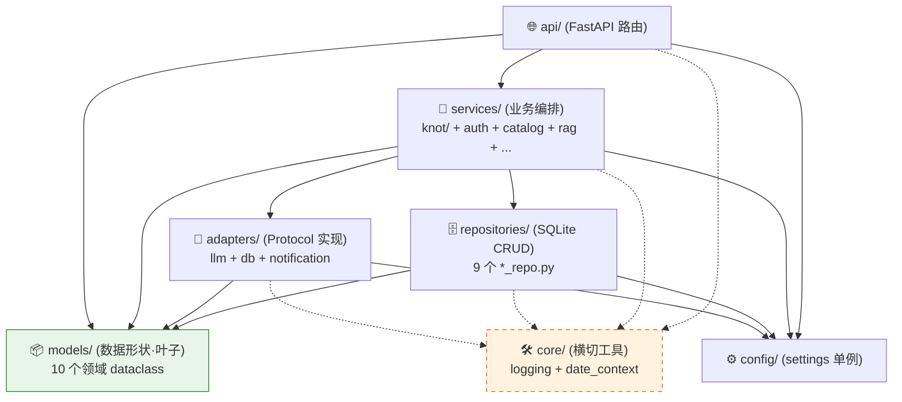

# BI-Agent — Claude Code 项目指令

## 概述

AI 驱动的 BI 助手：自然语言 → SQL → 图表。
- v0.1.1：Python 3 / FastAPI + React（浏览器端 Babel）
- v0.2.x（当前 v0.2.4）：FastAPI + React/Vite 构建版前端
- v0.x.x（规划）：Go 后端重写

## 协作规则

1. 不确定就问，别猜
2. 没要求就不写
3. 只改被要求的部分
4. 给验收标准，别给步骤

### ⚠️ 迭代循环协议 (Loop Protocol)

**严禁在未执行四阶段循环的情况下编写任何业务代码。**

#### 角色定义

| 角色 | 实体 | 职责 |
|---|---|---|
| **新版本 Agent** | 为本 PATCH 新开的对话 | 方案设计 / 终审 / 执行业务代码 |
| **上一版本 Agent** | 上一次对话（通常是仍持续运行、时间最早的那个） | 转为"高级顾问"，做溯源复审 |
| **资深架构师** | User 本人 | 战略决策 + 拍板 |
| **辅助 AI** | 资深 + Codex 评审组 | 给 Redline / 评分 |

#### 四阶段

1. **方案设计 (Stage 1)**：**新版本 Agent** 产出执行手册（`docs/plans/v0.X.Y-*.md`）。
2. **资深审计 (Stage 2)**：提交给**资深架构师 + 辅助 AI** 获取 Redline。
3. **溯源复审 (Stage 3)**：将方案喂给**上一版本 Agent** 进行逻辑一致性校验
   （防止与上一 PATCH 的设计决策冲突 / 漏检文件 / 错误命名 / 红线遗漏）。
4. **终审锁定 (Stage 4)**：**新版本 Agent** 整合所有意见，完成最终执行手册 + commit 锁定后开干。

#### 角色切换规则

每个 PATCH 完成后：
- 本 PATCH 的"新版本 Agent" → 自动晋升为下一 PATCH 的"上一版本 Agent"
- 用户为下一 PATCH 开新对话产生新的"新版本 Agent"
- 上上版本 Agent 通常被关闭归档（除非有特殊溯源需求）

## 启动

```bash
# 本地开发
pip install -r requirements.txt
python3 -m uvicorn bi_agent.main:app --reload --port 8000

# Docker 部署
docker build -t bi-agent . && docker run -d -p 8000:8000 --env-file .env bi-agent
```

## 关键路径

| 文件 | 职责 |
|------|------|
| `bi_agent/main.py` | App 工厂，sys.path 设置必须最先执行，注册所有路由 |
| `bi_agent/dependencies.py` | JWT 常量、create_token、get_current_user、require_admin |
| `bi_agent/schemas.py` | 所有 Pydantic 请求模型（9 个） |
| `bi_agent/engine_cache.py` | 用户 DB 引擎缓存（TTL 1h）、_upload_engine |
| `bi_agent/routers/` | 业务域路由文件（auth / admin / conversations / database / few_shots / knowledge / prompts / query / templates / uploads / user） |
| `bi_agent/core/` | 核心模块（config, persistence, llm_client, sql_agent, multi_agent 等） |
| `bi_agent/static/` | Vite 构建产物（`frontend/` 源码 → `npm run build` 输出至此） |
| `bi_agent/data/` | SQLite 数据库（gitignore，运行时自动创建） |

## 导入约定

`main.py` 最先执行 `sys.path.insert(0, .../core)`，使 core/ 内模块可用扁平导入
（`import config`、`import persistence` 等）。
`routers/` 通过相对导入拿 `dependencies` 和 `engine_cache`，不需要重复 sys.path 操作。

## 数据库

- `bi_agent/data/bi_agent.db` — 用户 / 会话 / 消息 / 知识库 / 用户上传 CSV/Excel（v0.2.4 合并 uploads.db）
- Apache Doris / MySQL — 业务查询目标（通过 .env 配置）

## 版本管理

格式：`vMAJOR.MINOR.PATCH.YYYYMMDDHHmm`

- **MAJOR**：`0` = 内测；`1` = 团队公测（由用户决定何时跨过）
- **MINOR**：阶段性大节点（重大重构 / 用户认为"这一阶段已迭代完"）
- **PATCH**：每完成一轮需求迭代 +1
- **时间戳**：每次实际打 tag 的精确时间；同一 PATCH 周期内的小修补只更新时间戳，不动 PATCH

示例：

- 起点：`v0.2.0.xxx`
- 完成本轮 5 点（4/26 16:00）→ `v0.2.1.202604261600`
- 当晚 18:00 修补本轮遗留 → `v0.2.1.202604261800`（PATCH 不动）
- 下一轮新需求完成 → `v0.2.2.xxx`
- 后端 Go 重写或阶段性收尾 → `v0.3.0.xxx`

记录文件：`CHANGELOG.md`（Keep a Changelog 格式）

分支策略：`main`（保护，仅打 tag）/ `develop`（集成）/ `feat|fix|chore|hotfix/*`

## 已知技术债

| 优先级 | 问题 | 目标分支 |
|--------|------|---------|
| 高 | LLM 调用走 run_in_executor + 同步 SDK；v0.2.2 把 anyio 池开到 64，但仍非真异步。下个 MINOR 切 httpx.AsyncClient / AsyncOpenAI / AsyncAnthropic | feat/async-llm |
| 中 | 路由中 sync SQLAlchemy；DB 端短查询为主，暂不切 async，跟着上一项一起做 | feat/async-db |
| ~~中~~ ✅ v0.2.2 已用 loguru | 结构化日志 | — |
| ~~低~~ ✅ v0.2.4 已合并 | uploads.db → bi_agent.db | — |
| ~~低~~ ✅ v0.2.4 已删 | `bi_agent/routers/user.py` 的 `/api/user/config` `/api/user/agent-models` | — |

## v0.3.x 工程化重构 — Contract 升级路线图

v0.3.0（已合入）建立 4 层架构 `routers → services → repositories | adapters → models`，
当前 import-linter contract **4 条 KEPT** 但部分采用渐进式 FIXME 锁定（资深架构师 + Codex 评审组 APPROVED）。
后续 PATCH 必须按下表升级 `.importlinter`，**不得跳过**：

| FIXME 标签 | 当前状态 | 升级动作 | 落地版本 |
|-----------|---------|---------|---------|
| ~~`FIXME-v0.3.1`~~ ✅ v0.3.1 已偿还 | `repositories` 仅禁 `routers` | 加上 `bi_agent.services` 到 `forbidden_modules` | v0.3.1 services 落地后 |
| ~~`FIXME-v0.3.2`~~ ✅ v0.3.2 已偿还 | `repositories` 仅禁 `routers + services` | 加上 `bi_agent.adapters` + 新增 contract `adapters-no-business` | v0.3.2 adapters 落地后 |
| ~~`FIXME-v0.3.2`~~ ✅ v0.3.2 已偿还 | `repositories` 仅禁 `routers / services` | 再加 `bi_agent.adapters` | v0.3.2 adapters 落地后 |
| ~~`FIXME-v0.3.3`~~ ✅ v0.3.3 已偿还 | `core-no-models` 仅禁 `models / routers` | 完整 `forbidden_modules`：`models, api, services, repositories, adapters` | v0.3.3 core 完全瘦身后 |

**v0.3.3 终态（Full Forbidden Mode）**：6 条 contract 全部 KEPT，所有 FIXME 清空。
4-PATCH 工程化重构正式收官，进入 v0.4.x 业务迭代期。

### 4 层依赖图（v0.3.3 终态）



> **规则**：实线 = 业务依赖（自上而下）；虚线 = 横切工具（任意层可用，不构成业务依赖）。
> import-linter 6 条 contract 把所有反向箭头都禁了。

### 4-PATCH 演进时间轴

```mermaid
gantt
    title 4-PATCH 工程化重构总账（v0.3.0 → v0.3.3）
    dateFormat X
    axisFormat %s

    section v0.3.0
    repos + models + 工程化基线 (4 contracts, 48 tests)  :done, 0, 1

    section v0.3.1
    services + core 无业务化 (4 contracts, 61 tests)     :done, 1, 2

    section v0.3.2
    adapters 协议驱动 + errors 树 (5 contracts, 85 tests) :done, 2, 3

    section v0.3.3
    api 改名 + Full Forbidden (6 contracts, 101 tests)   :done, 3, 4
```



资深寄语：v0.3.3 结束前 `core` 的 `forbidden_modules` 必须锁死至最高级别。

辅助 v0.3.x 计划：

| PATCH | 主题 | 关键交付 |
|-------|------|---------|
| ✅ v0.3.0 | repos 拆分 + models 顶级包 + 工程化基线 | `pyproject.toml` / `.importlinter` / `pip install -e .` |
| ✅ v0.3.1 | services/ 落地（含 knot/）+ 删 repos facade re-export + core 无业务化 | 9 个文件 git mv → services/[knot/]，repos 仅暴露 `init_db / get_conn` |
| ✅ v0.3.2 | adapters/ 落地（llm/db/notification 协议驱动）+ services/llm_client 瘦身 | adapters/{llm,db,notification}/{base,...}.py，5 contracts KEPT |
| ✅ v0.3.3 | routers→api 改名 + core 完全瘦身 + Full Forbidden Mode + 端到端集成测试 | api/ + 6 contracts KEPT + 13 集成测试 + 3 core 纯度守护测试 |

## v0.4.x 业务迭代路线图（v0.3.3 之后）

架构底座已稳，进入业务能力迭代期。6 条 contract 全程 KEPT，不再开工程化大刀。

| PATCH | 主题 | 关键交付 |
|-------|------|---------|
| ✅ v0.4.0 | Clarifier intent + Layout 分支 + CSV 导出 + eval 扩量 | Clarifier 7 类 intent；前端按 intent 渲染 layout（MetricCard/Chart/RankView/RetentionMatrix/DetailTable）；`/api/messages/{id}/export.csv`（utf-8-sig BOM）；eval 80 条（每 intent ≥8 + 24 edge）；GH Actions live LLM CI；intent 准确率 ≥90% 门禁；AsyncLLMAdapter Protocol 占位 |
| ✅ v0.4.1 | 报表沉淀（saved_reports + 收藏 + 重跑 + CSV 导出）| `saved_reports` 表（去耦合快照）+ 6 路由（list/pin/run/update/delete/export.csv）+ 前端 ⭐ 收藏按钮 + SavedReportsScreen + R-S4 effectiveHint 三级链 + R-12 幂等 + R-S2 data_source 重跑 fallback；6 contracts KEPT；147 tests / 81 skipped；xlsx 推 v0.4.2 |
| ✅ v0.4.1.1 | hotfix — 笛卡尔积防御 + UX 双 Bug | Bug 1 (Shell.jsx active.startsWith('admin-')) + Bug 2 (后端 sql alias) + Bug 3 三层防御（Catalog RELATIONS + 双 prompt JOIN 硬约束 + eval 9 multi_table case + comma-FROM 守护正则）；157 tests / 90 skipped；89 eval cases；61 routes 不变；6 contracts KEPT。**隐含承诺**：合入后 7 天内须为 gitignored ohx_catalog.py 补 RELATIONS。 |
| ✅ v0.4.2 | 成本可观测 + xlsx 导出 + eval SQL 复杂度横切 | messages +10 列（4 agent_kind 分桶 + recovery_attempt）+ `cost_service` (R-S8 一致性入口) + `/api/admin/cost-stats` + xlsx 导出 (5000 行硬限 + R-S7 截断 metadata header) + eval 89→111 (subquery/window/cte +21) + AST hybrid dispatcher + CI label opt-in；64 routes / 203 tests / 112 skipped；6 contracts KEPT。**预算告警延期 v0.4.3**。**R-S6**：messages 列数 24，v0.4.5+ 评估迁移工具。 |
| ✅ v0.4.3 | 预算告警 + System_Recovery 维度（成本治理收尾）| `budgets` 表（global/user/agent_kind 三层 DRY）+ `budget_service` (R-16 优先级 + R-17 一致性对齐 + R-23 不缓存) + 5 路由（budgets CRUD + recovery-stats）+ R-22 流式/非流式同字段 + 前端 AdminBudgets/AdminRecovery + R-20 banner 降噪；69 routes / 223 tests / 112 skipped；6 contracts KEPT。**8 条红线 R-16~R-23 全部偿还**。错误体验/加密/审计推 v0.4.4-6。 |
| ⏳ v0.4.4 | 性能与异步 + 错误体验改造 | 落 AsyncLLMAdapter impl；async LLM/DB；错误体验跟随 async Try-Except 链路一起改（资深 Stage 2 重定位） |
| ⏳ v0.4.5 | 数据加密（API Key / DB 密码）| 独立迁移 PATCH；R-S6 schema 迁移工具评估也在此 PATCH 决策 |
| ⏳ v0.4.6 | 审计日志 | who-did-what；budget 变更入审计 |

## v0.2.0 Go 重写技术栈（分支 feat/go-rewrite）

- HTTP：`gin-gonic/gin` 或 `gofiber/fiber`
- ORM：`gorm.io/gorm`
- LLM：`anthropic/anthropic-sdk-go` + `sashabaranov/go-openai`
- JWT：`golang-jwt/jwt`
- 前端：React + Vite（保留 ECharts 逻辑，加构建步骤）
