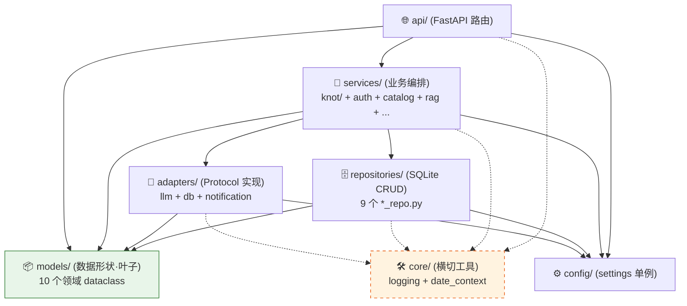

# BI-Agent — Claude Code 项目指令

## 概述

AI 驱动的 BI 助手：自然语言 → SQL → 图表。
- v0.1.1：Python 3 / FastAPI + React（浏览器端 Babel）
- v0.2.x（当前 v0.2.4）：FastAPI + React/Vite 构建版前端
- v0.x.x（规划）：Go 后端重写

## 协作规则

1. 不确定就问，别猜
2. 没要求就不写
3. 只改被要求的部分
4. 给验收标准，别给步骤

### ⚠️ 迭代循环协议 (Loop Protocol) — v3

**严禁在未走完三阶段评审的情况下编写任何业务代码。**

> v3 相对 v2：新增「**远古守护者**」角色 + 「**MINOR 滚动前夕整体审核**」仪式。
> v0.5.0 起生效；v0.4.x 期间走的是 v2（无远古守护者机制）。

#### 一个 MINOR = 一个 Agent

Agent 的生命周期与 **MINOR 版本号**绑定，不与 PATCH 绑定：

- v0.3.0 / v0.3.1 / … / v0.3.x → **同一对话** = **v0.3 Agent**
- v0.4.0 / v0.4.1 / … / v0.4.x → **同一对话** = **v0.4 Agent**
- v0.5.0 / … / v0.5.x → **同一对话** = **v0.5 Agent**

每跨一个 MINOR，用户开**新对话**启动新 Agent；角色按 §角色滚动规则更替。

#### 角色定义（v3 — 4 级角色）

| 角色 | 实体 | 职责 | 权限 |
|---|---|---|---|
| **执行者** | 当前 MINOR 的 Agent | 出方案、整合终审意见、写代码、跑闸门、提 PR | 读 + 写 |
| **守护者** | 上一 MINOR 的 Agent（距离 = 0.1） | PATCH 内 Stage 3 终审 + 闸门复核 | **只读**（严禁改代码） |
| **远古守护者** | 上上 MINOR 起的 Agent（距离 > 0.1） | **仅 MINOR 滚动前夕**整体审核 | **只读 + 默认沉睡** |
| **辅助 AI 初审组** | 资深工程师 + Codex + 其他辅助 AI | PATCH 内 Stage 2 给 Redline / 评分 / 风险点 | 评审建议 |
| **资深架构师** | User 本人 | 战略决策 + 拍板 + 召集整体审核 | 决策 |

#### 三阶段评审（PATCH 内常规流程）

```
执行者                    辅助 AI 初审组              守护者                  执行者
   │                           │                         │                       │
   │ Stage 1: 方案/规划草案 ───┼─────────────────────┐   │                       │
   │                           │                     │   │                       │
   │                           │ Stage 2: 初审意见    │   │                       │
   │                           │   (Redline/评分)    │   │                       │
   │                           │                     │   │                       │
   │                           └─────────────────────┴──>│ Stage 3: 终审         │
   │                                                     │   (整合 1+2 后给意见)  │
   │                                                     │                       │
   │<────────────────────── 终审意见 ────────────────────┘                       │
   │                                                                             │
   │ 执行（按终审意见落 commit）                                                  │
```

1. **Stage 1 — 方案设计（执行者出）**
   执行者产出执行手册草案 `docs/plans/v0.X.Y-*.md`，包含范围 / 红线 / 验收 / commit 序列。

2. **Stage 2 — 辅助 AI 初审**
   用户把 Stage 1 草案分发给辅助 AI 评审组，收集 Redline / 评分 / 风险点。
   执行者此阶段不参与（不打扰评审独立性）。

3. **Stage 3 — 守护者终审（上一 MINOR Agent）**
   用户把 **Stage 1 草案 + Stage 2 初审意见**一起喂给守护者。
   守护者职责：
   - 校验与上一 MINOR / 历史 PATCH 的设计决策一致性
   - 查漏检文件 / 错误命名 / 既有红线遗漏
   - 评估初审意见是否被正确吸收
   - 给出**终审意见**（保留 / 修订 / 否决具体条款）
   守护者**严禁直接修改方案文件或代码**，只输出评审文本。

4. **执行（执行者落地）**
   执行者**只拿到 Stage 3 终审意见**（不直接看 Stage 2 原文，避免重复消化），
   按终审意见整合修订手册 → commit 锁定 → 按 commit 序列实施 → 全闸门绿 → 提 PR。

#### MINOR 滚动前夕整体审核（v3 新增仪式）

- **触发**：资深架构师明确 announce「整体审核」
- **参与方**：执行者 + 守护者 + 所有存活的远古守护者（独立提供意见）
- **不在 PATCH 内**，是 MINOR 间的过渡仪式
- **产物 4 份固定模板**：
  1. **代码结构评估** — 巨型文件 / 重复 / 死代码 / 可读性短板
  2. **奥卡姆剃刀清单** — 必备 / 多余 / 待简化
  3. **重命名 / 重构 / 协议增量提案**
  4. **下一 MINOR 预期范围**（骨架，不锁定）
- **冲突仲裁**：多方意见独立提供，资深架构师拍板

#### 远古守护者激活原则

- 默认沉睡（不打扰当前 PATCH 节奏）
- 仅在「整体审核」明确激活
- 不参与日常 PATCH 三阶段评审

#### 角色滚动规则

每跨一个 MINOR：
- **当前执行者** → 下一 MINOR 的**守护者**（只读 active）
- **当前守护者** → 下一 MINOR 的**远古守护者**（保留对话，dormant）
- 已存在的远古守护者 → 继续保留 dormant
- 用户开**新对话**启动下一 MINOR 的**新执行者**

PATCH 内（v0.5.0 → v0.5.1 → …）**不切换角色**，仍由同一执行者完成所有 PATCH 的三阶段循环。

#### R-LP-v3-EX-1：方向决策 Stage 2 跳过例外条款（v0.6.0.19 立约首例）

**触发**：v3 三阶段评审中，若 PATCH 性质为**方向选择 / 路线评估类决策**（非代码落地），
Stage 2 辅助 AI 初审的 redline 维度（破契约 / 命名 / 副作用）对决策无边际价值，
此时**允许跳过 Stage 2**，但必须满足以下条件：

**适用条件（3 条同时满足）**：
1. PATCH 涉及 **0 行业务代码** + **0 红线新立**（纯决策类 docs）
2. 守护者 Stage 3 终审主动认可"跳过 Stage 2 合理"
3. 资深架构师在拍板前已明示知悉本例外

**强制替代（3 条护栏）**：
1. **30 分钟等效初审** — 由资深架构师召集独立第三方（Codex / 资深工程师 AI / 不同
   Claude lineage 的 subagent）做 ≤ 500 字红线评审
2. **真独立第三方** — 等效初审者不得是同一会话内 Claude lineage（否则等于自审）
3. **累计触发 ≥3 次** — 强制召集**远古守护者**复核滥用倾向，防例外条款被泛化滥用

**首例引用**：`docs/plans/phase-b-early-review-2026-05-21.md`（Phase B 提前评估，
v0.6 执行者 Stage 1 草案 + v0.5 守护者 Stage 3 终审 + Codex-equivalent subagent 等效初审）

**治理意义**：本条款由 v0.5 守护者 §VI 提出 + Codex 等效初审 C-5 强化（3 护栏）+ 资深 2026-05-22 拍板立约。
属 Loop Protocol v3 首次明示的"方向决策 Stage 2 可由等效初审替代"例外。

#### R-LP-v3-EX-2：OVERRIDE 累计触发远古守护者召集义务（v0.6.2.0-pre-governance 立约）

**触发**：累计 OVERRIDE 事件 **≥ 3 次** → 强制召集远古守护者参与 retroactive review。

**计数维度**（资深 2026-05-25 决策 α8）：**维度 A 时间线粒度**
- 一个 PATCH 启动决定 = 1 个 OVERRIDE（无论 PATCH 内部含几个子决策）
- PATCH 内嵌子 OVERRIDE 在 CHANGELOG + plan 文档归档，**不重复计入全局计数**
- 避免对集中决策 PATCH 的倍数惩罚

**归档完整性义务**：每次 OVERRIDE 事件必须在 7 天内归档独立 plan 文档（事件 + 日期 + 归档文件路径登记到 `docs/governance/override-cumulative-log.md`，资深架构师亲自维护）。

**首次履约**：2026-05-25 累计第 3 次 OVERRIDE（方向 ① announce） → v0.4 远古守护者第 3 次激活三任务合并评审。

#### R-LP-v3-EX-2.1：OVERRIDE 治理双锁强化（v0.6.2.0-pre-governance 立约）

**触发**：累计 OVERRIDE 事件 **≥ 4 次** → 强制 Q-quarter 暂停 OVERRIDE 1 个 PATCH 周期 + retroactive audit。

**背景**：v0.5 守护者第 10 次 active §IV 提出 + v0.4 远古守护者第 3 次激活 §1.5 强化（≥4 次过线必须 Q-quarter 暂停防 OVERRIDE 泛化）+ 资深 2026-05-25 拍板立约。

**Q-quarter 暂停期内**：
- 不允许新 OVERRIDE 决策
- 必须执行 retroactive audit（OVERRIDE 累计治理记录段补全）
- 守护者 + 远古守护者协同复核所有累计 OVERRIDE 合规性

**当前累计**：3 次（维度 A）→ 未触发；距过线 1 次之差。

#### R-LP-v3-EX-3：承诺推迟治理（v0.6.2.0-pre-governance 立约）

**触发**：执行者 / 守护者 / 资深架构师在 PATCH 文档明示的"推迟到 v0.X+"承诺，**连续 ≥ 3 PATCH 未兑现** → 升级为正式红线。

**背景**：v0.5 守护者第 10 次 active §VII 守护者补丁 3 提出（v0.5.x 累计 8+ inline helpers 移入 Shared.jsx 承诺多次推迟）+ 资深 2026-05-25 拍板立约。

**适用对象**：
- 技术债推迟（如 inline helpers 移入共享组件）
- 红线推迟兑现（如 v1.0 移除 sync LLM API）
- 设计决策推迟评估（如 5 层语义 + LogicForm 推 v0.7+）

**升级机制**：≥3 PATCH 未兑现的承诺 → 自动升级红线 R-LP-v3-EX-3-X（X 为承诺序号）；后续 PATCH 强制守护。

#### R-PB-GOV-1：工期指导性预估非硬承诺纪律（v0.6.2.0-pre-governance 立约）

**触发**：v0.5 守护者第 11 次 active 整合 Stage 2 工期重估 4.5-6.5 月 → 5-7 月时，资深架构师拒绝硬性工期承诺 + 立约（2026-05-25 决策 β2）。

**内容**：所有 PATCH 工期标注（如 "2-2.5 周"）为**指导性预估**，**非硬承诺**：
- PATCH 启动时机由资深架构师按业务方实际节奏决定
- 不锁定 1.0 公测时间窗（拒绝 2026 Q3 末 / Q4 末 / 2027 Q1 等具体承诺）
- 守护者 / 远古守护者 / Stage 2 评审员意见中"工程量重估 N 月"作为参考，不作约束
- 当资深 announce"按计划推进"时按当前已 LOCKED PATCH 序列执行
- **例外**：单 PATCH 内部 commit 序列工期可硬预估（守护者 Stage 3 终审依据）

**违反代价**：破 R-PB-GOV-1 = 业务方信任损失 / 团队疲劳 / 决策含糊；必须返做承诺修订。

#### R-PA-PB-V1：Phase B UI 视觉延续性立约（v0.6.0.19 立约）

**触发**：v0.5 守护者 2026-05-14 Phase B 评估意见 §7 提议；v0.6.0.19 正式落地立约。

**内容**：Phase B 及之后所有 PATCH（含 v0.6.2.0 TOTP enroll / v0.7.x 5 层语义等）
涉及 UI 改动时，必须严守 v0.5.x 锁定的视觉设计语言：
- OKLCH 单色系统（buildTheme 25 设计 token；+dark 透传 = 26 runtime keys — v0.6.2.3 口径锁定）
- I icon library（54 names — v0.6.0.3 +thumbsUp/Down；v0.6.4.0 UI v2 +16）
- brandSoft 8% inset + borderLeft 3px 25% 设计语言铁律
- HarmonyOS Sans SC / PingFang SC / JetBrains Mono 字体
- 18 屏 byte-equal 守护（除当前 PATCH 目标屏外 git diff 0 行）

**违反代价**：破 R-PA-PB-V1 = 视觉一致性回退；需重做并补补丁说明。

#### v3 协议施行历史

- v2（v0.4.x 期间生效）：3 角色（执行者 + 守护者 + 辅助 AI 初审组）
- v3（v0.5.0 起生效）：+ 远古守护者 + 整体审核仪式
- 首次整体审核：v0.4.6 → v0.5.0 滚动前夕（执行者 v0.4 + 守护者 v0.3，因 v0.3 之前无 v3 协议未存远古守护者）
- 第二次整体审核：v0.5.44 → v0.6.0 滚动前夕（执行者 v0.5 + 守护者 v0.4 + 远古守护者 v0.3）→ 产出 9 项 LOCKED 决议 S-1~S-9 → v0.6 Agent 启动 Phase A

**v3 协议施行回顾**（v0.5.0~v0.6.0 累计 26 次完整 PATCH 内施行；首次跨 MINOR 角色滚动后施行 = v0.6.0）：逐 PATCH 施行特征表已移至 [`GOVERNANCE-ARCHIVE.md`](GOVERNANCE-ARCHIVE.md)（治理留痕）；用户视角见 [`CHANGELOG.md`](CHANGELOG.md)。

## § Visual Replication Protocol（v0.5.7+ 屏复刻通用约束）

> **触发**：v0.5.7 起每个屏复刻 PATCH（home / shell / thinking / favorites / 9 admin tabs）
> **依据**：v0.5.7 Login pilot 实证经验提炼；适用于 v0.5.8+ 17 屏渐进复刻
> **与 Loop Protocol v3 关系**：本协议是视觉复刻专项约束，**不替代** v3 三阶段评审；每屏 PATCH 仍走 Stage 1+2+3+4

### 路径常量

- **Demo 设计稿**：`/Users/kk/Documents/knot_ui_demo/v0.5/artboards/*.jsx`（设计代理，**不进产品**）
- **产品屏**：`frontend/src/screens/*.jsx`
- **共享 Foundation**（v0.5.6 + v0.5.7 落地）：
  - `Shared.jsx` — buildTheme(dark) 25 设计 token (含 dark 透传 = 26 runtime keys) + I 38 icons + iconBtn/pillBtn + CHART_COLORS 8 色 + LineChart/BarChart/PieChart/TypingDots + KnotMark/KnotWordmark/KnotLogo + **v0.6.2.3 整合 14 helper → 26 exports；v0.6.2.4 drift 调和再整合 12（PeriodTab/TagChip/statLabelStyle 参数化 + Avatar/theadStyle + inputStyleField/inputStyleMono + ghostBtnStyle/primaryBtnStyle/pageBtnStyle + FilledChip/pillBtnCompact）→ 38 exports 段 3 收官**
  - `utils.jsx` — Modal/ModalHeader/Input/Select/Spinner/toast/useTheme/usePersist
  - `decor/NarrativeMotif.jsx` — 原子 motif SVG（React.memo + OKLCH color-mix tint）

### 设计系统（v0.5.6 锁定，严禁扩展）

- **色彩**：OKLCH 单一色空间 — brand 195° / success 145° / warn 85° / error 27° / chart 8 色 hue 45° 均匀分布
- **字体**：HarmonyOS Sans SC / PingFang SC / Inter（sans）+ JetBrains Mono / Geist Mono（mono）
- **图标**：I 54 names viewBox 24×24 stroke 1.6（v0.6.0.3 +thumbsUp/Down；v0.6.4.0 UI v2 +16；Logo 用 KnotMark viewBox 100×100，语义不同）
- **OKLCH fallback**：R-165 fallback（:root fallback vars + `@supports not`）原在 `frontend/src/App.css`，但该文件从未被 import → **未进产物**（v0.7.47 死码清扫删 App.css；index.css 仅 3 行 reset，视觉靠各屏 inline fontFamily 撑）。真正折进 index.css 履行 R-165 留 v0.8 前端硬化

### 视觉模型（v0.5.7 验证；v0.6.4.1.1 立约强化）

- **底色面板** → fluid 100%（铺满 viewport 边缘；不要 artboard 整体居中）
- **元素** → 尺寸不变，位置 anchor 到 panel 边角（与主题切换 fixed 右上同思路）
- demo 是 1200×760 artboard 设计代理，产品按"viewport-fluid + element-anchored"模式呈现，**不要照搬 artboard 尺寸**
- **⭐ R-UI2-VRP 立约（v0.6.4.1.1 — UI v2 屏复刻铁律）**：**artboard（Claude design）把握「整体设计方向」；本地标准把握「细节」。**
  artboard 的写死尺寸/坐标/百分比（如 `radial-gradient(ellipse at 22% 18%)`、`width: '70%'`、固定 1200×760 几何）**严禁照搬** —— 须按本地 VRP 标准重新锚定：底色 fluid 实底铺满 + 渐变/glow **element-anchored**（锚到元素如 motif 自身，非 viewport 百分比 — 后者在宽屏 farthest-corner ellipse 胀开/偏移）+ buildTheme/TOKENS_V2 tokens + 既有契约 byte-equal。
  **反例（v0.6.4.1 login）**：照搬 artboard 写死 `radial-gradient at 22% 18%` + motif `right 70%` → 宽 viewport 背景整体偏移；v0.6.4.1.1 修：实底 `T.chipBg` + motif `inset 0`（绿光由 motif 自身 `radial-gradient at 30% 30%` 锚定）。
  **后续每屏复刻强制套用**：artboard 看「要什么元素 / 什么布局方向 / 什么视觉语气」，本地决「fluid 锚定 / token / 契约」的实现细节。

### byte-equal 红线（每屏 PATCH 通用，沿用 v0.5.7 R-170~172/178/179/186 模板）

- export name + props 签名 byte-equal（App.jsx / Shell.jsx / 父组件调用 0 改动）
- 业务链路（api.* / state hooks / SSE handler / localStorage key）byte-equal
- 错误文案 / 提示文案字面 byte-equal（i18n 留 v0.6+）
- 其他 17 屏 + 子模块 byte-equal（`git diff origin/main HEAD -- frontend/src/screens/` 仅含目标屏）
- App.jsx / api.js / index.css / main.jsx / utils.jsx / Shell.jsx byte-equal（除非 PATCH 明确改 Shell 屏）

### 抗诱惑清单（5 条 — v0.5.7 R-186 经验）

- 即使 Foundation 资产可用，**仅在当前 PATCH 目标屏引用**
- 严禁顺手扩 buildTheme 加新字段（破 R-158 25 字段契约）
- 严禁顺手 i18n / 国际化（zh-CN 写死至 v0.5.x 末）
- 严禁顺手改其他屏 / Shell topbar / favicon 等不在 PATCH scope 内的资产
- 严禁引入新 npm 依赖（若需要 → 单独 chore PATCH 评估）

> **R-199.5 KnotLogo 文件集更新（v0.6.4.2 守护者裁定）**：v0.5.9 立的「KnotLogo 仅 Shared+Login+Shell 三文件」抗诱惑约束，在 v0.6.2.0 auth 屏落地时已自然失效 —— `Enroll.jsx`（TOTP enroll）+ `ForceChangePassword.jsx` 同为 brand/auth 屏，采用 KnotLogo 合理。**当前命中 5 文件**：Shared + Login + Shell + Enroll + ForceChangePassword。后续屏复刻 KnotLogo 哨兵基线 = 5（非 3）。

### 四源点版本同步（v0.6.4.11 task #44 单一真相源 — 替代旧「五处」硬编模型）

> **v0.6.4.11 task #44 根治**：旧「五处」模型里 Shell L43 是**条件式硬编**（仅改 Shell 时同步）→ 实测 drift **8 PATCH**（卡 v0.6.4.2）。根因 = **硬编版本字面分散在 Login/Shell 两屏**，靠人肉/条件式同步必然 drift（元模式 8 数据点核心）。
> **解 = 前端版本单一真相源**：新建 `frontend/src/version.js` `export const APP_VERSION`；Shell sidebar + Login footer **读 `{APP_VERSION}`**（不再硬编 → drift 不可能）。CI bridge 断言 `APP_VERSION === main.py version`。
> **历史归档**：旧「三处→四处→五处」演进 + R-181 误分类（元模式第 6/8 数据点）记于 CHANGELOG v0.6.4.2/4.3 + docs/plans/*；本段为 live spec，不复述。

每 PATCH 升版本须同步 **4 个源点**（全 ★CI 强制 — 改一漏一即红，无条件）：
1. ★ `knot/main.py` FastAPI version（R-72 `test_rename_smoke`）
2. ★ `tests/test_rename_smoke.py` R-72 字面 + docstring
3. ★ `README.md` 顶部 1000 字符内 `v{version}`（KNOW-1 `test_login_version_sync`）
4. ★ `frontend/src/version.js` `APP_VERSION`（bridge `test_doc_invariants.test_app_version_synced_with_main` 断言 == main.py）

**显示点自动跟随（不单列、不硬编）**：Login footer + Shell sidebar 渲染 `v{APP_VERSION}`（读源 #4）→ 版本一致由 bridge 保证；渲染哨兵（R-181 adapted + `test_shell_sidebar_renders_app_version`）断言二者真渲染 `v{APP_VERSION}`（非仅 import）。**Shell L43 条件式同步规则废除**。

**doc-不变量 CI 一揽子**（`tests/test_doc_invariants.py`，task #44）：version bridge（上 #4）+ KnotLogo 精确 5 文件集（R-199.5）+ CHANGELOG 顶部 == main version。未来新增 doc-不变量**优先纳 CI**（勿靠人肉 — 元教训：无 CI 则静默 drift）。

### 复用 v0.5.7 LOCKED 手册作模板

每屏 PATCH 沿用 `docs/plans/v0.5.7-login-pilot.md` 8 节模板（决议 / 红线 / 文件改动 / 验收 / commit 序列 / 协议合规 / 自检），按本屏特性填空即可。


## 启动

```bash
# 本地开发
pip install -e ".[dev]"
python3 -m uvicorn knot.main:app --reload --port 8000

# Docker 部署（v0.6.0 5 分钟全新部署快速开始 — 详 README §5 分钟）
docker build -t knot . && docker run -d -p 8000:8000 -v $(pwd)/data:/app/knot/data --env-file .env knot

# v0.4.x dev 用户升级（v0.5.0 R-67/68/74 双源兼容已撤回 — 详 CHANGELOG v0.6.0 撤回声明）
# 1. .env 改名 + 同值: BIAGENT_MASTER_KEY → KNOT_MASTER_KEY / JWT_SECRET 改通用 secret
# 2. DB 文件手动 rename: bi_agent.db → knot.db（详 README v0.4.x → v0.6.0 升级路径）
```

## 关键路径（v0.5.0 起包名 knot）

| 文件 | 职责 |
|------|------|
| `DEPLOY.md` | **运维部署手册**（v0.6.0.10 加）— 一键部署 + 升级 + 故障排查 + 监控；运维 / AI 助手优先参考 |
| `knot/main.py` | App 工厂，FastAPI title=KNOT version=0.5.6；启动 banner 显示实际加载 env 名 |
| `knot/api/deps.py` | JWT 常量、create_token、get_current_user、require_admin |
| `knot/api/schemas.py` | 所有 Pydantic 请求模型（9 个） |
| `knot/api/query.py` | v0.5.2 拆分：路由 + SSE generator 主控（yield 保留），业务计算 delegate query_steps |
| `knot/services/engine_cache.py` | 用户 DB 引擎缓存（TTL 1h）、_upload_engine |
| `knot/api/` | 业务域路由文件（72 路由：auth / admin / conversations / database / few_shots / knowledge / prompts / query / templates / uploads / saved_reports / audit / catalog / exports） |
| `knot/services/agents/` | 3 agent 实现（v0.5.0 从 services/knot/ rename）；v0.5.2 sql_planner 拆 prompts/tools/llm + orchestrator 拆 clarifier/presenter |
| `knot/services/agents/sql_planner.py` | v0.5.2 主文件：ReAct 调度员；拆出 prompts (`_AGENT_SYSTEM_TEMPLATE` + `_business_rules` + `_relations_for_schema`) / tools (`_strip_sql` + `_parse_agent_output` + `_is_fan_out` + `_run_tool` 含 v0.5.1 cartesian + v0.4.1.1 fan-out 守护) / llm (`_call_llm` + `_acall_llm` 含 v0.4.4 R-26 budget gate + R-30 透传) |
| `knot/services/agents/clarifier.py` | v0.5.2：VALID_INTENTS / INTENT_TO_HINT / DEFAULT_INTENT_FALLBACK + `_CLARIFIER_SYS` + `run_clarifier` / `arun_clarifier`（R-26 budget gate + R-30 透传）；v0.6.0 F2.6 `_CLARIFIER_SYS` 从 `knot/prompts/clarifier.md` lazy load |
| `knot/services/agents/presenter.py` | v0.5.2：`_PRESENTER_SYS`（含幻觉禁令 + 异常判断）+ `run_presenter` / `arun_presenter`；v0.6.0 F2.7 `_PRESENTER_SYS` 从 `knot/prompts/presenter.md` lazy load |
| `knot/services/agents/orchestrator.py` | v0.5.2 调度员：保留共享 helpers `_resolve` / `_llm` / `_allm` / `_parse_json` / `_today` / `_date_block` / `_business_rules` / `_app_or_key`（子文件函数体内延迟 import — R-106 方案 1）+ re-export 子文件 public 符号 |
| `knot/services/` | 业务编排层（auth_service / budget_service / cost_service / audit_service / error_translator / llm_client 等） |
| `knot/services/llm_client.py` | v0.5.2 主文件：generate_sql / agenerate_sql / fix_sql / afix_sql；拆出 few_shots / llm_prompt_builder / _llm_invoke + R-100 re-export |
| `knot/services/few_shots.py` | v0.5.2：DB 优先 / yaml 回退的 few-shot 装配 (`_load_few_shots` / `classify_question_type` / `get_few_shot_examples`) |
| `knot/services/llm_prompt_builder.py` | v0.5.2：`build_system_prompt`（含 v0.4.1.1 RELATIONS 注入 + Fan-Out 防御 prompt） |
| `knot/services/_llm_invoke.py` | v0.5.2：`calculate_cost` / `_invoke_via_adapter` / `_ainvoke_via_adapter`（含 v0.4.4 R-26 senior budget gate + R-30 透传 + R-32 agent_kind 分桶）/ `_parse_llm_response` 等 |
| `knot/services/query_steps.py` | v0.5.2 R-109：纯业务步骤函数（**0 yield**），SSE 主控保留在 api/query.py — `enrich_semantic` / `select_agent_key` / 3 流式 step (clarifier/sql_planner/presenter) + 2 非流式分支 (use_agent / generate+fix retry) |
| `frontend/src/screens/Chat.jsx` | v0.5.3 拆分：ChatScreen 主屏调度员（保留 export 名 + props）；sendQuery 走 sse_handler 纯函数 + callbacks 注入 state setter |
| `frontend/src/screens/chat/` | v0.5.3：7 个子模块 — `intent_helpers.js` (INTENT_TO_HINT 7 类) / `sse_handler.js` (R-118 纯函数 runQueryStream) / `ResultBlock.jsx` (R-117 7 intent layout 分支 + R-127 ErrorBanner ERROR_KIND_META + MetricCard + AGENT_KIND_EMOJI + exportMessageCsv) / `ChatEmpty.jsx` / `Conversation.jsx` / `ThinkingCard.jsx` (含 AgentThinkingPanel) / `Composer.jsx` |
| `frontend/src/screens/Admin.jsx` | v0.5.3 拆分：AdminScreen 状态容器（22 handlers + 23 state(useState) + 3 ref + 7 tab dispatch + AppShell + topbarTrailing 分支；v0.6.2.5 多 catalog 扩容）；保留 export 名 + props 含 initialTab 深链 |
| `frontend/src/screens/admin/` | v0.5.3：5 个子模块（D4 4 tab dumb component + 1 modals）— `tab_access.jsx` (Users + Sources) / `tab_resources.jsx` (Models + API Keys + Agent Models) / `tab_knowledge.jsx` (Knowledge + FewShots + Prompts) / `tab_system.jsx` (Catalog) / `modals.jsx` (UserFormModal + SourceFormModal + FewShotModal) |
| `knot/repositories/` | 9 个 *_repo.py + audit_repo.py |
| `knot/adapters/` | llm/{anthropic_native,openai_compat,openrouter,async+sync 双 API} + db/doris.py + notification/{base.py,__init__.py,webhook.py}（通知接口抽象层 — v0.5.5 删 lark.py stub；v0.7.7 加 webhook.py WebhookNotificationAdapter，monitors.py monitor-fire 生产调用；R-SL-69 独立 egress allowlist KNOT_WEBHOOK_ALLOWED_HOSTS 守护） |
| `knot/core/` | 横切工具（logging_setup / date_context / crypto/fernet）|
| `knot/scripts/` | migrate_encrypt_v045.py / purge_audit_log.py（v0.6.0 删 migrate_db_rename_v050.py — R-67/68 撤回；详 CHANGELOG）|
| `knot/prompts/` | 默认 3-Agent system prompts（v0.6.0 F2 — sql_planner.md / clarifier.md / presenter.md；启动期幂等 seed 到 DB；admin UI 可覆盖）|
| `knot/static/` | Vite 构建产物（`frontend/` 源码 → `npm run build` 输出至此） |
| `knot/data/` | SQLite 数据库（gitignore，runtime 自动创建；v0.5.0 起文件名 knot.db） |
| `scripts/audit_ohx_leakage.py` | v0.6.0 F6 — 业务方言 + 旧品牌字面泄漏守护（--mode=sanitize/brand/all；R-PA-1/R-PA-6 闸门 6 工具）|

## 导入约定

v0.3.0 起 `pip install -e .` editable 安装；解释器原生识别 `knot` 包，无 sys.path hack。
所有业务模块用 `from knot.X import Y` 绝对导入（`from knot.api.deps import get_current_user` 等）。

## 数据库

- `knot/data/knot.db` — 用户 / 会话 / 消息 / 知识库 / 用户上传 CSV/Excel / 审计日志
  （v0.2.4 合并 uploads.db；v0.4.6 加 audit_log）
- v0.4.x dev 用户升级路径（README §v0.4.x → v0.6.0）：手动 `mv bi_agent.db knot.db`（v0.5.0 startup auto-rename migration 已撤回 — 详 CHANGELOG v0.6.0）
- Apache Doris / MySQL — 业务查询目标（通过 .env 配置）

## 加密 master key（v0.6.0 单一 KNOT_MASTER_KEY）

- **v0.6.0+ 唯一**：`KNOT_MASTER_KEY`
- v0.5.x 的双源（KNOT_MASTER_KEY + 兼容旧名）已于 v0.6.0 Phase A 物理删除（详 [CHANGELOG v0.6.0 撤回声明](CHANGELOG.md#unreleased---v060-phase-a-knot-sanitize--bi_agent-兼容层清算--deploy-ready-内测可启动门)）
- v0.4.x dev 用户升级路径（README 同步）：DB 文件 rename + env 改名（同值）

## 版本管理

格式：`vMAJOR.MINOR.PATCH.YYYYMMDDHHmm`

- **MAJOR**：`0` = 内测；`1` = 团队公测（由用户决定何时跨过）
- **MINOR**：阶段性大节点（重大重构 / 用户认为"这一阶段已迭代完"）
- **PATCH**：每完成一轮需求迭代 +1
- **时间戳**：每次实际打 tag 的精确时间；同一 PATCH 周期内的小修补只更新时间戳，不动 PATCH

示例：

- 起点：`v0.2.0.xxx`
- 完成本轮 5 点（4/26 16:00）→ `v0.2.1.202604261600`
- 当晚 18:00 修补本轮遗留 → `v0.2.1.202604261800`（PATCH 不动）
- 下一轮新需求完成 → `v0.2.2.xxx`
- 后端 Go 重写或阶段性收尾 → `v0.3.0.xxx`

> **tag 实况（v0.7.0 grounded 订正 2026-06-21）**：上述 `.YYYYMMDDHHmm` 时间戳格式是**早期设计，实际从未在 tag 中执行** —— 真实 tag 用 `vX.Y.Z.N`（4 位 build 整数，如 `v0.6.0.13`），且**打 tag 在 `v0.6.0.13` 后即停**（v0.6.0.14 → v0.6.5.12 共 ~40 PATCH 无 tag）。这期间版本追踪 = **squash-merge commit 标题 `vX.Y.Z — 主题 (#PR)` + CHANGELOG + 5 源点 ★CI 同步**（见下 § 四源点版本同步 — main.py/version.js/README/CHANGELOG/test_rename_smoke）。**v0.7.0 起恢复里程碑 tag**：MINOR 边界打**纯 3 位版本串**（如 `v0.7.0` = main.py version，annotated）；PATCH 不强制打 tag（靠 merge commit + CHANGELOG 追踪）。`.YYYYMMDDHHmm` 格式正式废弃。

记录文件：`CHANGELOG.md`（Keep a Changelog 格式）

分支策略：`main`（默认分支 + 集成 + tag；PR squash merge 直入）/ `feat|fix|chore|hotfix/*`（开发分支）

> **历史**：早期协议设计 `main` 仅打 tag / `develop` 集成。实际自 v0.3.0 起所有 PR 都直合 `main`，`develop` 事实废弃停留 v0.2.4（落后 9+ PATCH）。v0.5.1 后正式将 GitHub default branch 切到 `main`、CLAUDE.md 同步现状；`develop` 分支保留作 v0.2.4 历史快照不再使用。

### v0.6.0.x → v0.6.2.0 版本号教训（v0.6.0.19 立约归档）

**症状**：2026-05-21 一晚连续发 v0.6.0.14 ~ v0.6.0.18 共 5 个 PATCH，其中 v0.6.0.16（内测指标屏 = 新 admin 屏 + 新 endpoint + 新 schema 列）+ v0.6.0.18（admin 用户查询历史屏 = 同上）按 §MINOR 规则**应是 MINOR 级别**（"阶段性大节点"），实际被打成 PATCH。

**根因**：v0.6.1 tag 早于 v0.6.0.13 存在（指向 Phase B 时间语义引擎 #78），执行者把 tag 当 main HEAD 状态，为避免命名冲突线性退到 v0.6.0.x。

**纪律修正**：
- **MINOR**：新顶层屏 / 新 endpoint + schema 改动 / 业务能力大节点 → MINOR
- **PATCH**：bug fix / lint 治理 / docs / 配置 / 微调 → PATCH
- **MAJOR**：内测 → 公测 / 公测 → 生产 / 业务模型重构 → MAJOR
- **跳号原则**：若 MINOR 数被 tag 占用（如 v0.6.1）→ **跳过该数字**，下一 MINOR 直接用 v0.6.2.0
- **不动历史**：已 merge 的 PATCH 号不追溯调整（避免 force-push 风险 + 历史值得保留反映"中间过程"）

## 已知技术债

| 优先级 | 问题 | 目标分支 |
|--------|------|---------|
| ~~高~~ ✅ v0.4.4 已偿还 | LLM 全面 async（AsyncAnthropic / AsyncOpenAI），threadpool 64→32 | — |
| 中 | 路由中 sync SQLAlchemy；DB 端短查询为主，暂未切 async（v0.4.4 LLM 离开池后压力已大幅缓解，可观察是否还需要） | feat/async-db |
| ~~中~~ ✅ v0.2.2 已用 loguru | 结构化日志 | — |
| ~~低~~ ✅ v0.2.4 已合并 | uploads.db → bi_agent.db | — |
| ~~低~~ ✅ v0.2.4 已删 | `bi_agent/routers/user.py` 的 `/api/user/config` `/api/user/agent-models` | — |

## 4 层架构依赖图（v0.3.3 终态 · 当前）


```mermaid
graph TD
    api["🌐 api/ (FastAPI 路由)"]
    services["🧩 services/ (业务编排)<br/>knot/ + auth + catalog + rag + ..."]
    repos["🗄️ repositories/ (SQLite CRUD)<br/>9 个 *_repo.py"]
    adapters["🔌 adapters/ (Protocol 实现)<br/>llm + db + notification"]
    models["📦 models/ (数据形状·叶子)<br/>10 个领域 dataclass"]
    core["🛠️ core/ (横切工具)<br/>logging + date_context"]
    config["⚙️ config/ (settings 单例)"]

    api --> services
    services --> repos
    services --> adapters
    repos --> models
    adapters --> models
    services --> models
    api --> models

    api -.-> core
    services -.-> core
    repos -.-> core
    adapters -.-> core
    api --> config
    services --> config
    repos --> config
    adapters --> config

    classDef leaf fill:#e8f5e9,stroke:#2e7d32
    classDef horizontal fill:#fff3e0,stroke:#e65100,stroke-dasharray:5
    class models,core leaf
    class core horizontal
```

> **规则**：实线 = 业务依赖（自上而下）；虚线 = 横切工具（任意层可用，不构成业务依赖）。
> import-linter 9 条 contract 把所有反向箭头都禁了。

## 历史路线图（v0.3~v0.6 逐 PATCH 追溯 — 已归档）

> v0.3.x 工程化重构演进时间轴 + v0.4.x / v0.5.x / v0.6.x 业务迭代逐 PATCH 路线图表已移至 [`GOVERNANCE-ARCHIVE.md`](GOVERNANCE-ARCHIVE.md)（治理留痕）；用户视角逐版本细节见 [`CHANGELOG.md`](CHANGELOG.md)。本文件只留 live 协议 + 当前架构 + v0.7 路线。

## v0.7.x 路线图（v0.6→v0.7 整体审核 LOCKED 后）

> **第三次整体审核**：v0.6.5.7 → v0.7.0 滚动前夕（执行者 v0.6 + 守护者 v0.5 + 远古守护者 v0.4；v0.3 已不在）→ #23 LOCKED 2026-06-20（总立场 major-revise）。**定向 v0.7 = 5 层语义层 + LogicForm**（资深 2026-06-08 拍板）。
> **完整 LOCKED 文档**：[`docs/plans/v0.6-to-v0.7-overall-review-2026-06-20.md`](docs/plans/v0.6-to-v0.7-overall-review-2026-06-20.md)（4 产物 + §0.5 仲裁 + §4.5 不变量清单）+ [`v0.6-overall-review-opinions.md`](docs/plans/v0.6-overall-review-opinions.md)（三方意见）+ [`v0.7.0-semantic-layer-prestudy-2026-06-12.md`](docs/plans/v0.7.0-semantic-layer-prestudy-2026-06-12.md)（Stage 0 预研）。
> **协议**：v0.7 业务模型重构级，走完整 v3 三阶段，**不适用简化协议**。

### ⭐ v0.7 不变量带入清单（greenfield 必守护栏 — 业务模型可重写，以下不可丢）
v0.7.0 Stage 1 须逐条声明载体/守护点：

- **v0.5 守护代（6）**：gate 鉴权（require_admin/get_current_user）· R-2FA（token_version 吊销 + 强制 enroll）· 视觉铁律（brandSoft 8% / borderLeft 25% / R-PA-PB-V1 + 18 屏 byte-equal）· doc-invariant CI（4~5 源点 + count==1）· R-192 AppShell 13 props · **OOS-1 单租户**（metric 归 `catalog_id`，严禁顺手引 tenant_id）
- **v0.4 守护代（4）**：数据加密（Fernet/KNOT_MASTER_KEY/enc_v1，metric 含机密须注册 + 补存储侧 CI 守护）· 审计（metric CRUD 配 Literal + audit 调用 + CI 断言每 Literal ≥1 emit）· 成本（cost_service R-S8 横跨语义+LLM 双路径 + 新 agent_kind 桶）· async（LogicForm 解析/编译 async-native + R-26 budget gate）
- **接缝（2）**：脱敏链 V2（metric SQL surface 非 admin 须脱敏）· **`crypto-only-in-allowed-callers` contract 扩 semantic 层**（semantic/agents 严禁直连 core.crypto）
- R-LP-v3 治理已立约（唯一原生带入，无需重立）

### v0.6.x 收官前置（v0.7.0 起手前必清）

> **执行序（资深 2026-06-20 选项 1 LOCKED）**：① type-hint 统一（**✅ v0.6.5.10**）→ ② admin.py 拆 + check_file_sizes 根治（**✅ v0.6.5.11**）→ ③ catalog.py 高守护（**✅ v0.6.5.12**）→ **v0.7.0 C1（三件收官全清，起手解锁）**。sync 链删除 / http_planner futures 下沉 JIT 推迟到相关 v0.7.x。

- **admin.py 拆 7 文件**（实测 908 行/30ep → users/datasources/models/api_keys/budgets/stats/or_catalog + __init__ 聚合；须 re-export `_DS_STATS_CACHE` 防 flaky）= 独立纯重构 PATCH（v0.7 加指标模块硬前置）。**② 验收硬条件（守护者 Stage 3 带出）**：7 新文件全 `from __future__`-clean + 0 `Optional[`（接 ① defer admin.py type-hint）
- ~~**catalog.py 单独高守护拆分**~~（**✅ v0.6.5.12** — 2-way 只抽 4 纯 loader → catalog_loaders.py；catalog 仍 module 保 globals/reload/getter → live-read 0 破坏 + 10 importer 0 改 + Contract 8）
- ~~**check_file_sizes 根治**~~（**✅ v0.6.5.11** — allowlist → backend auto-discover + DEFAULT_CAP 300 + ACK 例外；盲区闭合，新 backend >300 自动红）
- anthropic_native 标「冻结/capability reserve」（唯一 prompt-cache 实现，OR-only 下休眠，v0.7 LogicForm prompt 缓存杠杆）· sync 链删除（留奥卡姆建议，须 test-port + 分阶段）· http_planner futures regex 下沉 catalog · ~~model 层 type hint 统一~~（**✅ v0.6.5.10 收官① — admin.py 部分 defer ②**）· ~~admin.py:807 审计 bug~~（**✅ v0.6.5.9**）

### 增量交付序（非锁定 · 详 prestudy §6）
> v0.7.0~v0.7.24 已交付 PATCH 的逐条施行细节（指标注册表 / LogicForm 编译七刀 / 混合路由 / 呈现修复等）已移至 [`GOVERNANCE-ARCHIVE.md`](GOVERNANCE-ARCHIVE.md)（治理留痕）+ [`CHANGELOG.md`](CHANGELOG.md)。以下为未交付 / 前瞻工作：

- v0.7.x+ 派生指标续（维度派生「各城市客单价」/ 嵌套派生 derived-of-derived 解 DFS）+ RANGE/GROUPS frame 变体（窄）+ 定时主动评估（调度器 + fired-state 去重）+ 自动执行动作（写回 · 高风险）+ 回滚改变查询行为（修正回流 · Stage 0 预研）；**价值自测「解析半」**（parser NL→LogicForm 命中率 · kk live 自测）；**OHX few-shot #48 sta_date bug**（dwd_user_reg 无 sta_date 列，应 sta_time —— v0.7.19 发现，运维侧随手修）；**Codex #186 待决策项**（语义层开启策略 / README 重写 / develop+过期PR 清理 / 非流式接口生命周期 / 前端拆包 / 依赖锁 — 见 [[knot-governance-doc-hygiene]] 增量内联处理）

---

## v0.2.0 Go 重写技术栈（分支 feat/go-rewrite）

- HTTP：`gin-gonic/gin` 或 `gofiber/fiber`
- ORM：`gorm.io/gorm`
- LLM：`anthropic/anthropic-sdk-go` + `sashabaranov/go-openai`
- JWT：`golang-jwt/jwt`
- 前端：React + Vite（保留 ECharts 逻辑，加构建步骤）
