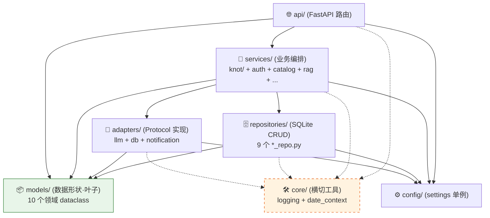

# BI-Agent — Claude Code 项目指令

## 概述

AI 驱动的 BI 助手：自然语言 → SQL → 图表。
- v0.1.1：Python 3 / FastAPI + React（浏览器端 Babel）
- v0.2.x（当前 v0.2.4）：FastAPI + React/Vite 构建版前端
- v0.x.x（规划）：Go 后端重写

## 协作规则

1. 不确定就问，别猜
2. 没要求就不写
3. 只改被要求的部分
4. 给验收标准，别给步骤

### 🔬 R-STORM：执行者多视角策展方法论（kk 2026-07-18 立 · 准则之一）

> **来源**：Stanford OVAL **STORM / Co-STORM**（[github.com/stanford-oval/storm](https://github.com/stanford-oval/storm)）—— LLM 知识策展系统：多视角提问（先调研发现视角再据视角生成问题）+ 检索接地 + 模拟对话迭代追问 + **moderator 主动生成发人深省的问题** + **mind map 共享概念空间** + 人在环 turn 管理 + 高度模块化。
> **性质**：kk 立为 **KNOT 执行者迭代项目过程中的工作方法论准则**（**不是产品特性**——是「执行者怎么干活」）。落在 Loop Protocol v3（三阶段评审）+ R-137（无单点可信）**之内**，不替代它们，是它们的方法论内核。

**六条执行者实践**（STORM 概念 → KNOT 执行者怎么做）：
1. **多视角提问代替单次推理**（perspective-guided questions）：设计 / 排查 / 决策前，扇出多条**独立视角/lens**（对抗证伪员、分维度审计 agent、diverse-lens verify），而非单 shot 结论。
2. **检索接地，永不凭记忆断言**（retrieval-grounded）：每条主张先 grounded 到 `file:line` / DB / 命令输出再断言；记忆 / 文档 / 历史审计只是**线索，用前必验**（呼应记忆系统「验证再断言」+ 版本锚点重核）。
3. **模拟对话迭代精炼**（simulated conversation）：理解经结构化往返精炼 —— grounded 盘点 → 草案 → 对抗自核 → Stage 2/3 → 追问补漏，**非一稿定论**。
4. **moderator 主动追问缺口**（thought-provoking questions）：执行者兼任 moderator，主动生成「**还缺什么**」—— 哪个 modality 没跑 / 哪条主张没验 / 哪个失败模式没人查（completeness critic）；把**重塑判断的问题**问出来，而非只答被问的。
5. **mind map 共享概念空间**（shared conceptual space）：维护分层可信知识结构（memory + `docs/plans` + CHANGELOG）与 kk 共享；保持 live 不 drift。
6. **人在环 turn 管理**（human-in-the-loop）：战略 / 口径 / 不可逆分叉交 kk steer（moderator 提问、human 拍板）；执行者不擅自定战略或业务口径。

**违反代价**：破 R-STORM = 单点推理 / 凭记忆断言 / 一稿定论 / 漏问缺口 → **假结论 / 假回归**。实证：2026-07-18 语义 eval「6 类系统性回归」实为 eval 模型错配（haiku vs 生产 sonnet-4.6）+ business_rules 缺参的**假象**，正是靠「多视角对比表 + grounded 查注册表/模型配置」才破案 —— 单看 eval 数字必误判语义层坏了。

### R-SENTINEL-AST：新哨兵默认标识符级（AST），文本匹配须写明理由（v0.9.5 立 · 三数据点）

**规则**：新增「扫全仓找某个名字 / 某种写法」的哨兵，**默认用 AST 按标识符判定**；
若确要用文本匹配（grep / 正则 / 逐 token），**必须在 docstring 写明为什么 AST 不适用**。

**为什么翻成默认（三个数据点，全是同一形状）**：
1. **v0.9.3** 载体名哨兵按文本扫 → `FIELD_LABELS` 类漂移逃逸；
2. **v0.9.4** `test_R17` 初版用正则 → **匹配到自己的 docstring** 而假红；
3. **v0.9.5** 旧名哨兵「运行期拼 needle」仍**自匹配** —— 因为文件在**讨论**那个名字
   （prose 带反引号，tokenizer 会 strip）⇒ **而该版 docstring 正引用着第 2 条教训**。

**根因（一句话）**：**讨论一个名字的文件必然含有那个名字** ⇒ 「这个标识符是否存在」这个问题，
文本匹配在原理上答不了；AST 里 prose 不可见，且「存在」的定义自动变准（
是否存在一个**叫这名字的标识符**，而非「是否出现过这串字符」）。

⭐⭐ **更一般的形式（v0.9.12 守护者自诊断折入 —— 他连续三次给错 oracle，三次同一根因）**：
> **别把 oracle 锚在「某个文件里写了什么」，要锚在「系统真的产出了什么」。**

| 错的锚点 | 正确锚点 | 实证 |
|---|---|---|
| bundle 文本**看起来**该长什么样 | 构建产物**真的**含什么 | v0.9.10 两版 oracle 被证伪（`v0.9.x` 不连续出现 / 依赖版本字面） |
| `schema.sql` **声明**了什么 | 库**真的建出**了什么 | v0.9.12：`users.api_key` 等 3 列由 `migrations.py` `ALTER TABLE` 加，`schema.sql` **0 命中** ⇒ 文本解析**实测 3 处假红** |
| 注释**声称**有什么守护 | 代码**真的**有没有 | v0.9.12：`fernet.py` 注释断言「D5 INFO log 在 repos wrap 内打」，实测 `logger.` 调用 **0 处** |

⚠️ **这条本仓早就有**（R-SENTINEL-AST 的内核就是它）—— 立过它，又连续三次违反它。
⇒ 记这条**自诊断**比记那三个错有用：**判据要问「跑出来是什么」，不是问「写着是什么」。**
**同源推论**：判「diff 是否只有预期改动」也不能用行级 grep（`^[-+][^-+]` **看不见空行增删**）——
用 `--numstat` 或整文件逐行比对。**oracle 要能表示你要排除的那个事件。**

### ⚠️ 迭代循环协议 (Loop Protocol) — v3

**严禁在未走完三阶段评审的情况下编写任何业务代码。**

> v3 相对 v2：新增「**远古守护者**」角色 + 「**MINOR 滚动前夕整体审核**」仪式。
> v0.5.0 起生效；v0.4.x 期间走的是 v2（无远古守护者机制）。

#### 一个 MINOR = 一个 Agent

Agent 的生命周期与 **MINOR 版本号**绑定，不与 PATCH 绑定：

- v0.3.0 / v0.3.1 / … / v0.3.x → **同一对话** = **v0.3 Agent**
- v0.4.0 / v0.4.1 / … / v0.4.x → **同一对话** = **v0.4 Agent**
- v0.5.0 / … / v0.5.x → **同一对话** = **v0.5 Agent**

每跨一个 MINOR，用户开**新对话**启动新 Agent；角色按 §角色滚动规则更替。

#### 角色定义（v3 — 4 级角色）

| 角色 | 实体 | 职责 | 权限 |
|---|---|---|---|
| **执行者** | 当前 MINOR 的 Agent | 出方案、整合终审意见、写代码、跑闸门、提 PR | 读 + 写 |
| **守护者** | **任何满足「独立性判据」的一方**（v3.1 改 —— 原「上一 MINOR 的 Agent」见下 §v3.1-A） | PATCH 内 Stage 3 终审 + 闸门复核 | **只读**（严禁改代码） |
| **远古守护者** | 上上 MINOR 起的 Agent（距离 > 0.1） | **仅 MINOR 滚动前夕**整体审核 | **只读 + 默认沉睡** |
| **辅助 AI 初审组** | 资深工程师 + Codex + 其他辅助 AI | PATCH 内 Stage 2 给 Redline / 评分 / 风险点 | 评审建议 |
| **资深架构师** | User 本人 | 战略决策 + 拍板 + 召集整体审核 | 决策 |

#### 三阶段评审（PATCH 内常规流程）

```
执行者                    辅助 AI 初审组              守护者                  执行者
   │                           │                         │                       │
   │ Stage 1: 方案/规划草案 ───┼─────────────────────┐   │                       │
   │                           │                     │   │                       │
   │                           │ Stage 2: 初审意见    │   │                       │
   │                           │   (Redline/评分)    │   │                       │
   │                           │                     │   │                       │
   │                           └─────────────────────┴──>│ Stage 3: 终审         │
   │                                                     │   (整合 1+2 后给意见)  │
   │                                                     │                       │
   │<────────────────────── 终审意见 ────────────────────┘                       │
   │                                                                             │
   │ 执行（按终审意见落 commit）                                                  │
```

1. **Stage 1 — 方案设计（执行者出）**
   执行者产出执行手册草案 `docs/plans/v0.X.Y-*.md`，包含范围 / 红线 / 验收 / commit 序列。

2. **Stage 2 — 辅助 AI 初审**
   用户把 Stage 1 草案分发给辅助 AI 评审组，收集 Redline / 评分 / 风险点。
   执行者此阶段不参与（不打扰评审独立性）。

3. **Stage 3 — 守护者终审（上一 MINOR Agent）**
   用户把 **Stage 1 草案 + Stage 2 初审意见**一起喂给守护者。
   守护者职责：
   - 校验与上一 MINOR / 历史 PATCH 的设计决策一致性
   - 查漏检文件 / 错误命名 / 既有红线遗漏
   - 评估初审意见是否被正确吸收
   - 给出**终审意见**（保留 / 修订 / 否决具体条款）
   守护者**严禁直接修改方案文件或代码**，只输出评审文本。

4. **执行（执行者落地）**
   执行者**只拿到 Stage 3 终审意见**（不直接看 Stage 2 原文，避免重复消化），
   按终审意见整合修订手册 → commit 锁定 → 按 commit 序列实施 → 全闸门绿 → 提 PR。

#### ⭐ v3.1 采纳（**Loop Protocol v4 提案的第一批** · kk 2026-08-01 拍板）

> **完整 v4 提案**：[`docs/governance/loop-protocol-v4-proposal.md`](docs/governance/loop-protocol-v4-proposal.md)
> （诊断 8 条全部来自 v0.9 弧真实事故 + 主流机制对照 10 条）。
> **本次只采三条**（低风险、立刻见效）；**T0-T3 档位 + PRR 留到 lift 前采**（lift 正是第一个 T3）；
> **ADR 从本条决策起用**（ADR-0001）。采纳理由的核心：
>
> ⭐ **主流靠「人多」换独立性，而本项目是一个人 + 一串会过期的 Agent 上下文
> ⇒ 独立性是结构性稀缺，加人换不来 ⇒ 必须用机制替代人数。**

##### v3.1-A 独立性判据（替代「时间距离」）

> **一个评审者是独立的，当且仅当它不知道本片的实现过程。**

**可操作形式**：给评审者的输入**只有** ① Stage 1 文档 ② 最终 diff ③ 闸门输出。
**不给**：实现期的探索过程、执行者的自辩、「我试过 A 但不行」这类叙述。

##### ⚠️ v3.1-A 与 v3.1-C 的冲突 + 解法：**Stage 4 输入分两包送**（v0.9.8 Stage 4 §II-1）

**冲突是真的**：**C 第 5 条强制生产**「实施期发现自己写错的东西」这份记录，而**A 明禁**把
「实现期叙述 / 执行者自辩」交给评审者 —— 而 §9 每片都是 Stage 4 材料的一部分。
⇒ 同一份协议里两条互斥。

**解 = 排序，不删任何一条**：
- **包 1**（先送）= Stage 1 文档 + 最终 diff + 闸门输出 ⇒ 守护者据此形成**初步发现**；
- **包 2**（守护者**交出初步发现之后**才送）= §9 实施记录 ⇒ 作**交叉校准**：
  「我找到的它有没有自报？它自报的我有没有漏？」

⇒ 两个性质都保住，而 §9 **从锚定风险变成校准工具**。
⚠️ **实证（v0.9.8 守护者自陈）**：那一片「大体上没做到这个排序 —— 读到证据之前已经读了执行者的
理由；我的发现里有多少被锚定，**我无法自证**」。
⇒ **这本身就是判据可操作的证明：它能被检验，而那次检验结果是「没遵守」。**

**为什么它优于原「上一 MINOR 的 Agent」**：
- **不随时间衰减**（上一 MINOR 的知识会过期；「不知道过程」永远成立）；
- **可验证**（看给了什么输入，而不是猜某人有多少上下文）；
- **不要求特定实体** ⇒ 谁可用就用谁：新起的 Agent 会话 / Codex / kk 本人 / 未来的第二个 AI 源。

⇒ **「Stage 2 缺席」这个概念结构性消失** ——
故 **R-LP-v3-EX-1 不再需要逐片引用**（该条保留为历史，见 ADR-0001）。

##### v3.1-B 承重面强制枚举表（11 条 · 结构化枚举替代「恰好想到」）

**触发**：变更命中**承重面** —— 鉴权 · 租户隔离 · 凭据/加密 · 审计 · DB 迁移 · 出网/egress ·
删除数据 · 限流。**Stage 1 或评审里必须逐条显式回答**（可答「不适用」，但**不能跳过**）：

1. **fail-open 面**：新判据写错会 fail-open 还是 fail-closed？
2. **oracle 能力**：判据能**表示**我要排除的那个事件吗？**且注入真能产生它吗？**
   （v0.9.9 折入后半 —— 该片实测：用「两支合并」当取材**没红**，因为那种改法
   压根产生不了要测的后果 ⇒ **注入不成立时，「取材证明」是空的**。）
   - ⭐ **在 WAL / 任何日志式存储下，「文件字节」不是状态；状态是读者看到的东西**（v0.9.11 守护者折入）。
     用文件字节表述的 oracle 测的是**错的对象**，且**两个方向都错**：主文件可以「没变」而数据已被改写
     （改动躺在 WAL 里）；而 `PRAGMA wal_checkpoint` 本身重排页 ⇒ checkpoint 后再比字节，
     **正确实现也会假红**。⇒ 用 `iterdump()` 这类**读者可见内容**的判据。
     ⚠️ 同一个错犯过两次且**跨了三年**：v0.4.5 那条测的 `sha256(bak)==sha256(db)`
     （⇒ 它在**祝福** `copy2` 缺陷）与 v0.9.10 Stage 4 守护者给的「要真按字节比」——
     **都把「文件字节相同」当成一个其实关于内容的性质的定义。**
   - ⭐ **安全属性是「什么没发生」，不是「抛了异常」**（v0.9.11；守护者单独背书）。
     异常只是实现方式之一 ⇒ **`pytest.raises` 当主 oracle 常常是假证明**：
     摘掉守护后测试停在 `DID NOT RAISE`，而「零写入 / 零备份」这些真属性的断言**根本不执行**。
     ⇒ 写 `try/except Exception` + **无条件**断真属性，最后才断「有没有给出可操作的说明」。
3. ⭐ **「那一行」族**（v0.9.8 Stage 4 §II-2 合并 —— 原 #3 门 / #4 消息 / 新形状「记录」同族）：
   **门 / 消息 / 记录，都要在「事情真的发生的那一行」。**
   - **门**装在**能力被行使的那一行**，不是决策点（v0.9.6 错两次才收敛）；
   - **消息**挂在**真的会失败的那条路径**上（v0.9.6 Stage 4：`pytest.raises(match=)` 让说明永不显示）；
   - **记录**与被记录的动作是**同一个事件**（v0.9.8：同连接、同事务、单次 commit）。
   - ⭐ **消息的内容也要对，不只是位置对**（v0.9.10 折入）：v0.9.6 学到的是「精心写的说明**可能永不显示**」；
     v0.9.10 是「说明**显示了，但说的是假的**」——诊断行的正则在 raw string 里写成 `\\d`（= 反斜杠+d，
     永不匹配数字）⇒ 恒报 `[]`，**红是红了，而它在撒谎**。
     **根因**：诊断代码**只在失败路径上运行** ⇒ **它只能靠真的把它弄红来测试**。
     ⇒ **机械形式**：**revert-to-bad 的验收产物是那条失败消息的原文，不是「转红了」三个字。**
   ⚠️ 合并而非新增第 12 条是刻意的 —— **表膨胀会降低逐条回答的质量**（守护者原话）。
4. **（已并入 #3）**
5. **散文规则**：新增规则里哪条**只写在 docstring 而无守护**？
6. **声明 vs 生产者**：新声明的有生产者吗？新产物有消费者吗？
7. **顶班**：摘掉一道门时，会不会有**别的门顶班**而让测继续绿？
8. **既有测的绿是真的吗**：有没有测「**因为错误的理由而绿**」？
   ⭐ **兑现/推翻一个承诺时，要扫两侧 —— 描述它的地方，和断言它的地方。**
   （v0.9.9 Stage 4 折入 · **同族第三次**：v0.9.5「只扫『谁产生 `defaults`』漏了『谁断言它』」·
   v0.9.7「摘门后耦合测理由变假」· v0.9.9「改了 CLAUDE.md 与 core docstring，
   漏了那条断言侧的测 —— 它名字与 docstring 三句全假而**仍然绿**」。）
   ⇒ 处置通常是**改名 + 重写理由，不是删** —— **断言可能仍值钱，过期的只是理由。**
9. **契约冲突**：有没有绕开某条契约？**契约冲突常常在说结构错了，不是绕路的对象。**
10. **策略题的影子**：出现「两个选项都要我定一条策略」了吗？**那往往说明那个失败模式本不该存在。**
11. **诚实收窄**：本片**不声称**什么？（明确写出来）

⚠️ **每条都对应 v0.9 弧一次真实事故**（逐条出处见 v4 提案 §4.4）。
⚠️ **回流纪律 —— 已给它一个可执行载体**（v0.9.8 Stage 4 §II-2）：
**Stage 4 的强制一问**：「本片有没有出现表里没有的**新失效形状**？若有，折进第几条 / 新增第几条？」
⇒ **CI 看不见的规则，就挂在一定会发生的仪式上。**
（原先「必须回流」只是散文、无触发点 —— 那正是本表第 5 条点名的形状，自指。
实证：v0.9.8 的新形状「记录的位置」已按此折进 #3 的族，而不是新增第 12 条。）

##### v3.1-C Definition of Done（把既有强项升格为明文）

一个 PATCH 只有**同时**满足才算完成：
1. **四闸门全绿**（全量 / ruff / import-linter / size）**+ 前端三件恒做**（eslint + vitest + **重建 `knot/static`**）；
   ⭐ **「前端动了则…」这个条件式已废除（v0.9.10 R14）** —— `frontend/src/version.js` **就是 4 源点的第 4 点**
   ⇒ **任何 bump 版本的 PATCH 都必然改前端** ⇒ 「前端零改动」在这类片里**永不可能为真**。
   写这句话的模板让 v0.9.7/.8/.9 **连续三片**据此跳过重建，UI 显示 v0.9.6 而 API 报 0.9.9，无人察觉。
   ⇒ 判据改为**「`frontend/src/` 除 `version.js` 外零改动」**（可为真，且**不构成跳过重建的理由**——版本串进 bundle）。
   闸门侧由 `test_doc_invariants.test_static_bundle_version_synced_with_version_js` 强制（漏一次即红）；
   **只加闸门不改这句话 = 教下一片继续说假话。**
2. ⭐ **每条「已守护」的声称都有一次真跑过的 revert-to-bad**，且**把失败信息的原文贴进记录** ——
   证明它**不只是红，而且红得能看懂、说的还是真话**
   （v0.9.6：精心写的说明可能永不显示 · v0.9.10：说明显示了但内容是假的 —— 见 v3.1-B #3 末条）；
   ⭐ **产物形式优先取「唯一抓住」而非「抓住」**（v0.9.10 Stage 4 §II 一般化）：
   「我的新守护抓住了 X」远不如「**我的新守护是唯一抓住 X 的那个**」有说服力 ——
   后者**同时证明了旧守护的盲区，而盲区才是事故的原因**。
   实证：v0.9.10 REVERT-A 得 `1 failed, 6 passed`，坐实此前 5 道 doc-invariant 断言
   **结构上看不见 stale 构建产物** ⇒ 这才解释了「连漏 3 片无人察觉」。
   v0.9.11 二次实证：备份退回 `copy2` 得 `1 failed, 14 passed` ⇒ **Sa1 是 WAL-safe 唯一守护者**
   （同文件另一条内容级断言的数据已被 checkpoint 进主文件 ⇒ copy2 也拷得到 ⇒ 它通过）
   ⇒ 由此在两处 docstring 互引「删了谁就没人守了」。
   ⭐⭐ **跑 revert 前的五问**（v0.9.11 守护者归纳四条 + **v0.9.14 Stage 4 增第 ⑤ 条** ——
   五种失效模式**互不重叠**，各有实证）：
   **① 探针会到达吗**（v0.9.11 Sa2/Sa5：停在 `DID NOT RAISE`，真属性的断言根本不执行）·
   **② 注入真能产生那个后果吗**（v0.9.9 两支合并 · v0.9.11 Sa1：WAL 若已 checkpoint 则两种备份无从区分）·
   **③ oracle 会不会恒定**（v0.9.11 Sa4：`frozenset` 迭代在**同进程内本就稳定** ⇒
   「连跑 5 次相同」摘掉 `sorted()` 也必然通过 = 空判据）·
   > ⭐ **③ 的高频具体形态（v0.9.12 折入，已机械守护）**：**「X 不在 Y 里」的断言必须先证明 Y 非空**
   > —— 对空集做否定断言**恒真**。本仓的具体载体是 `caplog`：logger 是 **loguru** 而 `caplog`
   > **只抓 stdlib logging** ⇒ 反向断言（`not in` / `not caplog.records` / `== ""`）**静默恒绿**，
   > 而正向断言会响亮地红（安全）。⇒ 只有反向方向危险。
   > 已踩 **3 次**、教训只在两条 docstring 里 ⇒ v0.9.12 装
   > `tests/test_test_hygiene.py::test_caplog_absence_assertions_must_prove_caplog_is_nonempty`。
   > ⚠️ 刻意**不一律禁 `caplog`** —— `url_allowlist.py` 真用 stdlib `logging`，有合法用法。·
   **④ 消息说的对吗**（v0.9.10：raw string 里 `\\d` ⇒ 诊断恒报 `[]`，红了却在撒谎）·
   ⭐ **⑤ 等值判据的两边，是同一种方式产出的吗**（v0.9.14 Stage 4 守护者立为第五种形状）：
   > **两边若非同法产出，测的是「两种产出方式的差异」，不是被测性质。**
   > **实证（v0.9.14 locked lane 首次上 CI 即红在此）**：`requirements.lock` 是「**干净 venv**
   > 装完后 `pip freeze`」的产物，而 lane 原本装进 runner 的**系统 site-packages**
   > ⇒ 比的是两个不同的东西（实测 `python:3.11-slim` 预装 `packaging==26.2`，
   > 由 `wheel≥0.44` 带入，而 `pip freeze` **只排除** `pip`/`setuptools`/`wheel`）。
   > ⇒ 修法是**让两边同法产出**（lane 也装进干净 venv），
   > **而不是**把那个包加回 lock —— 后者是把镜像残留祝福成「依赖」。
   > ⚠️ **同族的第二种出口：判据本来就不该是等值。**「镜像内 `pip freeze` == lock」
   > 按字面**不可能成立**（镜像必然多出基础镜像预装）⇒ 判据应为 **⊇ + 差集具名并注明来源**。
   > ⇒ 问自己：**我要的是「两边一样」，还是「这一边包含那一边」？**
3. 承重面变更的 **v3.1-B 枚举表逐条有答**；
4. **实施期偏离 Stage 1 的每一处都给出理由**；
5. ⭐ **实施期发现自己写错的东西写进记录** —— v0.9 弧证明这是最高价值的一节。

##### ⭐ v3.1 的统摄原则

> **评审的产物应当是哨兵，不是意见。**
> 每条评审发现，要么变成一条 CI / 测 / 清单项，要么就会随评审者的上下文一起过期。
> **意见的有效期 = 评审者上下文的寿命；哨兵的有效期 = 仓库的寿命。**

#### MINOR 滚动前夕整体审核（v3 新增仪式）

- **触发**：资深架构师明确 announce「整体审核」
- **参与方**：执行者 + 守护者 + 所有存活的远古守护者（独立提供意见）
- **不在 PATCH 内**，是 MINOR 间的过渡仪式
- **产物 4 份固定模板**：
  1. **代码结构评估** — 巨型文件 / 重复 / 死代码 / 可读性短板
  2. **奥卡姆剃刀清单** — 必备 / 多余 / 待简化
  3. **重命名 / 重构 / 协议增量提案**
  4. **下一 MINOR 预期范围**（骨架，不锁定）
- **冲突仲裁**：多方意见独立提供，资深架构师拍板

#### 远古守护者激活原则

- 默认沉睡（不打扰当前 PATCH 节奏）
- 仅在「整体审核」明确激活
- 不参与日常 PATCH 三阶段评审

#### 角色滚动规则

每跨一个 MINOR：
- **当前执行者** → 下一 MINOR 的**守护者**（只读 active）
- **当前守护者** → 下一 MINOR 的**远古守护者**（保留对话，dormant）
- 已存在的远古守护者 → 继续保留 dormant
- 用户开**新对话**启动下一 MINOR 的**新执行者**

PATCH 内（v0.5.0 → v0.5.1 → …）**不切换角色**，仍由同一执行者完成所有 PATCH 的三阶段循环。

#### R-LP-v3-EX-1：方向决策 Stage 2 跳过例外条款（v0.6.0.19 立约首例）

**触发**：v3 三阶段评审中，若 PATCH 性质为**方向选择 / 路线评估类决策**（非代码落地），
Stage 2 辅助 AI 初审的 redline 维度（破契约 / 命名 / 副作用）对决策无边际价值，
此时**允许跳过 Stage 2**，但必须满足以下条件：

**适用条件（3 条同时满足）**：
1. PATCH 涉及 **0 行业务代码** + **0 红线新立**（纯决策类 docs）
2. 守护者 Stage 3 终审主动认可"跳过 Stage 2 合理"
3. 资深架构师在拍板前已明示知悉本例外

**强制替代（3 条护栏）**：
1. **30 分钟等效初审** — 由资深架构师召集独立第三方（Codex / 资深工程师 AI / 不同
   Claude lineage 的 subagent）做 ≤ 500 字红线评审
2. **真独立第三方** — 等效初审者不得是同一会话内 Claude lineage（否则等于自审）
3. **累计触发 ≥3 次** — 强制召集**远古守护者**复核滥用倾向，防例外条款被泛化滥用

**首例引用**：`docs/plans/phase-b-early-review-2026-05-21.md`（Phase B 提前评估，
v0.6 执行者 Stage 1 草案 + v0.5 守护者 Stage 3 终审 + Codex-equivalent subagent 等效初审）

**治理意义**：本条款由 v0.5 守护者 §VI 提出 + Codex 等效初审 C-5 强化（3 护栏）+ 资深 2026-05-22 拍板立约。
属 Loop Protocol v3 首次明示的"方向决策 Stage 2 可由等效初审替代"例外。

#### R-LP-v3-EX-2：OVERRIDE 累计触发远古守护者召集义务（v0.6.2.0-pre-governance 立约）

**触发**：累计 OVERRIDE 事件 **≥ 3 次** → 强制召集远古守护者参与 retroactive review。

**计数维度**（资深 2026-05-25 决策 α8）：**维度 A 时间线粒度**
- 一个 PATCH 启动决定 = 1 个 OVERRIDE（无论 PATCH 内部含几个子决策）
- PATCH 内嵌子 OVERRIDE 在 CHANGELOG + plan 文档归档，**不重复计入全局计数**
- 避免对集中决策 PATCH 的倍数惩罚

**归档完整性义务**：每次 OVERRIDE 事件必须在 7 天内归档独立 plan 文档（事件 + 日期 + 归档文件路径登记到 `docs/governance/override-cumulative-log.md`，资深架构师亲自维护）。

**首次履约**：2026-05-25 累计第 3 次 OVERRIDE（方向 ① announce） → v0.4 远古守护者第 3 次激活三任务合并评审。

#### R-LP-v3-EX-2.1：OVERRIDE 治理双锁强化（v0.6.2.0-pre-governance 立约）

**触发**：累计 OVERRIDE 事件 **≥ 4 次** → 强制 Q-quarter 暂停 OVERRIDE 1 个 PATCH 周期 + retroactive audit。

**背景**：v0.5 守护者第 10 次 active §IV 提出 + v0.4 远古守护者第 3 次激活 §1.5 强化（≥4 次过线必须 Q-quarter 暂停防 OVERRIDE 泛化）+ 资深 2026-05-25 拍板立约。

**Q-quarter 暂停期内**：
- 不允许新 OVERRIDE 决策
- 必须执行 retroactive audit（OVERRIDE 累计治理记录段补全）
- 守护者 + 远古守护者协同复核所有累计 OVERRIDE 合规性

**当前累计**：3 次（维度 A）→ 未触发；距过线 1 次之差。

#### R-LP-v3-EX-3：承诺推迟治理（v0.6.2.0-pre-governance 立约）

**触发**：执行者 / 守护者 / 资深架构师在 PATCH 文档明示的"推迟到 v0.X+"承诺，**连续 ≥ 3 PATCH 未兑现** → 升级为正式红线。

**背景**：v0.5 守护者第 10 次 active §VII 守护者补丁 3 提出（v0.5.x 累计 8+ inline helpers 移入 Shared.jsx 承诺多次推迟）+ 资深 2026-05-25 拍板立约。

**适用对象**：
- 技术债推迟（如 inline helpers 移入共享组件）
- 红线推迟兑现（如 v1.0 移除 sync LLM API）
- 设计决策推迟评估（如 5 层语义 + LogicForm 推 v0.7+）

**升级机制**：≥3 PATCH 未兑现的承诺 → 自动升级红线 R-LP-v3-EX-3-X（X 为承诺序号）；后续 PATCH 强制守护。

#### R-LP-v3-EX-3-1：default-admin 弱口令债正式红线（v0.8→v0.9 整体审核 2026-07-16 立约 · 承诺序号 1）

**触发**：`knot/repositories/base.py` 自标「default admin/admin123 是 1.0 公测前必清的安全债」，自 v0.6.0 seed 起承诺推迟至今**远超 R-LP-v3-EX-3「≥3 PATCH 未兑现」阈值** → 升级为正式红线（本条为承诺序号 1 首例）。

**grounded 事实**（v0.8→v0.9 整体审核对抗验证 C1 校准 —— **撤回**远古守护者被证伪的「服务端零强制 / 纯前端」论证）：
- 全新部署 seed `admin/admin123`（`base.py:214-225`，bcrypt，role=admin，must_change_password=1，已知公开值）。
- 强制改密**服务端有硬门**（`deps.py:135-136` must_change_password=1 非 `/api/auth/*` 端点 403 + `deps.py:141-148` TOTP-required 第二门）——**非「纯前端」**。
- **真实残留风险 = 已知默认口令 + 首启竞态窗口**：seed admin 无 TOTP，login 返完整 token（`auth.py:38-48`）；攻击者若抢在合法 admin 前首次登录，可经白名单内 `/api/auth/change-password`（旧口令=已知 admin123）+ `/api/totp/*` enroll 自己的 TOTP 夺 admin。多租户下同一已知默认口令跨部署放大。

**守护义务**：
- **1.0 公测前必须清除 default admin seed**（或强制首启改密 + enroll 闭合竞态窗口才放行）——后续 PATCH 强制守护，不得再推迟。
- v0.8.19（b）先加首启竞态缓解：seed 时 env `KNOT_INITIAL_ADMIN_PASSWORD` 优先，无则随机强口令 + 一次性日志打印，替代硬编 `admin123`；配 reset 脚本 + 同步清 README / DEPLOY.md admin123 footprint。

**违反代价**：破 R-LP-v3-EX-3-1 = 已知弱口令带进公测 / 多租户 = 账户接管面；必须返做。

#### R-PB-GOV-1：工期指导性预估非硬承诺纪律（v0.6.2.0-pre-governance 立约）

**触发**：v0.5 守护者第 11 次 active 整合 Stage 2 工期重估 4.5-6.5 月 → 5-7 月时，资深架构师拒绝硬性工期承诺 + 立约（2026-05-25 决策 β2）。

**内容**：所有 PATCH 工期标注（如 "2-2.5 周"）为**指导性预估**，**非硬承诺**：
- PATCH 启动时机由资深架构师按业务方实际节奏决定
- 不锁定 1.0 公测时间窗（拒绝 2026 Q3 末 / Q4 末 / 2027 Q1 等具体承诺）
- 守护者 / 远古守护者 / Stage 2 评审员意见中"工程量重估 N 月"作为参考，不作约束
- 当资深 announce"按计划推进"时按当前已 LOCKED PATCH 序列执行
- **例外**：单 PATCH 内部 commit 序列工期可硬预估（守护者 Stage 3 终审依据）

**违反代价**：破 R-PB-GOV-1 = 业务方信任损失 / 团队疲劳 / 决策含糊；必须返做承诺修订。

#### R-PA-PB-V1：Phase B UI 视觉延续性立约（v0.6.0.19 立约）

**触发**：v0.5 守护者 2026-05-14 Phase B 评估意见 §7 提议；v0.6.0.19 正式落地立约。

**内容**：Phase B 及之后所有 PATCH（含 v0.6.2.0 TOTP enroll / v0.7.x 5 层语义等）
涉及 UI 改动时，必须严守 v0.5.x 锁定的视觉设计语言：
- OKLCH 单色系统（buildTheme(dark,{hue,style}) **38 runtime keys** — v0.8.14 玻璃 chrome + type system 升级 re-baseline；原 v0.6.2.3 口径 26）
- I icon library（37 names — v0.6.4.0 +16=54 后 v0.7.48 死码清扫 −17）
- brandSoft 8% inset + borderLeft 3px 25% 设计语言铁律
- HarmonyOS Sans SC / PingFang SC / JetBrains Mono 字体
- 18 屏 byte-equal 守护（除当前 PATCH 目标屏外 git diff 0 行）

**违反代价**：破 R-PA-PB-V1 = 视觉一致性回退；需重做并补补丁说明。

#### v3 协议施行历史

- v2（v0.4.x 期间生效）：3 角色（执行者 + 守护者 + 辅助 AI 初审组）
- v3（v0.5.0 起生效）：+ 远古守护者 + 整体审核仪式
- 首次整体审核：v0.4.6 → v0.5.0 滚动前夕（执行者 v0.4 + 守护者 v0.3，因 v0.3 之前无 v3 协议未存远古守护者）
- 第二次整体审核：v0.5.44 → v0.6.0 滚动前夕（执行者 v0.5 + 守护者 v0.4 + 远古守护者 v0.3）→ 产出 9 项 LOCKED 决议 S-1~S-9 → v0.6 Agent 启动 Phase A

**v3 协议施行回顾**（v0.5.0~v0.6.0 累计 26 次完整 PATCH 内施行；首次跨 MINOR 角色滚动后施行 = v0.6.0）：逐 PATCH 施行特征表已移至 [`GOVERNANCE-ARCHIVE.md`](GOVERNANCE-ARCHIVE.md)（治理留痕）；用户视角见 [`CHANGELOG.md`](CHANGELOG.md)。

## § Visual Replication Protocol（v0.5.7+ 屏复刻通用约束）

> **触发**：v0.5.7 起每个屏复刻 PATCH（home / shell / thinking / favorites / 9 admin tabs）
> **依据**：v0.5.7 Login pilot 实证经验提炼；适用于 v0.5.8+ 17 屏渐进复刻
> **与 Loop Protocol v3 关系**：本协议是视觉复刻专项约束，**不替代** v3 三阶段评审；每屏 PATCH 仍走 Stage 1+2+3+4

### 路径常量

- **Demo 设计稿**：`/Users/kk/Documents/knot_ui_demo/v0.5/artboards/*.jsx`（设计代理，**不进产品**）
- **产品屏**：`frontend/src/screens/*.jsx`
- **共享 Foundation**（v0.5.6 + v0.5.7 落地）：
  - `Shared.jsx` — buildTheme(dark,{hue,style}) **38 runtime keys**（v0.8.14 玻璃 chrome + type system；原 26 = 25 token + dark，+玻璃 8 + type 4） + I 38 icons + iconBtn/pillBtn + CHART_COLORS 8 色 + LineChart/BarChart/PieChart/TypingDots + KnotMark/KnotWordmark/KnotLogo + **v0.6.2.3 整合 14 helper → 26 exports；v0.6.2.4 drift 调和再整合 12（PeriodTab/TagChip/statLabelStyle 参数化 + Avatar/theadStyle + inputStyleField/inputStyleMono + ghostBtnStyle/primaryBtnStyle/pageBtnStyle + FilledChip/pillBtnCompact）→ 38 exports 段 3 收官**
  - `utils.jsx` — Modal/ModalHeader/Input/Select/Spinner/toast/useTheme/usePersist
  - `decor/NarrativeMotif.jsx` — 原子 motif SVG（React.memo + OKLCH color-mix tint）

### 设计系统（v0.5.6 立 · v0.8.14 玻璃 chrome + type system 升级，设计侧三轮定稿）

> ⚠️ v0.8.14 UI 交付包扩展了设计系统（buildTheme 加签名 + 玻璃 tokens + 外观预设 + 自托管字体 + 字阶 tokens）。**原「严禁扩展 buildTheme 25 字段」铁律已被 v0.8.14 版本位取代**（详 CHANGELOG v0.8.14 + Shared.jsx 头注释）；单色铁律 / brandSoft 8% + borderLeft 25% / 语义色仍守。

- **色彩**：OKLCH 单一色空间 — brand/accent 195°（外观预设可换 hue：cyan 195°/violet/emerald/amber，同 L/C 只换 hue，单色铁律保持）/ success 145° / warn 85° / error 27° / chart 8 色。
- **玻璃 chrome（v0.8.14）**：`buildTheme(dark, {hue, style})`（旧签名兼容）— style ∈ frosted(雾面·克制) / aurora(极光·多彩)；新 tokens ambient（页底环境色渐变）/ blur（backdrop-filter）/ glassBorder（高光描边）/ panelShadow（inset 高光）/ glow（aurora 发光）/ chartColors。结构色转半透明 rgba + backdrop-blur。外观 store = `utils.getAppearance/setAppearance`（localStorage `cb_appearance`，旧 `cb_theme` 迁移+双写；入口 Shell 顶栏「外观」弹层）。
- **字体（v0.8.14 自托管 fontsource，main.jsx import）**：Inter Variable（拉丁/数字，栈首）→ MiSans VF（预留槽位）→ Noto Sans SC（中文，unicode-range 分包）；mono = JetBrains Mono Variable，**仅数字/SQL/ID/时间戳**（中文标签一律 sans）。**消除此前 Windows 雅黑回退**。
- **字阶铁律（v0.8.14）**：`T.fs` caption 11/label 12/body 13/reading 14/title 16/kpi 22（hero 28/34 仅空态）；`T.fw` 400/500/650（900 仅 KNOT 标）；`T.ls` mono 0.02em/display -0.02em/body -0.003em；全局 tabular-nums。新代码禁手写 0.5px 步进字号 + 600/700/800 字重。
- **图标**：I 37 names viewBox 24×24 stroke 1.6（Logo 用 KnotMark viewBox 100×100，语义不同）。
- **交互一致性（v0.8.14）**：`window.confirm` 全废 → `utils.confirmDialog`（Promise API）+ ConfirmHost 玻璃确认框（Enter 确认/Esc 取消）；新代码禁用 window.confirm。ECharts 图内文字显式指定字体（轴刻度 mono / 图例+tooltip sans）。
- **OKLCH fallback**：R-165（:root fallback + `@supports not`）仍未折进 index.css；⚠️ v0.8.14 视觉已重写，需重估是否仍适用（backlog）。

### 视觉模型（v0.5.7 验证；v0.6.4.1.1 立约强化）

- **底色面板** → fluid 100%（铺满 viewport 边缘；不要 artboard 整体居中）
- **元素** → 尺寸不变，位置 anchor 到 panel 边角（与主题切换 fixed 右上同思路）
- demo 是 1200×760 artboard 设计代理，产品按"viewport-fluid + element-anchored"模式呈现，**不要照搬 artboard 尺寸**
- **⭐ R-UI2-VRP 立约（v0.6.4.1.1 — UI v2 屏复刻铁律）**：**artboard（Claude design）把握「整体设计方向」；本地标准把握「细节」。**
  artboard 的写死尺寸/坐标/百分比（如 `radial-gradient(ellipse at 22% 18%)`、`width: '70%'`、固定 1200×760 几何）**严禁照搬** —— 须按本地 VRP 标准重新锚定：底色 fluid 实底铺满 + 渐变/glow **element-anchored**（锚到元素如 motif 自身，非 viewport 百分比 — 后者在宽屏 farthest-corner ellipse 胀开/偏移）+ buildTheme/TOKENS_V2 tokens + 既有契约 byte-equal。
  **反例（v0.6.4.1 login）**：照搬 artboard 写死 `radial-gradient at 22% 18%` + motif `right 70%` → 宽 viewport 背景整体偏移；v0.6.4.1.1 修：实底 `T.chipBg` + motif `inset 0`（绿光由 motif 自身 `radial-gradient at 30% 30%` 锚定）。
  **后续每屏复刻强制套用**：artboard 看「要什么元素 / 什么布局方向 / 什么视觉语气」，本地决「fluid 锚定 / token / 契约」的实现细节。

### byte-equal 红线（每屏 PATCH 通用，沿用 v0.5.7 R-170~172/178/179/186 模板）

- export name + props 签名 byte-equal（App.jsx / Shell.jsx / 父组件调用 0 改动）
- 业务链路（api.* / state hooks / SSE handler / localStorage key）byte-equal
- 错误文案 / 提示文案字面 byte-equal（i18n 留 v0.6+）
- 其他 17 屏 + 子模块 byte-equal（`git diff origin/main HEAD -- frontend/src/screens/` 仅含目标屏）
- App.jsx / api.js / index.css / main.jsx / utils.jsx / Shell.jsx byte-equal（除非 PATCH 明确改 Shell 屏）

### 抗诱惑清单（5 条 — v0.5.7 R-186 经验）

- 即使 Foundation 资产可用，**仅在当前 PATCH 目标屏引用**
- 严禁顺手扩 buildTheme 加新字段（破 R-158 25 字段契约）
- 严禁顺手 i18n / 国际化（zh-CN 写死至 v0.5.x 末）
- 严禁顺手改其他屏 / Shell topbar / favicon 等不在 PATCH scope 内的资产
- 严禁引入新 npm 依赖（若需要 → 单独 chore PATCH 评估）

> **R-199.5 KnotLogo 文件集更新（v0.6.4.2 守护者裁定）**：v0.5.9 立的「KnotLogo 仅 Shared+Login+Shell 三文件」抗诱惑约束，在 v0.6.2.0 auth 屏落地时已自然失效 —— `Enroll.jsx`（TOTP enroll）+ `ForceChangePassword.jsx` 同为 brand/auth 屏，采用 KnotLogo 合理。**当前命中 5 文件**：Shared（定义）+ Login + Shell + Enroll + ForceChangePassword。哨兵基线 = 5（4 渲染 + 1 Shared 定义；`test_knotlogo_file_set` 渲染 guard 断 4）。（v0.8.5 ②a：BI 曾短暂自建 BIShell 命中 BI.jsx → 后改共用 `<AppShell>`，Shell 一处渲染 brand 覆盖 chat/BI/admin 全部外壳，BI.jsx 回落不直渲。）

### 四源点版本同步（v0.6.4.11 task #44 单一真相源 — 替代旧「五处」硬编模型）

> **v0.6.4.11 task #44 根治**：旧「五处」模型里 Shell L43 是**条件式硬编**（仅改 Shell 时同步）→ 实测 drift **8 PATCH**（卡 v0.6.4.2）。根因 = **硬编版本字面分散在 Login/Shell 两屏**，靠人肉/条件式同步必然 drift（元模式 8 数据点核心）。
> **解 = 前端版本单一真相源**：新建 `frontend/src/version.js` `export const APP_VERSION`；Shell sidebar + Login footer **读 `{APP_VERSION}`**（不再硬编 → drift 不可能）。CI bridge 断言 `APP_VERSION === main.py version`。
> **历史归档**：旧「三处→四处→五处」演进 + R-181 误分类（元模式第 6/8 数据点）记于 CHANGELOG v0.6.4.2/4.3 + docs/plans/*；本段为 live spec，不复述。

每 PATCH 升版本须同步 **4 个源点**（全 ★CI 强制 — 改一漏一即红，无条件）：
1. ★ `knot/main.py` FastAPI version（R-72 `test_rename_smoke`）
2. ★ `tests/test_rename_smoke.py` R-72 字面 + docstring
3. ★ `README.md` 顶部 1000 字符内 `v{version}`（KNOW-1 `test_login_version_sync`）
4. ★ `frontend/src/version.js` `APP_VERSION`（bridge `test_doc_invariants.test_app_version_synced_with_main` 断言 == main.py）

**显示点自动跟随（不单列、不硬编）**：Login footer + Shell sidebar 渲染 `v{APP_VERSION}`（读源 #4）→ 版本一致由 bridge 保证；渲染哨兵（R-181 adapted + `test_shell_sidebar_renders_app_version`）断言二者真渲染 `v{APP_VERSION}`（非仅 import）。**Shell L43 条件式同步规则废除**。

**⭐ 第 5 个源点 = 构建产物 `knot/static`（v0.9.10 R14 补齐）**：4 源点**此前不含它** ⇒ **没有任何闸门看它**
⇒ v0.9.7/.8/.9 三片都 bump 了 4 源点却没重建，**用户在 UI 看到 v0.9.6 而 API 报 0.9.9，连漏 3 片无人察觉**。
⇒ **每片 bump 版本后必须 `cd frontend && npm ci && npm run build`**，由 CI 强制（见下）。
> **锚点为什么是「`index.html` 真正引用的那个 chunk」**：孤儿 chunk 不被引用 ⇒ 不会被浏览器加载 ⇒ 不是 stale 发布；
> 真正危险的是 `index.html` 指着旧 chunk，而那恰被本断言抓到。
> **判据 = 反引号包裹的裸版本串**（`` `0.9.10` `` = APP_VERSION 编译后形状）。⚠️ 两版被证伪的 oracle 别走回头路：
> ① `v\d+\.\d+\.\d+` 全集 —— UI 写 `v{APP_VERSION}`，`v` 是另一个 JSX 文本节点 ⇒ **不会连续出现**；
> ② 裸 semver 全集 —— bundle 里合法含大量依赖版本字面（`0.4.2`/`1.82.33`/`127.0.0` …）。

**doc-不变量 CI 一揽子**（`tests/test_doc_invariants.py`，task #44）：version bridge（上 #4）+ KnotLogo 精确文件集（R-199.5，5 文件 = 4 渲染 + Shared 定义；BI 共用 AppShell 不直渲）+ CHANGELOG 顶部 == main version + **构建产物版本 == `version.js`** + **`knot/static/assets` 无孤儿 chunk**（v0.9.10）。未来新增 doc-不变量**优先纳 CI**（勿靠人肉 — 元教训：无 CI 则静默 drift）。

### 复用 v0.5.7 LOCKED 手册作模板

每屏 PATCH 沿用 `docs/plans/v0.5.7-login-pilot.md` 8 节模板（决议 / 红线 / 文件改动 / 验收 / commit 序列 / 协议合规 / 自检），按本屏特性填空即可。


## 启动

```bash
# 本地开发
pip install -e ".[dev]"
python3 -m uvicorn knot.main:app --reload --port 8000

# Docker 部署（v0.6.0 5 分钟全新部署快速开始 — 详 README §5 分钟）
docker build -t knot . && docker run -d -p 8000:8000 -v $(pwd)/data:/app/knot/data --env-file .env knot

# v0.4.x dev 用户升级（v0.5.0 R-67/68/74 双源兼容已撤回 — 详 CHANGELOG v0.6.0 撤回声明）
# 1. .env 改名 + 同值: BIAGENT_MASTER_KEY → KNOT_MASTER_KEY / JWT_SECRET 改通用 secret
# 2. DB 文件手动 rename: bi_agent.db → knot.db（详 README v0.4.x → v0.6.0 升级路径）
```

## 关键路径（v0.5.0 起包名 knot）

| 文件 | 职责 |
|------|------|
| `DEPLOY.md` | **运维部署手册**（v0.6.0.10 加）— 一键部署 + 升级 + 故障排查 + 监控；运维 / AI 助手优先参考 |
| `knot/main.py` | App 工厂，FastAPI title=KNOT version=0.5.6；启动 banner 显示实际加载 env 名 |
| `knot/api/deps.py` | JWT 常量、create_token、get_current_user、require_admin |
| `knot/api/schemas.py` | 所有 Pydantic 请求模型（9 个） |
| `knot/api/query.py` | v0.5.2 拆分：路由 + SSE generator 主控（yield 保留），业务计算 delegate query_steps |
| `knot/services/engine_cache.py` | 用户 DB 引擎缓存（TTL 1h）、_upload_engine |
| `knot/api/` | 业务域路由文件（72 路由：auth / admin / conversations / database / few_shots / knowledge / prompts / query / templates / uploads / saved_reports / audit / catalog / exports） |
| `knot/services/agents/` | 3 agent 实现（v0.5.0 从 services/knot/ rename）；v0.5.2 sql_planner 拆 prompts/tools/llm + orchestrator 拆 clarifier/presenter |
| `knot/services/agents/sql_planner.py` | v0.5.2 主文件：ReAct 调度员；拆出 prompts (`_AGENT_SYSTEM_TEMPLATE` + `_business_rules` + `_relations_for_schema`) / tools (`_strip_sql` + `_parse_agent_output` + `_is_fan_out` + `_run_tool` 含 v0.5.1 cartesian + v0.4.1.1 fan-out 守护) / llm (`_call_llm` + `_acall_llm` 含 v0.4.4 R-26 budget gate + R-30 透传) |
| `knot/services/agents/clarifier.py` | v0.5.2：VALID_INTENTS / INTENT_TO_HINT / DEFAULT_INTENT_FALLBACK + `_CLARIFIER_SYS` + `run_clarifier` / `arun_clarifier`（R-26 budget gate + R-30 透传）；v0.6.0 F2.6 `_CLARIFIER_SYS` 从 `knot/prompts/clarifier.md` lazy load |
| `knot/services/agents/presenter.py` | v0.5.2：`_PRESENTER_SYS`（含幻觉禁令 + 异常判断）+ `run_presenter` / `arun_presenter`；v0.6.0 F2.7 `_PRESENTER_SYS` 从 `knot/prompts/presenter.md` lazy load |
| `knot/services/agents/orchestrator.py` | v0.5.2 调度员：保留共享 helpers `_resolve` / `_llm` / `_allm` / `_parse_json` / `_today` / `_date_block` / `_business_rules` / `_app_or_key`（子文件函数体内延迟 import — R-106 方案 1）+ re-export 子文件 public 符号 |
| `knot/services/` | 业务编排层（auth_service / budget_service / cost_service / audit_service / error_translator / llm_client 等） |
| `knot/services/llm_client.py` | v0.5.2 主文件：generate_sql / agenerate_sql / fix_sql / afix_sql；拆出 few_shots / llm_prompt_builder / _llm_invoke + R-100 re-export |
| `knot/services/few_shots.py` | v0.5.2：DB 优先 / yaml 回退的 few-shot 装配 (`_load_few_shots` / `classify_question_type` / `get_few_shot_examples`) |
| `knot/services/llm_prompt_builder.py` | v0.5.2：`build_system_prompt`（含 v0.4.1.1 RELATIONS 注入 + Fan-Out 防御 prompt） |
| `knot/services/_llm_invoke.py` | v0.5.2：`calculate_cost` / `_invoke_via_adapter` / `_ainvoke_via_adapter`（含 v0.4.4 R-26 senior budget gate + R-30 透传 + R-32 agent_kind 分桶）/ `_parse_llm_response` 等 |
| `knot/services/query_steps.py` | v0.5.2 R-109：纯业务步骤函数（**0 yield**），SSE 主控保留在 api/query.py — `enrich_semantic` / `select_agent_key` / 3 流式 step (clarifier/sql_planner/presenter) + 2 非流式分支 (use_agent / generate+fix retry) |
| `frontend/src/screens/Chat.jsx` | v0.5.3 拆分：ChatScreen 主屏调度员（保留 export 名 + props）；sendQuery 走 sse_handler 纯函数 + callbacks 注入 state setter |
| `frontend/src/screens/chat/` | v0.5.3：7 个子模块 — `intent_helpers.js` (INTENT_TO_HINT 7 类) / `sse_handler.js` (R-118 纯函数 runQueryStream) / `ResultBlock.jsx` (R-117 7 intent layout 分支 + R-127 ErrorBanner ERROR_KIND_META + MetricCard + AGENT_KIND_EMOJI + exportMessageCsv) / `ChatEmpty.jsx` / `Conversation.jsx` / `ThinkingCard.jsx` (含 AgentThinkingPanel) / `Composer.jsx` |
| `frontend/src/screens/Admin.jsx` | v0.5.3 拆分：AdminScreen 状态容器（22 handlers + 23 state(useState) + 3 ref + 7 tab dispatch + AppShell + topbarTrailing 分支；v0.6.2.5 多 catalog 扩容）；保留 export 名 + props 含 initialTab 深链 |
| `frontend/src/screens/admin/` | v0.5.3：5 个子模块（D4 4 tab dumb component + 1 modals）— `tab_access.jsx` (Users + Sources) / `tab_resources.jsx` (Models + API Keys + Agent Models) / `tab_knowledge.jsx` (Knowledge + FewShots + Prompts) / `tab_system.jsx` (Catalog) / `modals.jsx` (UserFormModal + SourceFormModal + FewShotModal) |
| `knot/repositories/` | 9 个 *_repo.py + audit_repo.py |
| `knot/adapters/` | llm/{anthropic_native,openai_compat,openrouter,async+sync 双 API} + db/doris.py + notification/{base.py,__init__.py,webhook.py,lark.py,telegram.py,im_egress.py}（通知/IM 分享适配层 — v0.5.5 删 lark.py **stub** → v0.8 BI 报表 IM 分享重加**完整实现**：lark.py LarkImageAdapter（`_token_cache` tenant-token 缓存 :23）+ telegram.py TelegramImageAdapter + im_egress.py `IM_ALLOWED_HOSTS` 发送侧 egress allowlist（R-SL-69 与数据源读取 `KNOT_HTTP_ALLOWED_HOSTS` 物理隔离）；v0.7.7 webhook.py WebhookNotificationAdapter，monitors.py monitor-fire 生产调用 + `KNOT_WEBHOOK_ALLOWED_HOSTS` 守护） |
| `knot/core/` | 横切工具（logging_setup / date_context / crypto/fernet）|
| `knot/scripts/` | migrate_encrypt_v045.py / purge_audit_log.py（v0.6.0 删 migrate_db_rename_v050.py — R-67/68 撤回；详 CHANGELOG）|
| `knot/prompts/` | 默认 3-Agent system prompts（v0.6.0 F2 — sql_planner.md / clarifier.md / presenter.md；启动期幂等 seed 到 DB；admin UI 可覆盖）|
| `knot/static/` | Vite 构建产物（`frontend/` 源码 → `npm run build` 输出至此） |
| `knot/data/` | SQLite 数据库（gitignore，runtime 自动创建；v0.5.0 起文件名 knot.db） |
| `scripts/audit_ohx_leakage.py` | v0.6.0 F6 — 业务方言 + 旧品牌字面泄漏守护（--mode=sanitize/brand/all；R-PA-1/R-PA-6 闸门 6 工具）|

## 导入约定

v0.3.0 起 `pip install -e .` editable 安装；解释器原生识别 `knot` 包，无 sys.path hack。
所有业务模块用 `from knot.X import Y` 绝对导入（`from knot.api.deps import get_current_user` 等）。

## 数据库

- `knot/data/knot.db` — 用户 / 会话 / 消息 / 知识库 / 用户上传 CSV/Excel / 审计日志
  （v0.2.4 合并 uploads.db；v0.4.6 加 audit_log）
- v0.4.x dev 用户升级路径（README §v0.4.x → v0.6.0）：手动 `mv bi_agent.db knot.db`（v0.5.0 startup auto-rename migration 已撤回 — 详 CHANGELOG v0.6.0）
- Apache Doris / MySQL — 业务查询目标（通过 .env 配置）

## ⭐ OOS-1v2 多租户隔离红线（v0.9.0 红线修订仪式改立 · 原 OOS-1 单租户死线 v0.6.2.0 正式翻转）

> **OOS-1v2（v0.9.0 红线修订仪式改立 · 原 OOS-1 单租户死线正式翻转）**：多租户隔离模型 = **C 方案（平台库 + per-tenant SQLite 文件，fail-closed）**。**租户库内严禁 tenant_id/project_id 列**——行级租户列对 LogicForm 编译器 fail-open（漏注一条 = 静默跨租户供数），文件边界是唯一隔离载体；租户归属列仅允许存在于平台库（tenants 等平台元数据表）。catalog_id 仍 = 租户内水平切分 ≠ 租户隔离。tenant 上下文 fail-closed（无 ctx → raise，严禁全局回退）。配套 **R-T-GATE**：隔离栈就绪（uploads/凭据/egress/catalog/调度器/缓存与限流键/开通口令）前严禁放开第二租户开通。
>
> **⭐ R-T-GATE 就绪清单（v0.9.4 增补 · lift 前必清）**：v0.9.1 进程内缓存 ✅ · v0.9.2 uploads ✅ ·
> v0.9.3 catalog 载体 ✅ · **v0.9.4 JWT tid 请求级解析 ✅**（middleware 读 tid + `get_current_user`
> tid 门 + 漂移 tripwire + 登录按 slug 自建 ctx）· **B-3 三项（v0.9.3 原理上修不了，必须单独做）**：per-tenant file catalog
> （`_local_catalog.py` 现为单一进程级模块，空-DB 租户会被注入部署方真实业务规则+库表）+ **per-tenant
> `http_spec` 凭据**（`adapters/http/executor.py:87-88` 走进程 env = 租户盲 → 租户#2 可用租户#1 凭据读其
> 实时接口 = **跨租户数据出境**）+ **egress 租户域化**（`url_allowlist.py:30` host 白名单同为进程 env）+ **`/api/admin/catalog` 的 `defaults` 字段**（`api/catalog.py:52` → `get_defaults_from_files()` **绕过租户槽**直吐部署级 file catalog 全文 ⇒ lift 后租户#2 admin 即可见部署方真实库表+业务口径；分槽挡不住它）·
> prompt seed / TOTP rollout 的 `resolve_single_tenant`（`main.py:103/169`）· `replicas=1` 运维门（进程全局
> 每副本一份，分布式失效前）· `_business_rules` 归正。
>
> **⭐ 清单分项（v0.9.5 D8'' —— 此前一串挂在同一个版本号下，与 5 处代码注释互相矛盾）**：
> 每项给**具名目标片**，不再统挂 v0.9.5；治理依据 = 版本号里装的东西与代码注释/CLAUDE.md/CHANGELOG
> 不一致，正是 R-LP-v3-EX-3 要防的「**承诺静默蒸发**」起点。
> - ✅ **鉴权拆分 platform/tenant admin = v0.9.5 已完成**（`require_tenant_admin` 90 站点改名 +
>   平台面 out-of-band 平行认证路径 + `PLATFORM_SECRET` 策略类 + 死 `defaults` 字段已删）。
>   ⚠️ 但 v0.9.5 **刻意零平台写操作**（E2）⇒ **平台侧审计仍无落点** ⇒ **R-10 audit-on-drift 未解开**。
> - ▶ **`db_dir` UNIQUE + 格式约束** → **provisioning 片**（非 v0.9.5）。
> - ✅✅ **B-3 三项 = 全部闭合**（① v0.9.6 · **②③ v0.9.7**）：
>   - ✅ **① per-tenant file catalog（v0.9.6 owner-gate）**：`catalog_loaders.load_file_layer()`
>     单一 choke point —— 非**起源租户**（`core.tenant_context.OWNER_TENANT_ID` / `is_owner_tenant()`）
>     返**完整 empty 五元组**（**禁半空**：`business_rules` 仅空库才 fallback ⇒ 半空会继续泄漏部署方口径）。
>     闭合「空-DB 租户被零动作注入部署方表/词典/口径」。**本项仍在生效，未随 ②③ 摘除。**
>   - ✅ **② per-tenant `http_spec` 凭据（v0.9.7）**：`executor.execute` 的 env 模式**物理删除**
>     （`base_url_env` / `auth_*_env` + `import os` 一并删；配 AST 哨兵禁该适配器再读进程 env）。
>     凭据一律经 spec 的 `source_id` → **本租户库** `data_sources`（Fernet）。能力处**两道独立**硬边界
>     （无 `source_id` / 数据源无地址，消息可区分）；决策处 `pick_http_route` 软降级落 SQL **+ 记日志**；
>     `resolve_spec` 未绑定时**剥掉** `base_url`/`auth_*`（那些值来自零校验 `PUT`、明文存在 catalog 里）。
>   - ✅ **③ egress 租户域化（v0.9.7）**：allowlist 从进程 env 改读 **`tenants.allowed_http_hosts`**
>     （平台库新列 + 本仓**第一条平台迁移**）。**三态语义，判据必须 `is None`**：
>     `NULL`=未配置（起源租户回退 env + 启动 WARN）/ `''`=**部署方明确的「禁」**（不回退）/ 非空=该集合。
>     **永不与 env 或其他租户取交集/并集**（取交集是反向的：为给客租户开权会同时放宽起源租户）。
>     载体选「`tenants` 的一列」而非独立表/hook/参数：`get_tenant` / `list_active_tenants` **都是 `SELECT *`**
>     ⇒ 加列自动进 tenant ctx ⇒ 能力处（adapters）只读 `core.tenant_context` 即可，**零分层例外**
>     （`adapters-no-business` 禁 adapters → repositories）。
>   - 🗑 **v0.9.6 的两道代偿门已随 ②③ 摘除**（`executor.execute` 的 owner 硬边界 + `pick_http_route`
>     Layer 0）—— 它们的注释原文就写着「只有 ②③ 都落地才可移除…别单独摘」。
>     ⇒ **按租户区分的不再是「是不是起源租户」，而是「凭据是不是自己的」+「主机是不是自己 allowlist 里的」。**
>     配正对照测（非起源租户配了自己的 allowlist ⇒ 请求真的发出）防「拦住所有人」式假通过。
>   - 🔒 **原耦合 CI 已转向**：`test_coupling_gate_exists_implies_rtgate_not_lifted` →
>     **`test_rtgate_still_locks_second_tenant`**（断言仍是**行为级**：两 active 租户 ⇒ 请求 fail-closed；
>     消息改列**剩余** blocker）。⚠️ 实测坐实它「摘门后**不会红、会静默变绿而理由变假**」——
>     它的断言纯行为级、代码里不引用那道门 ⇒ **这类测最危险的失效形态不是转红，是继续绿着但守的已经不是原来那件事。**
>   - ⚠️ `/api/admin/catalog` 的 `defaults` 字段已于 v0.9.5 删除（**部分**减暴露）——
>     但 `current` **仍含 file 层**（owner 侧）且「让它不含」被 v0.7.29b 不变量**禁止**。
>   - ⚠️ **v0.9.7 顺带修一个既有安全缺陷**：egress 拒绝消息把 `sorted(allowed)` = **整份 allowlist**
>     插进异常，经 `run_http_step` → `result["error"]` → `api/query.py` **原样 yield** → SSE
>     ⇒ 租户 admin 可读出部署方内网主机清单（**与 #262 同类**）。已收敛（诊断进日志且**连条目数都不记** ——
>     它在污点传播上仍是 env 派生，被 #262 的 AST 哨兵实测拦下）。
> - ▶ **provisioning 侧新增登记**（v0.9.6）：**禁停用 / 删除起源租户** ——
>   `resolve_single_tenant()` 只要求恰 1 active、**不要求 `id == OWNER_TENANT_ID`** ⇒ 停用 tenant#1 +
>   active tenant#2 ⇒ boot 成功而 **file 层对被服务租户静默变空**。v0.9.6 已加启动期 WARN 兜住可诊断性，
>   但**根治在 provisioning 片**。
> - ▶ **provisioning 侧新增登记（v0.9.7 · M5 阻断项）**：**开通租户时必须显式配 `allowed_http_hosts`**。
>   该列**没有任何写端点**（v0.9.5 E2 刻意零平台写操作）⇒ 唯一配置途径是运维直接 `UPDATE platform.db`
>   （SQL 原文见 DEPLOY.md「多租户运维门」）。**漏配 ⇒ 该租户 HTTP 数据源全部静默拒绝**
>   —— fail-closed 正确，但**与 bug 不可区分** ⇒ 与「禁停用/删除起源租户」**同族，写在一起**。
> - ▶ **启动/请求期残留的 `resolve_single_tenant`** → **lift 前**。⚠️ **不写行号**（会漂 —— v0.9.7 实测原登记的 `main.py:103/169` 已漂到 **95/166**，且**第三处** `main.py:245`（audit purge 后台任务）**从未登记**）⇒ 按**符号 + 文件**记：`main.py` **3 处**（prompt seed / TOTP rollout / audit purge）+ `auth.py`（登录无 slug 回退）+ `tenant_resolution.py`（无 tid 回退）= **生产 5 处**；另 CLI 脚本 3 处已支持 `--tenant`（非阻塞）。
> - ✅ **平台审计落点 `platform_audit` = v0.9.8 已闭合**（R7）：平台库新增 `platform_audit` 表
>   + `tenants.updated_at` + 单一写口 `tenant_repo.update_tenant` + 只读端点 `GET /api/platform/audit`。
>   ⭐ **承重设计不是表而是写法**：审计 INSERT 与被记录的动作**同连接、同事务、单次 commit**
>   ⇒ 「审计写失败」与「动作失败」是同一件事 ⇒ **不存在「做了但没记」/「记了但没做」**，
>   且**不需要**在 raise 与吞之间选策略（原草案主张 raise 会把 `replicas=1` 这条**零强制**的
>   运维约束变成 boot 可用性单点 —— 多副本共享 PVC 首启并发写 ⇒ `database is locked` ⇒ 崩溃循环）。
>   四条哨兵：Literal 与 emit **精确集合相等** · `detail` 无凭据 + 调用方零 env 读 ·
>   `UPDATE tenants` **恰一处** · **append-only**（禁改禁删 —— 租户侧已有合法 DELETE 先例，
>   平台侧清理脚本一定会来，有哨兵它就必须是显式评审改动）。
>   ⚠️ **诚实边界**：运维直接 `sqlite3 UPDATE` 仍绕过写口 ⇒ 只声称「**代码路径**上的变更被审计」。
> - ✅ **R-10 audit-on-drift = v0.9.9 已兑现**（自 v0.9.4 登记、**连续 5 片未兑现**后结清 ——
>   已过 R-LP-v3-EX-3 的「≥3」线，kk 2026-08-01 拍板「直接做掉、不升红线」）：
>   真漂移抛 `TenantDriftError`，由 `api/deps.get_current_user` 写**平台**审计。
>   ⚠️ **推翻 v0.9.8 的一句订正**：当时写「R-10 是租户侧的事」是**错的** ——
>   漂移那一刻「当前是哪家公司」**本身就是坏的** ⇒ 写租户库 = 写进两个互斥声明中可能错的那一个
>   = **把安全事件披露给错误那家公司的 admin、同时对该知道的那家隐藏它**（跨租户信息披露）。
>   ⇒ CLAUDE.md **原先**那句「因平台侧无落点而未解开」才是对的。
>   ⚠️ 「未设 ctx」是**预期路径刻意不记**（否则正常流量刷满审计表）；审计写失败**仍 401**
>   （固有策略题 —— 「动作 = 拒绝请求」不是 DB 写、没有可同事务的对象），且计数器在抛出前已自增。
> - ▶ **`replicas=1` 运维门** → ⚠️ **已改向**：kk 2026-08-01 拍板「要真解不要临时方案」
>   ⇒ 原「启动期喊一声」的 chore **删除**，替换为 **R10' 让多副本安全**，排在 **lift 之后**
>   （它是容量特性、不是 lift blocker）。真实作业面只两项（引擎缓存失效跨副本 + 限流桶共享），
>   且**都不需要 Redis** —— 详 `docs/plans/v0.9-lift-arc-remaining-plan.md` D-E。
> - ▶ **`_business_rules` 归正** → 独立片（⚠️ 测绘订正：它**不是多租户项**而是**多 catalog 正确性** ——
>   agent 读默认槽、`query_helper` 读 per-user active catalog = 两个来源；且 `getattr(..., "")`
>   是 v0.9.3 那批 fail-soft 吞点的漏网一处。建议落地时从本清单移出，免得稀释「还差什么」的信号）。
> - ▶ **lift 本身**（删 `assert_no_second_active_tenant_served` 的唯一调用点）→ **lift 片**，上列全绿才放行。
> **v0.9.4 新增 5 项**：① **登录 `company` 改必填**（现未带则回退唯一 active 租户 —— 仅在本 gate 锁死
> 单租户期间成立，lift 后回退 = 「不带代号 → 随便进某家公司」fail-open）· ② **per-tenant 初始口令 /
> 一次性邀请流**（单一 `KNOT_INITIAL_ADMIN_PASSWORD` ⇒ 每个新租户 seed 同一口令 = 「A 能进 B」的真实入口；
> kk 2026-07-27 决策③延后）· ③ **平台侧审计**（登录失败分支「代号不存在 / 租户停用」无租户库可写审计，
> 现仅 INFO 日志；`tenants.updated_at` 亦缺 ⇒ 「谁改了 db_dir」无时间线）· ④ **`/api/bi/scheduler/tick`
> 租户域化**（无 JWT ⇒ tid 不适用，仍走单租户解析；且「一个全局密钥能 fan-out 所有租户」是独立的
> 跨租户操作权问题）· ⑤ **`_get_secret` 单一全局 + 回退公开默认值** —— 标 `escalated-by-v0.9.4`：
> 本片**加重**了它（此前伪造默认 key 只能拿到唯一那个租户；有了 `tid` 这个「自声明但被签名」的 claim，
> 伪造者**可任选 tid** ⇒ 从「全权访问唯一租户」升级为「**全权访问任意租户、可选**」。公允：启动期
> fail-fast，活窗口窄）。**LOCKED audit-on-drift 仍未结清**（R-10；本片降级为 WARN + 计数器）。修订程序：v0.8→v0.9 整体审核三方（执行者 v0.8 + 守护者 v0.7 + 远古守护者 v0.6）+ 资深仲裁 LOCKED（A3/C1/D1）+ 本仪式 Stage 1-3 + CHANGELOG 修订声明；不计入 OVERRIDE 维度 A 累计（override-cumulative-log §8）。
>
> **完整 LOCKED 设计**（4 产物 + 迁移 + R-T-GATE 就绪清单）：[`docs/plans/v0.9.0-oos1-ceremony-multitenant-base.md`](docs/plans/v0.9.0-oos1-ceremony-multitenant-base.md)（Stage 3 守护者复核 PASS · 放行）+ [`v0.9.0-stage3-recheck-brief.md`](docs/plans/v0.9.0-stage3-recheck-brief.md)。

## 加密 master key（v0.6.0 单一 KNOT_MASTER_KEY）

- **v0.6.0+ 唯一**：`KNOT_MASTER_KEY`
- v0.5.x 的双源（KNOT_MASTER_KEY + 兼容旧名）已于 v0.6.0 Phase A 物理删除（详 [CHANGELOG v0.6.0 撤回声明](CHANGELOG.md#unreleased---v060-phase-a-knot-sanitize--bi_agent-兼容层清算--deploy-ready-内测可启动门)）
- v0.4.x dev 用户升级路径（README 同步）：DB 文件 rename + env 改名（同值）

## 版本管理

格式：`vMAJOR.MINOR.PATCH.YYYYMMDDHHmm`

- **MAJOR**：`0` = 内测；`1` = 团队公测（由用户决定何时跨过）
- **MINOR**：阶段性大节点（重大重构 / 用户认为"这一阶段已迭代完"）
- **PATCH**：每完成一轮需求迭代 +1
- **时间戳**：每次实际打 tag 的精确时间；同一 PATCH 周期内的小修补只更新时间戳，不动 PATCH

示例：

- 起点：`v0.2.0.xxx`
- 完成本轮 5 点（4/26 16:00）→ `v0.2.1.202604261600`
- 当晚 18:00 修补本轮遗留 → `v0.2.1.202604261800`（PATCH 不动）
- 下一轮新需求完成 → `v0.2.2.xxx`
- 后端 Go 重写或阶段性收尾 → `v0.3.0.xxx`

> **tag 实况（v0.7.0 grounded 订正 2026-06-21）**：上述 `.YYYYMMDDHHmm` 时间戳格式是**早期设计，实际从未在 tag 中执行** —— 真实 tag 用 `vX.Y.Z.N`（4 位 build 整数，如 `v0.6.0.13`），且**打 tag 在 `v0.6.0.13` 后即停**（v0.6.0.14 → v0.6.5.12 共 ~40 PATCH 无 tag）。这期间版本追踪 = **squash-merge commit 标题 `vX.Y.Z — 主题 (#PR)` + CHANGELOG + 5 源点 ★CI 同步**（见下 § 四源点版本同步 — main.py/version.js/README/CHANGELOG/test_rename_smoke）。**v0.7.0 起恢复里程碑 tag**：MINOR 边界打**纯 3 位版本串**（如 `v0.7.0` = main.py version，annotated）；PATCH 不强制打 tag（靠 merge commit + CHANGELOG 追踪）。`.YYYYMMDDHHmm` 格式正式废弃。

记录文件：`CHANGELOG.md`（Keep a Changelog 格式）

分支策略：`main`（默认分支 + 集成 + tag；PR squash merge 直入）/ `feat|fix|chore|hotfix/*`（开发分支）

> **历史**：早期协议设计 `main` 仅打 tag / `develop` 集成。实际自 v0.3.0 起所有 PR 都直合 `main`，`develop` 事实废弃停留 v0.2.4（落后 9+ PATCH）。v0.5.1 后正式将 GitHub default branch 切到 `main`、CLAUDE.md 同步现状；`develop` 分支保留作 v0.2.4 历史快照不再使用。

### v0.6.0.x → v0.6.2.0 版本号教训（v0.6.0.19 立约归档）

**症状**：2026-05-21 一晚连续发 v0.6.0.14 ~ v0.6.0.18 共 5 个 PATCH，其中 v0.6.0.16（内测指标屏 = 新 admin 屏 + 新 endpoint + 新 schema 列）+ v0.6.0.18（admin 用户查询历史屏 = 同上）按 §MINOR 规则**应是 MINOR 级别**（"阶段性大节点"），实际被打成 PATCH。

**根因**：v0.6.1 tag 早于 v0.6.0.13 存在（指向 Phase B 时间语义引擎 #78），执行者把 tag 当 main HEAD 状态，为避免命名冲突线性退到 v0.6.0.x。

**纪律修正**：
- **MINOR**：新顶层屏 / 新 endpoint + schema 改动**且构成业务能力节点** / 业务能力大节点 → MINOR
  （**kk 2026-08-01 修订**）⚠️ **平台 / 治理面的加表 + 只读端点属 PATCH** ——
  判据不是「动了 schema 或加了 endpoint」，而是「**是否构成一个业务能力节点**」。
  **决定性理由**（v0.9.8 守护者 Stage 3 §III）：**MINOR 是 Agent 生命周期边界**
  （§「一个 MINOR = 一个 Agent」+ 角色滚动仪式）⇒ **在一条多片的弧中途 bump MINOR
  会触发换执行者 / 换守护者**，那与「弧内保持同一执行者的连续上下文」直接冲突。
  **先例**（修订前已按此实践，先例一致）：v0.9.5 加了平台端点 + 平台列、v0.9.7 加了平台列，
  **都按 PATCH**；v0.9.8 加平台表 + 只读端点，同样 PATCH。
- **PATCH**：bug fix / lint 治理 / docs / 配置 / 微调 → PATCH
- **MAJOR**：内测 → 公测 / 公测 → 生产 / 业务模型重构 → MAJOR
- **跳号原则**：若 MINOR 数被 tag 占用（如 v0.6.1）→ **跳过该数字**，下一 MINOR 直接用 v0.6.2.0
- **不动历史**：已 merge 的 PATCH 号不追溯调整（避免 force-push 风险 + 历史值得保留反映"中间过程"）

## 已知技术债

| 优先级 | 问题 | 目标分支 |
|--------|------|---------|
| ~~高~~ ✅ v0.4.4 已偿还 | LLM 全面 async（AsyncAnthropic / AsyncOpenAI），threadpool 64→32 | — |
| 中 | 路由中 sync SQLAlchemy；DB 端短查询为主，暂未切 async（v0.4.4 LLM 离开池后压力已大幅缓解，可观察是否还需要） | feat/async-db |
| ~~中~~ ✅ v0.2.2 已用 loguru | 结构化日志 | — |
| ~~低~~ ✅ v0.2.4 已合并 | uploads.db → bi_agent.db | — |
| ~~低~~ ✅ v0.2.4 已删 | `bi_agent/routers/user.py` 的 `/api/user/config` `/api/user/agent-models` | — |

## 4 层架构依赖图（v0.3.3 终态 · 当前）


```mermaid
graph TD
    api["🌐 api/ (FastAPI 路由)"]
    services["🧩 services/ (业务编排)<br/>knot/ + auth + catalog + rag + ..."]
    repos["🗄️ repositories/ (SQLite CRUD)<br/>9 个 *_repo.py"]
    adapters["🔌 adapters/ (Protocol 实现)<br/>llm + db + notification"]
    models["📦 models/ (数据形状·叶子)<br/>10 个领域 dataclass"]
    core["🛠️ core/ (横切工具)<br/>logging + date_context"]
    config["⚙️ config/ (settings 单例)"]

    api --> services
    services --> repos
    services --> adapters
    repos --> models
    adapters --> models
    services --> models
    api --> models

    api -.-> core
    services -.-> core
    repos -.-> core
    adapters -.-> core
    api --> config
    services --> config
    repos --> config
    adapters --> config

    classDef leaf fill:#e8f5e9,stroke:#2e7d32
    classDef horizontal fill:#fff3e0,stroke:#e65100,stroke-dasharray:5
    class models,core leaf
    class core horizontal
```

> **规则**：实线 = 业务依赖（自上而下）；虚线 = 横切工具（任意层可用，不构成业务依赖）。
> import-linter 9 条 contract 把所有反向箭头都禁了。

## 历史路线图（v0.3~v0.6 逐 PATCH 追溯 — 已归档）

> v0.3.x 工程化重构演进时间轴 + v0.4.x / v0.5.x / v0.6.x 业务迭代逐 PATCH 路线图表已移至 [`GOVERNANCE-ARCHIVE.md`](GOVERNANCE-ARCHIVE.md)（治理留痕）；用户视角逐版本细节见 [`CHANGELOG.md`](CHANGELOG.md)。本文件只留 live 协议 + 当前架构 + v0.7 路线。

## v0.7.x 路线图（v0.6→v0.7 整体审核 LOCKED 后）

> **第三次整体审核**：v0.6.5.7 → v0.7.0 滚动前夕（执行者 v0.6 + 守护者 v0.5 + 远古守护者 v0.4；v0.3 已不在）→ #23 LOCKED 2026-06-20（总立场 major-revise）。**定向 v0.7 = 5 层语义层 + LogicForm**（资深 2026-06-08 拍板）。
> **完整 LOCKED 文档**：[`docs/plans/v0.6-to-v0.7-overall-review-2026-06-20.md`](docs/plans/v0.6-to-v0.7-overall-review-2026-06-20.md)（4 产物 + §0.5 仲裁 + §4.5 不变量清单）+ [`v0.6-overall-review-opinions.md`](docs/plans/v0.6-overall-review-opinions.md)（三方意见）+ [`v0.7.0-semantic-layer-prestudy-2026-06-12.md`](docs/plans/v0.7.0-semantic-layer-prestudy-2026-06-12.md)（Stage 0 预研）。
> **协议**：v0.7 业务模型重构级，走完整 v3 三阶段，**不适用简化协议**。

### ⭐ v0.7 不变量带入清单（greenfield 必守护栏 — 业务模型可重写，以下不可丢）
v0.7.0 Stage 1 须逐条声明载体/守护点：

- **v0.5 守护代（6）**：gate 鉴权（require_admin/get_current_user）· R-2FA（token_version 吊销 + 强制 enroll）· 视觉铁律（brandSoft 8% / borderLeft 25% / R-PA-PB-V1 + 18 屏 byte-equal）· doc-invariant CI（4~5 源点 + count==1）· R-192 AppShell 13 props · **OOS-1v2 多租户隔离**（v0.9.0 红线修订仪式改立；C 方案 per-tenant 文件边界，租户库内仍严禁 tenant_id 列 = fail-open；catalog_id = 租户内水平切分 ≠ 隔离；详 § OOS-1v2 多租户隔离红线，数据库段旁）
- **v0.4 守护代（4）**：数据加密（Fernet/KNOT_MASTER_KEY/enc_v1，metric 含机密须注册 + 补存储侧 CI 守护）· 审计（metric CRUD 配 Literal + audit 调用 + CI 断言每 Literal ≥1 emit）· 成本（cost_service R-S8 横跨语义+LLM 双路径 + 新 agent_kind 桶）· async（LogicForm 解析/编译 async-native + R-26 budget gate）
- **接缝（2）**：脱敏链 V2（metric SQL surface 非 admin 须脱敏）· **`crypto-only-in-allowed-callers` contract 扩 semantic 层**（semantic/agents 严禁直连 core.crypto）
- R-LP-v3 治理已立约（唯一原生带入，无需重立）

### v0.6.x 收官前置（v0.7.0 起手前必清）

> **执行序（资深 2026-06-20 选项 1 LOCKED）**：① type-hint 统一（**✅ v0.6.5.10**）→ ② admin.py 拆 + check_file_sizes 根治（**✅ v0.6.5.11**）→ ③ catalog.py 高守护（**✅ v0.6.5.12**）→ **v0.7.0 C1（三件收官全清，起手解锁）**。sync 链删除 / http_planner futures 下沉 JIT 推迟到相关 v0.7.x。

- **admin.py 拆 7 文件**（实测 908 行/30ep → users/datasources/models/api_keys/budgets/stats/or_catalog + __init__ 聚合；须 re-export `_DS_STATS_CACHE` 防 flaky）= 独立纯重构 PATCH（v0.7 加指标模块硬前置）。**② 验收硬条件（守护者 Stage 3 带出）**：7 新文件全 `from __future__`-clean + 0 `Optional[`（接 ① defer admin.py type-hint）
- ~~**catalog.py 单独高守护拆分**~~（**✅ v0.6.5.12** — 2-way 只抽 4 纯 loader → catalog_loaders.py；catalog 仍 module 保 globals/reload/getter → live-read 0 破坏 + 10 importer 0 改 + Contract 8）
- ~~**check_file_sizes 根治**~~（**✅ v0.6.5.11** — allowlist → backend auto-discover + DEFAULT_CAP 300 + ACK 例外；盲区闭合，新 backend >300 自动红）
- anthropic_native 标「冻结/capability reserve」（唯一 prompt-cache 实现，OR-only 下休眠，v0.7 LogicForm prompt 缓存杠杆）· sync 链删除（留奥卡姆建议，须 test-port + 分阶段）· http_planner futures regex 下沉 catalog · ~~model 层 type hint 统一~~（**✅ v0.6.5.10 收官① — admin.py 部分 defer ②**）· ~~admin.py:807 审计 bug~~（**✅ v0.6.5.9**）

### 增量交付序（非锁定 · 详 prestudy §6）
> v0.7.0~v0.7.24 已交付 PATCH 的逐条施行细节（指标注册表 / LogicForm 编译七刀 / 混合路由 / 呈现修复等）已移至 [`GOVERNANCE-ARCHIVE.md`](GOVERNANCE-ARCHIVE.md)（治理留痕）+ [`CHANGELOG.md`](CHANGELOG.md)。以下为未交付 / 前瞻工作：

- v0.7.x+ 派生指标续（维度派生「各城市客单价」/ 嵌套派生 derived-of-derived 解 DFS）+ RANGE/GROUPS frame 变体（窄）+ 定时主动评估（调度器 + fired-state 去重）+ 自动执行动作（写回 · 高风险）+ 回滚改变查询行为（修正回流 · Stage 0 预研）；**价值自测「解析半」**（parser NL→LogicForm 命中率 · kk live 自测）；**OHX few-shot #48 sta_date bug**（dwd_user_reg 无 sta_date 列，应 sta_time —— v0.7.19 发现，运维侧随手修）；**Codex #186 待决策项**（语义层开启策略 / README 重写 / develop+过期PR 清理 / 非流式接口生命周期 / 前端拆包 / 依赖锁 — 见 [[knot-governance-doc-hygiene]] 增量内联处理）

---

## v0.2.0 Go 重写技术栈（分支 feat/go-rewrite）

- HTTP：`gin-gonic/gin` 或 `gofiber/fiber`
- ORM：`gorm.io/gorm`
- LLM：`anthropic/anthropic-sdk-go` + `sashabaranov/go-openai`
- JWT：`golang-jwt/jwt`
- 前端：React + Vite（保留 ECharts 逻辑，加构建步骤）
