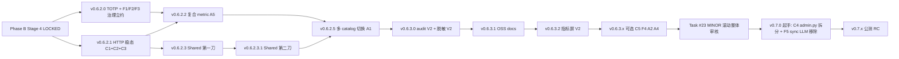

# v0.6.2.0+ Phase B 路线图 v2（守护者终审 + 资深决策整合稿）

> **协议依据**：Loop Protocol v3 全 v3 三阶段
>
> **触发**：M-1 #22 Phase B 评估完成 + v0.5 守护者第 10 次 active Stage 3 终审 + 资深 2026-05-25 10 项决策拍板
>
> **执行者**：v0.6 执行者
>
> **守护者**：v0.5 守护者（第 10 次 active；前次"最后一次 active" 判断修订 → active 期延长至 Phase B 收官）
>
> **远古守护者**：v0.4 远古守护者（资深决策 #9 — 本周三任务合并召集）
>
> **资深架构师**：你
>
> **日期**：2026-05-25
>
> **状态**：执行者整合稿 — 待 Stage 2 辅助 AI 初审（资深决策 #8 补做） + Stage 4 LOCKED
>
> **supersedes**：`v0.6.2.0-phase-b-roadmap.md` v1（Stage 1 初稿）

---

## §0 触发与战略意义

### 0.1 内测期闭环 + Phase B 决策时间线

```
2026-05-13  v0.6.0 Phase A merge（Deploy-Ready）
2026-05-14  v0.6.0.1 + v0.6.0.2 双 micro PATCH
2026-05-XX  v0.6.1 时间语义引擎 V1（Phase B 决议 B 修订版首个正式 PATCH）
2026-05-XX  v0.6.1.4 HTTP API adapter（OVERRIDE #4）
2026-05-25  v0.6.1.11 prod 上线 + 业务方 demo sign-off ✓
2026-05-25  资深 announce 方向 ①（修订为"Phase B 完整版"）+ 守护者第 10 次 active Stage 3 + 10 项决策拍板
2026-05-XX  v0.6.2.0 启动（待 Stage 2 补做 + 远古守护者召集 + Stage 4 LOCKED）
```

### 0.2 命名修订（守护者 §III + 资深决策 #1）

**v1 → v2**：方向 ①"Phase B 充分推进" → **"Phase B 完整版（不含 5 层语义+LogicForm）"**

- 原 phase-b-proposal-draft.md ① 充分 (5 层语义 + LogicForm) 推迟到 **v0.7+ 数据驱动评估**
- 本路线图实质：②-revised 扩大版 + Phase B 二刀 HTTP adapter sustained + 整体审核 §1 治理债打包
- 治理诚实度 — 名实一致防未来"方向 ① 已 announce" 借口启动 5 层语义

### 0.3 OVERRIDE 累计治理记录段（新增 — 守护者 §IV + 资深决策 #4）

| # | OVERRIDE 事件 | 日期 | 归档位置 |
|---|---|---|---|
| 1 | R-PA-5 buffer Day 7 提前评估（override LOCKED Day 28+） | 2026-05-21 | phase-b-early-review-2026-05-21.md |
| 2 | Phase B 二刀 HTTP adapter（override ②-revised §V Q4 narrow 下限） | 2026-05-24 | phase-b-narrow-2-http-adapter-2026-05-24.md |
| 3 | （待 v0.6.2.0 retroactive review 核实） | TBD | TBD |
| 4 | （待 v0.6.2.0 retroactive review 核实） | TBD | TBD |
| **5** | **方向 ① announce override ②-revised 推荐 → 本路线图启动** | **2026-05-25** | **本文档 + CHANGELOG v0.6.2.0 段** |

→ **R-LP-v3-EX-2.1 触发**（累计 ≥4 → 强制 Q-quarter 暂停）+ **R-LP-v3-EX-2 触发**（累计 ≥3 → 强制召集远古守护者）。两条立约 v0.6.2.0 启动前必须落地（守护者补漏 F1-F3）。

---

## §1 Phase B 五类范围（修订后 — 22 子项）

### 修订对照表（v1 → v2）

| 修订项 | v1 → v2 | 依据 |
|---|---|---|
| A1 multi-tenant 模型评估 | → **single-tenant 内多 catalog 切换** | 守护者 §VIII + 资深决策 #2 OOS-1 sustained |
| **A3 时间语义 V2** | **整项移出 → v0.7+** | 守护者 §V + 资深决策 #7（避免第 6 次 OVERRIDE）|
| D3 内测指标屏 V2 "多租户" 字面 | **"多 catalog 维度"** | 守护者 §VIII + 资深决策 #2 |
| C2 pick_http_route 实施 | exclusion regex → **双层守护** | 守护者 §VI 3.3 + 资深决策 #10 |
| 段 3 Shared 重构 | 1 PATCH → **拆 2 PATCH** | 守护者 §V + §VII + 资深决策 #5 |
| 段 7 admin.py 拆分 | "v0.6.2.x 或 v0.7.0" → **v0.7.0 起手"结构重构 commit-day"** | 守护者 §II + §V + 资深决策 #6 |
| 工程量 3-4 月 | → **4-6 月** | 守护者 §VII + 资深决策（默认 accept）|
| **新增 F1-F5 守护者补漏子项** | +5 项 | 守护者 §II 末 |

### A 类 — 业务能力扩展（修订后 4 项，A3 移出）

| ID | 子项 | 优先级 | 预估 PATCH |
|---|---|---|---|
| **A1**（修订版）| **single-tenant 内多 catalog 切换**（admin UI 切换 active catalog；不引入 tenant_id；不跨 catalog 数据隔离）| P1 | v0.6.2.5（1 PATCH）|
| A2 | HTTP API 数据源生态扩展 | P2 | v0.6.3.x（按需扩）|
| ~~A3~~ | ~~时间语义引擎 V2~~ | **推 v0.7+** | — |
| A4 | clarifier intent 扩 7→9 类 + R-PB-A4-X byte-equal 守护 | P3 | v0.6.3.x（1 PATCH）|
| A5 | SQL planner 复合 metric | P1 | v0.6.2.2（1 PATCH）|

### B 类 — 安全与合规（3 项 + B1 红线扩 4 条）

| ID | 子项 | 优先级 | 预估 PATCH |
|---|---|---|---|
| B1 | TOTP 2FA 强制 enroll（红线扩 R-PB-B1-5~8）| P1 | v0.6.2.0（独立 PATCH）|
| B2 | 审计日志 V2 | P2 | v0.6.3.0（与 B3 同 PATCH）|
| B3 | 数据脱敏链路 V2 | P2 | v0.6.3.0 |

### C 类 — 工程稳态收尾（5 项）

| ID | 子项 | 优先级 | 预估 PATCH |
|---|---|---|---|
| C1 | catalog source_type 产品级 | P1 | v0.6.2.1 |
| **C2**（修订）| **pick_http_route 双层守护**（正向白名单 catalog source:http + entity → 主路由；黑名单 regex 仅 diagnostic warn 层）| P1 | v0.6.2.1（与 C1 同 PATCH）|
| C3 | sql_planner LLM 输出拒识 | P1 | v0.6.2.1（与 C1/C2 同 PATCH）|
| C4 | admin.py 921 LOC 拆分 | P2 | **v0.7.0 起手 "结构重构 commit-day"** |
| C5 | AdminAudit.jsx 480 LOC 拆分 | P3 | v0.6.3.x |

### D 类 — 公测准备（3 项）

| ID | 子项 | 优先级 | 预估 PATCH |
|---|---|---|---|
| D1 | OSS readiness 工具链 | P2 | v0.6.3.1 |
| D2 | 公测 onboarding docs（业务方/运维/admin 三视角）| P2 | v0.6.3.1（与 D1 同 PATCH）|
| **D3**（修订）| 内测指标屏 V2（**多 catalog 维度** / DAU / SLA）| P3 | v0.6.3.2 |

### E 类 — 视觉/UX（3 项 + 拆 2 PATCH）

| ID | 子项 | 优先级 | 预估 PATCH |
|---|---|---|---|
| E1+E2（修订）| **Shared.jsx 渐进抽象 — 拆 2 PATCH**：v0.6.2.3（5 helpers + 5 屏 + thead pattern 8 文件 100% 测试覆盖）+ v0.6.2.3.1（7 helpers + 9 屏扩张）| P1 | v0.6.2.3 + v0.6.2.3.1 |
| E3 | R-PA-PB-V1 视觉延续性铁律 | P0 sustained | 每个含 UI 改动 PATCH 默认守护 |

### F 类 — 守护者补漏（5 项，本 v2 新增）

| ID | 子项 | 优先级 | 预估 PATCH |
|---|---|---|---|
| **F1** | R-LP-v3-EX-3 承诺推迟治理立约（≥3 PATCH 未兑现升级红线）| P0 | v0.6.2.0 内 docs commit（与 B1 同 PATCH）|
| **F2** | R-LP-v3-EX-2.1 OVERRIDE 治理双锁强化（≥4 次强制 Q-quarter 暂停）| P0 | v0.6.2.0 内 docs commit |
| **F3** | OVERRIDE 累计治理记录段（CHANGELOG）补全 5 次记录 | P0 | v0.6.2.0 内 docs commit |
| **F4** | AdminScreenTemplate 抽象（2 屏验证 → 5 屏扩张）| P2 | v0.6.3.x（与 C5 同 PATCH 或紧接）|
| **F5** | sync LLM API v1.0 移除 audit | P2 | v0.7.0 起手 0.7.0.1 micro PATCH |

**合计：22 子项 → 8-10 PATCH（v0.6.2.0 → v0.6.3.x + v0.7.0 起手）+ 1 v0.7.0 大 PATCH（C4 + F5）**

---

## §2 PATCH 序列规划（v2 修订）

### 段 1 — 安全前置 + 治理立约（v0.6.2.0）

```
v0.6.2.0  TOTP 2FA enroll  (B1) + 治理立约 docs commit (F1+F2+F3)
          - B1 红线扩 R-PB-B1-1~8（含守护者补 5~8：重置/rate limit/二次确认/Fernet 路径）
          - F1+F2+F3 在 commit 0 LOCKED docs 段同步落地（不阻塞 B1 业务代码）
          - 注：v0.6.2.0 同 MINOR 内 PATCH 序列起点，**不触发**整体审核仪式（守护者 §V 修订）
          预计：1.5-2 周
```

### 段 2 — 工程稳态偿还（v0.6.2.1+2）

```
v0.6.2.1  HTTP 路由稳态收尾  (C1 + C2 + C3)
          - C1: catalog._load_from_db 推断 source_type + admin UI 字段持久化
          - C2: 双层守护（正向白名单主路由 + 黑名单 regex diagnostic warn 层）
          - C3: sql_planner 非 SELECT 输出拒识 + sql_validator fail-open warn log
          预计：2-2.5 周

v0.6.2.2  SQL planner 复合 metric  (A5)
          - 拆分复合问题为 N 个子 SQL + 合并展示，或友好拒答
          预计：1 周
```

### 段 3 — Shared 重构（v0.6.2.3 + v0.6.2.3.1 拆 2 PATCH）

```
v0.6.2.3  Shared 重构第一刀（5 helpers + 5 屏 + thead pattern）
          - 5 helpers: StatusDot / Avatar / thead pattern / ActionChip / EnabledChip
          - 5 屏验证: AdminAudit / SavedReports / tab_access / AdminBudgets / AdminRecovery
          - thead pattern 8 文件 100% byte-equal 守护测试覆盖（最强 ROI）
          预计：1.5-2 周

v0.6.2.3.1  Shared 重构第二刀（7 helpers + 9 屏扩张）
          - 7 helpers: BudgetActionChip / WarnNote / KpiCard / PeriodTab / TagChip / trailingChip / medal+trophy svg
          - 9 屏: 剩余 admin tabs + chat 子模块 + 其他屏
          - 14 屏 byte-equal sustained 全量验证
          预计：1.5-2 周
```

### 段 4 — 业务能力扩展（v0.6.2.4 移出 + v0.6.2.5）

```
~~v0.6.2.4~~  ~~时间语义引擎 V2~~  推 v0.7+

v0.6.2.5  Single-tenant 多 catalog 切换  (A1 修订版)
          - admin UI 切换 active catalog（不引入 tenant_id）
          - catalog import/export JSON（类比 v0.5.44 4 字段 admin UI 编辑扩展）
          - 业务方各自配 catalog + 数据源（数据库连接共享）
          - 严守 OOS-1 sustained — 不引入跨 catalog 数据隔离
          预计：1.5-2 周
```

### 段 5 — 安全合规 V2（v0.6.3.0）

```
v0.6.3.0  audit V2 + 脱敏 V2  (B2 + B3)
          MINOR 顺手升（v0.6.2.x 完毕后自然进 v0.6.3）
          预计：1.5-2 周
```

### 段 6 — 公测准备（v0.6.3.1+2）

```
v0.6.3.1  OSS readiness + 公测 docs  (D1 + D2)
          预计：2-2.5 周

v0.6.3.2  内测指标屏 V2（多 catalog 维度 / DAU / SLA）  (D3 修订)
          预计：1 周
```

### 段 7 — Phase B 收官前可选

```
v0.6.3.x  AdminAudit.jsx 拆分  (C5) + AdminScreenTemplate 抽象 (F4)
v0.6.3.x  HTTP API 数据源生态扩展  (A2)
v0.6.3.x  clarifier intent 扩 7→9 类  (A4)
```

### 段 8 — v0.7.0 起手"结构重构 commit-day"（守护者强烈建议）

```
v0.7.0    admin.py 5-7 文件拆分  (C4) + sync LLM API v1.0 移除 (F5)
          - admin.py 921 LOC → users/datasources/models/budgets/stats/api_keys/or_catalog (~80-350 LOC 各)
          - 同时启动 MINOR 滚动整体审核仪式（Task #23）
          预计：2-3 周
```

### Phase B 收官时机

预计 v0.6.3.x 收尾（约 2026 Q3 末 ~ Q4 初）→ MINOR 滚动整体审核仪式（Task #23）→ v0.7.0 公测 RC + 结构重构。

**总预计**：8-10 PATCH × 1.5-2.5 周/PATCH = **4-6 月**（守护者重估 sustained）

---

## §3 红线（修订 + 补漏）

### 3.1 Phase B 通用红线（v2 扩展）

| 红线 | 内容 | 来源 |
|---|---|---|
| R-PA-PB-V1 | Phase B UI 视觉延续性铁律 | v0.6.0.19 立约 |
| R-PB2-1~16 | HTTP API 数据源守护（含 v0.6.1.4 立约 + Phase B 二刀 R-PB2-9~16 sustained）| v0.6.1.4 + 二刀 |
| **R-OAR-1**（补 1）| admin.py LIMITS dict 临时 cap 950（拆分后 ≤ 250）| 整体审核 §VII 补丁 1 |
| **R-LP-v3-EX-2.1**（补 2）| OVERRIDE 累计 ≥4 次强制 Q-quarter 暂停 1 个 PATCH 周期 + retroactive audit | 整体审核 §VII 补丁 4 + 资深决策 #3 |
| **R-LP-v3-EX-3**（补 3）| 承诺推迟治理（≥3 PATCH 未兑现升级红线） | 整体审核 §VII 补丁 3 + 资深决策 #3 |
| R-94 文件大小 | LIMITS dict 严守 | v0.5.2 |
| R-100 re-export | 拆分文件保 import 路径 byte-equal | v0.5.2 |
| R-128 className 字面 | 前端 byte-equal | v0.5.3 |
| R-158 buildTheme 25 字段 | 严禁扩张 | v0.5.6 |
| R-192 AppShell 13 props | 宪法级 byte-equal | v0.5.9 |
| R-286 hex 全清 | 全站禁止 hex（boxShadow + rgba 豁免）| v0.5.12 |
| R-302.5 emoji 业务豁免 | banner / 错误 emoji 保留；装饰类全清 | v0.5.13 |

### 3.2 段 1 B1 TOTP 红线（守护者扩 4 条）

| 红线 | 内容 |
|---|---|
| R-PB-B1-1 | TOTP secret Fernet 加密存储（复用 v0.4.5 master_key）|
| R-PB-B1-2 | enroll 失败/中断 — 用户账号不锁死（recovery codes 可下载）|
| R-PB-B1-3 | admin 自身 enroll 顺序 — 启动期降级或宽限期 |
| R-PB-B1-4 | 公测启动闸门 — R-PA-8 自验 + Day 28+ 三方会议门 |
| **R-PB-B1-5**（守护者补 §VI 3.2）| TOTP 重置流程（用户丢手机）— admin 重置必须 audit_log；recovery codes 单次使用；重置 ≥ 5 次/月触发警报 |
| **R-PB-B1-6**（守护者补 §VI 3.2）| TOTP 验证 rate limit — 每 user 5/min 验证尝试 + brute force 防御 |
| **R-PB-B1-7**（守护者补 §VI 3.2）| enroll 二次确认 — 用户初次 enroll 必须用 2 个动态码连续验证（防扫码错误）|
| **R-PB-B1-8**（守护者补 §VI 3.2）| TOTP secret Fernet 加密路径明示 — DB 字段名 + enc_v1: 前缀（与 R-PB-B1-1 协同）|

### 3.3 段 2 C1+C2+C3 红线（C2 双层守护修订）

| 红线 | 内容 |
|---|---|
| R-PB-C1-1 | catalog._load_from_db 推断 source_type — 不破坏 DB > _local > _template 优先级 |
| R-PB-C1-2 | admin UI 加 source_type select 字段 — 默认 "db"；HTTP 必须显式选；保存时持久化 |
| **R-PB-C2-1**（v2 修订 — 双层守护）| **正向白名单主路由**：catalog source:http + entity 明示 → pick_http_route 命中；否则 default fallback SQL 路径 |
| **R-PB-C2-2**（v2 修订）| **黑名单 regex 作 diagnostic warn 层**："(历史\|已平仓\|强平\|爆仓\|ADL\|(\d+天\|\d+月\|昨天\|上周\|N天前))" 命中时 log warn 不阻断 |
| R-PB-C2-3 | None 分支必须 log `logger.info(f"pick_http_route no match: refined={...} lex_hits={...} http_table_check={...}")` |
| R-PB-C3-1 | sql_planner LLM 输出非 SELECT 起手 → 不喂 validator，直接返路由错误"该问题需要外部 API，不适用 SQL 查询" |
| R-PB-C3-2 | sql_validator fail-open 路径必须打 warn log（e38de5e76703 链路盲区偿还）|

### 3.4 段 3 E1+E2 Shared 重构红线（拆 2 PATCH）

| 红线 | 内容 |
|---|---|
| R-PB-E1-1 | Shared.jsx 提取 helpers 字面与原 inline byte-equal（git grep -F 验证）|
| R-PB-E1-2 | 各屏调用点 git diff = 0 行（除 import 行）— 14 屏 sustained byte-equal |
| R-PB-E1-3 | LIMITS dict Shared.jsx 374 → 预留 480（含新增 12+ helpers）|
| R-PB-E1-4 | I icon 36 names 不动；只加 helpers 不加 icons |
| **R-PB-E1-5**（守护者补 §VI 3.4）| 分 2 PATCH 渐进抽象（v0.6.2.3 5 helpers + 5 屏 / v0.6.2.3.1 7 helpers + 9 屏）|
| **R-PB-E1-6**（守护者补 §VI 3.4）| thead pattern 第一 PATCH 内 8 文件 byte-equal 测试覆盖 100% |

### 3.5 段 4 A1 OOS-1 守护红线（v2 新增）

| 红线 | 内容 |
|---|---|
| **R-PB-A1-1** | OOS-1 sustained — A1 严禁引入 tenant_id / project_id 字段 |
| **R-PB-A1-2** | OOS-1 sustained — A1 严禁跨 catalog 数据隔离 |
| **R-PB-A1-3** | catalog 切换路径 — 数据库连接共享；业务方各自配 catalog + 数据源 |
| **R-PB-A1-4** | 多 catalog audit_log 透明性 — 切换 active catalog 必须 INSERT audit_log |

---

## §4 PATCH 间依赖与并行（v2 修订）



**并行机会**：
- v0.6.2.0（TOTP）与 v0.6.2.1（HTTP 稳态）可并行（不同子系统）
- v0.6.2.3.1 Shared 第二刀与 v0.6.2.5 多 catalog 切换可并行

---

## §5 验收标准（v2 修订）

### 段 1 验收（v0.6.2.0）
- TOTP enroll 端到端流程跑通（admin + 普通用户）
- recovery codes 下载 + 单次使用语义
- R-PB-B1-5~8 守护扩展（重置 audit / rate limit / 二次确认 / Fernet 路径）
- 公测启动闸门文档化（GitHub issue + R-PA-8 自验）
- **F1+F2+F3 立约落地**（R-LP-v3-EX-2.1 + EX-3 + OVERRIDE 累计治理记录段 CHANGELOG 补全）

### 段 2 验收（v0.6.2.1 + v0.6.2.2）
- e38de5e76703 链路类问题不再静默 fallback（None 分支必有 log）
- "用户10047725历史持仓" 走 SQL 路径返多行（不走 HTTP）— **通过双层守护**
- 黑名单 regex 命中时 log warn（不阻断）— diagnostic 层验证
- "今日合约交易量和充值" 不再返 0（明确路径或友好拒答）
- admin UI 编辑数据源时 source_type 字段保留 + 持久化

### 段 3 验收（v0.6.2.3 + v0.6.2.3.1）
- Shared.jsx 12+ helpers 全命中（git grep -F）
- 14 屏 git diff = 0 行（除 import）
- thead pattern 8 文件 byte-equal 测试覆盖 100%
- LIMITS dict Shared.jsx 在预留范围内（≤480）

### 段 4 验收（v0.6.2.5）
- admin UI 切换 active catalog 正常
- catalog import/export JSON 跑通
- **R-PB-A1-1~4 全部验证**（无 tenant_id 字段 / 无跨 catalog 隔离 / 数据库连接共享 / audit_log 透明）
- 多业务方场景测试（至少 2 个 catalog 并存切换）

### 段 5-7 验收
- 按各 PATCH 独立验收（v0.6.3.0/1/2 + 段 7 可选）

### 段 8 验收（v0.7.0 起手）
- admin.py 拆 5-7 文件，主文件 ≤ 250 LOC，子文件 ≤ 350 LOC
- sync LLM API 全删（query_steps 切 async-only）
- MINOR 滚动整体审核仪式 4 份产物归档

---

## §6 协议合规（Loop Protocol v3 — v2 修订）

### 6.1 三阶段评审节奏（修订）

| Stage | 内容 | 状态 |
|---|---|---|
| Stage 1 | v1 草案（Phase B 范围 + PATCH 序列 + 红线骨架）| ✅ 完成 2026-05-25 |
| **Stage 2** | **辅助 AI 初审（资深决策 #8 补做）— Codex + 资深工程师 AI 独立评审 v2 整合稿** | ⏳ 待启动 |
| **Stage 3** | v0.5 守护者第 10 次 active 终审（已完成 — 本 v2 已整合 6 项强制修订 + F1-F5 补漏 + 10 项资深决策）| ✅ 完成 2026-05-25 |
| Stage 4 | 资深拍板 LOCKED → 启动 v0.6.2.0 | ⏳ 待 Stage 2 完成 |

**注**：Stage 2 与 Stage 3 顺序倒挂（守护者先评 v1 → 资深拍板 → v2 整合 → 补做 Stage 2）— 资深 explicit ack 接受此偏离。

### 6.2 远古守护者激活（资深决策 #9）

**本周三任务合并召集 v0.4 远古守护者**：
1. (a) Q5 retroactive review（OVERRIDE 累计第 5 次治理审计）
2. (b) 本路线图 v2 Stage 3 独立终审（守护者已完成 — 远古守护者补独立意见）
3. (c) 整体审核 §1 评审（代码结构评估子产物独立份）

合并节省协调成本；R-LP-v3-EX-2 ≥3 次召集义务正式履行。

### 6.3 简化协议适用性

不适用 R-LP-v3-EX-1 简化协议（业务代码 + 红线新立 + 多 PATCH 跨度）。Stage 2 补做必要（资深决策 #8 sustained）。

### 6.4 MINOR 滚动整体审核衔接

Phase B 收官（v0.6.3.x 末尾） → 触发 Task #23 仪式 → 4 份产物（执行者 + 守护者 + 远古守护者 + 资深仲裁）→ v0.7.0 起手"结构重构 commit-day"（admin.py 拆分 + sync LLM 移除）→ v0.7.x 公测 RC。

---

## §7 风险与依赖（v2 修订）

### 7.1 已识别风险

| 风险 | 影响 | 缓解 |
|---|---|---|
| Shared.jsx 重构破坏 14 屏 byte-equal | 视觉回归 | 拆 2 PATCH + R-PB-E1-2 git diff = 0 严守 |
| TOTP enroll 锁死 admin 自身 | 公测无法启动 | R-PB-B1-3 启动期降级 + R-PB-B1-7 二次确认 |
| C2 正向白名单 entity 推断失败 | HTTP 路径漏命中 | 黑名单 diagnostic warn 层兜底 + Stage 2 Codex 评审 entity 推断方案 |
| A1 OOS-1 红线被业务方推压 | 多租户诱惑触发 | R-PB-A1-1~4 sustained + 守护者本周外召集复核 |
| Phase B 周期 4-6 月业务方耐心 | 上线节奏 | 段 2 完成即可发布 v0.6.2 内测增强版 |
| OVERRIDE 治理失控（累计第 6 次+）| 协议失信 | R-LP-v3-EX-2.1 Q-quarter 暂停 + retroactive audit |

### 7.2 外部依赖

- 业务方持续反馈 + 周/月度需求复核
- 运维 K8s + ConfigMap 节奏（每 PATCH 上线）
- Doris 集群稳定性
- **v0.4 远古守护者本周三任务合并响应**（资深决策 #9）
- **Stage 2 Codex / 资深工程师 AI 评审响应**（资深决策 #8）

### 7.3 撤回机制

任何子项 Stage 2 / Stage 3 / Stage 4 期间被证明：
- 范围超 Phase B 边界 → 推迟 v0.7+
- 与红线冲突无法妥协 → 撤回或大改方案
- 业务方不需要 → 删除

按 v0.6.0 撤回先例（R-67/68/74 撤回声明）操作。

---

## §8 自检清单（v2 扩展 — 17 项）

- [x] Phase B 评估触发条件齐全（Task #22 ✓）
- [x] 5 类范围完整（A 业务 + B 安全 + C 稳态 + D 公测 + E 视觉 + F 守护者补漏）
- [x] 22 子项每项有优先级 + 预估 PATCH（A3 移出标记清晰）
- [x] PATCH 序列含依赖关系 + 并行机会（含段 8 v0.7.0 起手）
- [x] 红线分通用 + 段专属（含 16 条新立 R-PB-* + R-OAR-* + R-LP-v3-EX-*）
- [x] 验收标准每段独立可测
- [x] 协议合规（v3 三阶段 + 远古守护者激活 + R-PA-PB-V1 sustained）
- [x] 风险识别 + 撤回机制
- [x] **C-补 1** OVERRIDE 累计治理记录 — 当前累计第 5 次 ✓ §0.3
- [x] **C-补 2** OOS-1 多租户红线 sustained check — A1/D3 字面修订 ✓ §1
- [x] **C-补 3** R-LP-v3-EX-2 ≥3 次召集远古守护者执行状态 ✓ §6.2
- [x] **C-补 4** §1 整体审核 §VII 5 项守护者补丁纳入状态 — F1-F5 ✓ §1
- [x] **C-补 5** A3 时间语义 V2 与 P1-1 冲突说明 — A3 移出 ✓ §1 修订对照表
- [x] **C-补 6** 工程量 buffer 评估 — 3-4 月 → 4-6 月 ✓ §0.1 + §2
- [x] **C-补 7** Phase B 二刀 R-PB2-9~16 sustained check ✓ §3.1
- [x] **C-补 8** 方向 ① 命名一致性 audit ✓ §0.2
- [ ] Stage 2 辅助 AI 初审（资深决策 #8 — 待启动）
- [ ] v0.4 远古守护者本周三任务合并（资深决策 #9 — 待启动）
- [ ] Stage 4 资深拍板 LOCKED → 启动 v0.6.2.0

---

## §9 资深下一动作（v2 — 已完成 + 待启动）

### ✅ 已完成（资深 2026-05-25 拍板）
1. 方向 ① 命名修订 → "Phase B 完整版"（决策 #1 accept）
2. OOS-1 红线 sustained — A1/D3 修订（决策 #2 accept）
3. R-LP-v3-EX-2.1 + EX-3 立约 v0.6.2.0 启动前落地（决策 #3 accept）
4. OVERRIDE 累计第 5 次 CHANGELOG 治理记录段（决策 #4 accept）
5. 段 3 Shared 重构拆 2 PATCH（决策 #5 accept）
6. 段 7 admin.py 拆分 v0.7.0 起手"结构重构 commit-day"（决策 #6 accept）
7. A3 时间语义 V2 推 v0.7+（决策 #7）
8. Stage 2 辅助 AI 初审补做（决策 #8）
9. v0.4 远古守护者本周三任务合并（决策 #9）
10. C2 双层守护（决策 #10）

### ⏳ 待启动

| # | 动作 | 责任方 | 时机 |
|---|---|---|---|
| 11 | 执行者代发 Stage 2 Codex / 资深工程师 AI 评审 prompt | v0.6 执行者 | 立即 |
| 12 | 资深 announce v0.4 远古守护者本周三任务合并召集 | 资深架构师 | 本周内 |
| 13 | Stage 2 + 远古守护者意见返回 → 执行者整合 v3（如有修订）| v0.6 执行者 | 1-2 周 |
| 14 | 资深 Stage 4 LOCKED 拍板 → 启动 v0.6.2.0 | 资深架构师 | Stage 2 + 远古守护者 完成后 |
| 15 | v0.6.2.0 启动 → CHANGELOG OVERRIDE #5 治理段补全 + R-LP-v3-EX-2.1/3 立约 commit | v0.6 执行者 | Stage 4 LOCKED 后 |

---

**附录 A**：相关已有文档
- `docs/plans/v0.6.2.0-phase-b-roadmap.md` — v1 Stage 1 初稿（本 v2 supersedes）
- `docs/plans/v0.6.x-code-structure-assessment-2026-05-25.md` — 代码结构评估
- `docs/plans/v0.6.0-phase-a-sanitize.md` — Phase A LOCKED 终稿
- `docs/plans/v0.6.1-narrow-scope-time-resolver.md` — Phase B 决议 B 修订版首个 PATCH
- `CHANGELOG.md` — v0.6.x 累计变更 + 待补 OVERRIDE #5 治理记录段

**附录 B**：关联 Task
- M-1 #22 Phase B 评估收尾 ✓
- M-1.5 #24 本文档（in_progress → 即将转 Stage 2 启动）
- M-2 #23 MINOR 滚动整体审核（v0.6.3.x 收尾后触发，含 v0.7.0 起手 commit-day）
- #3 TOTP 2FA → 融入段 1 v0.6.2.0
- #16 代码结构评估 → 融入 v0.7.0 起手 C4
- #17 SQL 复合 metric → 融入段 2 v0.6.2.2

**附录 C**：守护者第 10 次 active 关键裁定回顾
- §III 名实不副诊断 → 方向 ① 改名（accept）
- §IV OVERRIDE 累计第 5 次治理污点 → CHANGELOG 补全 + EX-2.1/3 立约（accept）
- §VIII A1 OOS-1 触发 → single-tenant 多 catalog 切换（accept）
- §VII 工程量重估 3-4 月 → 4-6 月（accept）
- §V Shared 拆 2 PATCH + admin.py v0.7.0 起手（accept）
- §VI C2 改正向白名单 → 双层守护（资深决策 #10 折中）
- §XI active 期延长至 Phase B 收官（accept）
