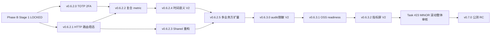

# v0.6.2.0+ Phase B 路线图（Stage 1 执行者初稿）

> **协议依据**：Loop Protocol v3 全 v3 三阶段（业务功能 + 工程稳态混合 PATCH 包，不适用简化协议）
>
> **触发**：M-1 #22 Phase B 评估完成（2026-05-25 资深 announce 方向 ①「Phase B 充分推进」）
>
> **执行者**：v0.6 执行者
>
> **守护者**：v0.5 守护者（独立对话 — 视觉延续性 R-PA-PB-V1 + clarifier intent 扩类必经审视）
>
> **远古守护者**：v0.4 远古守护者（async 链路 + audit V2 + 加密 V2 经验关联）
>
> **资深架构师**：你
>
> **日期**：2026-05-25
>
> **状态**：执行者 Stage 1 初稿 — 待 Stage 2 辅助 AI 初审 + Stage 3 守护者终审 + 资深拍板 LOCKED

---

## §0 触发与战略意义

### 0.1 内测期闭环

```
2026-05-13  v0.6.0 Phase A merge（Deploy-Ready）
2026-05-14  v0.6.0.1 + v0.6.0.2 双 micro PATCH
2026-05-XX  v0.6.1 时间语义引擎（Phase B 决议 B 修订版首个正式 PATCH）
2026-05-XX  v0.6.1.4 HTTP API adapter（OVERRIDE #4）
2026-05-25  v0.6.1.11 prod 上线 + 业务方 demo sign-off ✓
2026-05-25  资深 announce 内测结束 + Phase B 评估闭环 = 方向 ①
```

### 0.2 决策依据

| 输入 | 验证结果 |
|---|---|
| HTTP API adapter（撮合 admin） | ✅ prod 真实跑通（持仓查询 4/4 STEPS） |
| 时间语义引擎 | ✅ "今天/昨天/上周"等已识别 |
| JSON 日志 | ✅ Filebeat/Kibana decode_json_fields 接通 |
| K8s 部署稳定性 | ✅ devops-knot-web-* 1k+ hits/3h |
| 业务方真实反馈 | ✅ demo 跑通 + 后续业务方加速接入需求 |
| 治理债务暴露 | catalog source_type 字段持久化 + pick_http_route 路由 + clarifier intent layout 错位 — 都需要在 Phase B 偿还 |

### 0.3 Phase B 战略定位

**两条主线并行**：
- **业务能力线**（A + B）：多业务方扩量 / 安全合规公测前置
- **工程稳态线**（C + D + E）：路由治理 / 公测 docs / 视觉债

**收官目标**：Phase B 结束（约 v0.6.x 末尾） → 进入 v0.7.0 公测 RC 准备 → 1.0 团队公测正式版。

---

## §1 Phase B 五类范围（候选 23 子项）

### A 类 — 业务能力扩展

| ID | 子项 | 优先级 | 预估 PATCH |
|---|---|---|---|
| A1 | 多业务方/多数据源扩量（非 OHX 业务方接入模板化） | P1 | v0.6.2.x（1-2 PATCH） |
| A2 | HTTP API 数据源生态扩展（更多撮合 / 风控 / 行情 endpoint） | P2 | v0.6.3.x（按需扩） |
| A3 | 时间语义引擎 V2（同比/环比/复合时段/财季） | P2 | v0.6.2.x（1 PATCH） |
| A4 | clarifier intent 扩 7→9 类（HTTP 多行 detail 升级 + 时间分桶独立 trend） | P3 | v0.6.3.x（1 PATCH） |
| A5 | SQL planner 复合 metric（"今日合约交易量和充值"返 0 — Task #17） | P1 | v0.6.2.x（1 PATCH） |

### B 类 — 安全与合规（公测前置闸门）

| ID | 子项 | 优先级 | 预估 PATCH |
|---|---|---|---|
| B1 | TOTP 2FA 强制 enroll（Task #3 — 公测启动闸门） | P1 | v0.6.2.0（1 PATCH 单独） |
| B2 | 审计日志 V2（v0.4.6 audit_log 扩业务覆盖 + admin 操作粒度） | P2 | v0.6.2.x（1 PATCH） |
| B3 | 数据脱敏链路 V2（v0.6.0.19 R-脱敏-1~7 sustained + 业务字段扩展） | P2 | v0.6.2.x（1 PATCH） |

### C 类 — 工程稳态收尾（v0.6.1.x 路由债务）

| ID | 子项 | 优先级 | 预估 PATCH |
|---|---|---|---|
| C1 | catalog source_type 产品级（admin UI 加 select 字段 + 后端 schema 持久化） | P1 | v0.6.2.x（1 PATCH） |
| C2 | pick_http_route 架构升级（exclusion regex + analysis_approach 透传 + None 分支诊断日志） | P1 | v0.6.2.x（1 PATCH，与 C1 同 PATCH） |
| C3 | sql_planner LLM 输出拒识（非 SELECT 中文不当 SQL fail-open） | P1 | v0.6.2.x（与 C1/C2 同 PATCH） |
| C4 | admin.py 921 LOC 拆分（代码结构评估 §1 P1 提案） | P2 | v0.6.2.x 或 v0.7.0 单独 PATCH |
| C5 | AdminAudit.jsx 480 LOC 拆分（代码结构评估 §1 P2 提案） | P3 | v0.6.3.x |

### D 类 — 公测准备（开源 readiness 收尾）

| ID | 子项 | 优先级 | 预估 PATCH |
|---|---|---|---|
| D1 | 开源 readiness 工具链（OSS 部署 docs + Helm chart 模板 + ENV 全清 audit） | P2 | v0.6.3.x |
| D2 | 公测 onboarding docs（业务方 / 运维 / admin 三视角） | P2 | v0.6.3.x（与 D1 同 PATCH） |
| D3 | KNOT 内测指标屏（v0.6.1.0）扩张至公测维度（DAU / 多租户 / SLA） | P3 | v0.6.3.x（1 PATCH） |

### E 类 — 视觉/UX（v0.5.x 累计技术债）

| ID | 子项 | 优先级 | 预估 PATCH |
|---|---|---|---|
| E1 | 8+ inline helpers 移入 Shared.jsx（StatusDot/Avatar/thead pattern 等 — 累计第六次复用承诺） | P2 | v0.6.2.x（1 PATCH，Shared 大重构） |
| E2 | thead pattern 抽象（8 文件 byte-equal — 最强 ROI 抽象） | P1 | E1 同 PATCH |
| E3 | R-PA-PB-V1 Phase B UI 视觉延续性铁律严守（OKLCH / 25 字段 / I 36 icons / inset 8% / borderLeft 25%）| P0 sustained | 每个含 UI 改动 PATCH 默认守护 |

**合计：23 子项 → 预估 8-12 个 PATCH（v0.6.2.0 → v0.6.x 收官）**

---

## §2 PATCH 序列规划（草案 — 待 Stage 2/3 调整）

按"安全前置 + 治理优先 + 业务跟进 + 公测收尾"四段式：

### 段 1 — 安全前置（公测闸门）

```
v0.6.2.0  TOTP 2FA enroll  (B1)
          独立 PATCH；MINOR 滚动整体审核仪式触发（Phase B 内首次 .2.0 = 部分 MINOR 感）
          预计：3-5 commit / 1-1.5 周
```

### 段 2 — 工程稳态偿还（v0.6.1.x 治理债 + 复合 metric）

```
v0.6.2.1  HTTP 路由稳态收尾  (C1 + C2 + C3)
          - catalog._load_from_db 推断 source_type + admin UI 字段持久化
          - pick_http_route exclusion regex + analysis_approach 透传 + 诊断日志
          - sql_planner 非 SELECT 输出拒识
          预计：4-6 commit / 1 周

v0.6.2.2  SQL planner 复合 metric  (A5)
          - 拆分 "今日合约交易量和充值" 类复合问题为 N 个子 SQL + 合并展示
          - 或：拒答 + 友好提示让用户分次问
          预计：3-5 commit / 1 周
```

### 段 3 — 视觉债清理（v0.5.x 累计承诺偿还）

```
v0.6.2.3  Shared.jsx 大重构  (E1 + E2)
          - 8+ inline helpers 移入：StatusDot / Avatar / ActionChip / BudgetActionChip /
            EnabledChip / WarnNote / KpiCard / PeriodTab / TagChip / trailingChip / medal / trophy
          - thead pattern 提取（8 文件 byte-equal — 最强 ROI）
          - 各屏调用点 byte-equal 校验（git diff 0 改动验证）
          预计：5-8 commit / 1-1.5 周（Shared 改动牵动 14 屏 — 严格 byte-equal 测试）
```

### 段 4 — 业务能力扩展

```
v0.6.2.4  时间语义引擎 V2  (A3)
          - 同比 / 环比 / 复合时段 / 财季
          预计：3-5 commit / 1 周

v0.6.2.5  多业务方接入模板化  (A1)
          - catalog import/export JSON
          - 数据源连接向导
          - 业务方独立 OnBoarding 流程
          预计：5-8 commit / 1.5-2 周
```

### 段 5 — 安全合规 V2（公测前置补强）

```
v0.6.3.0  audit V2 + 脱敏 V2  (B2 + B3)
          MINOR 顺手升（v0.6.2.x 完毕后自然进 v0.6.3）
          预计：5-8 commit / 1-1.5 周
```

### 段 6 — 公测准备

```
v0.6.3.1  OSS readiness + 公测 docs  (D1 + D2)
          预计：4-6 commit / 1 周

v0.6.3.2  内测指标屏 V2（公测维度）  (D3)
          预计：3-5 commit / 1 周
```

### 段 7 — 后续可选

```
v0.6.3.x  admin.py + AdminAudit.jsx 拆分  (C4 + C5)
v0.6.3.x  HTTP API 数据源生态扩展  (A2)
v0.6.3.x  clarifier intent 扩 7→9 类  (A4)
```

### Phase B 收官时机

预计 v0.6.3.x 收尾（约 2026 Q3）→ MINOR 滚动整体审核仪式（Task #23）→ v0.7.0 公测 RC。

**总预计**：8-12 PATCH × 1-1.5 周/PATCH = **3-4 个月**

---

## §3 红线（Phase B 通用 + 每类专属）

### 3.1 Phase B 通用红线（贯穿全部 PATCH）

| 红线 | 内容 | 来源 |
|---|---|---|
| **R-PA-PB-V1** | Phase B UI 视觉延续性铁律 — 严守 OKLCH 单色 / 25 字段 buildTheme / I 36 icons / inset 8% / borderLeft 3px 25% | v0.6.0.19 立约 |
| **R-PB2-1~10** | HTTP API 数据源守护（host 白名单 + 跨源 JOIN 禁 + PII redact + URL 不泄漏）| v0.6.1.4 立约 |
| **R-94 文件大小** | 单文件 LIMITS dict 严守；新文件加入 dict；超过红线必须 ack | v0.5.2 立约 |
| **R-100 re-export** | 拆分文件必保 import 路径 byte-equal | v0.5.2 立约 |
| **R-128 className 字面** | 前端 byte-equal | v0.5.3 立约 |
| **R-158 buildTheme 25 字段** | 严禁扩张 | v0.5.6 立约 |
| **R-192 AppShell 13 props** | 宪法级 byte-equal | v0.5.9 立约 |
| **R-286 hex 全清** | 全站禁止 hex 字面（除 boxShadow + rgba 豁免）| v0.5.12 立约 |
| **R-302.5 emoji 业务豁免** | banner / 错误类 emoji 保留；装饰类全清 | v0.5.13 立约 |

### 3.2 段 1（B1 TOTP）专属红线

| 红线 | 内容 |
|---|---|
| **R-PB-B1-1** | TOTP secret 加密存储（复用 v0.4.5 Fernet master_key） |
| **R-PB-B1-2** | enroll 失败/中断 — 用户账号不能锁死（recovery codes 必须可下载）|
| **R-PB-B1-3** | admin 自身 enroll 顺序 — 不能因 admin 自己未 enroll 锁死全员（启动期降级或宽限期）|
| **R-PB-B1-4** | 公测启动闸门关联 — R-PA-8 自验 + Day 28+ 三方会议门 |

### 3.3 段 2（C1+C2+C3 HTTP 路由稳态）专属红线

| 红线 | 内容 |
|---|---|
| **R-PB-C1-1** | catalog._load_from_db 推断 source_type — 不破坏 DB > _local > _template 优先级 |
| **R-PB-C1-2** | admin UI 加 source_type select 字段 — 默认 "db"；HTTP 必须显式选；保存时持久化 |
| **R-PB-C2-1** | pick_http_route exclusion regex — "(历史\|已平仓\|强平\|爆仓\|ADL\|(\d+天\|\d+月\|昨天\|上周\|N天前))" 命中则 skip HTTP |
| **R-PB-C2-2** | None 分支必须 log `logger.info(f"pick_http_route no match: refined={...} lex_hits={...} http_table_check={...}")` |
| **R-PB-C3-1** | sql_planner LLM 输出非 SELECT 起手 → 不喂 validator，直接返路由错误"该问题需要外部 API，不适用 SQL 查询" |
| **R-PB-C3-2** | sql_validator fail-open 路径必须打 warn log（生产 e38de5e76703 链路盲区偿还） |

### 3.4 段 3（E1+E2 Shared 重构）专属红线

| 红线 | 内容 |
|---|---|
| **R-PB-E1-1** | Shared.jsx 提取 helpers 字面与原 inline byte-equal（thead 8 文件 git grep -F 验证） |
| **R-PB-E1-2** | 各屏调用点 git diff = 0 行（除 import 行）— 14 屏 sustained byte-equal |
| **R-PB-E1-3** | LIMITS dict Shared.jsx 374→预留 480（含新增 12+ helpers）|
| **R-PB-E1-4** | I icon 36 names 不动；只加 helpers 不加 icons（A4 clarifier intent 改造时如需新 icon 单独 PATCH）|

### 3.5 段 4-7 各类专属红线

待 Stage 1 详细 PATCH 草案分别立约（每个 PATCH 单独 doc）。

---

## §4 PATCH 间依赖与并行



**并行机会**：v0.6.2.0 TOTP 与 v0.6.2.1 HTTP 路由稳态可并行（不同子系统）；v0.6.2.3 Shared 重构与 v0.6.2.4 时间语义可并行。

---

## §5 验收标准（每段独立）

### 段 1 验收
- TOTP enroll 端到端流程跑通（admin + 普通用户）
- recovery codes 下载 + 单次使用语义
- 公测启动闸门文档化（GitHub issue + R-PA-8 自验）

### 段 2 验收
- e38de5e76703 链路类问题不再静默 fallback（None 分支必有 log）
- "用户10047725历史持仓" 走 SQL 路径返多行（不走 HTTP）
- "今日合约交易量和充值" 不再返 0（明确路径或友好拒答）
- admin UI 编辑数据源时 source_type 字段保留

### 段 3 验收
- Shared.jsx git grep -F 12+ helpers 全命中
- 14 屏 git diff = 0 行（除 import）
- thead pattern 抽象后 8 文件 byte-equal sustained

### 段 4-7 验收
待详细 PATCH 草案补充。

---

## §6 协议合规（Loop Protocol v3）

### 6.1 三阶段评审节奏

| Stage | 内容 | 执行者 |
|---|---|---|
| Stage 1 | 本文档 — Phase B 范围 + PATCH 序列 + 红线骨架 | v0.6 执行者（本人）|
| Stage 2 | 辅助 AI 初审 — Codex + 资深工程师 AI 独立评审 | 辅助 AI 评审组 |
| Stage 3 | v0.5 守护者终审 — 整合 1+2 + 设计先例继承 + 一致性核验 | v0.5 守护者 |
| Stage 4 | 资深拍板 LOCKED → 启动 v0.6.2.0 | 资深架构师（用户）|

### 6.2 远古守护者激活

- v0.4 远古守护者：B1 TOTP enroll（关联 v0.4.5 加密 V1 经验）+ A3 时间语义 V2（关联 v0.6.1 V1 经验）
- v0.3 远古守护者：dormant（无明显结构性触发）

### 6.3 简化协议适用性

**本文档不适用 R-LP-v3-EX-1 简化协议**（涉及业务代码 + 红线新立 + 多 PATCH 跨度）— 必走完整三阶段。

### 6.4 MINOR 滚动整体审核衔接

Phase B 收官（v0.6.3.x 末尾） → 触发 Task #23 仪式 → 4 份产物（含本文档 §1 §2 sustained 评估）→ v0.7.0 启动。

---

## §7 风险与依赖

### 7.1 已识别风险

| 风险 | 影响 | 缓解 |
|---|---|---|
| Shared.jsx 重构破坏 14 屏 byte-equal | 视觉回归 | R-PB-E1-2 git diff = 0 行严守 + 三方共识 |
| TOTP enroll 锁死 admin 自身 | 公测无法启动 | R-PB-B1-3 启动期降级 + recovery codes 双保险 |
| HTTP 路由 exclusion regex 误杀正常 HTTP 问题 | 业务方反馈 | Stage 2 Codex 评审 regex + 单元测试覆盖 8+ case |
| 多业务方扩量 catalog 冲突 | 数据隔离 | A1 PATCH 单独评估 multi-tenant 模型 |
| Phase B 周期过长（3-4 月）业务方耐心 | 上线节奏 | 段 2 完成即可发布 v0.6.2 内测增强版给业务方继续用 |

### 7.2 外部依赖

- 业务方继续配合反馈（demo 后持续使用 + 报问题）
- 运维 K8s + ConfigMap 维护节奏（每个 PATCH 上线节奏）
- Doris 集群稳定性（A5 复合 metric 测试基础设施）

### 7.3 撤回机制

任何子项在 Stage 2/3 评审中被证明：
- 范围超 Phase B 边界 → 推迟到 v0.7+
- 与红线冲突无法妥协 → 撤回或大改方案
- 业务方不需要 → 删除（不浪费 PATCH 预算）

按 v0.6.0 撤回先例（R-67/68/74 撤回声明）操作。

---

## §8 自检清单（Stage 1 → Stage 2 提交前）

- [x] Phase B 评估触发条件齐全（Task #22 ✓）
- [x] 5 类范围完整（A 业务 + B 安全 + C 稳态 + D 公测 + E 视觉）
- [x] 23 子项每项有优先级 + 预估 PATCH
- [x] PATCH 序列含依赖关系 + 并行机会
- [x] 红线分通用 + 段专属（含 11 条新立 R-PB-*）
- [x] 验收标准每段独立可测
- [x] 协议合规（v3 三阶段 + 远古守护者激活 + R-PA-PB-V1 sustained）
- [x] 风险识别 + 撤回机制
- [ ] Stage 2 辅助 AI 初审（待启动）
- [ ] Stage 3 v0.5 守护者终审（待启动）
- [ ] Stage 4 资深拍板 LOCKED（待启动）

---

## §9 下一动作

**资深架构师（你）的下一动作**：

1. 审本草案 — 5 类范围是否覆盖完整？是否有遗漏 / 需要删除的子项？
2. 优先级是否合理？（特别是 P1/P2/P3 分布）
3. 段 1-7 序列是否合理？是否有应并行而被串行的？
4. 时间预估（3-4 月）是否符合公测节奏期望？

**审完后**：
- 修订后转 Stage 2（辅助 AI 初审）— 我可以代发 prompt 给 Codex / 资深工程师 AI
- 或直接交 v0.5 守护者 Stage 3（如认为 Stage 2 无必要 — R-LP-v3-EX-1 例外条款可考虑但本案 23 子项业务跨度大不建议跳）
- 或要求执行者补强某段 — 我会再迭代

---

**附录 A**：相关已有文档
- `docs/plans/v0.6.x-code-structure-assessment-2026-05-25.md` — 代码结构评估（执行者初稿，本文档 §1 C4/C5 + §1 E1/E2 部分依据）
- `docs/plans/v0.6.0-phase-a-sanitize.md` — Phase A LOCKED 终稿
- `docs/plans/v0.6.1-narrow-scope-time-resolver.md` — Phase B 决议 B 修订版首个 PATCH
- `docs/plans/v0.6.1.x-ops-deploy-checklist-k8s.md` — K8s 部署 checklist（业务方上线作业流）
- `CHANGELOG.md` — v0.6.x 累计变更 + 撤回声明

**附录 B**：关联 Task
- M-1 #22 Phase B 评估收尾 ✓
- M-1.5 #24 本文档（in_progress）
- M-2 #23 MINOR 滚动整体审核（Phase B 收官后触发）
- #3 TOTP 2FA → 融入段 1 v0.6.2.0
- #16 代码结构评估 → 融入段 2 C4/C5 + 段 3 E1/E2
- #17 SQL 复合 metric → 融入段 2 v0.6.2.2
